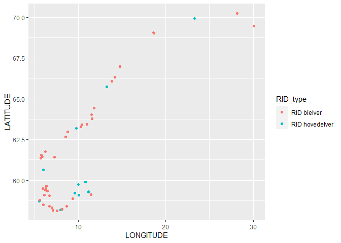
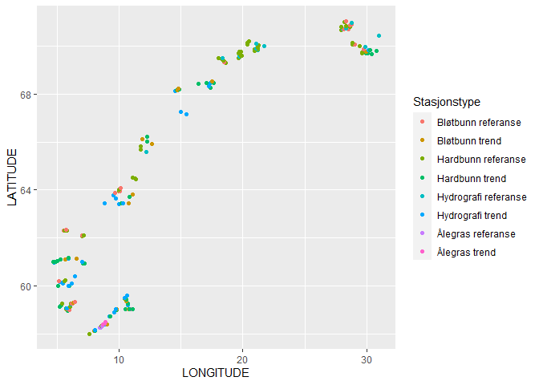
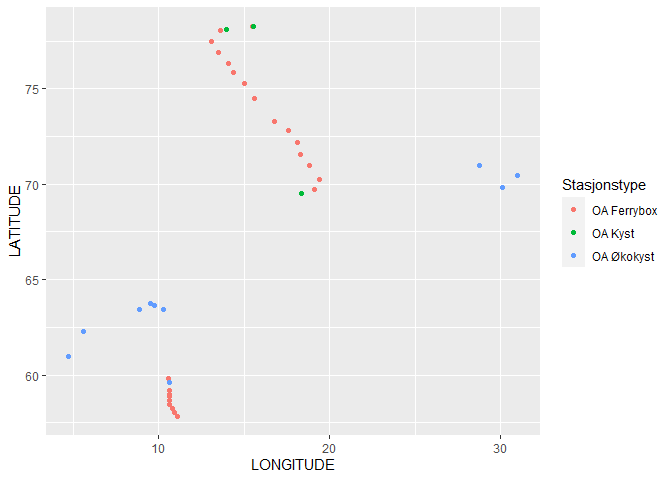
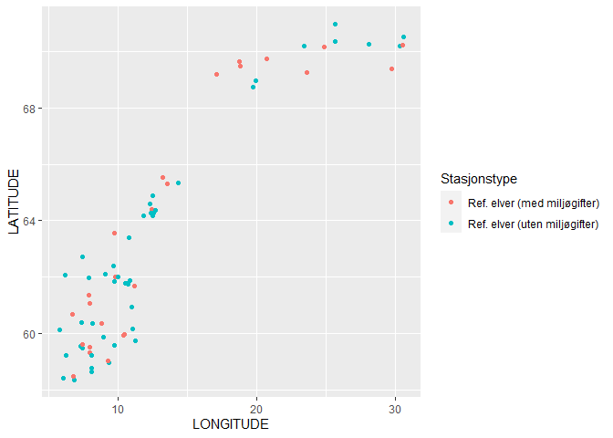
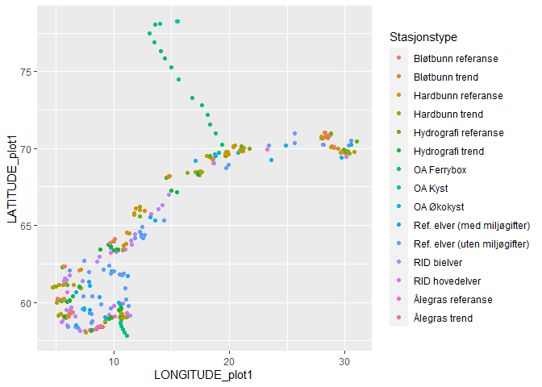
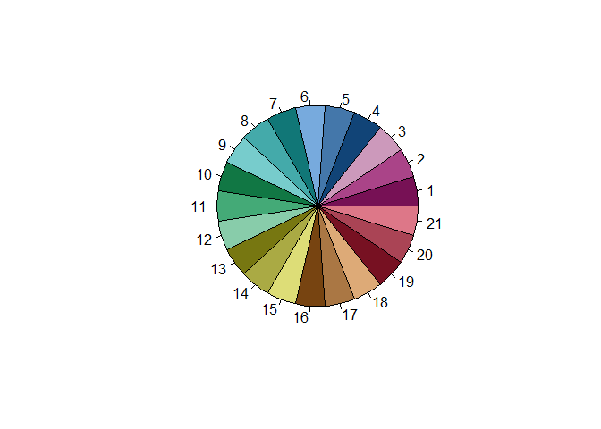
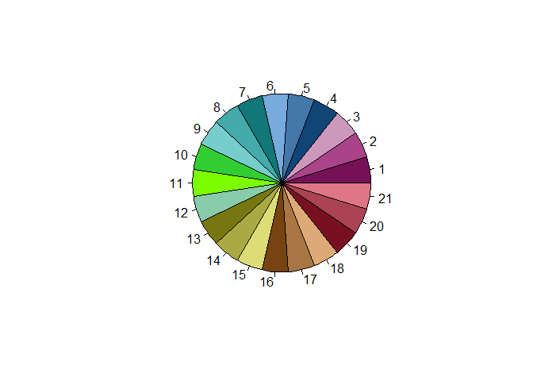

Making interactive maps (using mapview) of marine stations (Økokyst and ocean acidification) as well as river/freshwater stations (RID and reference rivers)  

* Several result

## Packages


```r
library("niRvana")
library(dplyr)
library(purrr)
library(stringr)
library(ggplot2)

# NOTE:
# stations_from_project should add "project name" + coordinates, and remove ENTERED_BY, ENTERED_DATE
# And perhaps be able to handle >1 project at a time

# Set credentials, get projects
```

## Get projects


```r
## Set username + password for NIVAbase
# (Not needed if you have saved username + password for NIVAbase permanently using keyring )
# set_credentials()

df_projects <- get_projects()   # we call it 'df_projects' (the default name used by 'get_stations_from_project')
```

## RID stations   

### Select RID projects

```r
sel <- grepl("RID", df_projects$PROJECT_NAME)
# sum(sel)
df_projects[sel,]
```

```
##    PROJECT_ID    PROJECT_NAME PROJECT_DESCRIPTION STARTDATE    ENDDATE
## 62       3320 RID- Hovedelver                <NA>      <NA> 2020-12-31
## 63       3321   RID - Bielver                <NA>      <NA>       <NA>
## 64       3322       RID - 109                <NA>      <NA>       <NA>
## 65       3323  RID Flomprøver                <NA>      <NA>       <NA>
##                       ENTERED_BY        ENTERED_DATE
## 62 NT AUTHORITY\\ANONYMOUS LOGON 2008-08-25 09:55:50
## 63 NT AUTHORITY\\ANONYMOUS LOGON 2008-08-25 09:55:50
## 64 NT AUTHORITY\\ANONYMOUS LOGON 2008-08-25 09:55:50
## 65 NT AUTHORITY\\ANONYMOUS LOGON 2008-08-25 09:55:50
```

### Stations

```r
# Get stations
# debugonce(get_stations_from_project)
df_stations_hoved <- get_stations_from_project("RID- Hovedelver", ignore.case = FALSE)  # PROJECT_ID 3320
```

```
## One project found, stations downloaded from the following project:
##   RID- Hovedelver(PROJECT_ID: 3320)
## Description: NA (STARTDATE: NA, ENDDATE: 2020-12-31)
```

```r
df_stations_bi <- get_stations_from_project("RID - Bielver", ignore.case = FALSE)       # PROJECT_ID 3321
```

```
## One project found, stations downloaded from the following project:
##   RID - Bielver(PROJECT_ID: 3321)
## Description: NA (STARTDATE: NA, ENDDATE: NA)
```

```r
# Combine and add coordinates
RID_stations <- rbind(df_stations_hoved, df_stations_bi) %>%
  add_coordinates() %>%
  left_join(tibble(PROJECT_ID = c(3320, 3321), 
                   RID_type = c("RID hovedelver", "RID bielver")),
            by = "PROJECT_ID") %>%
  select(RID_type, everything())
```


### Data on map  


```r
ggplot(RID_stations, aes(LONGITUDE, LATITUDE, color = RID_type)) +
  geom_point()
```

<!-- -->


## ØKOKYST, hydrography only    

* Not used, kept only for hiostorical reasons  


```r
okokyst_stations <- readxl::read_excel(
  "K:/Avdeling/214-Oseanografi/DATABASER/OKOKYST_2017/OKOKYST_Hydrografi_Stasjoner_v5.xlsx")
```

## ØKOKYST from NIVAbasen


```r
sel <- grepl("økokyst", df_projects$PROJECT_NAME, ignore.case = TRUE)
# sum(sel)
# df_projects[sel,]

# Stations from all recent ØKOKYST projects
prosj <- c("ØKOKYST Skagerrak 2017-2020",
           "ØKOKYST Nordsjøen Nord",
           "ØKOKYST Norskehavet Sør I",
           "ØKOKYST Norskehavet Sør II",
           "ØKOKYST Norskehavet Nord I",
           "ØKOKYST Barentshavet",
           "ØKOKYST Ferrybox")

# This adds a lot of data frames to the output:
df_stations <- prosj %>% 
  purrr::map_df(~get_stations_from_project(., ignore.case = FALSE, exact = TRUE))
```

```
## One project found, stations downloaded from the following project:
##   ØKOKYST Skagerrak 2017-2020(PROJECT_ID: 10467)
## Description: Miljøovervåking eutrofi/klima Skagerrak (STARTDATE: 2017-02-01, ENDDATE: 2018-03-31)One project found, stations downloaded from the following project:
##   ØKOKYST Nordsjøen Nord(PROJECT_ID: 10526)
## Description: Økosystemovervåkning i kystvann (ØKOKYST)-Delprogram Nordsjøen Nord (STARTDATE: 2017-02-01, ENDDATE: 2021-06-30)One project found, stations downloaded from the following project:
##   ØKOKYST Norskehavet Sør I(PROJECT_ID: 10446)
## Description: Økosystemovervåking i kystvann (ØKOKYST) Norskehavet Sør I. PL: HTR (STARTDATE: 2017-01-01, ENDDATE: 2020-11-30)One project found, stations downloaded from the following project:
##   ØKOKYST Norskehavet Sør II(PROJECT_ID: 10426)
## Description: Miljøovervåking eutrofi/klima Norskehavet Sør II (STARTDATE: 2017-02-01, ENDDATE: 2018-03-31)One project found, stations downloaded from the following project:
##   ØKOKYST Norskehavet Nord I(PROJECT_ID: 10586)
## Description: NA (STARTDATE: 2017-02-01, ENDDATE: 2018-06-30)One project found, stations downloaded from the following project:
##   ØKOKYST Barentshavet(PROJECT_ID: 10626)
## Description: NA (STARTDATE: 2017-02-01, ENDDATE: 2018-06-30)One project found, stations downloaded from the following project:
##   ØKOKYST Ferrybox(PROJECT_ID: 11046)
## Description: ØKOKYST FerryBox under Havforsuring (STARTDATE: 2017-01-01, ENDDATE: 2020-12-31)
```

```r
OKOKYST_all_stations <- df_stations %>% 
  add_coordinates()

cat("\n")
```

```r
cat("One station is wrong - remove it here; correct station added as extra data below (dat_xtra2)\n")
```

```
## One station is wrong - remove it here; correct station added as extra data below (dat_xtra2)
```

```r
sel <- OKOKYST_all_stations$STATION_CODE %in% "HT76"
OKOKYST_all_stations <- OKOKYST_all_stations[!sel,]
cat(sum(sel), "station removed\n")
```

```
## 1 station removed
```

```r
# Save

if (FALSE) {
  openxlsx::write.xlsx(OKOKYST_all_stations, "Data/81_OKOKYST_all_stations.xlsx")
} 
```

### Projects and station codes  

```r
table(OKOKYST_all_stations$PROJECT_ID)  
```

```
## 
## 10426 10446 10467 10526 10586 10626 11046 
##    21     9    19    29    16    25    10
```

```r
# Types of statoins (see below)
table(substr(OKOKYST_all_stations$STATION_CODE, 1, 2))
```

```
## 
## BR BT G2 HR HT VR VT 
## 14 16  1 33 29  9 27
```

```r
# B = bløtbunn, H = hardbunn, V = Hydrografi
table(substr(OKOKYST_all_stations$STATION_CODE, 1, 1))
```

```
## 
##  B  G  H  V 
## 30  1 62 36
```

### Extra data 1
Gotten in mail from Camilla 5.12.2019, see text file in Input_data folder


```r
# Extra data (gotten in mail from Camilla 5.12.2019, see text file in Input_data folder)
dat_xtra1 <- readxl::read_excel("Input_data/Stasjoner Norskehavet Nord III.xlsx") %>%
  rename(STATION_CODE= `Stasjon #`, 
         STATION_NAME = `Stasjon navn`, 
         LONGITUDE = Longitude, LATITUDE = Latitude)

# Remove parantheses
dat_xtra1$STATION_CODE <- sub("(", "", dat_xtra1$STATION_CODE, fixed = TRUE)
dat_xtra1$STATION_CODE <- sub(")", "", dat_xtra1$STATION_CODE, fixed = TRUE)

table(substr(dat_xtra1$STATION_CODE, 1, 2))
```

```
## 
## BR HR VR 
##  1 20  6
```

### More extra data 
Gotten in mail from Camilla 9.12.2019, see text file in Input_data folder


```r
dat_xtra2 <- readxl::read_excel("Input_data/ØKOKYST stasjoner_ tillegg til kart.xlsx") %>%
  rename(STATION_CODE= `kode`, 
         STATION_NAME = `stasjonsnavn`, 
         LONGITUDE = long, LATITUDE = lat) %>%
  # The ones without parathesis and with 'opsjon' are deleted (they are double up)
  filter(!(substr(STATION_CODE,1,1) != "(" & `skal_utføres` == "opsjon"))

# Remove parantheses
dat_xtra2$STATION_CODE <- sub("(", "", dat_xtra2$STATION_CODE, fixed = TRUE)
dat_xtra2$STATION_CODE <- sub(")", "", dat_xtra2$STATION_CODE, fixed = TRUE)

# dat_xtra2

table(substr(dat_xtra2$STATION_CODE, 1, 2))
```

```
## 
## BR BT HR HT VR VT ZR ZT 
## 16 14  6  5  7 10  4  4
```

### Even more extra data 
Gotten in mail from Camilla 11.12.2019


```r
dat_xtra3 <- tibble(
  STATION_CODE = c("HT77", "HT78"), 
  STATION_NAME = c("Hemreviken", "Fuglbergøya"),
  LONGITUDE = c(14.83210, 14.68820), 
  LATITUDE = c(68.21070, 68.15380))
```

### Even more extra data, again 
Gotten in mail from Camilla 11.12.2019


```r
st <- c("HR19","HR121","HR153","HT28","HT27","HT33","HT34")

dat_xtra4 <- readxl::read_excel(
  "Input_data/Økokyststasjoner_tilbud2016_alle.xlsx",
  sheet = "hardbunn") %>% # names()
  rename(STATION_CODE = `St.nr`, 
         STATION_NAME = `St.navn`, 
         LONGITUDE = `...6`, LATITUDE = Posisjon) %>%
  filter(STATION_CODE %in% st) %>%
  select(STATION_NAME, STATION_CODE, LONGITUDE, LATITUDE)
```

```
## Warning in read_fun(path = enc2native(normalizePath(path)), sheet_i = sheet, :
## Coercing boolean to numeric in K21 / R21C11
```

```
## New names:
## * `` -> ...6
## * `` -> ...10
## * `` -> ...11
## * `` -> ...12
## * `` -> ...13
```

### Add the 4 sets of extra data and add 'Stasjonstype' variable  
Note: G28 Gullholmen is a hard bottom station - I assume for trends.   
See "Årsrapport DP Skagerrak 2018.pdf" found in `K:\Prosjekter\Sjøvann\KYSTOVERVÅKING ØKOKYST\KYSTOVERVÅKING ØKOKYST 2017-2020\ØKOKYST DP Skagerrak O-17089_19089\Årsrapport2018\`  

```r
OKOKYST_all_stations2 <- bind_rows(
  OKOKYST_all_stations,
  dat_xtra1 %>% select(STATION_NAME, STATION_CODE, LONGITUDE, LATITUDE),
  dat_xtra2 %>% select(STATION_NAME, STATION_CODE, LONGITUDE, LATITUDE),
  dat_xtra3,
  dat_xtra4
  ) %>%
  mutate(Stasjonstype = case_when(substr(STATION_CODE,1,2) %in% "BT" ~ "Bløtbunn trend",
                             substr(STATION_CODE,1,2) %in% "BR" ~ "Bløtbunn referanse",
                             substr(STATION_CODE,1,2) %in% "VT" ~ "Hydrografi trend",
                             substr(STATION_CODE,1,2) %in% "VR" ~ "Hydrografi referanse",
                             substr(STATION_CODE,1,2) %in% "HT" ~ "Hardbunn trend",
                             STATION_CODE %in% "G28" ~ "Hardbunn trend",
                             substr(STATION_CODE,1,2) %in% c("HR","Hr") ~ "Hardbunn referanse",
                             substr(STATION_CODE,1,2) %in% "ZT" ~ "Ålegras trend",
                             substr(STATION_CODE,1,2) %in% "ZR" ~ "Ålegras referanse"
                             )
  )

if (FALSE)
  openxlsx::write.xlsx(OKOKYST_all_stations2, "Figures/01_01_Rid_and_Okokyst_coordinates.xlsx")
```


### Sort by position

```r
OKOKYST_all_stations2 <- OKOKYST_all_stations2 %>%
  mutate(LONGITUDE_plot1 = LONGITUDE,
         LATITUDE_plot1 = LATITUDE,
         LONGITUDE_plot2 = LONGITUDE,
         LATITUDE_plot2 = LATITUDE,
         LONGITUDE_plot3 = LONGITUDE,
         LATITUDE_plot3 = LATITUDE
         ) %>%
  arrange(LATITUDE, LONGITUDE, STATION_CODE)
```


### Remove duplicates  

```r
d_lat <- diff(OKOKYST_all_stations2$LATITUDE) == 0
d_lng <- diff(OKOKYST_all_stations2$LONGITUDE) == 0
d_code <- 
  head(OKOKYST_all_stations2$STATION_CODE, -1) == tail(OKOKYST_all_stations2$STATION_CODE, -1)

sum(d_lat & d_lng & d_code)
```

```
## [1] 6
```

```r
i_remove <- which(d_lat & d_lng & d_code)

# Remove
OKOKYST_all_stations2 <- OKOKYST_all_stations2[-i_remove,]
```


### Stations with same positions    
For making 3 versions:
-	Ver1: Stations with same coordinate moved 500 meter to South/North
-	Ver2: Stations with same coordinate moved 1000 meter to South/North
-	Ver3: Stations with same coordinate moved 2000 meter to South/North


```r
dist_move1 <- 0.5
dist_move2 <- 1
dist_move3 <- 0.25

d_lat <- diff(OKOKYST_all_stations2$LATITUDE) == 0
d_lng <- diff(OKOKYST_all_stations2$LONGITUDE) == 0

sum(d_lat & d_lng)
```

```
## [1] 12
```

```r
i1 <- which(d_lat & d_lng)
i2 <- sort(c(i1, i1+1))
i2
```

```
##  [1]  60  61  65  66  67  68  79  80 115 116 126 127 128 129 144 145 154 155 178
## [20] 179 180 181 203 204
```

```r
# Check
# OKOKYST_all_stations2[i2,] %>% 
#      select(STATION_NAME, STATION_CODE, LONGITUDE, LATITUDE, LATITUDE_plot2)

# Move all B (soft bottom) stations 500 m South, and all V stations 500 m North
# One latitude = 111.5 km
OKOKYST_all_stations2$LATITUDE_plot1[i1] <- 
  OKOKYST_all_stations2$LATITUDE[i1] - 1/111.5*dist_move1
OKOKYST_all_stations2$LATITUDE_plot1[i1+1] <- 
  OKOKYST_all_stations2$LATITUDE[i1+1] + 1/111.5*dist_move1

# same but longer
OKOKYST_all_stations2$LATITUDE_plot2[i1] <- 
  OKOKYST_all_stations2$LATITUDE[i1] - 1/111.5*dist_move2
OKOKYST_all_stations2$LATITUDE_plot2[i1+1] <- 
  OKOKYST_all_stations2$LATITUDE[i1+1] + 1/111.5*dist_move2

# Demonstrate (shown below)
OKOKYST_all_stations2[i2,] %>% 
     select(STATION_NAME, STATION_CODE, LONGITUDE, LATITUDE, LATITUDE_plot2)
```

```
##           STATION_NAME STATION_CODE LONGITUDE LATITUDE LATITUDE_plot2
## 60  Innenfor Lyraneset        BT131    5.9540  60.0096       60.00063
## 61  Kvinnheradsfjorden         VT52    5.9540  60.0096       60.01857
## 65     Maurangsfjorden        BT132    6.1680  60.1061       60.09713
## 66     Maurangsfjorden         VT74    6.1680  60.1061       60.11507
## 67         Fusafjorden        BT133    5.5424  60.1595       60.15053
## 68         Fusafjorden         VT75    5.5424  60.1595       60.16847
## 79              Nærnes        BT139    7.0556  60.9963       60.98733
## 80              Nærnes         VT79    7.0556  60.9963       61.00527
## 115        Broemsneset        BR114   11.3100  64.4700       64.46103
## 116        Broemsneset         VR52   11.3100  64.4700       64.47897
## 126              Setså        BT141   15.4461  67.1709       67.16193
## 127              Setså         VT82   15.4461  67.1709       67.17987
## 128            Alvenes        BT140   14.9770  67.2743       67.26533
## 129            Alvenes         VT81   14.9770  67.2743       67.28327
## 144           Bakkland        BR115   17.3649  68.4705       68.46153
## 145        Tjukkeneset         VT28   17.3649  68.4705       68.47947
## 156           Bakkland        BR115   18.3380  69.5020       69.49303
## 157     Straumsfjorden         VR54   18.3380  69.5020       69.51097
## 180         Styggbukta        HR105   30.2771  69.8383       69.82933
## 181         Styggbukta        HT105   30.2771  69.8383       69.84727
## 182          Holmengrå        HR104   30.2706  69.8459       69.83693
## 183          Holmengrå       HT104    30.2706  69.8459       69.85487
## 207     Kvænanger Ytre         BR46   21.0725  70.1161       70.10713
## 208     Kvænanger Ytre          VR4   21.0725  70.1161       70.12507
```

```r
# same but longer
OKOKYST_all_stations2$LATITUDE_plot3[i1] <- 
  OKOKYST_all_stations2$LATITUDE[i1] - 1/111.5*dist_move3
OKOKYST_all_stations2$LATITUDE_plot3[i1+1] <- 
  OKOKYST_all_stations2$LATITUDE[i1+1] + 1/111.5*dist_move3
```


### Stations with same positions, check

```r
library(nivamaps)
library(sf)
```

```
## Linking to GEOS 3.9.1, GDAL 3.2.1, PROJ 7.2.1
```

```r
library(mapview)

make_point <- function(i, data, col_long, col_lat){
  data[i,c(col_long, col_lat)] %>% 
    as.numeric() %>%
    st_point()
}

df_test <- OKOKYST_all_stations2[i2,]

point_list <- 1:nrow(df_test) %>% 
  purrr::map(make_point, data = df_test, "LONGITUDE_plot2", "LATITUDE_plot2")
st_geometry(df_test) <- st_sfc(point_list, crs = 4326)

# RColorBrewer::display.brewer.all()
# RColorBrewer::display.brewer.pal(8, "Paired")
cols <- RColorBrewer::brewer.pal(10, "Paired") %>% rev()
cols <- cols[c(2,1,4,3,6,5,8,7,10,9)]

# Plot below
# mapview(df_test, zcol = "Stasjonstype", col.regions = cols, alpha.regions = 1) 
```

### Data on map  


```r
ggplot(OKOKYST_all_stations2, aes(LONGITUDE, LATITUDE, color = Stasjonstype)) +
  geom_point()
```

<!-- -->


## Ocean acidification (havforsuring)  


```r
# STATION_NAME, Stasjonstype (= type stasjon), STATION_CODE, LONGITUDE, LATITUDE

oa_stations1 <- readxl::read_excel(
  "Input_data/Havforsuring 210044 Overview_saved4Jan2022.xlsx", 
  sheet = "Sampling overview", skip = 1
  ) %>%
  rename(
    STATION_NAME = Stasjon,
    STATION_CODE = `Stasjon nr.`,
    LATITUDE = `Latitude (decimal)`,
    LONGITUDE = `Longitude (decimal)`)
```

```
## New names:
## * `` -> ...18
## * Januar -> Januar...20
## * Februar -> Februar...21
## * Mars -> Mars...22
## * April -> April...23
## * ...
```

```r
oa_stations <- oa_stations1 %>%
  filter(!is.na(LATITUDE)) %>%
  mutate(
    Stasjonstype = case_when(
      grepl("Kiel", STATION_NAME) ~ "OA Ferrybox",
      grepl("Tromsø", STATION_NAME) ~ "OA Ferrybox",
      `Instipro activity` %in% "KYST" ~ "OA Kyst",
      grepl("VT", STATION_CODE) ~ "OA Økokyst",
      grepl("VR", STATION_CODE) ~ "OA Økokyst",
      TRUE ~ "OA Kyst")
  )

table(oa_stations$Stasjonstype)
```

```
## 
## OA Ferrybox     OA Kyst  OA Økokyst 
##          24           3          10
```

```r
# oa_stations %>% select(Type:`Instipro activity`, Stasjonstype) %>% View()
```


### Data on map  


```r
ggplot(oa_stations, aes(LONGITUDE, LATITUDE, color = Stasjonstype)) +
  geom_point() 
```

<!-- -->


## Reference rivers    


```r
#
# From Aquamonitor
#- not used - better to use excel file, which has information (directly) on chemical variables or not
#

if (FALSE){

  sel <- grepl("referanseelv", df_projects$PROJECT_NAME, ignore.case = TRUE)
  # sum(sel)
  df_projects[sel,]
  
  df_stations_referanseelv <- get_stations_from_project(
    "Overvåking av referanseelver", ignore.case = FALSE)  # PROJECT_ID 3320
  
}

reference_rivers_1 <- readxl::read_excel("Input_data/Referanseelver_stasjoner_per_2019.xlsx") 
```

```
## New names:
## * `` -> ...11
## * `` -> ...12
```

```r
table(addNA(reference_rivers_1$Fortsatt_med))
```

```
## 
##   ja  nei <NA> 
##   70    7    0
```

```r
table(addNA(reference_rivers_1$Miljøgifter))
```

```
## 
##    -    X <NA> 
##   52   25    0
```

```r
reference_rivers <- reference_rivers_1 %>%
  filter(Fortsatt_med == "ja") %>%
  rename(
    LONGITUDE = Lon,
    LATITUDE = Lat,
    STATION_CODE = Aquamonitor_stasjonskode) %>%
  mutate(
    STATION_NAME = stringr::str_sub(Rapportnavn, start = 5),
    Stasjonstype = case_when(
      `Miljøgifter` %in% "X" ~ "Ref. elver (med miljøgifter)",
      TRUE ~ "Ref. elver (uten miljøgifter)")
  )
```


### Data on map  


```r
ggplot(reference_rivers, aes(LONGITUDE, LATITUDE, color = Stasjonstype)) +
  geom_point()
```

<!-- -->

## Combined ØKOKYST and RID stations   


### Combining  
Makes three sets of coordinates, as there will be made three sets of maps depending on how far same-coordinate stations are moved.


```r
# STATION_NAME first, for hover
df_comb <- bind_rows(
  RID_stations %>% 
    rename(Stasjonstype = RID_type) %>%
    mutate(LONGITUDE_plot1 = LONGITUDE,
           LATITUDE_plot1 = LATITUDE,
           LONGITUDE_plot2 = LONGITUDE,
           LATITUDE_plot2 = LATITUDE,
           LONGITUDE_plot3 = LONGITUDE,
           LATITUDE_plot3 = LATITUDE
    ),  
  oa_stations %>% 
    mutate(LONGITUDE_plot1 = LONGITUDE,
           LATITUDE_plot1 = LATITUDE,
           LONGITUDE_plot2 = LONGITUDE,
           LATITUDE_plot2 = LATITUDE,
           LONGITUDE_plot3 = LONGITUDE,
           LATITUDE_plot3 = LATITUDE
    ),  
  reference_rivers %>% 
    mutate(LONGITUDE_plot1 = LONGITUDE,
           LATITUDE_plot1 = LATITUDE,
           LONGITUDE_plot2 = LONGITUDE,
           LATITUDE_plot2 = LATITUDE,
           LONGITUDE_plot3 = LONGITUDE,
           LATITUDE_plot3 = LATITUDE
    ),  
  OKOKYST_all_stations2) %>% 
  select(STATION_NAME, Stasjonstype, STATION_CODE, 
         LONGITUDE, LATITUDE,
         LONGITUDE_plot1, LATITUDE_plot1,
         LONGITUDE_plot2, LATITUDE_plot2,
         LONGITUDE_plot3, LATITUDE_plot3
  )
```
### Test plot  

```r
ggplot(df_comb, aes(LONGITUDE_plot1, LATITUDE_plot1, color = Stasjonstype)) +
  geom_point()
```

<!-- -->

## Interactive maps, source data  

### Makes three sets of data (for the three versions of maps)  
- With spatial column  


```r
# library(nivamaps)
library(sf)
library(mapview)

df_comb1 <- df_comb
df_comb2 <- df_comb
df_comb3 <- df_comb

make_point <- function(i, data, col_long, col_lat){
  data[i,c(col_long, col_lat)] %>% 
    as.numeric() %>%
    st_point()
}

point_list <- 1:nrow(df_comb) %>% 
  purrr::map(make_point, data = df_comb, "LONGITUDE_plot1", "LATITUDE_plot1")
st_geometry(df_comb1) <- st_sfc(point_list, crs = 4326)

point_list <- 1:nrow(df_comb) %>% 
  purrr::map(make_point, data = df_comb, "LONGITUDE_plot2", "LATITUDE_plot2")
st_geometry(df_comb2) <- st_sfc(point_list, crs = 4326)

point_list <- 1:nrow(df_comb) %>% 
  purrr::map(make_point, data = df_comb, "LONGITUDE_plot3", "LATITUDE_plot3")
st_geometry(df_comb3) <- st_sfc(point_list, crs = 4326)


# RColorBrewer::display.brewer.all()
# RColorBrewer::display.brewer.pal(8, "Paired")
cols <- RColorBrewer::brewer.pal(10, "Paired") %>% rev()
cols <- cols[c(2,1,4,3,6,5,8,7,10,9)]

#
# Labels for mouseover
#
label_1 <- with(df_comb1, paste0(STATION_CODE, " (", STATION_NAME, ")"))
label_2 <- with(df_comb2, paste0(STATION_CODE, " (", STATION_NAME, ")"))
label_3 <- with(df_comb3, paste0(STATION_CODE, " (", STATION_NAME, ")"))
```

## Interactive maps 1

### Save interactive maps  
6 versions:  
  - 3 versions (depending of movement of same-coordinate stations) * 2 point-size verions


```r
# df_comb_data <- df_comb[c("STATION_CODE", "Stasjonstype")] %>% as.data.frame()


# Original point size
mapview(df_comb1, zcol = "Stasjonstype", 
        col.regions = cols, alpha.regions = 1,
        label = label_1
        ) %>%
  mapshot("Figures/01_Rid_and_Okokyst_ver1.html")
```

```
## Warning: Found less unique colors (10) than unique zcol values (15)! 
## Recycling color vector.
```

```r
# With smaller dots, for showng all or Norway
mapview(df_comb1, zcol = "Stasjonstype", 
        col.regions = cols, alpha.regions = 1, 
        label = label_1, cex = 3) %>%
  mapshot("Figures/01_Rid_and Okokyst_small_ver1.html")
```

```
## Warning: Found less unique colors (10) than unique zcol values (15)! 
## Recycling color vector.
```

```r
# Static plots
mapview(df_comb2, zcol = "Stasjonstype", 
        col.regions = cols, alpha.regions = 1,
        label = label_2
        ) %>%
  mapshot("Figures/01_Rid_and_Okokyst_ver2.html")
```

```
## Warning: Found less unique colors (10) than unique zcol values (15)! 
## Recycling color vector.
```

```r
# With smaller dots, for showng all or Norway
mapview(df_comb2, zcol = "Stasjonstype", 
        col.regions = cols, alpha.regions = 1, 
        label = label_2, cex = 3) %>%
  mapshot("Figures/01_Rid_and Okokyst_small_ver2.html")
```

```
## Warning: Found less unique colors (10) than unique zcol values (15)! 
## Recycling color vector.
```

```r
# Static plots
mapview(df_comb3, zcol = "Stasjonstype", 
        col.regions = cols, alpha.regions = 1,
        label = label_3
        ) %>%
  mapshot("Figures/01_Rid_and_Okokyst_ver3.html")
```

```
## Warning: Found less unique colors (10) than unique zcol values (15)! 
## Recycling color vector.
```

```r
# With smaller dots, for showng all or Norway
mapview(df_comb3, zcol = "Stasjonstype", 
        col.regions = cols, alpha.regions = 1, 
        label = label_3, cex = 3) %>%
  mapshot("Figures/01_Rid_and Okokyst_small_ver3.html")
```

```
## Warning: Found less unique colors (10) than unique zcol values (15)! 
## Recycling color vector.
```

```r
# nivamaps  
# make_map(62, 10, zoom = 6) %>%
#   add_points(df_sel2[,c(2,1,3)], radius = 5, col_popup = 3) %>% 
#   make_html(filename = "Figures/Rid_and Okokyst_interactive.html") 
#rstudioapi::viewer("test.html")

# nivamaps::add_points()
```

## Interactive maps 2 (ver 4)   

- HTML files version 4a and 4b  
- Can turn on and off each group/type of points separately  
- Økokyst stations are split in different groups (Type)   


### Separate data for each station type       


```r
#
# Better; Split by first part of 'Stasjonstype' (Bløtbunn, hardbunn etc) => 5 layers  
#

table(df_comb2$Stasjonstype)  
```

```
## 
##            Bløtbunn referanse                Bløtbunn trend 
##                            28                            29 
##            Hardbunn referanse                Hardbunn trend 
##                            62                            41 
##          Hydrografi referanse              Hydrografi trend 
##                            20                            37 
##                   OA Ferrybox                       OA Kyst 
##                            24                             3 
##                    OA Økokyst  Ref. elver (med miljøgifter) 
##                            10                            25 
## Ref. elver (uten miljøgifter)                   RID bielver 
##                            45                            37 
##                RID hovedelver             Ålegras referanse 
##                            15                             4 
##                 Ålegras trend 
##                             4
```

```r
df_comb2_ver4 <- df_comb2 %>%
  select(
    -c(LONGITUDE_plot1, LONGITUDE_plot2, LONGITUDE_plot3, 
       LATITUDE_plot1, LATITUDE_plot2, LATITUDE_plot3)) %>%
  mutate(
    Type = case_when(
      grepl("Ref. elver", Stasjonstype) ~ "Referanseelver",
      grepl("OA", Stasjonstype) ~ "Havforsuring",
      TRUE ~ Stasjonstype %>% stringr::str_extract("[^[[:blank:]]]+")
      ),
    Type = case_when(
      Type %in% c("Bløtbunn", "Hardbunn", "Hydrografi", "Ålegras") ~ paste("Økokyst -", Type), 
      Type %in% "RID" ~ "RID-elver", 
      TRUE ~ Type),
    Type = factor(Type, levels = c("Økokyst - Bløtbunn", "Økokyst - Hardbunn", 
                                   "Økokyst - Hydrografi", "Økokyst - Ålegras", 
                                   "Havforsuring", "RID-elver", "Referanseelver")),
    Label = paste0(STATION_CODE, " (", STATION_NAME, ")")   # for mouseover
  )

# names(table(df_comb2_ver4$Type)) %>% dput()

# Check
# df_comb2_ver4 %>% count(Type, Stasjonstype) %>% View()
table(df_comb2_ver4$Type)  
```

```
## 
##   Økokyst - Bløtbunn   Økokyst - Hardbunn Økokyst - Hydrografi 
##                   57                  103                   57 
##    Økokyst - Ålegras         Havforsuring            RID-elver 
##                    8                   37                   52 
##       Referanseelver 
##                   70
```

```r
# table(df_comb2_ver4$Stasjonstype, df_comb2_ver4$Type)  

#
# Make list
#
df_comb2_ver4_list <- df_comb2_ver4 %>%
  base::split(df_comb2_ver4$Type)

df_comb2_ver4_list %>% map_int(nrow)
```

```
##   Økokyst - Bløtbunn   Økokyst - Hardbunn Økokyst - Hydrografi 
##                   57                  103                   57 
##    Økokyst - Ålegras         Havforsuring            RID-elver 
##                    8                   37                   52 
##       Referanseelver 
##                   70
```

### Colors 


```r
# Colors
# RColorBrewer::display.brewer.all()

# Qualitative color schemes by Paul Tol
#     https://www.r-bloggers.com/the-paul-tol-21-color-salute/
#     http://www.sron.nl/~pault/colourschemes.pdf
#     Paul Tol 2012. Colour Schemes. SRON Technical Note SRON/EPS/TN/09-002 (issue 2.2)

if (FALSE){
  
# tol15rainbow
cols <- c("#114477", "#4477AA", "#77AADD", "#117755", "#44AA88", "#99CCBB", "#777711", "#AAAA44", "#DDDD77", "#771111", "#AA4444", "#DD7777", "#771144", "#AA4477", "#DD77AA")
pie(rep(1,length(cols)), col = cols)

# tol7qualitative
cols <- c("#332288", "#88CCEE", "#44AA99", "#117733", "#DDCC77", "#CC6677","#AA4499")
pie(rep(1,length(cols)), col = cols)

# tol10qualitative
tol10qualitative=c("#332288", "#88CCEE", "#44AA99", "#117733", "#999933", "#DDCC77", "#661100", "#CC6677", "#882255", "#AA4499")
pie(rep(1,length(cols)), col = cols)

}

# tol21rainbow
# Then just use some of tjem
cols <-  c("#771155", "#AA4488", "#CC99BB", "#114477", "#4477AA", "#77AADD", "#117777", "#44AAAA", "#77CCCC", "#117744", "#44AA77", "#88CCAA", "#777711", "#AAAA44", "#DDDD77", "#774411", "#AA7744", "#DDAA77", "#771122", "#AA4455", "#DD7788")
pie(rep(1,length(cols)), col = cols)
```

<!-- -->

```r
# These two are a bit similar to no. 7 and 8, so we change them manually:
cols[10] <- "limegreen"
cols[11] <- "lawngreen"
pie(rep(1,length(cols)), col = cols)
```

<!-- -->

```r
# NOte: element 5 (IO stations) have 3 levels
col_list <- list(cols[1:2], cols[4:5], cols[7:8], cols[10:11], cols[13:15], cols[16:17], cols[19:20])
```

### Make interactive map a  
Original point size  

```r
map_list <- seq_along(df_comb2_ver4_list) %>%
  purrr::map(
    ~mapview(df_comb2_ver4_list[[.x]], 
             zcol = "Stasjonstype", 
             col.regions = col_list[[.x]], 
             alpha.regions = 1,
             label = df_comb2_ver4_list[[.x]]$Label, 
             layer.name = names(df_comb2_ver4_list)[.x])
)

final_map_ver4a <- map_list[[1]]
for (i in 2:length(map_list))
  final_map_ver4a <- final_map_ver4a + map_list[[i]]
```


### Make interactive map b  
Smaller point size  

```r
map_list <- seq_along(df_comb2_ver4_list) %>%
  purrr::map(
    ~mapview(df_comb2_ver4_list[[.x]], 
             zcol = "Stasjonstype", 
             col.regions = col_list[[.x]], 
             alpha.regions = 1,
             label = df_comb2_ver4_list[[.x]]$Label, 
             layer.name = names(df_comb2_ver4_list)[.x],
             cex = 3)
)


final_map_ver4b <- map_list[[1]]
for (i in 2:length(map_list))
  final_map_ver4b <- final_map_ver4b + map_list[[i]]
```


### Save   
- Also save do

```r
fn <- "01_Rid_and_Okokyst_ver4a.html"
final_map_ver4a %>% mapshot(paste0("Figures/", fn))
final_map_ver4a %>% mapshot(paste0("K:/Avdeling/214-Oseanografi/DHJ/Data/Maps/Økokyst-kart/", fn))

fn <- "01_Rid_and_Okokyst_ver4b.html"
final_map_ver4b %>% mapshot(paste0("Figures/", fn))
final_map_ver4b %>% mapshot(paste0("K:/Avdeling/214-Oseanografi/DHJ/Data/Maps/Økokyst-kart/", fn))

# This doesn't work (we need to do it in windows, as there are a bunch of extra :
# file.copy(
#   paste0("Figures/", fn),
#   paste0("K:/Avdeling/214-Oseanografi/DHJ/Data/Maps/Økokyst-kart/", fn)
# )

# Note: also put on Google docs
# 
```

### Show map  

```r
final_map_ver4b
```

```{=html}
<div id="htmlwidget-7a907aa846cb6bda6ada" style="width:768px;height:768px;" class="leaflet html-widget"></div>
<script type="application/json" data-for="htmlwidget-7a907aa846cb6bda6ada">{"x":{"options":{"minZoom":1,"maxZoom":52,"crs":{"crsClass":"L.CRS.EPSG3857","code":null,"proj4def":null,"projectedBounds":null,"options":{}},"preferCanvas":false,"bounceAtZoomLimits":false,"maxBounds":[[[-90,-370]],[[90,370]]]},"calls":[{"method":"addProviderTiles","args":["CartoDB.Positron","CartoDB.Positron","CartoDB.Positron",{"errorTileUrl":"","noWrap":false,"detectRetina":false,"pane":"tilePane"}]},{"method":"addProviderTiles","args":["CartoDB.DarkMatter","CartoDB.DarkMatter","CartoDB.DarkMatter",{"errorTileUrl":"","noWrap":false,"detectRetina":false,"pane":"tilePane"}]},{"method":"addProviderTiles","args":["OpenStreetMap","OpenStreetMap","OpenStreetMap",{"errorTileUrl":"","noWrap":false,"detectRetina":false,"pane":"tilePane"}]},{"method":"addProviderTiles","args":["Esri.WorldImagery","Esri.WorldImagery","Esri.WorldImagery",{"errorTileUrl":"","noWrap":false,"detectRetina":false,"pane":"tilePane"}]},{"method":"addProviderTiles","args":["OpenTopoMap","OpenTopoMap","OpenTopoMap",{"errorTileUrl":"","noWrap":false,"detectRetina":false,"pane":"tilePane"}]},{"method":"createMapPane","args":["point",440]},{"method":"addCircleMarkers","args":[[58.1213,58.3252,58.4037,59.0078,59.0199,59.0258,59.04092,59.229,59.2609,59.2746,59.2981,59.3186,59.359,59.59103,60.0006313901345,60.1042,60.0971313901345,60.1505313901345,60.2122,60.9873313901345,61.1217,61.1245,62.09488,62.293487,62.330674,63.4488,63.4583,63.82,63.87,63.9583,64.0987,64.4610313901345,65.93448333,66.12421667,67.1619313901345,67.2653313901345,68.1784,68.2255,68.4682,68.4682,68.4615313901345,68.5213,69.3418,69.4930313901345,69.7717,69.8549,69.8549,70.0641,70.086,70.1071313901345,70.6909,70.698,70.698,70.8759,70.9223,71.0024,71.032],[8.0212,8.6295,9.0312,5.9718,5.736,9.7908,10.76027,6.1142,6.1855,6.2443,6.3384,6.4323,10.58533,10.6353,5.954,5.4667,6.168,5.5424,5.1787,7.0556,5.6391,6.5636,7.006971,5.535993,5.761956,10.7871,10.8167,11.1023,9.6653,10.0623,10.1239,11.31,12.68216667,11.8774,15.4461,14.977,14.7101,14.805,17.3718,17.3718,17.3649,17.5003,18.5118,18.338,29.9485,29.7822,29.7822,29.0653,29.0608,21.0725,28.54,28.1486,28.1486,28.638,28.7816,28.2685,28.3158],3,null,"Økokyst - Bløtbunn",{"crs":{"crsClass":"L.CRS.EPSG3857","code":null,"proj4def":null,"projectedBounds":null,"options":{}},"pane":"point","stroke":true,"color":"#333333","weight":1,"opacity":[0.9,0.9,0.9,0.9,0.9,0.9,0.9,0.9,0.9,0.9,0.9,0.9,0.9,0.9,0.9,0.9,0.9,0.9,0.9,0.9,0.9,0.9,0.9,0.9,0.9,0.9,0.9,0.9,0.9,0.9,0.9,0.9,0.9,0.9,0.9,0.9,0.9,0.9,0.9,0.9,0.9,0.9,0.9,0.9,0.9,0.9,0.9,0.9,0.9,0.9,0.9,0.9,0.9,0.9,0.9,0.9,0.9],"fill":true,"fillColor":["#AA4488","#771155","#AA4488","#771155","#AA4488","#AA4488","#AA4488","#AA4488","#771155","#771155","#AA4488","#771155","#AA4488","#AA4488","#AA4488","#AA4488","#AA4488","#AA4488","#771155","#AA4488","#AA4488","#AA4488","#771155","#771155","#771155","#AA4488","#AA4488","#AA4488","#771155","#771155","#771155","#771155","#AA4488","#AA4488","#AA4488","#AA4488","#AA4488","#AA4488","#AA4488","#AA4488","#771155","#AA4488","#771155","#771155","#AA4488","#771155","#771155","#771155","#771155","#771155","#771155","#771155","#771155","#771155","#771155","#771155","#771155"],"fillOpacity":[1,1,1,1,1,1,1,1,1,1,1,1,1,1,1,1,1,1,1,1,1,1,1,1,1,1,1,1,1,1,1,1,1,1,1,1,1,1,1,1,1,1,1,1,1,1,1,1,1,1,1,1,1,1,1,1,1]},null,null,["<div class='scrollableContainer'><table class=mapview-popup id='popup'><tr class='coord'><td><\/td><th><b>Feature ID&emsp;<\/b><\/th><td>161&emsp;<\/td><\/tr><tr><td>1<\/td><th>STATION_NAME&emsp;<\/th><td>Kristiansand&emsp;<\/td><\/tr><tr><td>2<\/td><th>Stasjonstype&emsp;<\/th><td>Bløtbunn trend&emsp;<\/td><\/tr><tr><td>3<\/td><th>STATION_CODE&emsp;<\/th><td>BT129 &emsp;<\/td><\/tr><tr><td>4<\/td><th>LONGITUDE&emsp;<\/th><td> 8.021200&emsp;<\/td><\/tr><tr><td>5<\/td><th>LATITUDE&emsp;<\/th><td>58.12130&emsp;<\/td><\/tr><tr><td>6<\/td><th>geometry&emsp;<\/th><td>sfc_POINT&emsp;<\/td><\/tr><tr><td>7<\/td><th>Type&emsp;<\/th><td>Økokyst - Bløtbunn&emsp;<\/td><\/tr><tr><td>8<\/td><th>Label&emsp;<\/th><td>BT129  (Kristiansand)&emsp;<\/td><\/tr><\/table><\/div>","<div class='scrollableContainer'><table class=mapview-popup id='popup'><tr class='coord'><td><\/td><th><b>Feature ID&emsp;<\/b><\/th><td>169&emsp;<\/td><\/tr><tr><td>1<\/td><th>STATION_NAME&emsp;<\/th><td>Grimstad&emsp;<\/td><\/tr><tr><td>2<\/td><th>Stasjonstype&emsp;<\/th><td>Bløtbunn referanse&emsp;<\/td><\/tr><tr><td>3<\/td><th>STATION_CODE&emsp;<\/th><td>BR1&emsp;<\/td><\/tr><tr><td>4<\/td><th>LONGITUDE&emsp;<\/th><td> 8.629500&emsp;<\/td><\/tr><tr><td>5<\/td><th>LATITUDE&emsp;<\/th><td>58.32520&emsp;<\/td><\/tr><tr><td>6<\/td><th>geometry&emsp;<\/th><td>sfc_POINT&emsp;<\/td><\/tr><tr><td>7<\/td><th>Type&emsp;<\/th><td>Økokyst - Bløtbunn&emsp;<\/td><\/tr><tr><td>8<\/td><th>Label&emsp;<\/th><td>BR1 (Grimstad)&emsp;<\/td><\/tr><\/table><\/div>","<div class='scrollableContainer'><table class=mapview-popup id='popup'><tr class='coord'><td><\/td><th><b>Feature ID&emsp;<\/b><\/th><td>173&emsp;<\/td><\/tr><tr><td>1<\/td><th>STATION_NAME&emsp;<\/th><td>Arendal&emsp;<\/td><\/tr><tr><td>2<\/td><th>Stasjonstype&emsp;<\/th><td>Bløtbunn trend&emsp;<\/td><\/tr><tr><td>3<\/td><th>STATION_CODE&emsp;<\/th><td>BT44&emsp;<\/td><\/tr><tr><td>4<\/td><th>LONGITUDE&emsp;<\/th><td> 9.031200&emsp;<\/td><\/tr><tr><td>5<\/td><th>LATITUDE&emsp;<\/th><td>58.40370&emsp;<\/td><\/tr><tr><td>6<\/td><th>geometry&emsp;<\/th><td>sfc_POINT&emsp;<\/td><\/tr><tr><td>7<\/td><th>Type&emsp;<\/th><td>Økokyst - Bløtbunn&emsp;<\/td><\/tr><tr><td>8<\/td><th>Label&emsp;<\/th><td>BT44 (Arendal)&emsp;<\/td><\/tr><\/table><\/div>","<div class='scrollableContainer'><table class=mapview-popup id='popup'><tr class='coord'><td><\/td><th><b>Feature ID&emsp;<\/b><\/th><td>181&emsp;<\/td><\/tr><tr><td>1<\/td><th>STATION_NAME&emsp;<\/th><td>Idsefjorden&emsp;<\/td><\/tr><tr><td>2<\/td><th>Stasjonstype&emsp;<\/th><td>Bløtbunn referanse&emsp;<\/td><\/tr><tr><td>3<\/td><th>STATION_CODE&emsp;<\/th><td>BR23&emsp;<\/td><\/tr><tr><td>4<\/td><th>LONGITUDE&emsp;<\/th><td> 5.971800&emsp;<\/td><\/tr><tr><td>5<\/td><th>LATITUDE&emsp;<\/th><td>59.00780&emsp;<\/td><\/tr><tr><td>6<\/td><th>geometry&emsp;<\/th><td>sfc_POINT&emsp;<\/td><\/tr><tr><td>7<\/td><th>Type&emsp;<\/th><td>Økokyst - Bløtbunn&emsp;<\/td><\/tr><tr><td>8<\/td><th>Label&emsp;<\/th><td>BR23 (Idsefjorden)&emsp;<\/td><\/tr><\/table><\/div>","<div class='scrollableContainer'><table class=mapview-popup id='popup'><tr class='coord'><td><\/td><th><b>Feature ID&emsp;<\/b><\/th><td>182&emsp;<\/td><\/tr><tr><td>1<\/td><th>STATION_NAME&emsp;<\/th><td>Åmøyfjorden&emsp;<\/td><\/tr><tr><td>2<\/td><th>Stasjonstype&emsp;<\/th><td>Bløtbunn trend&emsp;<\/td><\/tr><tr><td>3<\/td><th>STATION_CODE&emsp;<\/th><td>BT125&emsp;<\/td><\/tr><tr><td>4<\/td><th>LONGITUDE&emsp;<\/th><td> 5.736000&emsp;<\/td><\/tr><tr><td>5<\/td><th>LATITUDE&emsp;<\/th><td>59.01990&emsp;<\/td><\/tr><tr><td>6<\/td><th>geometry&emsp;<\/th><td>sfc_POINT&emsp;<\/td><\/tr><tr><td>7<\/td><th>Type&emsp;<\/th><td>Økokyst - Bløtbunn&emsp;<\/td><\/tr><tr><td>8<\/td><th>Label&emsp;<\/th><td>BT125 (Åmøyfjorden)&emsp;<\/td><\/tr><\/table><\/div>","<div class='scrollableContainer'><table class=mapview-popup id='popup'><tr class='coord'><td><\/td><th><b>Feature ID&emsp;<\/b><\/th><td>185&emsp;<\/td><\/tr><tr><td>1<\/td><th>STATION_NAME&emsp;<\/th><td>Håøyfjord&emsp;<\/td><\/tr><tr><td>2<\/td><th>Stasjonstype&emsp;<\/th><td>Bløtbunn trend&emsp;<\/td><\/tr><tr><td>3<\/td><th>STATION_CODE&emsp;<\/th><td>BT128&emsp;<\/td><\/tr><tr><td>4<\/td><th>LONGITUDE&emsp;<\/th><td> 9.790800&emsp;<\/td><\/tr><tr><td>5<\/td><th>LATITUDE&emsp;<\/th><td>59.02580&emsp;<\/td><\/tr><tr><td>6<\/td><th>geometry&emsp;<\/th><td>sfc_POINT&emsp;<\/td><\/tr><tr><td>7<\/td><th>Type&emsp;<\/th><td>Økokyst - Bløtbunn&emsp;<\/td><\/tr><tr><td>8<\/td><th>Label&emsp;<\/th><td>BT128 (Håøyfjord)&emsp;<\/td><\/tr><\/table><\/div>","<div class='scrollableContainer'><table class=mapview-popup id='popup'><tr class='coord'><td><\/td><th><b>Feature ID&emsp;<\/b><\/th><td>191&emsp;<\/td><\/tr><tr><td>1<\/td><th>STATION_NAME&emsp;<\/th><td>Torbjørnskjær&emsp;<\/td><\/tr><tr><td>2<\/td><th>Stasjonstype&emsp;<\/th><td>Bløtbunn trend&emsp;<\/td><\/tr><tr><td>3<\/td><th>STATION_CODE&emsp;<\/th><td>BT137&emsp;<\/td><\/tr><tr><td>4<\/td><th>LONGITUDE&emsp;<\/th><td>10.760270&emsp;<\/td><\/tr><tr><td>5<\/td><th>LATITUDE&emsp;<\/th><td>59.04092&emsp;<\/td><\/tr><tr><td>6<\/td><th>geometry&emsp;<\/th><td>sfc_POINT&emsp;<\/td><\/tr><tr><td>7<\/td><th>Type&emsp;<\/th><td>Økokyst - Bløtbunn&emsp;<\/td><\/tr><tr><td>8<\/td><th>Label&emsp;<\/th><td>BT137 (Torbjørnskjær)&emsp;<\/td><\/tr><\/table><\/div>","<div class='scrollableContainer'><table class=mapview-popup id='popup'><tr class='coord'><td><\/td><th><b>Feature ID&emsp;<\/b><\/th><td>199&emsp;<\/td><\/tr><tr><td>1<\/td><th>STATION_NAME&emsp;<\/th><td>Hjelmeland&emsp;<\/td><\/tr><tr><td>2<\/td><th>Stasjonstype&emsp;<\/th><td>Bløtbunn trend&emsp;<\/td><\/tr><tr><td>3<\/td><th>STATION_CODE&emsp;<\/th><td>BT135&emsp;<\/td><\/tr><tr><td>4<\/td><th>LONGITUDE&emsp;<\/th><td> 6.114200&emsp;<\/td><\/tr><tr><td>5<\/td><th>LATITUDE&emsp;<\/th><td>59.22900&emsp;<\/td><\/tr><tr><td>6<\/td><th>geometry&emsp;<\/th><td>sfc_POINT&emsp;<\/td><\/tr><tr><td>7<\/td><th>Type&emsp;<\/th><td>Økokyst - Bløtbunn&emsp;<\/td><\/tr><tr><td>8<\/td><th>Label&emsp;<\/th><td>BT135 (Hjelmeland)&emsp;<\/td><\/tr><\/table><\/div>","<div class='scrollableContainer'><table class=mapview-popup id='popup'><tr class='coord'><td><\/td><th><b>Feature ID&emsp;<\/b><\/th><td>205&emsp;<\/td><\/tr><tr><td>1<\/td><th>STATION_NAME&emsp;<\/th><td>Jøsenfjorden ytre&emsp;<\/td><\/tr><tr><td>2<\/td><th>Stasjonstype&emsp;<\/th><td>Bløtbunn referanse&emsp;<\/td><\/tr><tr><td>3<\/td><th>STATION_CODE&emsp;<\/th><td>BR111&emsp;<\/td><\/tr><tr><td>4<\/td><th>LONGITUDE&emsp;<\/th><td> 6.185500&emsp;<\/td><\/tr><tr><td>5<\/td><th>LATITUDE&emsp;<\/th><td>59.26090&emsp;<\/td><\/tr><tr><td>6<\/td><th>geometry&emsp;<\/th><td>sfc_POINT&emsp;<\/td><\/tr><tr><td>7<\/td><th>Type&emsp;<\/th><td>Økokyst - Bløtbunn&emsp;<\/td><\/tr><tr><td>8<\/td><th>Label&emsp;<\/th><td>BR111 (Jøsenfjorden ytre)&emsp;<\/td><\/tr><\/table><\/div>","<div class='scrollableContainer'><table class=mapview-popup id='popup'><tr class='coord'><td><\/td><th><b>Feature ID&emsp;<\/b><\/th><td>206&emsp;<\/td><\/tr><tr><td>1<\/td><th>STATION_NAME&emsp;<\/th><td>Jøsenfjorden&emsp;<\/td><\/tr><tr><td>2<\/td><th>Stasjonstype&emsp;<\/th><td>Bløtbunn referanse&emsp;<\/td><\/tr><tr><td>3<\/td><th>STATION_CODE&emsp;<\/th><td>BR110&emsp;<\/td><\/tr><tr><td>4<\/td><th>LONGITUDE&emsp;<\/th><td> 6.244300&emsp;<\/td><\/tr><tr><td>5<\/td><th>LATITUDE&emsp;<\/th><td>59.27460&emsp;<\/td><\/tr><tr><td>6<\/td><th>geometry&emsp;<\/th><td>sfc_POINT&emsp;<\/td><\/tr><tr><td>7<\/td><th>Type&emsp;<\/th><td>Økokyst - Bløtbunn&emsp;<\/td><\/tr><tr><td>8<\/td><th>Label&emsp;<\/th><td>BR110 (Jøsenfjorden)&emsp;<\/td><\/tr><\/table><\/div>","<div class='scrollableContainer'><table class=mapview-popup id='popup'><tr class='coord'><td><\/td><th><b>Feature ID&emsp;<\/b><\/th><td>208&emsp;<\/td><\/tr><tr><td>1<\/td><th>STATION_NAME&emsp;<\/th><td>Jøsenfjorden&emsp;<\/td><\/tr><tr><td>2<\/td><th>Stasjonstype&emsp;<\/th><td>Bløtbunn trend&emsp;<\/td><\/tr><tr><td>3<\/td><th>STATION_CODE&emsp;<\/th><td>BT136 &emsp;<\/td><\/tr><tr><td>4<\/td><th>LONGITUDE&emsp;<\/th><td> 6.338400&emsp;<\/td><\/tr><tr><td>5<\/td><th>LATITUDE&emsp;<\/th><td>59.29810&emsp;<\/td><\/tr><tr><td>6<\/td><th>geometry&emsp;<\/th><td>sfc_POINT&emsp;<\/td><\/tr><tr><td>7<\/td><th>Type&emsp;<\/th><td>Økokyst - Bløtbunn&emsp;<\/td><\/tr><tr><td>8<\/td><th>Label&emsp;<\/th><td>BT136  (Jøsenfjorden)&emsp;<\/td><\/tr><\/table><\/div>","<div class='scrollableContainer'><table class=mapview-popup id='popup'><tr class='coord'><td><\/td><th><b>Feature ID&emsp;<\/b><\/th><td>209&emsp;<\/td><\/tr><tr><td>1<\/td><th>STATION_NAME&emsp;<\/th><td>Jøsenfjorden indre&emsp;<\/td><\/tr><tr><td>2<\/td><th>Stasjonstype&emsp;<\/th><td>Bløtbunn referanse&emsp;<\/td><\/tr><tr><td>3<\/td><th>STATION_CODE&emsp;<\/th><td>BR109 &emsp;<\/td><\/tr><tr><td>4<\/td><th>LONGITUDE&emsp;<\/th><td> 6.432300&emsp;<\/td><\/tr><tr><td>5<\/td><th>LATITUDE&emsp;<\/th><td>59.31860&emsp;<\/td><\/tr><tr><td>6<\/td><th>geometry&emsp;<\/th><td>sfc_POINT&emsp;<\/td><\/tr><tr><td>7<\/td><th>Type&emsp;<\/th><td>Økokyst - Bløtbunn&emsp;<\/td><\/tr><tr><td>8<\/td><th>Label&emsp;<\/th><td>BR109  (Jøsenfjorden indre)&emsp;<\/td><\/tr><\/table><\/div>","<div class='scrollableContainer'><table class=mapview-popup id='popup'><tr class='coord'><td><\/td><th><b>Feature ID&emsp;<\/b><\/th><td>211&emsp;<\/td><\/tr><tr><td>1<\/td><th>STATION_NAME&emsp;<\/th><td>Bastøy&emsp;<\/td><\/tr><tr><td>2<\/td><th>Stasjonstype&emsp;<\/th><td>Bløtbunn trend&emsp;<\/td><\/tr><tr><td>3<\/td><th>STATION_CODE&emsp;<\/th><td>BT80&emsp;<\/td><\/tr><tr><td>4<\/td><th>LONGITUDE&emsp;<\/th><td>10.585330&emsp;<\/td><\/tr><tr><td>5<\/td><th>LATITUDE&emsp;<\/th><td>59.35900&emsp;<\/td><\/tr><tr><td>6<\/td><th>geometry&emsp;<\/th><td>sfc_POINT&emsp;<\/td><\/tr><tr><td>7<\/td><th>Type&emsp;<\/th><td>Økokyst - Bløtbunn&emsp;<\/td><\/tr><tr><td>8<\/td><th>Label&emsp;<\/th><td>BT80 (Bastøy)&emsp;<\/td><\/tr><\/table><\/div>","<div class='scrollableContainer'><table class=mapview-popup id='popup'><tr class='coord'><td><\/td><th><b>Feature ID&emsp;<\/b><\/th><td>215&emsp;<\/td><\/tr><tr><td>1<\/td><th>STATION_NAME&emsp;<\/th><td>Hvitsten&emsp;<\/td><\/tr><tr><td>2<\/td><th>Stasjonstype&emsp;<\/th><td>Bløtbunn trend&emsp;<\/td><\/tr><tr><td>3<\/td><th>STATION_CODE&emsp;<\/th><td>BT71&emsp;<\/td><\/tr><tr><td>4<\/td><th>LONGITUDE&emsp;<\/th><td>10.635300&emsp;<\/td><\/tr><tr><td>5<\/td><th>LATITUDE&emsp;<\/th><td>59.59103&emsp;<\/td><\/tr><tr><td>6<\/td><th>geometry&emsp;<\/th><td>sfc_POINT&emsp;<\/td><\/tr><tr><td>7<\/td><th>Type&emsp;<\/th><td>Økokyst - Bløtbunn&emsp;<\/td><\/tr><tr><td>8<\/td><th>Label&emsp;<\/th><td>BT71 (Hvitsten)&emsp;<\/td><\/tr><\/table><\/div>","<div class='scrollableContainer'><table class=mapview-popup id='popup'><tr class='coord'><td><\/td><th><b>Feature ID&emsp;<\/b><\/th><td>219&emsp;<\/td><\/tr><tr><td>1<\/td><th>STATION_NAME&emsp;<\/th><td>Innenfor Lyraneset&emsp;<\/td><\/tr><tr><td>2<\/td><th>Stasjonstype&emsp;<\/th><td>Bløtbunn trend&emsp;<\/td><\/tr><tr><td>3<\/td><th>STATION_CODE&emsp;<\/th><td>BT131&emsp;<\/td><\/tr><tr><td>4<\/td><th>LONGITUDE&emsp;<\/th><td> 5.954000&emsp;<\/td><\/tr><tr><td>5<\/td><th>LATITUDE&emsp;<\/th><td>60.00960&emsp;<\/td><\/tr><tr><td>6<\/td><th>geometry&emsp;<\/th><td>sfc_POINT&emsp;<\/td><\/tr><tr><td>7<\/td><th>Type&emsp;<\/th><td>Økokyst - Bløtbunn&emsp;<\/td><\/tr><tr><td>8<\/td><th>Label&emsp;<\/th><td>BT131 (Innenfor Lyraneset)&emsp;<\/td><\/tr><\/table><\/div>","<div class='scrollableContainer'><table class=mapview-popup id='popup'><tr class='coord'><td><\/td><th><b>Feature ID&emsp;<\/b><\/th><td>222&emsp;<\/td><\/tr><tr><td>1<\/td><th>STATION_NAME&emsp;<\/th><td>Bjørnafjorden&emsp;<\/td><\/tr><tr><td>2<\/td><th>Stasjonstype&emsp;<\/th><td>Bløtbunn trend&emsp;<\/td><\/tr><tr><td>3<\/td><th>STATION_CODE&emsp;<\/th><td>BT92&emsp;<\/td><\/tr><tr><td>4<\/td><th>LONGITUDE&emsp;<\/th><td> 5.466700&emsp;<\/td><\/tr><tr><td>5<\/td><th>LATITUDE&emsp;<\/th><td>60.10420&emsp;<\/td><\/tr><tr><td>6<\/td><th>geometry&emsp;<\/th><td>sfc_POINT&emsp;<\/td><\/tr><tr><td>7<\/td><th>Type&emsp;<\/th><td>Økokyst - Bløtbunn&emsp;<\/td><\/tr><tr><td>8<\/td><th>Label&emsp;<\/th><td>BT92 (Bjørnafjorden)&emsp;<\/td><\/tr><\/table><\/div>","<div class='scrollableContainer'><table class=mapview-popup id='popup'><tr class='coord'><td><\/td><th><b>Feature ID&emsp;<\/b><\/th><td>224&emsp;<\/td><\/tr><tr><td>1<\/td><th>STATION_NAME&emsp;<\/th><td>Maurangsfjorden&emsp;<\/td><\/tr><tr><td>2<\/td><th>Stasjonstype&emsp;<\/th><td>Bløtbunn trend&emsp;<\/td><\/tr><tr><td>3<\/td><th>STATION_CODE&emsp;<\/th><td>BT132&emsp;<\/td><\/tr><tr><td>4<\/td><th>LONGITUDE&emsp;<\/th><td> 6.168000&emsp;<\/td><\/tr><tr><td>5<\/td><th>LATITUDE&emsp;<\/th><td>60.10610&emsp;<\/td><\/tr><tr><td>6<\/td><th>geometry&emsp;<\/th><td>sfc_POINT&emsp;<\/td><\/tr><tr><td>7<\/td><th>Type&emsp;<\/th><td>Økokyst - Bløtbunn&emsp;<\/td><\/tr><tr><td>8<\/td><th>Label&emsp;<\/th><td>BT132 (Maurangsfjorden)&emsp;<\/td><\/tr><\/table><\/div>","<div class='scrollableContainer'><table class=mapview-popup id='popup'><tr class='coord'><td><\/td><th><b>Feature ID&emsp;<\/b><\/th><td>226&emsp;<\/td><\/tr><tr><td>1<\/td><th>STATION_NAME&emsp;<\/th><td>Fusafjorden&emsp;<\/td><\/tr><tr><td>2<\/td><th>Stasjonstype&emsp;<\/th><td>Bløtbunn trend&emsp;<\/td><\/tr><tr><td>3<\/td><th>STATION_CODE&emsp;<\/th><td>BT133&emsp;<\/td><\/tr><tr><td>4<\/td><th>LONGITUDE&emsp;<\/th><td> 5.542400&emsp;<\/td><\/tr><tr><td>5<\/td><th>LATITUDE&emsp;<\/th><td>60.15950&emsp;<\/td><\/tr><tr><td>6<\/td><th>geometry&emsp;<\/th><td>sfc_POINT&emsp;<\/td><\/tr><tr><td>7<\/td><th>Type&emsp;<\/th><td>Økokyst - Bløtbunn&emsp;<\/td><\/tr><tr><td>8<\/td><th>Label&emsp;<\/th><td>BT133 (Fusafjorden)&emsp;<\/td><\/tr><\/table><\/div>","<div class='scrollableContainer'><table class=mapview-popup id='popup'><tr class='coord'><td><\/td><th><b>Feature ID&emsp;<\/b><\/th><td>231&emsp;<\/td><\/tr><tr><td>1<\/td><th>STATION_NAME&emsp;<\/th><td>Klokkavika&emsp;<\/td><\/tr><tr><td>2<\/td><th>Stasjonstype&emsp;<\/th><td>Bløtbunn referanse&emsp;<\/td><\/tr><tr><td>3<\/td><th>STATION_CODE&emsp;<\/th><td>BR108&emsp;<\/td><\/tr><tr><td>4<\/td><th>LONGITUDE&emsp;<\/th><td> 5.178700&emsp;<\/td><\/tr><tr><td>5<\/td><th>LATITUDE&emsp;<\/th><td>60.21220&emsp;<\/td><\/tr><tr><td>6<\/td><th>geometry&emsp;<\/th><td>sfc_POINT&emsp;<\/td><\/tr><tr><td>7<\/td><th>Type&emsp;<\/th><td>Økokyst - Bløtbunn&emsp;<\/td><\/tr><tr><td>8<\/td><th>Label&emsp;<\/th><td>BR108 (Klokkavika)&emsp;<\/td><\/tr><\/table><\/div>","<div class='scrollableContainer'><table class=mapview-popup id='popup'><tr class='coord'><td><\/td><th><b>Feature ID&emsp;<\/b><\/th><td>238&emsp;<\/td><\/tr><tr><td>1<\/td><th>STATION_NAME&emsp;<\/th><td>Nærnes&emsp;<\/td><\/tr><tr><td>2<\/td><th>Stasjonstype&emsp;<\/th><td>Bløtbunn trend&emsp;<\/td><\/tr><tr><td>3<\/td><th>STATION_CODE&emsp;<\/th><td>BT139&emsp;<\/td><\/tr><tr><td>4<\/td><th>LONGITUDE&emsp;<\/th><td> 7.055600&emsp;<\/td><\/tr><tr><td>5<\/td><th>LATITUDE&emsp;<\/th><td>60.99630&emsp;<\/td><\/tr><tr><td>6<\/td><th>geometry&emsp;<\/th><td>sfc_POINT&emsp;<\/td><\/tr><tr><td>7<\/td><th>Type&emsp;<\/th><td>Økokyst - Bløtbunn&emsp;<\/td><\/tr><tr><td>8<\/td><th>Label&emsp;<\/th><td>BT139 (Nærnes)&emsp;<\/td><\/tr><\/table><\/div>","<div class='scrollableContainer'><table class=mapview-popup id='popup'><tr class='coord'><td><\/td><th><b>Feature ID&emsp;<\/b><\/th><td>243&emsp;<\/td><\/tr><tr><td>1<\/td><th>STATION_NAME&emsp;<\/th><td>Hamneneset&emsp;<\/td><\/tr><tr><td>2<\/td><th>Stasjonstype&emsp;<\/th><td>Bløtbunn trend&emsp;<\/td><\/tr><tr><td>3<\/td><th>STATION_CODE&emsp;<\/th><td>BT117&emsp;<\/td><\/tr><tr><td>4<\/td><th>LONGITUDE&emsp;<\/th><td> 5.639100&emsp;<\/td><\/tr><tr><td>5<\/td><th>LATITUDE&emsp;<\/th><td>61.12170&emsp;<\/td><\/tr><tr><td>6<\/td><th>geometry&emsp;<\/th><td>sfc_POINT&emsp;<\/td><\/tr><tr><td>7<\/td><th>Type&emsp;<\/th><td>Økokyst - Bløtbunn&emsp;<\/td><\/tr><tr><td>8<\/td><th>Label&emsp;<\/th><td>BT117 (Hamneneset)&emsp;<\/td><\/tr><\/table><\/div>","<div class='scrollableContainer'><table class=mapview-popup id='popup'><tr class='coord'><td><\/td><th><b>Feature ID&emsp;<\/b><\/th><td>244&emsp;<\/td><\/tr><tr><td>1<\/td><th>STATION_NAME&emsp;<\/th><td>Djupeviki&emsp;<\/td><\/tr><tr><td>2<\/td><th>Stasjonstype&emsp;<\/th><td>Bløtbunn trend&emsp;<\/td><\/tr><tr><td>3<\/td><th>STATION_CODE&emsp;<\/th><td>BT124&emsp;<\/td><\/tr><tr><td>4<\/td><th>LONGITUDE&emsp;<\/th><td> 6.563600&emsp;<\/td><\/tr><tr><td>5<\/td><th>LATITUDE&emsp;<\/th><td>61.12450&emsp;<\/td><\/tr><tr><td>6<\/td><th>geometry&emsp;<\/th><td>sfc_POINT&emsp;<\/td><\/tr><tr><td>7<\/td><th>Type&emsp;<\/th><td>Økokyst - Bløtbunn&emsp;<\/td><\/tr><tr><td>8<\/td><th>Label&emsp;<\/th><td>BT124 (Djupeviki)&emsp;<\/td><\/tr><\/table><\/div>","<div class='scrollableContainer'><table class=mapview-popup id='popup'><tr class='coord'><td><\/td><th><b>Feature ID&emsp;<\/b><\/th><td>249&emsp;<\/td><\/tr><tr><td>1<\/td><th>STATION_NAME&emsp;<\/th><td>Korsen&emsp;<\/td><\/tr><tr><td>2<\/td><th>Stasjonstype&emsp;<\/th><td>Bløtbunn referanse&emsp;<\/td><\/tr><tr><td>3<\/td><th>STATION_CODE&emsp;<\/th><td>BR113&emsp;<\/td><\/tr><tr><td>4<\/td><th>LONGITUDE&emsp;<\/th><td> 7.006971&emsp;<\/td><\/tr><tr><td>5<\/td><th>LATITUDE&emsp;<\/th><td>62.09488&emsp;<\/td><\/tr><tr><td>6<\/td><th>geometry&emsp;<\/th><td>sfc_POINT&emsp;<\/td><\/tr><tr><td>7<\/td><th>Type&emsp;<\/th><td>Økokyst - Bløtbunn&emsp;<\/td><\/tr><tr><td>8<\/td><th>Label&emsp;<\/th><td>BR113 (Korsen)&emsp;<\/td><\/tr><\/table><\/div>","<div class='scrollableContainer'><table class=mapview-popup id='popup'><tr class='coord'><td><\/td><th><b>Feature ID&emsp;<\/b><\/th><td>251&emsp;<\/td><\/tr><tr><td>1<\/td><th>STATION_NAME&emsp;<\/th><td>Herøyfjorden_bløtbunn&emsp;<\/td><\/tr><tr><td>2<\/td><th>Stasjonstype&emsp;<\/th><td>Bløtbunn referanse&emsp;<\/td><\/tr><tr><td>3<\/td><th>STATION_CODE&emsp;<\/th><td>BR70&emsp;<\/td><\/tr><tr><td>4<\/td><th>LONGITUDE&emsp;<\/th><td> 5.535993&emsp;<\/td><\/tr><tr><td>5<\/td><th>LATITUDE&emsp;<\/th><td>62.29349&emsp;<\/td><\/tr><tr><td>6<\/td><th>geometry&emsp;<\/th><td>sfc_POINT&emsp;<\/td><\/tr><tr><td>7<\/td><th>Type&emsp;<\/th><td>Økokyst - Bløtbunn&emsp;<\/td><\/tr><tr><td>8<\/td><th>Label&emsp;<\/th><td>BR70 (Herøyfjorden_bløtbunn)&emsp;<\/td><\/tr><\/table><\/div>","<div class='scrollableContainer'><table class=mapview-popup id='popup'><tr class='coord'><td><\/td><th><b>Feature ID&emsp;<\/b><\/th><td>256&emsp;<\/td><\/tr><tr><td>1<\/td><th>STATION_NAME&emsp;<\/th><td>Skinnbrokleia_bløtbunn&emsp;<\/td><\/tr><tr><td>2<\/td><th>Stasjonstype&emsp;<\/th><td>Bløtbunn referanse&emsp;<\/td><\/tr><tr><td>3<\/td><th>STATION_CODE&emsp;<\/th><td>BR12&emsp;<\/td><\/tr><tr><td>4<\/td><th>LONGITUDE&emsp;<\/th><td> 5.761956&emsp;<\/td><\/tr><tr><td>5<\/td><th>LATITUDE&emsp;<\/th><td>62.33067&emsp;<\/td><\/tr><tr><td>6<\/td><th>geometry&emsp;<\/th><td>sfc_POINT&emsp;<\/td><\/tr><tr><td>7<\/td><th>Type&emsp;<\/th><td>Økokyst - Bløtbunn&emsp;<\/td><\/tr><tr><td>8<\/td><th>Label&emsp;<\/th><td>BR12 (Skinnbrokleia_bløtbunn)&emsp;<\/td><\/tr><\/table><\/div>","<div class='scrollableContainer'><table class=mapview-popup id='popup'><tr class='coord'><td><\/td><th><b>Feature ID&emsp;<\/b><\/th><td>259&emsp;<\/td><\/tr><tr><td>1<\/td><th>STATION_NAME&emsp;<\/th><td>Stjørdalsfjorden&emsp;<\/td><\/tr><tr><td>2<\/td><th>Stasjonstype&emsp;<\/th><td>Bløtbunn trend&emsp;<\/td><\/tr><tr><td>3<\/td><th>STATION_CODE&emsp;<\/th><td>BT130 &emsp;<\/td><\/tr><tr><td>4<\/td><th>LONGITUDE&emsp;<\/th><td>10.787100&emsp;<\/td><\/tr><tr><td>5<\/td><th>LATITUDE&emsp;<\/th><td>63.44880&emsp;<\/td><\/tr><tr><td>6<\/td><th>geometry&emsp;<\/th><td>sfc_POINT&emsp;<\/td><\/tr><tr><td>7<\/td><th>Type&emsp;<\/th><td>Økokyst - Bløtbunn&emsp;<\/td><\/tr><tr><td>8<\/td><th>Label&emsp;<\/th><td>BT130  (Stjørdalsfjorden)&emsp;<\/td><\/tr><\/table><\/div>","<div class='scrollableContainer'><table class=mapview-popup id='popup'><tr class='coord'><td><\/td><th><b>Feature ID&emsp;<\/b><\/th><td>262&emsp;<\/td><\/tr><tr><td>1<\/td><th>STATION_NAME&emsp;<\/th><td>Stjørdalsfjorden&emsp;<\/td><\/tr><tr><td>2<\/td><th>Stasjonstype&emsp;<\/th><td>Bløtbunn trend&emsp;<\/td><\/tr><tr><td>3<\/td><th>STATION_CODE&emsp;<\/th><td>BT77&emsp;<\/td><\/tr><tr><td>4<\/td><th>LONGITUDE&emsp;<\/th><td>10.816700&emsp;<\/td><\/tr><tr><td>5<\/td><th>LATITUDE&emsp;<\/th><td>63.45830&emsp;<\/td><\/tr><tr><td>6<\/td><th>geometry&emsp;<\/th><td>sfc_POINT&emsp;<\/td><\/tr><tr><td>7<\/td><th>Type&emsp;<\/th><td>Økokyst - Bløtbunn&emsp;<\/td><\/tr><tr><td>8<\/td><th>Label&emsp;<\/th><td>BT77 (Stjørdalsfjorden)&emsp;<\/td><\/tr><\/table><\/div>","<div class='scrollableContainer'><table class=mapview-popup id='popup'><tr class='coord'><td><\/td><th><b>Feature ID&emsp;<\/b><\/th><td>267&emsp;<\/td><\/tr><tr><td>1<\/td><th>STATION_NAME&emsp;<\/th><td>Trondheimsfjorden indre&emsp;<\/td><\/tr><tr><td>2<\/td><th>Stasjonstype&emsp;<\/th><td>Bløtbunn trend&emsp;<\/td><\/tr><tr><td>3<\/td><th>STATION_CODE&emsp;<\/th><td>BT112 &emsp;<\/td><\/tr><tr><td>4<\/td><th>LONGITUDE&emsp;<\/th><td>11.102300&emsp;<\/td><\/tr><tr><td>5<\/td><th>LATITUDE&emsp;<\/th><td>63.82000&emsp;<\/td><\/tr><tr><td>6<\/td><th>geometry&emsp;<\/th><td>sfc_POINT&emsp;<\/td><\/tr><tr><td>7<\/td><th>Type&emsp;<\/th><td>Økokyst - Bløtbunn&emsp;<\/td><\/tr><tr><td>8<\/td><th>Label&emsp;<\/th><td>BT112  (Trondheimsfjorden indre)&emsp;<\/td><\/tr><\/table><\/div>","<div class='scrollableContainer'><table class=mapview-popup id='popup'><tr class='coord'><td><\/td><th><b>Feature ID&emsp;<\/b><\/th><td>268&emsp;<\/td><\/tr><tr><td>1<\/td><th>STATION_NAME&emsp;<\/th><td>Trøndelag ytre&emsp;<\/td><\/tr><tr><td>2<\/td><th>Stasjonstype&emsp;<\/th><td>Bløtbunn referanse&emsp;<\/td><\/tr><tr><td>3<\/td><th>STATION_CODE&emsp;<\/th><td>BR65&emsp;<\/td><\/tr><tr><td>4<\/td><th>LONGITUDE&emsp;<\/th><td> 9.665300&emsp;<\/td><\/tr><tr><td>5<\/td><th>LATITUDE&emsp;<\/th><td>63.87000&emsp;<\/td><\/tr><tr><td>6<\/td><th>geometry&emsp;<\/th><td>sfc_POINT&emsp;<\/td><\/tr><tr><td>7<\/td><th>Type&emsp;<\/th><td>Økokyst - Bløtbunn&emsp;<\/td><\/tr><tr><td>8<\/td><th>Label&emsp;<\/th><td>BR65 (Trøndelag ytre)&emsp;<\/td><\/tr><\/table><\/div>","<div class='scrollableContainer'><table class=mapview-popup id='popup'><tr class='coord'><td><\/td><th><b>Feature ID&emsp;<\/b><\/th><td>270&emsp;<\/td><\/tr><tr><td>1<\/td><th>STATION_NAME&emsp;<\/th><td>Skråfjord&emsp;<\/td><\/tr><tr><td>2<\/td><th>Stasjonstype&emsp;<\/th><td>Bløtbunn referanse&emsp;<\/td><\/tr><tr><td>3<\/td><th>STATION_CODE&emsp;<\/th><td>BR69&emsp;<\/td><\/tr><tr><td>4<\/td><th>LONGITUDE&emsp;<\/th><td>10.062300&emsp;<\/td><\/tr><tr><td>5<\/td><th>LATITUDE&emsp;<\/th><td>63.95830&emsp;<\/td><\/tr><tr><td>6<\/td><th>geometry&emsp;<\/th><td>sfc_POINT&emsp;<\/td><\/tr><tr><td>7<\/td><th>Type&emsp;<\/th><td>Økokyst - Bløtbunn&emsp;<\/td><\/tr><tr><td>8<\/td><th>Label&emsp;<\/th><td>BR69 (Skråfjord)&emsp;<\/td><\/tr><\/table><\/div>","<div class='scrollableContainer'><table class=mapview-popup id='popup'><tr class='coord'><td><\/td><th><b>Feature ID&emsp;<\/b><\/th><td>272&emsp;<\/td><\/tr><tr><td>1<\/td><th>STATION_NAME&emsp;<\/th><td>Skjørafjord&emsp;<\/td><\/tr><tr><td>2<\/td><th>Stasjonstype&emsp;<\/th><td>Bløtbunn referanse&emsp;<\/td><\/tr><tr><td>3<\/td><th>STATION_CODE&emsp;<\/th><td>BR66&emsp;<\/td><\/tr><tr><td>4<\/td><th>LONGITUDE&emsp;<\/th><td>10.123900&emsp;<\/td><\/tr><tr><td>5<\/td><th>LATITUDE&emsp;<\/th><td>64.09870&emsp;<\/td><\/tr><tr><td>6<\/td><th>geometry&emsp;<\/th><td>sfc_POINT&emsp;<\/td><\/tr><tr><td>7<\/td><th>Type&emsp;<\/th><td>Økokyst - Bløtbunn&emsp;<\/td><\/tr><tr><td>8<\/td><th>Label&emsp;<\/th><td>BR66 (Skjørafjord)&emsp;<\/td><\/tr><\/table><\/div>","<div class='scrollableContainer'><table class=mapview-popup id='popup'><tr class='coord'><td><\/td><th><b>Feature ID&emsp;<\/b><\/th><td>274&emsp;<\/td><\/tr><tr><td>1<\/td><th>STATION_NAME&emsp;<\/th><td>Broemsneset&emsp;<\/td><\/tr><tr><td>2<\/td><th>Stasjonstype&emsp;<\/th><td>Bløtbunn referanse&emsp;<\/td><\/tr><tr><td>3<\/td><th>STATION_CODE&emsp;<\/th><td>BR114&emsp;<\/td><\/tr><tr><td>4<\/td><th>LONGITUDE&emsp;<\/th><td>11.310000&emsp;<\/td><\/tr><tr><td>5<\/td><th>LATITUDE&emsp;<\/th><td>64.47000&emsp;<\/td><\/tr><tr><td>6<\/td><th>geometry&emsp;<\/th><td>sfc_POINT&emsp;<\/td><\/tr><tr><td>7<\/td><th>Type&emsp;<\/th><td>Økokyst - Bløtbunn&emsp;<\/td><\/tr><tr><td>8<\/td><th>Label&emsp;<\/th><td>BR114 (Broemsneset)&emsp;<\/td><\/tr><\/table><\/div>","<div class='scrollableContainer'><table class=mapview-popup id='popup'><tr class='coord'><td><\/td><th><b>Feature ID&emsp;<\/b><\/th><td>281&emsp;<\/td><\/tr><tr><td>1<\/td><th>STATION_NAME&emsp;<\/th><td>Vefsenfjorden&emsp;<\/td><\/tr><tr><td>2<\/td><th>Stasjonstype&emsp;<\/th><td>Bløtbunn trend&emsp;<\/td><\/tr><tr><td>3<\/td><th>STATION_CODE&emsp;<\/th><td>BT11&emsp;<\/td><\/tr><tr><td>4<\/td><th>LONGITUDE&emsp;<\/th><td>12.682167&emsp;<\/td><\/tr><tr><td>5<\/td><th>LATITUDE&emsp;<\/th><td>65.93448&emsp;<\/td><\/tr><tr><td>6<\/td><th>geometry&emsp;<\/th><td>sfc_POINT&emsp;<\/td><\/tr><tr><td>7<\/td><th>Type&emsp;<\/th><td>Økokyst - Bløtbunn&emsp;<\/td><\/tr><tr><td>8<\/td><th>Label&emsp;<\/th><td>BT11 (Vefsenfjorden)&emsp;<\/td><\/tr><\/table><\/div>","<div class='scrollableContainer'><table class=mapview-popup id='popup'><tr class='coord'><td><\/td><th><b>Feature ID&emsp;<\/b><\/th><td>283&emsp;<\/td><\/tr><tr><td>1<\/td><th>STATION_NAME&emsp;<\/th><td>Floholmane&emsp;<\/td><\/tr><tr><td>2<\/td><th>Stasjonstype&emsp;<\/th><td>Bløtbunn trend&emsp;<\/td><\/tr><tr><td>3<\/td><th>STATION_CODE&emsp;<\/th><td>BT14&emsp;<\/td><\/tr><tr><td>4<\/td><th>LONGITUDE&emsp;<\/th><td>11.877400&emsp;<\/td><\/tr><tr><td>5<\/td><th>LATITUDE&emsp;<\/th><td>66.12422&emsp;<\/td><\/tr><tr><td>6<\/td><th>geometry&emsp;<\/th><td>sfc_POINT&emsp;<\/td><\/tr><tr><td>7<\/td><th>Type&emsp;<\/th><td>Økokyst - Bløtbunn&emsp;<\/td><\/tr><tr><td>8<\/td><th>Label&emsp;<\/th><td>BT14 (Floholmane)&emsp;<\/td><\/tr><\/table><\/div>","<div class='scrollableContainer'><table class=mapview-popup id='popup'><tr class='coord'><td><\/td><th><b>Feature ID&emsp;<\/b><\/th><td>285&emsp;<\/td><\/tr><tr><td>1<\/td><th>STATION_NAME&emsp;<\/th><td>Setså&emsp;<\/td><\/tr><tr><td>2<\/td><th>Stasjonstype&emsp;<\/th><td>Bløtbunn trend&emsp;<\/td><\/tr><tr><td>3<\/td><th>STATION_CODE&emsp;<\/th><td>BT141&emsp;<\/td><\/tr><tr><td>4<\/td><th>LONGITUDE&emsp;<\/th><td>15.446100&emsp;<\/td><\/tr><tr><td>5<\/td><th>LATITUDE&emsp;<\/th><td>67.17090&emsp;<\/td><\/tr><tr><td>6<\/td><th>geometry&emsp;<\/th><td>sfc_POINT&emsp;<\/td><\/tr><tr><td>7<\/td><th>Type&emsp;<\/th><td>Økokyst - Bløtbunn&emsp;<\/td><\/tr><tr><td>8<\/td><th>Label&emsp;<\/th><td>BT141 (Setså)&emsp;<\/td><\/tr><\/table><\/div>","<div class='scrollableContainer'><table class=mapview-popup id='popup'><tr class='coord'><td><\/td><th><b>Feature ID&emsp;<\/b><\/th><td>287&emsp;<\/td><\/tr><tr><td>1<\/td><th>STATION_NAME&emsp;<\/th><td>Alvenes&emsp;<\/td><\/tr><tr><td>2<\/td><th>Stasjonstype&emsp;<\/th><td>Bløtbunn trend&emsp;<\/td><\/tr><tr><td>3<\/td><th>STATION_CODE&emsp;<\/th><td>BT140&emsp;<\/td><\/tr><tr><td>4<\/td><th>LONGITUDE&emsp;<\/th><td>14.977000&emsp;<\/td><\/tr><tr><td>5<\/td><th>LATITUDE&emsp;<\/th><td>67.27430&emsp;<\/td><\/tr><tr><td>6<\/td><th>geometry&emsp;<\/th><td>sfc_POINT&emsp;<\/td><\/tr><tr><td>7<\/td><th>Type&emsp;<\/th><td>Økokyst - Bløtbunn&emsp;<\/td><\/tr><tr><td>8<\/td><th>Label&emsp;<\/th><td>BT140 (Alvenes)&emsp;<\/td><\/tr><\/table><\/div>","<div class='scrollableContainer'><table class=mapview-popup id='popup'><tr class='coord'><td><\/td><th><b>Feature ID&emsp;<\/b><\/th><td>291&emsp;<\/td><\/tr><tr><td>1<\/td><th>STATION_NAME&emsp;<\/th><td>Skrovsvedet&emsp;<\/td><\/tr><tr><td>2<\/td><th>Stasjonstype&emsp;<\/th><td>Bløtbunn trend&emsp;<\/td><\/tr><tr><td>3<\/td><th>STATION_CODE&emsp;<\/th><td>BT10&emsp;<\/td><\/tr><tr><td>4<\/td><th>LONGITUDE&emsp;<\/th><td>14.710100&emsp;<\/td><\/tr><tr><td>5<\/td><th>LATITUDE&emsp;<\/th><td>68.17840&emsp;<\/td><\/tr><tr><td>6<\/td><th>geometry&emsp;<\/th><td>sfc_POINT&emsp;<\/td><\/tr><tr><td>7<\/td><th>Type&emsp;<\/th><td>Økokyst - Bløtbunn&emsp;<\/td><\/tr><tr><td>8<\/td><th>Label&emsp;<\/th><td>BT10 (Skrovsvedet)&emsp;<\/td><\/tr><\/table><\/div>","<div class='scrollableContainer'><table class=mapview-popup id='popup'><tr class='coord'><td><\/td><th><b>Feature ID&emsp;<\/b><\/th><td>293&emsp;<\/td><\/tr><tr><td>1<\/td><th>STATION_NAME&emsp;<\/th><td>Molldøra&emsp;<\/td><\/tr><tr><td>2<\/td><th>Stasjonstype&emsp;<\/th><td>Bløtbunn trend&emsp;<\/td><\/tr><tr><td>3<\/td><th>STATION_CODE&emsp;<\/th><td>BT9&emsp;<\/td><\/tr><tr><td>4<\/td><th>LONGITUDE&emsp;<\/th><td>14.805000&emsp;<\/td><\/tr><tr><td>5<\/td><th>LATITUDE&emsp;<\/th><td>68.22550&emsp;<\/td><\/tr><tr><td>6<\/td><th>geometry&emsp;<\/th><td>sfc_POINT&emsp;<\/td><\/tr><tr><td>7<\/td><th>Type&emsp;<\/th><td>Økokyst - Bløtbunn&emsp;<\/td><\/tr><tr><td>8<\/td><th>Label&emsp;<\/th><td>BT9 (Molldøra)&emsp;<\/td><\/tr><\/table><\/div>","<div class='scrollableContainer'><table class=mapview-popup id='popup'><tr class='coord'><td><\/td><th><b>Feature ID&emsp;<\/b><\/th><td>300&emsp;<\/td><\/tr><tr><td>1<\/td><th>STATION_NAME&emsp;<\/th><td>Tjukkeneset&emsp;<\/td><\/tr><tr><td>2<\/td><th>Stasjonstype&emsp;<\/th><td>Bløtbunn trend&emsp;<\/td><\/tr><tr><td>3<\/td><th>STATION_CODE&emsp;<\/th><td>BT95&emsp;<\/td><\/tr><tr><td>4<\/td><th>LONGITUDE&emsp;<\/th><td>17.371800&emsp;<\/td><\/tr><tr><td>5<\/td><th>LATITUDE&emsp;<\/th><td>68.46820&emsp;<\/td><\/tr><tr><td>6<\/td><th>geometry&emsp;<\/th><td>sfc_POINT&emsp;<\/td><\/tr><tr><td>7<\/td><th>Type&emsp;<\/th><td>Økokyst - Bløtbunn&emsp;<\/td><\/tr><tr><td>8<\/td><th>Label&emsp;<\/th><td>BT95 (Tjukkeneset)&emsp;<\/td><\/tr><\/table><\/div>","<div class='scrollableContainer'><table class=mapview-popup id='popup'><tr class='coord'><td><\/td><th><b>Feature ID&emsp;<\/b><\/th><td>301&emsp;<\/td><\/tr><tr><td>1<\/td><th>STATION_NAME&emsp;<\/th><td>Tjukkeneset&emsp;<\/td><\/tr><tr><td>2<\/td><th>Stasjonstype&emsp;<\/th><td>Bløtbunn trend&emsp;<\/td><\/tr><tr><td>3<\/td><th>STATION_CODE&emsp;<\/th><td>BT95&emsp;<\/td><\/tr><tr><td>4<\/td><th>LONGITUDE&emsp;<\/th><td>17.371800&emsp;<\/td><\/tr><tr><td>5<\/td><th>LATITUDE&emsp;<\/th><td>68.46820&emsp;<\/td><\/tr><tr><td>6<\/td><th>geometry&emsp;<\/th><td>sfc_POINT&emsp;<\/td><\/tr><tr><td>7<\/td><th>Type&emsp;<\/th><td>Økokyst - Bløtbunn&emsp;<\/td><\/tr><tr><td>8<\/td><th>Label&emsp;<\/th><td>BT95 (Tjukkeneset)&emsp;<\/td><\/tr><\/table><\/div>","<div class='scrollableContainer'><table class=mapview-popup id='popup'><tr class='coord'><td><\/td><th><b>Feature ID&emsp;<\/b><\/th><td>303&emsp;<\/td><\/tr><tr><td>1<\/td><th>STATION_NAME&emsp;<\/th><td>Bakkland&emsp;<\/td><\/tr><tr><td>2<\/td><th>Stasjonstype&emsp;<\/th><td>Bløtbunn referanse&emsp;<\/td><\/tr><tr><td>3<\/td><th>STATION_CODE&emsp;<\/th><td>BR115&emsp;<\/td><\/tr><tr><td>4<\/td><th>LONGITUDE&emsp;<\/th><td>17.364900&emsp;<\/td><\/tr><tr><td>5<\/td><th>LATITUDE&emsp;<\/th><td>68.47050&emsp;<\/td><\/tr><tr><td>6<\/td><th>geometry&emsp;<\/th><td>sfc_POINT&emsp;<\/td><\/tr><tr><td>7<\/td><th>Type&emsp;<\/th><td>Økokyst - Bløtbunn&emsp;<\/td><\/tr><tr><td>8<\/td><th>Label&emsp;<\/th><td>BR115 (Bakkland)&emsp;<\/td><\/tr><\/table><\/div>","<div class='scrollableContainer'><table class=mapview-popup id='popup'><tr class='coord'><td><\/td><th><b>Feature ID&emsp;<\/b><\/th><td>306&emsp;<\/td><\/tr><tr><td>1<\/td><th>STATION_NAME&emsp;<\/th><td>Slettjordneset&emsp;<\/td><\/tr><tr><td>2<\/td><th>Stasjonstype&emsp;<\/th><td>Bløtbunn trend&emsp;<\/td><\/tr><tr><td>3<\/td><th>STATION_CODE&emsp;<\/th><td>BT96&emsp;<\/td><\/tr><tr><td>4<\/td><th>LONGITUDE&emsp;<\/th><td>17.500300&emsp;<\/td><\/tr><tr><td>5<\/td><th>LATITUDE&emsp;<\/th><td>68.52130&emsp;<\/td><\/tr><tr><td>6<\/td><th>geometry&emsp;<\/th><td>sfc_POINT&emsp;<\/td><\/tr><tr><td>7<\/td><th>Type&emsp;<\/th><td>Økokyst - Bløtbunn&emsp;<\/td><\/tr><tr><td>8<\/td><th>Label&emsp;<\/th><td>BT96 (Slettjordneset)&emsp;<\/td><\/tr><\/table><\/div>","<div class='scrollableContainer'><table class=mapview-popup id='popup'><tr class='coord'><td><\/td><th><b>Feature ID&emsp;<\/b><\/th><td>309&emsp;<\/td><\/tr><tr><td>1<\/td><th>STATION_NAME&emsp;<\/th><td>Solbakken&emsp;<\/td><\/tr><tr><td>2<\/td><th>Stasjonstype&emsp;<\/th><td>Bløtbunn referanse&emsp;<\/td><\/tr><tr><td>3<\/td><th>STATION_CODE&emsp;<\/th><td>BR116&emsp;<\/td><\/tr><tr><td>4<\/td><th>LONGITUDE&emsp;<\/th><td>18.511800&emsp;<\/td><\/tr><tr><td>5<\/td><th>LATITUDE&emsp;<\/th><td>69.34180&emsp;<\/td><\/tr><tr><td>6<\/td><th>geometry&emsp;<\/th><td>sfc_POINT&emsp;<\/td><\/tr><tr><td>7<\/td><th>Type&emsp;<\/th><td>Økokyst - Bløtbunn&emsp;<\/td><\/tr><tr><td>8<\/td><th>Label&emsp;<\/th><td>BR116 (Solbakken)&emsp;<\/td><\/tr><\/table><\/div>","<div class='scrollableContainer'><table class=mapview-popup id='popup'><tr class='coord'><td><\/td><th><b>Feature ID&emsp;<\/b><\/th><td>313&emsp;<\/td><\/tr><tr><td>1<\/td><th>STATION_NAME&emsp;<\/th><td>Bakkland&emsp;<\/td><\/tr><tr><td>2<\/td><th>Stasjonstype&emsp;<\/th><td>Bløtbunn referanse&emsp;<\/td><\/tr><tr><td>3<\/td><th>STATION_CODE&emsp;<\/th><td>BR115&emsp;<\/td><\/tr><tr><td>4<\/td><th>LONGITUDE&emsp;<\/th><td>18.338000&emsp;<\/td><\/tr><tr><td>5<\/td><th>LATITUDE&emsp;<\/th><td>69.50200&emsp;<\/td><\/tr><tr><td>6<\/td><th>geometry&emsp;<\/th><td>sfc_POINT&emsp;<\/td><\/tr><tr><td>7<\/td><th>Type&emsp;<\/th><td>Økokyst - Bløtbunn&emsp;<\/td><\/tr><tr><td>8<\/td><th>Label&emsp;<\/th><td>BR115 (Bakkland)&emsp;<\/td><\/tr><\/table><\/div>","<div class='scrollableContainer'><table class=mapview-popup id='popup'><tr class='coord'><td><\/td><th><b>Feature ID&emsp;<\/b><\/th><td>330&emsp;<\/td><\/tr><tr><td>1<\/td><th>STATION_NAME&emsp;<\/th><td>Korsfjorden&emsp;<\/td><\/tr><tr><td>2<\/td><th>Stasjonstype&emsp;<\/th><td>Bløtbunn trend&emsp;<\/td><\/tr><tr><td>3<\/td><th>STATION_CODE&emsp;<\/th><td>BT134 &emsp;<\/td><\/tr><tr><td>4<\/td><th>LONGITUDE&emsp;<\/th><td>29.948500&emsp;<\/td><\/tr><tr><td>5<\/td><th>LATITUDE&emsp;<\/th><td>69.77170&emsp;<\/td><\/tr><tr><td>6<\/td><th>geometry&emsp;<\/th><td>sfc_POINT&emsp;<\/td><\/tr><tr><td>7<\/td><th>Type&emsp;<\/th><td>Økokyst - Bløtbunn&emsp;<\/td><\/tr><tr><td>8<\/td><th>Label&emsp;<\/th><td>BT134  (Korsfjorden)&emsp;<\/td><\/tr><\/table><\/div>","<div class='scrollableContainer'><table class=mapview-popup id='popup'><tr class='coord'><td><\/td><th><b>Feature ID&emsp;<\/b><\/th><td>343&emsp;<\/td><\/tr><tr><td>1<\/td><th>STATION_NAME&emsp;<\/th><td>Kjøfjorden&emsp;<\/td><\/tr><tr><td>2<\/td><th>Stasjonstype&emsp;<\/th><td>Bløtbunn referanse&emsp;<\/td><\/tr><tr><td>3<\/td><th>STATION_CODE&emsp;<\/th><td>BR112&emsp;<\/td><\/tr><tr><td>4<\/td><th>LONGITUDE&emsp;<\/th><td>29.782200&emsp;<\/td><\/tr><tr><td>5<\/td><th>LATITUDE&emsp;<\/th><td>69.85490&emsp;<\/td><\/tr><tr><td>6<\/td><th>geometry&emsp;<\/th><td>sfc_POINT&emsp;<\/td><\/tr><tr><td>7<\/td><th>Type&emsp;<\/th><td>Økokyst - Bløtbunn&emsp;<\/td><\/tr><tr><td>8<\/td><th>Label&emsp;<\/th><td>BR112 (Kjøfjorden)&emsp;<\/td><\/tr><\/table><\/div>","<div class='scrollableContainer'><table class=mapview-popup id='popup'><tr class='coord'><td><\/td><th><b>Feature ID&emsp;<\/b><\/th><td>344&emsp;<\/td><\/tr><tr><td>1<\/td><th>STATION_NAME&emsp;<\/th><td>Kjøfjorden&emsp;<\/td><\/tr><tr><td>2<\/td><th>Stasjonstype&emsp;<\/th><td>Bløtbunn referanse&emsp;<\/td><\/tr><tr><td>3<\/td><th>STATION_CODE&emsp;<\/th><td>BR112&emsp;<\/td><\/tr><tr><td>4<\/td><th>LONGITUDE&emsp;<\/th><td>29.782200&emsp;<\/td><\/tr><tr><td>5<\/td><th>LATITUDE&emsp;<\/th><td>69.85490&emsp;<\/td><\/tr><tr><td>6<\/td><th>geometry&emsp;<\/th><td>sfc_POINT&emsp;<\/td><\/tr><tr><td>7<\/td><th>Type&emsp;<\/th><td>Økokyst - Bløtbunn&emsp;<\/td><\/tr><tr><td>8<\/td><th>Label&emsp;<\/th><td>BR112 (Kjøfjorden)&emsp;<\/td><\/tr><\/table><\/div>","<div class='scrollableContainer'><table class=mapview-popup id='popup'><tr class='coord'><td><\/td><th><b>Feature ID&emsp;<\/b><\/th><td>356&emsp;<\/td><\/tr><tr><td>1<\/td><th>STATION_NAME&emsp;<\/th><td>Varangerfjorden&emsp;<\/td><\/tr><tr><td>2<\/td><th>Stasjonstype&emsp;<\/th><td>Bløtbunn referanse&emsp;<\/td><\/tr><tr><td>3<\/td><th>STATION_CODE&emsp;<\/th><td>BR96 &emsp;<\/td><\/tr><tr><td>4<\/td><th>LONGITUDE&emsp;<\/th><td>29.065300&emsp;<\/td><\/tr><tr><td>5<\/td><th>LATITUDE&emsp;<\/th><td>70.06410&emsp;<\/td><\/tr><tr><td>6<\/td><th>geometry&emsp;<\/th><td>sfc_POINT&emsp;<\/td><\/tr><tr><td>7<\/td><th>Type&emsp;<\/th><td>Økokyst - Bløtbunn&emsp;<\/td><\/tr><tr><td>8<\/td><th>Label&emsp;<\/th><td>BR96  (Varangerfjorden)&emsp;<\/td><\/tr><\/table><\/div>","<div class='scrollableContainer'><table class=mapview-popup id='popup'><tr class='coord'><td><\/td><th><b>Feature ID&emsp;<\/b><\/th><td>361&emsp;<\/td><\/tr><tr><td>1<\/td><th>STATION_NAME&emsp;<\/th><td>Varangerfjorden&emsp;<\/td><\/tr><tr><td>2<\/td><th>Stasjonstype&emsp;<\/th><td>Bløtbunn referanse&emsp;<\/td><\/tr><tr><td>3<\/td><th>STATION_CODE&emsp;<\/th><td>BR100&emsp;<\/td><\/tr><tr><td>4<\/td><th>LONGITUDE&emsp;<\/th><td>29.060800&emsp;<\/td><\/tr><tr><td>5<\/td><th>LATITUDE&emsp;<\/th><td>70.08600&emsp;<\/td><\/tr><tr><td>6<\/td><th>geometry&emsp;<\/th><td>sfc_POINT&emsp;<\/td><\/tr><tr><td>7<\/td><th>Type&emsp;<\/th><td>Økokyst - Bløtbunn&emsp;<\/td><\/tr><tr><td>8<\/td><th>Label&emsp;<\/th><td>BR100 (Varangerfjorden)&emsp;<\/td><\/tr><\/table><\/div>","<div class='scrollableContainer'><table class=mapview-popup id='popup'><tr class='coord'><td><\/td><th><b>Feature ID&emsp;<\/b><\/th><td>362&emsp;<\/td><\/tr><tr><td>1<\/td><th>STATION_NAME&emsp;<\/th><td>Kvænanger Ytre&emsp;<\/td><\/tr><tr><td>2<\/td><th>Stasjonstype&emsp;<\/th><td>Bløtbunn referanse&emsp;<\/td><\/tr><tr><td>3<\/td><th>STATION_CODE&emsp;<\/th><td>BR46&emsp;<\/td><\/tr><tr><td>4<\/td><th>LONGITUDE&emsp;<\/th><td>21.072500&emsp;<\/td><\/tr><tr><td>5<\/td><th>LATITUDE&emsp;<\/th><td>70.11610&emsp;<\/td><\/tr><tr><td>6<\/td><th>geometry&emsp;<\/th><td>sfc_POINT&emsp;<\/td><\/tr><tr><td>7<\/td><th>Type&emsp;<\/th><td>Økokyst - Bløtbunn&emsp;<\/td><\/tr><tr><td>8<\/td><th>Label&emsp;<\/th><td>BR46 (Kvænanger Ytre)&emsp;<\/td><\/tr><\/table><\/div>","<div class='scrollableContainer'><table class=mapview-popup id='popup'><tr class='coord'><td><\/td><th><b>Feature ID&emsp;<\/b><\/th><td>369&emsp;<\/td><\/tr><tr><td>1<\/td><th>STATION_NAME&emsp;<\/th><td>Gulgofjorden&emsp;<\/td><\/tr><tr><td>2<\/td><th>Stasjonstype&emsp;<\/th><td>Bløtbunn referanse&emsp;<\/td><\/tr><tr><td>3<\/td><th>STATION_CODE&emsp;<\/th><td>BR40 &emsp;<\/td><\/tr><tr><td>4<\/td><th>LONGITUDE&emsp;<\/th><td>28.540000&emsp;<\/td><\/tr><tr><td>5<\/td><th>LATITUDE&emsp;<\/th><td>70.69090&emsp;<\/td><\/tr><tr><td>6<\/td><th>geometry&emsp;<\/th><td>sfc_POINT&emsp;<\/td><\/tr><tr><td>7<\/td><th>Type&emsp;<\/th><td>Økokyst - Bløtbunn&emsp;<\/td><\/tr><tr><td>8<\/td><th>Label&emsp;<\/th><td>BR40  (Gulgofjorden)&emsp;<\/td><\/tr><\/table><\/div>","<div class='scrollableContainer'><table class=mapview-popup id='popup'><tr class='coord'><td><\/td><th><b>Feature ID&emsp;<\/b><\/th><td>372&emsp;<\/td><\/tr><tr><td>1<\/td><th>STATION_NAME&emsp;<\/th><td>Langfjorden&emsp;<\/td><\/tr><tr><td>2<\/td><th>Stasjonstype&emsp;<\/th><td>Bløtbunn referanse&emsp;<\/td><\/tr><tr><td>3<\/td><th>STATION_CODE&emsp;<\/th><td>BR41&emsp;<\/td><\/tr><tr><td>4<\/td><th>LONGITUDE&emsp;<\/th><td>28.148600&emsp;<\/td><\/tr><tr><td>5<\/td><th>LATITUDE&emsp;<\/th><td>70.69800&emsp;<\/td><\/tr><tr><td>6<\/td><th>geometry&emsp;<\/th><td>sfc_POINT&emsp;<\/td><\/tr><tr><td>7<\/td><th>Type&emsp;<\/th><td>Økokyst - Bløtbunn&emsp;<\/td><\/tr><tr><td>8<\/td><th>Label&emsp;<\/th><td>BR41 (Langfjorden)&emsp;<\/td><\/tr><\/table><\/div>","<div class='scrollableContainer'><table class=mapview-popup id='popup'><tr class='coord'><td><\/td><th><b>Feature ID&emsp;<\/b><\/th><td>373&emsp;<\/td><\/tr><tr><td>1<\/td><th>STATION_NAME&emsp;<\/th><td>Langfjorden&emsp;<\/td><\/tr><tr><td>2<\/td><th>Stasjonstype&emsp;<\/th><td>Bløtbunn referanse&emsp;<\/td><\/tr><tr><td>3<\/td><th>STATION_CODE&emsp;<\/th><td>BR41&emsp;<\/td><\/tr><tr><td>4<\/td><th>LONGITUDE&emsp;<\/th><td>28.148600&emsp;<\/td><\/tr><tr><td>5<\/td><th>LATITUDE&emsp;<\/th><td>70.69800&emsp;<\/td><\/tr><tr><td>6<\/td><th>geometry&emsp;<\/th><td>sfc_POINT&emsp;<\/td><\/tr><tr><td>7<\/td><th>Type&emsp;<\/th><td>Økokyst - Bløtbunn&emsp;<\/td><\/tr><tr><td>8<\/td><th>Label&emsp;<\/th><td>BR41 (Langfjorden)&emsp;<\/td><\/tr><\/table><\/div>","<div class='scrollableContainer'><table class=mapview-popup id='popup'><tr class='coord'><td><\/td><th><b>Feature ID&emsp;<\/b><\/th><td>378&emsp;<\/td><\/tr><tr><td>1<\/td><th>STATION_NAME&emsp;<\/th><td>Tana ytre 1&emsp;<\/td><\/tr><tr><td>2<\/td><th>Stasjonstype&emsp;<\/th><td>Bløtbunn referanse&emsp;<\/td><\/tr><tr><td>3<\/td><th>STATION_CODE&emsp;<\/th><td>BR43&emsp;<\/td><\/tr><tr><td>4<\/td><th>LONGITUDE&emsp;<\/th><td>28.638000&emsp;<\/td><\/tr><tr><td>5<\/td><th>LATITUDE&emsp;<\/th><td>70.87590&emsp;<\/td><\/tr><tr><td>6<\/td><th>geometry&emsp;<\/th><td>sfc_POINT&emsp;<\/td><\/tr><tr><td>7<\/td><th>Type&emsp;<\/th><td>Økokyst - Bløtbunn&emsp;<\/td><\/tr><tr><td>8<\/td><th>Label&emsp;<\/th><td>BR43 (Tana ytre 1)&emsp;<\/td><\/tr><\/table><\/div>","<div class='scrollableContainer'><table class=mapview-popup id='popup'><tr class='coord'><td><\/td><th><b>Feature ID&emsp;<\/b><\/th><td>379&emsp;<\/td><\/tr><tr><td>1<\/td><th>STATION_NAME&emsp;<\/th><td>Tana ytre 2&emsp;<\/td><\/tr><tr><td>2<\/td><th>Stasjonstype&emsp;<\/th><td>Bløtbunn referanse&emsp;<\/td><\/tr><tr><td>3<\/td><th>STATION_CODE&emsp;<\/th><td>BR45 &emsp;<\/td><\/tr><tr><td>4<\/td><th>LONGITUDE&emsp;<\/th><td>28.781600&emsp;<\/td><\/tr><tr><td>5<\/td><th>LATITUDE&emsp;<\/th><td>70.92230&emsp;<\/td><\/tr><tr><td>6<\/td><th>geometry&emsp;<\/th><td>sfc_POINT&emsp;<\/td><\/tr><tr><td>7<\/td><th>Type&emsp;<\/th><td>Økokyst - Bløtbunn&emsp;<\/td><\/tr><tr><td>8<\/td><th>Label&emsp;<\/th><td>BR45  (Tana ytre 2)&emsp;<\/td><\/tr><\/table><\/div>","<div class='scrollableContainer'><table class=mapview-popup id='popup'><tr class='coord'><td><\/td><th><b>Feature ID&emsp;<\/b><\/th><td>381&emsp;<\/td><\/tr><tr><td>1<\/td><th>STATION_NAME&emsp;<\/th><td>Tanafjorden&emsp;<\/td><\/tr><tr><td>2<\/td><th>Stasjonstype&emsp;<\/th><td>Bløtbunn referanse&emsp;<\/td><\/tr><tr><td>3<\/td><th>STATION_CODE&emsp;<\/th><td>BR42 &emsp;<\/td><\/tr><tr><td>4<\/td><th>LONGITUDE&emsp;<\/th><td>28.268500&emsp;<\/td><\/tr><tr><td>5<\/td><th>LATITUDE&emsp;<\/th><td>71.00240&emsp;<\/td><\/tr><tr><td>6<\/td><th>geometry&emsp;<\/th><td>sfc_POINT&emsp;<\/td><\/tr><tr><td>7<\/td><th>Type&emsp;<\/th><td>Økokyst - Bløtbunn&emsp;<\/td><\/tr><tr><td>8<\/td><th>Label&emsp;<\/th><td>BR42  (Tanafjorden)&emsp;<\/td><\/tr><\/table><\/div>","<div class='scrollableContainer'><table class=mapview-popup id='popup'><tr class='coord'><td><\/td><th><b>Feature ID&emsp;<\/b><\/th><td>384&emsp;<\/td><\/tr><tr><td>1<\/td><th>STATION_NAME&emsp;<\/th><td>Tanafjorden&emsp;<\/td><\/tr><tr><td>2<\/td><th>Stasjonstype&emsp;<\/th><td>Bløtbunn referanse&emsp;<\/td><\/tr><tr><td>3<\/td><th>STATION_CODE&emsp;<\/th><td>BR44 &emsp;<\/td><\/tr><tr><td>4<\/td><th>LONGITUDE&emsp;<\/th><td>28.315800&emsp;<\/td><\/tr><tr><td>5<\/td><th>LATITUDE&emsp;<\/th><td>71.03200&emsp;<\/td><\/tr><tr><td>6<\/td><th>geometry&emsp;<\/th><td>sfc_POINT&emsp;<\/td><\/tr><tr><td>7<\/td><th>Type&emsp;<\/th><td>Økokyst - Bløtbunn&emsp;<\/td><\/tr><tr><td>8<\/td><th>Label&emsp;<\/th><td>BR44  (Tanafjorden)&emsp;<\/td><\/tr><\/table><\/div>"],{"maxWidth":800,"minWidth":50,"autoPan":true,"keepInView":false,"closeButton":true,"closeOnClick":true,"className":""},["BT129  (Kristiansand)","BR1 (Grimstad)","BT44 (Arendal)","BR23 (Idsefjorden)","BT125 (Åmøyfjorden)","BT128 (Håøyfjord)","BT137 (Torbjørnskjær)","BT135 (Hjelmeland)","BR111 (Jøsenfjorden ytre)","BR110 (Jøsenfjorden)","BT136  (Jøsenfjorden)","BR109  (Jøsenfjorden indre)","BT80 (Bastøy)","BT71 (Hvitsten)","BT131 (Innenfor Lyraneset)","BT92 (Bjørnafjorden)","BT132 (Maurangsfjorden)","BT133 (Fusafjorden)","BR108 (Klokkavika)","BT139 (Nærnes)","BT117 (Hamneneset)","BT124 (Djupeviki)","BR113 (Korsen)","BR70 (Herøyfjorden_bløtbunn)","BR12 (Skinnbrokleia_bløtbunn)","BT130  (Stjørdalsfjorden)","BT77 (Stjørdalsfjorden)","BT112  (Trondheimsfjorden indre)","BR65 (Trøndelag ytre)","BR69 (Skråfjord)","BR66 (Skjørafjord)","BR114 (Broemsneset)","BT11 (Vefsenfjorden)","BT14 (Floholmane)","BT141 (Setså)","BT140 (Alvenes)","BT10 (Skrovsvedet)","BT9 (Molldøra)","BT95 (Tjukkeneset)","BT95 (Tjukkeneset)","BR115 (Bakkland)","BT96 (Slettjordneset)","BR116 (Solbakken)","BR115 (Bakkland)","BT134  (Korsfjorden)","BR112 (Kjøfjorden)","BR112 (Kjøfjorden)","BR96  (Varangerfjorden)","BR100 (Varangerfjorden)","BR46 (Kvænanger Ytre)","BR40  (Gulgofjorden)","BR41 (Langfjorden)","BR41 (Langfjorden)","BR43 (Tana ytre 1)","BR45  (Tana ytre 2)","BR42  (Tanafjorden)","BR44  (Tanafjorden)"],{"interactive":false,"permanent":false,"direction":"auto","opacity":1,"offset":[0,0],"textsize":"10px","textOnly":false,"className":"","sticky":true},null]},{"method":"addScaleBar","args":[{"maxWidth":100,"metric":true,"imperial":true,"updateWhenIdle":true,"position":"bottomleft"}]},{"method":"addHomeButton","args":[5.1787,58.1213,29.9485,71.032,true,"Økokyst - Bløtbunn","Zoom to Økokyst - Bløtbunn","<strong> Økokyst - Bløtbunn <\/strong>","bottomright"]},{"method":"addLegend","args":[{"colors":["#771155","#AA4488"],"labels":["Bløtbunn referanse","Bløtbunn trend"],"na_color":null,"na_label":"NA","opacity":1,"position":"topright","type":"factor","title":"Økokyst - Bløtbunn","extra":null,"layerId":null,"className":"info legend","group":"Økokyst - Bløtbunn"}]},{"method":"addCircleMarkers","args":[[58.0108,58.1323,58.1446,58.3166,58.7427,58.969,58.99358,59.0233,59.0267,59.0389,59.04749,59.0597,59.135,59.1481,59.186,59.2511,59.25427,59.2568,59.43692,59.45012,59.98604,60.00797,60.10373,60.19838,60.19853,60.23186,60.9356,60.9548,60.9909,60.998,61.0231,61.111,61.163,62.085,62.1109,62.320471,62.324375,63.4538,63.7211,63.9523,64.0022,64.4668,64.4808,64.5174,65.69000781,65.80569232,66.01136754,66.23358915,68.1538,68.2107,68.275951,68.317453,68.419,68.450163,68.471952,69.299201,69.333025,69.390295,69.482164,69.491139,69.518153,69.539665,69.605264,69.607263,69.6741,69.692913,69.7038,69.7041,69.7086,69.7459,69.746182,69.760114,69.775291,69.7918,69.814308,69.820484,69.834361,69.8293313901345,69.8472686098655,69.8369313901345,69.8548686098655,69.853889,69.880503,69.884113,69.936069,69.961985,70.00494,70.0068,70.013875,70.024467,70.0681,70.07739,70.0787,70.08069,70.1425,70.153777,70.19315,70.6734,70.7953,70.8143,70.8262,71.0239,71.024],[7.603,8.0662,8.0359,8.5817,9.2676,5.8787,9.80854,9.75373,10.5268,11.11583,10.87016,5.7185,5.2098,6.0848,5.3157,6.0943,10.70413,5.4274,10.58157,10.48281,5.10358,5.98933,6.18175,5.16829,5.59371,5.68542,7.192,7.0986,4.7212,4.886,5.0289,5.284,5.9105,7.03,7.1742,5.773626,5.611352,10.2275,10.8565,9.9783,10.016,11.3571,11.3108,11.1279,11.78342298,11.76967649,12.24631601,12.2803224,14.6882,14.8321,17.38945,17.269717,16.3929,17.047789,17.623382,18.609447,18.529852,18.427542,18.278809,18.062969,19.635861,19.726537,19.83945,19.92598,30.4058,19.665825,29.9462,29.6177,30.0941,29.6447,29.641716,19.84273,19.716776,30.7965,20.919247,20.990959,21.193497,30.2771,30.2771,30.2706,30.2706,21.17893,21.0907,20.919837,21.184317,21.206815,29.44512,29.439,21.730448,21.285972,28.9376,20.371142,28.8293,28.81624,28.852,20.383446,20.493514,27.9426,27.9293,28.6804,28.3523,28.20628,28.2057],3,null,"Økokyst - Hardbunn",{"crs":{"crsClass":"L.CRS.EPSG3857","code":null,"proj4def":null,"projectedBounds":null,"options":{}},"pane":"point","stroke":true,"color":"#333333","weight":1,"opacity":[0.9,0.9,0.9,0.9,0.9,0.9,0.9,0.9,0.9,0.9,0.9,0.9,0.9,0.9,0.9,0.9,0.9,0.9,0.9,0.9,0.9,0.9,0.9,0.9,0.9,0.9,0.9,0.9,0.9,0.9,0.9,0.9,0.9,0.9,0.9,0.9,0.9,0.9,0.9,0.9,0.9,0.9,0.9,0.9,0.9,0.9,0.9,0.9,0.9,0.9,0.9,0.9,0.9,0.9,0.9,0.9,0.9,0.9,0.9,0.9,0.9,0.9,0.9,0.9,0.9,0.9,0.9,0.9,0.9,0.9,0.9,0.9,0.9,0.9,0.9,0.9,0.9,0.9,0.9,0.9,0.9,0.9,0.9,0.9,0.9,0.9,0.9,0.9,0.9,0.9,0.9,0.9,0.9,0.9,0.9,0.9,0.9,0.9,0.9,0.9,0.9,0.9,0.9],"fill":true,"fillColor":["#114477","#4477AA","#4477AA","#114477","#4477AA","#4477AA","#4477AA","#4477AA","#4477AA","#4477AA","#4477AA","#4477AA","#4477AA","#114477","#4477AA","#114477","#4477AA","#114477","#4477AA","#114477","#4477AA","#4477AA","#4477AA","#114477","#114477","#114477","#4477AA","#4477AA","#4477AA","#4477AA","#4477AA","#4477AA","#4477AA","#114477","#114477","#114477","#114477","#4477AA","#4477AA","#114477","#114477","#114477","#114477","#114477","#114477","#114477","#4477AA","#4477AA","#4477AA","#4477AA","#4477AA","#4477AA","#4477AA","#4477AA","#4477AA","#114477","#114477","#114477","#114477","#114477","#114477","#114477","#114477","#114477","#4477AA","#114477","#4477AA","#114477","#4477AA","#114477","#114477","#114477","#114477","#4477AA","#114477","#114477","#114477","#114477","#4477AA","#114477","#4477AA","#114477","#114477","#114477","#114477","#114477","#114477","#114477","#114477","#114477","#114477","#114477","#114477","#114477","#114477","#114477","#114477","#114477","#114477","#114477","#114477","#114477","#114477"],"fillOpacity":[1,1,1,1,1,1,1,1,1,1,1,1,1,1,1,1,1,1,1,1,1,1,1,1,1,1,1,1,1,1,1,1,1,1,1,1,1,1,1,1,1,1,1,1,1,1,1,1,1,1,1,1,1,1,1,1,1,1,1,1,1,1,1,1,1,1,1,1,1,1,1,1,1,1,1,1,1,1,1,1,1,1,1,1,1,1,1,1,1,1,1,1,1,1,1,1,1,1,1,1,1,1,1]},null,null,["<div class='scrollableContainer'><table class=mapview-popup id='popup'><tr class='coord'><td><\/td><th><b>Feature ID&emsp;<\/b><\/th><td>160&emsp;<\/td><\/tr><tr><td>1<\/td><th>STATION_NAME&emsp;<\/th><td>Tregde&emsp;<\/td><\/tr><tr><td>2<\/td><th>Stasjonstype&emsp;<\/th><td>Hardbunn referanse&emsp;<\/td><\/tr><tr><td>3<\/td><th>STATION_CODE&emsp;<\/th><td>HR15 &emsp;<\/td><\/tr><tr><td>4<\/td><th>LONGITUDE&emsp;<\/th><td> 7.603000&emsp;<\/td><\/tr><tr><td>5<\/td><th>LATITUDE&emsp;<\/th><td>58.01080&emsp;<\/td><\/tr><tr><td>6<\/td><th>geometry&emsp;<\/th><td>sfc_POINT&emsp;<\/td><\/tr><tr><td>7<\/td><th>Type&emsp;<\/th><td>Økokyst - Hardbunn&emsp;<\/td><\/tr><tr><td>8<\/td><th>Label&emsp;<\/th><td>HR15  (Tregde)&emsp;<\/td><\/tr><\/table><\/div>","<div class='scrollableContainer'><table class=mapview-popup id='popup'><tr class='coord'><td><\/td><th><b>Feature ID&emsp;<\/b><\/th><td>162&emsp;<\/td><\/tr><tr><td>1<\/td><th>STATION_NAME&emsp;<\/th><td>Korsvikfjord&emsp;<\/td><\/tr><tr><td>2<\/td><th>Stasjonstype&emsp;<\/th><td>Hardbunn trend&emsp;<\/td><\/tr><tr><td>3<\/td><th>STATION_CODE&emsp;<\/th><td>HT180 &emsp;<\/td><\/tr><tr><td>4<\/td><th>LONGITUDE&emsp;<\/th><td> 8.066200&emsp;<\/td><\/tr><tr><td>5<\/td><th>LATITUDE&emsp;<\/th><td>58.13230&emsp;<\/td><\/tr><tr><td>6<\/td><th>geometry&emsp;<\/th><td>sfc_POINT&emsp;<\/td><\/tr><tr><td>7<\/td><th>Type&emsp;<\/th><td>Økokyst - Hardbunn&emsp;<\/td><\/tr><tr><td>8<\/td><th>Label&emsp;<\/th><td>HT180  (Korsvikfjord)&emsp;<\/td><\/tr><\/table><\/div>","<div class='scrollableContainer'><table class=mapview-popup id='popup'><tr class='coord'><td><\/td><th><b>Feature ID&emsp;<\/b><\/th><td>163&emsp;<\/td><\/tr><tr><td>1<\/td><th>STATION_NAME&emsp;<\/th><td>Gleodden&emsp;<\/td><\/tr><tr><td>2<\/td><th>Stasjonstype&emsp;<\/th><td>Hardbunn trend&emsp;<\/td><\/tr><tr><td>3<\/td><th>STATION_CODE&emsp;<\/th><td>HT175 &emsp;<\/td><\/tr><tr><td>4<\/td><th>LONGITUDE&emsp;<\/th><td> 8.035900&emsp;<\/td><\/tr><tr><td>5<\/td><th>LATITUDE&emsp;<\/th><td>58.14460&emsp;<\/td><\/tr><tr><td>6<\/td><th>geometry&emsp;<\/th><td>sfc_POINT&emsp;<\/td><\/tr><tr><td>7<\/td><th>Type&emsp;<\/th><td>Økokyst - Hardbunn&emsp;<\/td><\/tr><tr><td>8<\/td><th>Label&emsp;<\/th><td>HT175  (Gleodden)&emsp;<\/td><\/tr><\/table><\/div>","<div class='scrollableContainer'><table class=mapview-popup id='popup'><tr class='coord'><td><\/td><th><b>Feature ID&emsp;<\/b><\/th><td>168&emsp;<\/td><\/tr><tr><td>1<\/td><th>STATION_NAME&emsp;<\/th><td>Tvillingholmen&emsp;<\/td><\/tr><tr><td>2<\/td><th>Stasjonstype&emsp;<\/th><td>Hardbunn referanse&emsp;<\/td><\/tr><tr><td>3<\/td><th>STATION_CODE&emsp;<\/th><td>HR106 &emsp;<\/td><\/tr><tr><td>4<\/td><th>LONGITUDE&emsp;<\/th><td> 8.581700&emsp;<\/td><\/tr><tr><td>5<\/td><th>LATITUDE&emsp;<\/th><td>58.31660&emsp;<\/td><\/tr><tr><td>6<\/td><th>geometry&emsp;<\/th><td>sfc_POINT&emsp;<\/td><\/tr><tr><td>7<\/td><th>Type&emsp;<\/th><td>Økokyst - Hardbunn&emsp;<\/td><\/tr><tr><td>8<\/td><th>Label&emsp;<\/th><td>HR106  (Tvillingholmen)&emsp;<\/td><\/tr><\/table><\/div>","<div class='scrollableContainer'><table class=mapview-popup id='popup'><tr class='coord'><td><\/td><th><b>Feature ID&emsp;<\/b><\/th><td>177&emsp;<\/td><\/tr><tr><td>1<\/td><th>STATION_NAME&emsp;<\/th><td>Robbesvik&emsp;<\/td><\/tr><tr><td>2<\/td><th>Stasjonstype&emsp;<\/th><td>Hardbunn trend&emsp;<\/td><\/tr><tr><td>3<\/td><th>STATION_CODE&emsp;<\/th><td>HT179 &emsp;<\/td><\/tr><tr><td>4<\/td><th>LONGITUDE&emsp;<\/th><td> 9.267600&emsp;<\/td><\/tr><tr><td>5<\/td><th>LATITUDE&emsp;<\/th><td>58.74270&emsp;<\/td><\/tr><tr><td>6<\/td><th>geometry&emsp;<\/th><td>sfc_POINT&emsp;<\/td><\/tr><tr><td>7<\/td><th>Type&emsp;<\/th><td>Økokyst - Hardbunn&emsp;<\/td><\/tr><tr><td>8<\/td><th>Label&emsp;<\/th><td>HT179  (Robbesvik)&emsp;<\/td><\/tr><\/table><\/div>","<div class='scrollableContainer'><table class=mapview-popup id='popup'><tr class='coord'><td><\/td><th><b>Feature ID&emsp;<\/b><\/th><td>179&emsp;<\/td><\/tr><tr><td>1<\/td><th>STATION_NAME&emsp;<\/th><td>Tingsholmen&emsp;<\/td><\/tr><tr><td>2<\/td><th>Stasjonstype&emsp;<\/th><td>Hardbunn trend&emsp;<\/td><\/tr><tr><td>3<\/td><th>STATION_CODE&emsp;<\/th><td>HT28&emsp;<\/td><\/tr><tr><td>4<\/td><th>LONGITUDE&emsp;<\/th><td> 5.878700&emsp;<\/td><\/tr><tr><td>5<\/td><th>LATITUDE&emsp;<\/th><td>58.96900&emsp;<\/td><\/tr><tr><td>6<\/td><th>geometry&emsp;<\/th><td>sfc_POINT&emsp;<\/td><\/tr><tr><td>7<\/td><th>Type&emsp;<\/th><td>Økokyst - Hardbunn&emsp;<\/td><\/tr><tr><td>8<\/td><th>Label&emsp;<\/th><td>HT28 (Tingsholmen)&emsp;<\/td><\/tr><\/table><\/div>","<div class='scrollableContainer'><table class=mapview-popup id='popup'><tr class='coord'><td><\/td><th><b>Feature ID&emsp;<\/b><\/th><td>180&emsp;<\/td><\/tr><tr><td>1<\/td><th>STATION_NAME&emsp;<\/th><td>Store Arøya&emsp;<\/td><\/tr><tr><td>2<\/td><th>Stasjonstype&emsp;<\/th><td>Hardbunn trend&emsp;<\/td><\/tr><tr><td>3<\/td><th>STATION_CODE&emsp;<\/th><td>HT177&emsp;<\/td><\/tr><tr><td>4<\/td><th>LONGITUDE&emsp;<\/th><td> 9.808540&emsp;<\/td><\/tr><tr><td>5<\/td><th>LATITUDE&emsp;<\/th><td>58.99358&emsp;<\/td><\/tr><tr><td>6<\/td><th>geometry&emsp;<\/th><td>sfc_POINT&emsp;<\/td><\/tr><tr><td>7<\/td><th>Type&emsp;<\/th><td>Økokyst - Hardbunn&emsp;<\/td><\/tr><tr><td>8<\/td><th>Label&emsp;<\/th><td>HT177 (Store Arøya)&emsp;<\/td><\/tr><\/table><\/div>","<div class='scrollableContainer'><table class=mapview-popup id='popup'><tr class='coord'><td><\/td><th><b>Feature ID&emsp;<\/b><\/th><td>184&emsp;<\/td><\/tr><tr><td>1<\/td><th>STATION_NAME&emsp;<\/th><td>Risøyodden&emsp;<\/td><\/tr><tr><td>2<\/td><th>Stasjonstype&emsp;<\/th><td>Hardbunn trend&emsp;<\/td><\/tr><tr><td>3<\/td><th>STATION_CODE&emsp;<\/th><td>HT178&emsp;<\/td><\/tr><tr><td>4<\/td><th>LONGITUDE&emsp;<\/th><td> 9.753730&emsp;<\/td><\/tr><tr><td>5<\/td><th>LATITUDE&emsp;<\/th><td>59.02330&emsp;<\/td><\/tr><tr><td>6<\/td><th>geometry&emsp;<\/th><td>sfc_POINT&emsp;<\/td><\/tr><tr><td>7<\/td><th>Type&emsp;<\/th><td>Økokyst - Hardbunn&emsp;<\/td><\/tr><tr><td>8<\/td><th>Label&emsp;<\/th><td>HT178 (Risøyodden)&emsp;<\/td><\/tr><\/table><\/div>","<div class='scrollableContainer'><table class=mapview-popup id='popup'><tr class='coord'><td><\/td><th><b>Feature ID&emsp;<\/b><\/th><td>186&emsp;<\/td><\/tr><tr><td>1<\/td><th>STATION_NAME&emsp;<\/th><td>Færder fyr&emsp;<\/td><\/tr><tr><td>2<\/td><th>Stasjonstype&emsp;<\/th><td>Hardbunn trend&emsp;<\/td><\/tr><tr><td>3<\/td><th>STATION_CODE&emsp;<\/th><td>HT4&emsp;<\/td><\/tr><tr><td>4<\/td><th>LONGITUDE&emsp;<\/th><td>10.526800&emsp;<\/td><\/tr><tr><td>5<\/td><th>LATITUDE&emsp;<\/th><td>59.02670&emsp;<\/td><\/tr><tr><td>6<\/td><th>geometry&emsp;<\/th><td>sfc_POINT&emsp;<\/td><\/tr><tr><td>7<\/td><th>Type&emsp;<\/th><td>Økokyst - Hardbunn&emsp;<\/td><\/tr><tr><td>8<\/td><th>Label&emsp;<\/th><td>HT4 (Færder fyr)&emsp;<\/td><\/tr><\/table><\/div>","<div class='scrollableContainer'><table class=mapview-popup id='popup'><tr class='coord'><td><\/td><th><b>Feature ID&emsp;<\/b><\/th><td>188&emsp;<\/td><\/tr><tr><td>1<\/td><th>STATION_NAME&emsp;<\/th><td>Brattholmen&emsp;<\/td><\/tr><tr><td>2<\/td><th>Stasjonstype&emsp;<\/th><td>Hardbunn trend&emsp;<\/td><\/tr><tr><td>3<\/td><th>STATION_CODE&emsp;<\/th><td>HT176&emsp;<\/td><\/tr><tr><td>4<\/td><th>LONGITUDE&emsp;<\/th><td>11.115830&emsp;<\/td><\/tr><tr><td>5<\/td><th>LATITUDE&emsp;<\/th><td>59.03890&emsp;<\/td><\/tr><tr><td>6<\/td><th>geometry&emsp;<\/th><td>sfc_POINT&emsp;<\/td><\/tr><tr><td>7<\/td><th>Type&emsp;<\/th><td>Økokyst - Hardbunn&emsp;<\/td><\/tr><tr><td>8<\/td><th>Label&emsp;<\/th><td>HT176 (Brattholmen)&emsp;<\/td><\/tr><\/table><\/div>","<div class='scrollableContainer'><table class=mapview-popup id='popup'><tr class='coord'><td><\/td><th><b>Feature ID&emsp;<\/b><\/th><td>192&emsp;<\/td><\/tr><tr><td>1<\/td><th>STATION_NAME&emsp;<\/th><td>Akerøy&emsp;<\/td><\/tr><tr><td>2<\/td><th>Stasjonstype&emsp;<\/th><td>Hardbunn trend&emsp;<\/td><\/tr><tr><td>3<\/td><th>STATION_CODE&emsp;<\/th><td>HT5&emsp;<\/td><\/tr><tr><td>4<\/td><th>LONGITUDE&emsp;<\/th><td>10.870160&emsp;<\/td><\/tr><tr><td>5<\/td><th>LATITUDE&emsp;<\/th><td>59.04749&emsp;<\/td><\/tr><tr><td>6<\/td><th>geometry&emsp;<\/th><td>sfc_POINT&emsp;<\/td><\/tr><tr><td>7<\/td><th>Type&emsp;<\/th><td>Økokyst - Hardbunn&emsp;<\/td><\/tr><tr><td>8<\/td><th>Label&emsp;<\/th><td>HT5 (Akerøy)&emsp;<\/td><\/tr><\/table><\/div>","<div class='scrollableContainer'><table class=mapview-popup id='popup'><tr class='coord'><td><\/td><th><b>Feature ID&emsp;<\/b><\/th><td>193&emsp;<\/td><\/tr><tr><td>1<\/td><th>STATION_NAME&emsp;<\/th><td>Rossholmen&emsp;<\/td><\/tr><tr><td>2<\/td><th>Stasjonstype&emsp;<\/th><td>Hardbunn trend&emsp;<\/td><\/tr><tr><td>3<\/td><th>STATION_CODE&emsp;<\/th><td>HT27&emsp;<\/td><\/tr><tr><td>4<\/td><th>LONGITUDE&emsp;<\/th><td> 5.718500&emsp;<\/td><\/tr><tr><td>5<\/td><th>LATITUDE&emsp;<\/th><td>59.05970&emsp;<\/td><\/tr><tr><td>6<\/td><th>geometry&emsp;<\/th><td>sfc_POINT&emsp;<\/td><\/tr><tr><td>7<\/td><th>Type&emsp;<\/th><td>Økokyst - Hardbunn&emsp;<\/td><\/tr><tr><td>8<\/td><th>Label&emsp;<\/th><td>HT27 (Rossholmen)&emsp;<\/td><\/tr><\/table><\/div>","<div class='scrollableContainer'><table class=mapview-popup id='popup'><tr class='coord'><td><\/td><th><b>Feature ID&emsp;<\/b><\/th><td>195&emsp;<\/td><\/tr><tr><td>1<\/td><th>STATION_NAME&emsp;<\/th><td>Kavholmene&emsp;<\/td><\/tr><tr><td>2<\/td><th>Stasjonstype&emsp;<\/th><td>Hardbunn trend&emsp;<\/td><\/tr><tr><td>3<\/td><th>STATION_CODE&emsp;<\/th><td>HT34&emsp;<\/td><\/tr><tr><td>4<\/td><th>LONGITUDE&emsp;<\/th><td> 5.209800&emsp;<\/td><\/tr><tr><td>5<\/td><th>LATITUDE&emsp;<\/th><td>59.13500&emsp;<\/td><\/tr><tr><td>6<\/td><th>geometry&emsp;<\/th><td>sfc_POINT&emsp;<\/td><\/tr><tr><td>7<\/td><th>Type&emsp;<\/th><td>Økokyst - Hardbunn&emsp;<\/td><\/tr><tr><td>8<\/td><th>Label&emsp;<\/th><td>HT34 (Kavholmene)&emsp;<\/td><\/tr><\/table><\/div>","<div class='scrollableContainer'><table class=mapview-popup id='popup'><tr class='coord'><td><\/td><th><b>Feature ID&emsp;<\/b><\/th><td>196&emsp;<\/td><\/tr><tr><td>1<\/td><th>STATION_NAME&emsp;<\/th><td>Nesavik&emsp;<\/td><\/tr><tr><td>2<\/td><th>Stasjonstype&emsp;<\/th><td>Hardbunn referanse&emsp;<\/td><\/tr><tr><td>3<\/td><th>STATION_CODE&emsp;<\/th><td>HR121&emsp;<\/td><\/tr><tr><td>4<\/td><th>LONGITUDE&emsp;<\/th><td> 6.084800&emsp;<\/td><\/tr><tr><td>5<\/td><th>LATITUDE&emsp;<\/th><td>59.14810&emsp;<\/td><\/tr><tr><td>6<\/td><th>geometry&emsp;<\/th><td>sfc_POINT&emsp;<\/td><\/tr><tr><td>7<\/td><th>Type&emsp;<\/th><td>Økokyst - Hardbunn&emsp;<\/td><\/tr><tr><td>8<\/td><th>Label&emsp;<\/th><td>HR121 (Nesavik)&emsp;<\/td><\/tr><\/table><\/div>","<div class='scrollableContainer'><table class=mapview-popup id='popup'><tr class='coord'><td><\/td><th><b>Feature ID&emsp;<\/b><\/th><td>197&emsp;<\/td><\/tr><tr><td>1<\/td><th>STATION_NAME&emsp;<\/th><td>Børevika&emsp;<\/td><\/tr><tr><td>2<\/td><th>Stasjonstype&emsp;<\/th><td>Hardbunn trend&emsp;<\/td><\/tr><tr><td>3<\/td><th>STATION_CODE&emsp;<\/th><td>HT33&emsp;<\/td><\/tr><tr><td>4<\/td><th>LONGITUDE&emsp;<\/th><td> 5.315700&emsp;<\/td><\/tr><tr><td>5<\/td><th>LATITUDE&emsp;<\/th><td>59.18600&emsp;<\/td><\/tr><tr><td>6<\/td><th>geometry&emsp;<\/th><td>sfc_POINT&emsp;<\/td><\/tr><tr><td>7<\/td><th>Type&emsp;<\/th><td>Økokyst - Hardbunn&emsp;<\/td><\/tr><tr><td>8<\/td><th>Label&emsp;<\/th><td>HT33 (Børevika)&emsp;<\/td><\/tr><\/table><\/div>","<div class='scrollableContainer'><table class=mapview-popup id='popup'><tr class='coord'><td><\/td><th><b>Feature ID&emsp;<\/b><\/th><td>201&emsp;<\/td><\/tr><tr><td>1<\/td><th>STATION_NAME&emsp;<\/th><td>Skibaviga&emsp;<\/td><\/tr><tr><td>2<\/td><th>Stasjonstype&emsp;<\/th><td>Hardbunn referanse&emsp;<\/td><\/tr><tr><td>3<\/td><th>STATION_CODE&emsp;<\/th><td>HR153&emsp;<\/td><\/tr><tr><td>4<\/td><th>LONGITUDE&emsp;<\/th><td> 6.094300&emsp;<\/td><\/tr><tr><td>5<\/td><th>LATITUDE&emsp;<\/th><td>59.25110&emsp;<\/td><\/tr><tr><td>6<\/td><th>geometry&emsp;<\/th><td>sfc_POINT&emsp;<\/td><\/tr><tr><td>7<\/td><th>Type&emsp;<\/th><td>Økokyst - Hardbunn&emsp;<\/td><\/tr><tr><td>8<\/td><th>Label&emsp;<\/th><td>HR153 (Skibaviga)&emsp;<\/td><\/tr><\/table><\/div>","<div class='scrollableContainer'><table class=mapview-popup id='popup'><tr class='coord'><td><\/td><th><b>Feature ID&emsp;<\/b><\/th><td>202&emsp;<\/td><\/tr><tr><td>1<\/td><th>STATION_NAME&emsp;<\/th><td>Veslekalven&emsp;<\/td><\/tr><tr><td>2<\/td><th>Stasjonstype&emsp;<\/th><td>Hardbunn trend&emsp;<\/td><\/tr><tr><td>3<\/td><th>STATION_CODE&emsp;<\/th><td>HT3&emsp;<\/td><\/tr><tr><td>4<\/td><th>LONGITUDE&emsp;<\/th><td>10.704130&emsp;<\/td><\/tr><tr><td>5<\/td><th>LATITUDE&emsp;<\/th><td>59.25427&emsp;<\/td><\/tr><tr><td>6<\/td><th>geometry&emsp;<\/th><td>sfc_POINT&emsp;<\/td><\/tr><tr><td>7<\/td><th>Type&emsp;<\/th><td>Økokyst - Hardbunn&emsp;<\/td><\/tr><tr><td>8<\/td><th>Label&emsp;<\/th><td>HT3 (Veslekalven)&emsp;<\/td><\/tr><\/table><\/div>","<div class='scrollableContainer'><table class=mapview-popup id='popup'><tr class='coord'><td><\/td><th><b>Feature ID&emsp;<\/b><\/th><td>203&emsp;<\/td><\/tr><tr><td>1<\/td><th>STATION_NAME&emsp;<\/th><td>Skolbuholmen&emsp;<\/td><\/tr><tr><td>2<\/td><th>Stasjonstype&emsp;<\/th><td>Hardbunn referanse&emsp;<\/td><\/tr><tr><td>3<\/td><th>STATION_CODE&emsp;<\/th><td>HR19&emsp;<\/td><\/tr><tr><td>4<\/td><th>LONGITUDE&emsp;<\/th><td> 5.427400&emsp;<\/td><\/tr><tr><td>5<\/td><th>LATITUDE&emsp;<\/th><td>59.25680&emsp;<\/td><\/tr><tr><td>6<\/td><th>geometry&emsp;<\/th><td>sfc_POINT&emsp;<\/td><\/tr><tr><td>7<\/td><th>Type&emsp;<\/th><td>Økokyst - Hardbunn&emsp;<\/td><\/tr><tr><td>8<\/td><th>Label&emsp;<\/th><td>HR19 (Skolbuholmen)&emsp;<\/td><\/tr><\/table><\/div>","<div class='scrollableContainer'><table class=mapview-popup id='popup'><tr class='coord'><td><\/td><th><b>Feature ID&emsp;<\/b><\/th><td>212&emsp;<\/td><\/tr><tr><td>1<\/td><th>STATION_NAME&emsp;<\/th><td>Gullholmen&emsp;<\/td><\/tr><tr><td>2<\/td><th>Stasjonstype&emsp;<\/th><td>Hardbunn trend&emsp;<\/td><\/tr><tr><td>3<\/td><th>STATION_CODE&emsp;<\/th><td>G28&emsp;<\/td><\/tr><tr><td>4<\/td><th>LONGITUDE&emsp;<\/th><td>10.581570&emsp;<\/td><\/tr><tr><td>5<\/td><th>LATITUDE&emsp;<\/th><td>59.43692&emsp;<\/td><\/tr><tr><td>6<\/td><th>geometry&emsp;<\/th><td>sfc_POINT&emsp;<\/td><\/tr><tr><td>7<\/td><th>Type&emsp;<\/th><td>Økokyst - Hardbunn&emsp;<\/td><\/tr><tr><td>8<\/td><th>Label&emsp;<\/th><td>G28 (Gullholmen)&emsp;<\/td><\/tr><\/table><\/div>","<div class='scrollableContainer'><table class=mapview-popup id='popup'><tr class='coord'><td><\/td><th><b>Feature ID&emsp;<\/b><\/th><td>213&emsp;<\/td><\/tr><tr><td>1<\/td><th>STATION_NAME&emsp;<\/th><td>Østøya&emsp;<\/td><\/tr><tr><td>2<\/td><th>Stasjonstype&emsp;<\/th><td>Hardbunn referanse&emsp;<\/td><\/tr><tr><td>3<\/td><th>STATION_CODE&emsp;<\/th><td>HR152&emsp;<\/td><\/tr><tr><td>4<\/td><th>LONGITUDE&emsp;<\/th><td>10.482810&emsp;<\/td><\/tr><tr><td>5<\/td><th>LATITUDE&emsp;<\/th><td>59.45012&emsp;<\/td><\/tr><tr><td>6<\/td><th>geometry&emsp;<\/th><td>sfc_POINT&emsp;<\/td><\/tr><tr><td>7<\/td><th>Type&emsp;<\/th><td>Økokyst - Hardbunn&emsp;<\/td><\/tr><tr><td>8<\/td><th>Label&emsp;<\/th><td>HR152 (Østøya)&emsp;<\/td><\/tr><\/table><\/div>","<div class='scrollableContainer'><table class=mapview-popup id='popup'><tr class='coord'><td><\/td><th><b>Feature ID&emsp;<\/b><\/th><td>217&emsp;<\/td><\/tr><tr><td>1<\/td><th>STATION_NAME&emsp;<\/th><td>Raudbergtåa&emsp;<\/td><\/tr><tr><td>2<\/td><th>Stasjonstype&emsp;<\/th><td>Hardbunn trend&emsp;<\/td><\/tr><tr><td>3<\/td><th>STATION_CODE&emsp;<\/th><td>HT37&emsp;<\/td><\/tr><tr><td>4<\/td><th>LONGITUDE&emsp;<\/th><td> 5.103580&emsp;<\/td><\/tr><tr><td>5<\/td><th>LATITUDE&emsp;<\/th><td>59.98604&emsp;<\/td><\/tr><tr><td>6<\/td><th>geometry&emsp;<\/th><td>sfc_POINT&emsp;<\/td><\/tr><tr><td>7<\/td><th>Type&emsp;<\/th><td>Økokyst - Hardbunn&emsp;<\/td><\/tr><tr><td>8<\/td><th>Label&emsp;<\/th><td>HT37 (Raudbergtåa)&emsp;<\/td><\/tr><\/table><\/div>","<div class='scrollableContainer'><table class=mapview-popup id='popup'><tr class='coord'><td><\/td><th><b>Feature ID&emsp;<\/b><\/th><td>218&emsp;<\/td><\/tr><tr><td>1<\/td><th>STATION_NAME&emsp;<\/th><td>Løfallstrandi&emsp;<\/td><\/tr><tr><td>2<\/td><th>Stasjonstype&emsp;<\/th><td>Hardbunn trend&emsp;<\/td><\/tr><tr><td>3<\/td><th>STATION_CODE&emsp;<\/th><td>HT38&emsp;<\/td><\/tr><tr><td>4<\/td><th>LONGITUDE&emsp;<\/th><td> 5.989330&emsp;<\/td><\/tr><tr><td>5<\/td><th>LATITUDE&emsp;<\/th><td>60.00797&emsp;<\/td><\/tr><tr><td>6<\/td><th>geometry&emsp;<\/th><td>sfc_POINT&emsp;<\/td><\/tr><tr><td>7<\/td><th>Type&emsp;<\/th><td>Økokyst - Hardbunn&emsp;<\/td><\/tr><tr><td>8<\/td><th>Label&emsp;<\/th><td>HT38 (Løfallstrandi)&emsp;<\/td><\/tr><\/table><\/div>","<div class='scrollableContainer'><table class=mapview-popup id='popup'><tr class='coord'><td><\/td><th><b>Feature ID&emsp;<\/b><\/th><td>221&emsp;<\/td><\/tr><tr><td>1<\/td><th>STATION_NAME&emsp;<\/th><td>Maurangsfjorden&emsp;<\/td><\/tr><tr><td>2<\/td><th>Stasjonstype&emsp;<\/th><td>Hardbunn trend&emsp;<\/td><\/tr><tr><td>3<\/td><th>STATION_CODE&emsp;<\/th><td>HT41&emsp;<\/td><\/tr><tr><td>4<\/td><th>LONGITUDE&emsp;<\/th><td> 6.181750&emsp;<\/td><\/tr><tr><td>5<\/td><th>LATITUDE&emsp;<\/th><td>60.10373&emsp;<\/td><\/tr><tr><td>6<\/td><th>geometry&emsp;<\/th><td>sfc_POINT&emsp;<\/td><\/tr><tr><td>7<\/td><th>Type&emsp;<\/th><td>Økokyst - Hardbunn&emsp;<\/td><\/tr><tr><td>8<\/td><th>Label&emsp;<\/th><td>HT41 (Maurangsfjorden)&emsp;<\/td><\/tr><\/table><\/div>","<div class='scrollableContainer'><table class=mapview-popup id='popup'><tr class='coord'><td><\/td><th><b>Feature ID&emsp;<\/b><\/th><td>229&emsp;<\/td><\/tr><tr><td>1<\/td><th>STATION_NAME&emsp;<\/th><td>Børnestangen&emsp;<\/td><\/tr><tr><td>2<\/td><th>Stasjonstype&emsp;<\/th><td>Hardbunn referanse&emsp;<\/td><\/tr><tr><td>3<\/td><th>STATION_CODE&emsp;<\/th><td>HR120&emsp;<\/td><\/tr><tr><td>4<\/td><th>LONGITUDE&emsp;<\/th><td> 5.168290&emsp;<\/td><\/tr><tr><td>5<\/td><th>LATITUDE&emsp;<\/th><td>60.19838&emsp;<\/td><\/tr><tr><td>6<\/td><th>geometry&emsp;<\/th><td>sfc_POINT&emsp;<\/td><\/tr><tr><td>7<\/td><th>Type&emsp;<\/th><td>Økokyst - Hardbunn&emsp;<\/td><\/tr><tr><td>8<\/td><th>Label&emsp;<\/th><td>HR120 (Børnestangen)&emsp;<\/td><\/tr><\/table><\/div>","<div class='scrollableContainer'><table class=mapview-popup id='popup'><tr class='coord'><td><\/td><th><b>Feature ID&emsp;<\/b><\/th><td>230&emsp;<\/td><\/tr><tr><td>1<\/td><th>STATION_NAME&emsp;<\/th><td>Fusafjorden&emsp;<\/td><\/tr><tr><td>2<\/td><th>Stasjonstype&emsp;<\/th><td>Hardbunn referanse&emsp;<\/td><\/tr><tr><td>3<\/td><th>STATION_CODE&emsp;<\/th><td>HR25&emsp;<\/td><\/tr><tr><td>4<\/td><th>LONGITUDE&emsp;<\/th><td> 5.593710&emsp;<\/td><\/tr><tr><td>5<\/td><th>LATITUDE&emsp;<\/th><td>60.19853&emsp;<\/td><\/tr><tr><td>6<\/td><th>geometry&emsp;<\/th><td>sfc_POINT&emsp;<\/td><\/tr><tr><td>7<\/td><th>Type&emsp;<\/th><td>Økokyst - Hardbunn&emsp;<\/td><\/tr><tr><td>8<\/td><th>Label&emsp;<\/th><td>HR25 (Fusafjorden)&emsp;<\/td><\/tr><\/table><\/div>","<div class='scrollableContainer'><table class=mapview-popup id='popup'><tr class='coord'><td><\/td><th><b>Feature ID&emsp;<\/b><\/th><td>232&emsp;<\/td><\/tr><tr><td>1<\/td><th>STATION_NAME&emsp;<\/th><td>Eikelandsfjorden&emsp;<\/td><\/tr><tr><td>2<\/td><th>Stasjonstype&emsp;<\/th><td>Hardbunn referanse&emsp;<\/td><\/tr><tr><td>3<\/td><th>STATION_CODE&emsp;<\/th><td>HR26&emsp;<\/td><\/tr><tr><td>4<\/td><th>LONGITUDE&emsp;<\/th><td> 5.685420&emsp;<\/td><\/tr><tr><td>5<\/td><th>LATITUDE&emsp;<\/th><td>60.23186&emsp;<\/td><\/tr><tr><td>6<\/td><th>geometry&emsp;<\/th><td>sfc_POINT&emsp;<\/td><\/tr><tr><td>7<\/td><th>Type&emsp;<\/th><td>Økokyst - Hardbunn&emsp;<\/td><\/tr><tr><td>8<\/td><th>Label&emsp;<\/th><td>HR26 (Eikelandsfjorden)&emsp;<\/td><\/tr><\/table><\/div>","<div class='scrollableContainer'><table class=mapview-popup id='popup'><tr class='coord'><td><\/td><th><b>Feature ID&emsp;<\/b><\/th><td>234&emsp;<\/td><\/tr><tr><td>1<\/td><th>STATION_NAME&emsp;<\/th><td>Skjerdal&emsp;<\/td><\/tr><tr><td>2<\/td><th>Stasjonstype&emsp;<\/th><td>Hardbunn trend&emsp;<\/td><\/tr><tr><td>3<\/td><th>STATION_CODE&emsp;<\/th><td>HT187&emsp;<\/td><\/tr><tr><td>4<\/td><th>LONGITUDE&emsp;<\/th><td> 7.192000&emsp;<\/td><\/tr><tr><td>5<\/td><th>LATITUDE&emsp;<\/th><td>60.93560&emsp;<\/td><\/tr><tr><td>6<\/td><th>geometry&emsp;<\/th><td>sfc_POINT&emsp;<\/td><\/tr><tr><td>7<\/td><th>Type&emsp;<\/th><td>Økokyst - Hardbunn&emsp;<\/td><\/tr><tr><td>8<\/td><th>Label&emsp;<\/th><td>HT187 (Skjerdal)&emsp;<\/td><\/tr><\/table><\/div>","<div class='scrollableContainer'><table class=mapview-popup id='popup'><tr class='coord'><td><\/td><th><b>Feature ID&emsp;<\/b><\/th><td>235&emsp;<\/td><\/tr><tr><td>1<\/td><th>STATION_NAME&emsp;<\/th><td>Undredal&emsp;<\/td><\/tr><tr><td>2<\/td><th>Stasjonstype&emsp;<\/th><td>Hardbunn trend&emsp;<\/td><\/tr><tr><td>3<\/td><th>STATION_CODE&emsp;<\/th><td>HT186&emsp;<\/td><\/tr><tr><td>4<\/td><th>LONGITUDE&emsp;<\/th><td> 7.098600&emsp;<\/td><\/tr><tr><td>5<\/td><th>LATITUDE&emsp;<\/th><td>60.95480&emsp;<\/td><\/tr><tr><td>6<\/td><th>geometry&emsp;<\/th><td>sfc_POINT&emsp;<\/td><\/tr><tr><td>7<\/td><th>Type&emsp;<\/th><td>Økokyst - Hardbunn&emsp;<\/td><\/tr><tr><td>8<\/td><th>Label&emsp;<\/th><td>HT186 (Undredal)&emsp;<\/td><\/tr><\/table><\/div>","<div class='scrollableContainer'><table class=mapview-popup id='popup'><tr class='coord'><td><\/td><th><b>Feature ID&emsp;<\/b><\/th><td>237&emsp;<\/td><\/tr><tr><td>1<\/td><th>STATION_NAME&emsp;<\/th><td>Sula&emsp;<\/td><\/tr><tr><td>2<\/td><th>Stasjonstype&emsp;<\/th><td>Hardbunn trend&emsp;<\/td><\/tr><tr><td>3<\/td><th>STATION_CODE&emsp;<\/th><td>HT183&emsp;<\/td><\/tr><tr><td>4<\/td><th>LONGITUDE&emsp;<\/th><td> 4.721200&emsp;<\/td><\/tr><tr><td>5<\/td><th>LATITUDE&emsp;<\/th><td>60.99090&emsp;<\/td><\/tr><tr><td>6<\/td><th>geometry&emsp;<\/th><td>sfc_POINT&emsp;<\/td><\/tr><tr><td>7<\/td><th>Type&emsp;<\/th><td>Økokyst - Hardbunn&emsp;<\/td><\/tr><tr><td>8<\/td><th>Label&emsp;<\/th><td>HT183 (Sula)&emsp;<\/td><\/tr><\/table><\/div>","<div class='scrollableContainer'><table class=mapview-popup id='popup'><tr class='coord'><td><\/td><th><b>Feature ID&emsp;<\/b><\/th><td>240&emsp;<\/td><\/tr><tr><td>1<\/td><th>STATION_NAME&emsp;<\/th><td>Kuøyna&emsp;<\/td><\/tr><tr><td>2<\/td><th>Stasjonstype&emsp;<\/th><td>Hardbunn trend&emsp;<\/td><\/tr><tr><td>3<\/td><th>STATION_CODE&emsp;<\/th><td>HT184&emsp;<\/td><\/tr><tr><td>4<\/td><th>LONGITUDE&emsp;<\/th><td> 4.886000&emsp;<\/td><\/tr><tr><td>5<\/td><th>LATITUDE&emsp;<\/th><td>60.99800&emsp;<\/td><\/tr><tr><td>6<\/td><th>geometry&emsp;<\/th><td>sfc_POINT&emsp;<\/td><\/tr><tr><td>7<\/td><th>Type&emsp;<\/th><td>Økokyst - Hardbunn&emsp;<\/td><\/tr><tr><td>8<\/td><th>Label&emsp;<\/th><td>HT184 (Kuøyna)&emsp;<\/td><\/tr><\/table><\/div>","<div class='scrollableContainer'><table class=mapview-popup id='popup'><tr class='coord'><td><\/td><th><b>Feature ID&emsp;<\/b><\/th><td>241&emsp;<\/td><\/tr><tr><td>1<\/td><th>STATION_NAME&emsp;<\/th><td>Søre Dingeneset&emsp;<\/td><\/tr><tr><td>2<\/td><th>Stasjonstype&emsp;<\/th><td>Hardbunn trend&emsp;<\/td><\/tr><tr><td>3<\/td><th>STATION_CODE&emsp;<\/th><td>HT185&emsp;<\/td><\/tr><tr><td>4<\/td><th>LONGITUDE&emsp;<\/th><td> 5.028900&emsp;<\/td><\/tr><tr><td>5<\/td><th>LATITUDE&emsp;<\/th><td>61.02310&emsp;<\/td><\/tr><tr><td>6<\/td><th>geometry&emsp;<\/th><td>sfc_POINT&emsp;<\/td><\/tr><tr><td>7<\/td><th>Type&emsp;<\/th><td>Økokyst - Hardbunn&emsp;<\/td><\/tr><tr><td>8<\/td><th>Label&emsp;<\/th><td>HT185 (Søre Dingeneset)&emsp;<\/td><\/tr><\/table><\/div>","<div class='scrollableContainer'><table class=mapview-popup id='popup'><tr class='coord'><td><\/td><th><b>Feature ID&emsp;<\/b><\/th><td>242&emsp;<\/td><\/tr><tr><td>1<\/td><th>STATION_NAME&emsp;<\/th><td>So3-Kjekeneset&emsp;<\/td><\/tr><tr><td>2<\/td><th>Stasjonstype&emsp;<\/th><td>Hardbunn trend&emsp;<\/td><\/tr><tr><td>3<\/td><th>STATION_CODE&emsp;<\/th><td>HT168&emsp;<\/td><\/tr><tr><td>4<\/td><th>LONGITUDE&emsp;<\/th><td> 5.284000&emsp;<\/td><\/tr><tr><td>5<\/td><th>LATITUDE&emsp;<\/th><td>61.11100&emsp;<\/td><\/tr><tr><td>6<\/td><th>geometry&emsp;<\/th><td>sfc_POINT&emsp;<\/td><\/tr><tr><td>7<\/td><th>Type&emsp;<\/th><td>Økokyst - Hardbunn&emsp;<\/td><\/tr><tr><td>8<\/td><th>Label&emsp;<\/th><td>HT168 (So3-Kjekeneset)&emsp;<\/td><\/tr><\/table><\/div>","<div class='scrollableContainer'><table class=mapview-popup id='popup'><tr class='coord'><td><\/td><th><b>Feature ID&emsp;<\/b><\/th><td>246&emsp;<\/td><\/tr><tr><td>1<\/td><th>STATION_NAME&emsp;<\/th><td>So2-Kyrkjebø&emsp;<\/td><\/tr><tr><td>2<\/td><th>Stasjonstype&emsp;<\/th><td>Hardbunn trend&emsp;<\/td><\/tr><tr><td>3<\/td><th>STATION_CODE&emsp;<\/th><td>HT169&emsp;<\/td><\/tr><tr><td>4<\/td><th>LONGITUDE&emsp;<\/th><td> 5.910500&emsp;<\/td><\/tr><tr><td>5<\/td><th>LATITUDE&emsp;<\/th><td>61.16300&emsp;<\/td><\/tr><tr><td>6<\/td><th>geometry&emsp;<\/th><td>sfc_POINT&emsp;<\/td><\/tr><tr><td>7<\/td><th>Type&emsp;<\/th><td>Økokyst - Hardbunn&emsp;<\/td><\/tr><tr><td>8<\/td><th>Label&emsp;<\/th><td>HT169 (So2-Kyrkjebø)&emsp;<\/td><\/tr><\/table><\/div>","<div class='scrollableContainer'><table class=mapview-popup id='popup'><tr class='coord'><td><\/td><th><b>Feature ID&emsp;<\/b><\/th><td>247&emsp;<\/td><\/tr><tr><td>1<\/td><th>STATION_NAME&emsp;<\/th><td>Syltavika&emsp;<\/td><\/tr><tr><td>2<\/td><th>Stasjonstype&emsp;<\/th><td>Hardbunn referanse&emsp;<\/td><\/tr><tr><td>3<\/td><th>STATION_CODE&emsp;<\/th><td>HR155&emsp;<\/td><\/tr><tr><td>4<\/td><th>LONGITUDE&emsp;<\/th><td> 7.030000&emsp;<\/td><\/tr><tr><td>5<\/td><th>LATITUDE&emsp;<\/th><td>62.08500&emsp;<\/td><\/tr><tr><td>6<\/td><th>geometry&emsp;<\/th><td>sfc_POINT&emsp;<\/td><\/tr><tr><td>7<\/td><th>Type&emsp;<\/th><td>Økokyst - Hardbunn&emsp;<\/td><\/tr><tr><td>8<\/td><th>Label&emsp;<\/th><td>HR155 (Syltavika)&emsp;<\/td><\/tr><\/table><\/div>","<div class='scrollableContainer'><table class=mapview-popup id='popup'><tr class='coord'><td><\/td><th><b>Feature ID&emsp;<\/b><\/th><td>250&emsp;<\/td><\/tr><tr><td>1<\/td><th>STATION_NAME&emsp;<\/th><td>Kvitneset&emsp;<\/td><\/tr><tr><td>2<\/td><th>Stasjonstype&emsp;<\/th><td>Hardbunn referanse&emsp;<\/td><\/tr><tr><td>3<\/td><th>STATION_CODE&emsp;<\/th><td>HR154&emsp;<\/td><\/tr><tr><td>4<\/td><th>LONGITUDE&emsp;<\/th><td> 7.174200&emsp;<\/td><\/tr><tr><td>5<\/td><th>LATITUDE&emsp;<\/th><td>62.11090&emsp;<\/td><\/tr><tr><td>6<\/td><th>geometry&emsp;<\/th><td>sfc_POINT&emsp;<\/td><\/tr><tr><td>7<\/td><th>Type&emsp;<\/th><td>Økokyst - Hardbunn&emsp;<\/td><\/tr><tr><td>8<\/td><th>Label&emsp;<\/th><td>HR154 (Kvitneset)&emsp;<\/td><\/tr><\/table><\/div>","<div class='scrollableContainer'><table class=mapview-popup id='popup'><tr class='coord'><td><\/td><th><b>Feature ID&emsp;<\/b><\/th><td>253&emsp;<\/td><\/tr><tr><td>1<\/td><th>STATION_NAME&emsp;<\/th><td>Dimnanes&emsp;<\/td><\/tr><tr><td>2<\/td><th>Stasjonstype&emsp;<\/th><td>Hardbunn referanse&emsp;<\/td><\/tr><tr><td>3<\/td><th>STATION_CODE&emsp;<\/th><td>HR49&emsp;<\/td><\/tr><tr><td>4<\/td><th>LONGITUDE&emsp;<\/th><td> 5.773626&emsp;<\/td><\/tr><tr><td>5<\/td><th>LATITUDE&emsp;<\/th><td>62.32047&emsp;<\/td><\/tr><tr><td>6<\/td><th>geometry&emsp;<\/th><td>sfc_POINT&emsp;<\/td><\/tr><tr><td>7<\/td><th>Type&emsp;<\/th><td>Økokyst - Hardbunn&emsp;<\/td><\/tr><tr><td>8<\/td><th>Label&emsp;<\/th><td>HR49 (Dimnanes)&emsp;<\/td><\/tr><\/table><\/div>","<div class='scrollableContainer'><table class=mapview-popup id='popup'><tr class='coord'><td><\/td><th><b>Feature ID&emsp;<\/b><\/th><td>254&emsp;<\/td><\/tr><tr><td>1<\/td><th>STATION_NAME&emsp;<\/th><td>Vikane&emsp;<\/td><\/tr><tr><td>2<\/td><th>Stasjonstype&emsp;<\/th><td>Hardbunn referanse&emsp;<\/td><\/tr><tr><td>3<\/td><th>STATION_CODE&emsp;<\/th><td>HR46&emsp;<\/td><\/tr><tr><td>4<\/td><th>LONGITUDE&emsp;<\/th><td> 5.611352&emsp;<\/td><\/tr><tr><td>5<\/td><th>LATITUDE&emsp;<\/th><td>62.32437&emsp;<\/td><\/tr><tr><td>6<\/td><th>geometry&emsp;<\/th><td>sfc_POINT&emsp;<\/td><\/tr><tr><td>7<\/td><th>Type&emsp;<\/th><td>Økokyst - Hardbunn&emsp;<\/td><\/tr><tr><td>8<\/td><th>Label&emsp;<\/th><td>HR46 (Vikane)&emsp;<\/td><\/tr><\/table><\/div>","<div class='scrollableContainer'><table class=mapview-popup id='popup'><tr class='coord'><td><\/td><th><b>Feature ID&emsp;<\/b><\/th><td>260&emsp;<\/td><\/tr><tr><td>1<\/td><th>STATION_NAME&emsp;<\/th><td>Folafoten&emsp;<\/td><\/tr><tr><td>2<\/td><th>Stasjonstype&emsp;<\/th><td>Hardbunn trend&emsp;<\/td><\/tr><tr><td>3<\/td><th>STATION_CODE&emsp;<\/th><td>HT58&emsp;<\/td><\/tr><tr><td>4<\/td><th>LONGITUDE&emsp;<\/th><td>10.227500&emsp;<\/td><\/tr><tr><td>5<\/td><th>LATITUDE&emsp;<\/th><td>63.45380&emsp;<\/td><\/tr><tr><td>6<\/td><th>geometry&emsp;<\/th><td>sfc_POINT&emsp;<\/td><\/tr><tr><td>7<\/td><th>Type&emsp;<\/th><td>Økokyst - Hardbunn&emsp;<\/td><\/tr><tr><td>8<\/td><th>Label&emsp;<\/th><td>HT58 (Folafoten)&emsp;<\/td><\/tr><\/table><\/div>","<div class='scrollableContainer'><table class=mapview-popup id='popup'><tr class='coord'><td><\/td><th><b>Feature ID&emsp;<\/b><\/th><td>265&emsp;<\/td><\/tr><tr><td>1<\/td><th>STATION_NAME&emsp;<\/th><td>Skomakaren&emsp;<\/td><\/tr><tr><td>2<\/td><th>Stasjonstype&emsp;<\/th><td>Hardbunn trend&emsp;<\/td><\/tr><tr><td>3<\/td><th>STATION_CODE&emsp;<\/th><td>HT57&emsp;<\/td><\/tr><tr><td>4<\/td><th>LONGITUDE&emsp;<\/th><td>10.856500&emsp;<\/td><\/tr><tr><td>5<\/td><th>LATITUDE&emsp;<\/th><td>63.72110&emsp;<\/td><\/tr><tr><td>6<\/td><th>geometry&emsp;<\/th><td>sfc_POINT&emsp;<\/td><\/tr><tr><td>7<\/td><th>Type&emsp;<\/th><td>Økokyst - Hardbunn&emsp;<\/td><\/tr><tr><td>8<\/td><th>Label&emsp;<\/th><td>HT57 (Skomakaren)&emsp;<\/td><\/tr><\/table><\/div>","<div class='scrollableContainer'><table class=mapview-popup id='popup'><tr class='coord'><td><\/td><th><b>Feature ID&emsp;<\/b><\/th><td>269&emsp;<\/td><\/tr><tr><td>1<\/td><th>STATION_NAME&emsp;<\/th><td>Tårneset&emsp;<\/td><\/tr><tr><td>2<\/td><th>Stasjonstype&emsp;<\/th><td>Hardbunn referanse&emsp;<\/td><\/tr><tr><td>3<\/td><th>STATION_CODE&emsp;<\/th><td>HR115&emsp;<\/td><\/tr><tr><td>4<\/td><th>LONGITUDE&emsp;<\/th><td> 9.978300&emsp;<\/td><\/tr><tr><td>5<\/td><th>LATITUDE&emsp;<\/th><td>63.95230&emsp;<\/td><\/tr><tr><td>6<\/td><th>geometry&emsp;<\/th><td>sfc_POINT&emsp;<\/td><\/tr><tr><td>7<\/td><th>Type&emsp;<\/th><td>Økokyst - Hardbunn&emsp;<\/td><\/tr><tr><td>8<\/td><th>Label&emsp;<\/th><td>HR115 (Tårneset)&emsp;<\/td><\/tr><\/table><\/div>","<div class='scrollableContainer'><table class=mapview-popup id='popup'><tr class='coord'><td><\/td><th><b>Feature ID&emsp;<\/b><\/th><td>271&emsp;<\/td><\/tr><tr><td>1<\/td><th>STATION_NAME&emsp;<\/th><td>Herfjord&emsp;<\/td><\/tr><tr><td>2<\/td><th>Stasjonstype&emsp;<\/th><td>Hardbunn referanse&emsp;<\/td><\/tr><tr><td>3<\/td><th>STATION_CODE&emsp;<\/th><td>HR112&emsp;<\/td><\/tr><tr><td>4<\/td><th>LONGITUDE&emsp;<\/th><td>10.016000&emsp;<\/td><\/tr><tr><td>5<\/td><th>LATITUDE&emsp;<\/th><td>64.00220&emsp;<\/td><\/tr><tr><td>6<\/td><th>geometry&emsp;<\/th><td>sfc_POINT&emsp;<\/td><\/tr><tr><td>7<\/td><th>Type&emsp;<\/th><td>Økokyst - Hardbunn&emsp;<\/td><\/tr><tr><td>8<\/td><th>Label&emsp;<\/th><td>HR112 (Herfjord)&emsp;<\/td><\/tr><\/table><\/div>","<div class='scrollableContainer'><table class=mapview-popup id='popup'><tr class='coord'><td><\/td><th><b>Feature ID&emsp;<\/b><\/th><td>273&emsp;<\/td><\/tr><tr><td>1<\/td><th>STATION_NAME&emsp;<\/th><td>Yttergåsøya&emsp;<\/td><\/tr><tr><td>2<\/td><th>Stasjonstype&emsp;<\/th><td>Hardbunn referanse&emsp;<\/td><\/tr><tr><td>3<\/td><th>STATION_CODE&emsp;<\/th><td>HR157&emsp;<\/td><\/tr><tr><td>4<\/td><th>LONGITUDE&emsp;<\/th><td>11.357100&emsp;<\/td><\/tr><tr><td>5<\/td><th>LATITUDE&emsp;<\/th><td>64.46680&emsp;<\/td><\/tr><tr><td>6<\/td><th>geometry&emsp;<\/th><td>sfc_POINT&emsp;<\/td><\/tr><tr><td>7<\/td><th>Type&emsp;<\/th><td>Økokyst - Hardbunn&emsp;<\/td><\/tr><tr><td>8<\/td><th>Label&emsp;<\/th><td>HR157 (Yttergåsøya)&emsp;<\/td><\/tr><\/table><\/div>","<div class='scrollableContainer'><table class=mapview-popup id='popup'><tr class='coord'><td><\/td><th><b>Feature ID&emsp;<\/b><\/th><td>276&emsp;<\/td><\/tr><tr><td>1<\/td><th>STATION_NAME&emsp;<\/th><td>Broemsneset&emsp;<\/td><\/tr><tr><td>2<\/td><th>Stasjonstype&emsp;<\/th><td>Hardbunn referanse&emsp;<\/td><\/tr><tr><td>3<\/td><th>STATION_CODE&emsp;<\/th><td>HR156&emsp;<\/td><\/tr><tr><td>4<\/td><th>LONGITUDE&emsp;<\/th><td>11.310800&emsp;<\/td><\/tr><tr><td>5<\/td><th>LATITUDE&emsp;<\/th><td>64.48080&emsp;<\/td><\/tr><tr><td>6<\/td><th>geometry&emsp;<\/th><td>sfc_POINT&emsp;<\/td><\/tr><tr><td>7<\/td><th>Type&emsp;<\/th><td>Økokyst - Hardbunn&emsp;<\/td><\/tr><tr><td>8<\/td><th>Label&emsp;<\/th><td>HR156 (Broemsneset)&emsp;<\/td><\/tr><\/table><\/div>","<div class='scrollableContainer'><table class=mapview-popup id='popup'><tr class='coord'><td><\/td><th><b>Feature ID&emsp;<\/b><\/th><td>277&emsp;<\/td><\/tr><tr><td>1<\/td><th>STATION_NAME&emsp;<\/th><td>Ledangholman&emsp;<\/td><\/tr><tr><td>2<\/td><th>Stasjonstype&emsp;<\/th><td>Hardbunn referanse&emsp;<\/td><\/tr><tr><td>3<\/td><th>STATION_CODE&emsp;<\/th><td>HR158&emsp;<\/td><\/tr><tr><td>4<\/td><th>LONGITUDE&emsp;<\/th><td>11.127900&emsp;<\/td><\/tr><tr><td>5<\/td><th>LATITUDE&emsp;<\/th><td>64.51740&emsp;<\/td><\/tr><tr><td>6<\/td><th>geometry&emsp;<\/th><td>sfc_POINT&emsp;<\/td><\/tr><tr><td>7<\/td><th>Type&emsp;<\/th><td>Økokyst - Hardbunn&emsp;<\/td><\/tr><tr><td>8<\/td><th>Label&emsp;<\/th><td>HR158 (Ledangholman)&emsp;<\/td><\/tr><\/table><\/div>","<div class='scrollableContainer'><table class=mapview-popup id='popup'><tr class='coord'><td><\/td><th><b>Feature ID&emsp;<\/b><\/th><td>279&emsp;<\/td><\/tr><tr><td>1<\/td><th>STATION_NAME&emsp;<\/th><td>Slåttøya&emsp;<\/td><\/tr><tr><td>2<\/td><th>Stasjonstype&emsp;<\/th><td>Hardbunn referanse&emsp;<\/td><\/tr><tr><td>3<\/td><th>STATION_CODE&emsp;<\/th><td>HR60&emsp;<\/td><\/tr><tr><td>4<\/td><th>LONGITUDE&emsp;<\/th><td>11.783423&emsp;<\/td><\/tr><tr><td>5<\/td><th>LATITUDE&emsp;<\/th><td>65.69001&emsp;<\/td><\/tr><tr><td>6<\/td><th>geometry&emsp;<\/th><td>sfc_POINT&emsp;<\/td><\/tr><tr><td>7<\/td><th>Type&emsp;<\/th><td>Økokyst - Hardbunn&emsp;<\/td><\/tr><tr><td>8<\/td><th>Label&emsp;<\/th><td>HR60 (Slåttøya)&emsp;<\/td><\/tr><\/table><\/div>","<div class='scrollableContainer'><table class=mapview-popup id='popup'><tr class='coord'><td><\/td><th><b>Feature ID&emsp;<\/b><\/th><td>280&emsp;<\/td><\/tr><tr><td>1<\/td><th>STATION_NAME&emsp;<\/th><td>Arenholmen&emsp;<\/td><\/tr><tr><td>2<\/td><th>Stasjonstype&emsp;<\/th><td>Hardbunn referanse&emsp;<\/td><\/tr><tr><td>3<\/td><th>STATION_CODE&emsp;<\/th><td>HR61&emsp;<\/td><\/tr><tr><td>4<\/td><th>LONGITUDE&emsp;<\/th><td>11.769676&emsp;<\/td><\/tr><tr><td>5<\/td><th>LATITUDE&emsp;<\/th><td>65.80569&emsp;<\/td><\/tr><tr><td>6<\/td><th>geometry&emsp;<\/th><td>sfc_POINT&emsp;<\/td><\/tr><tr><td>7<\/td><th>Type&emsp;<\/th><td>Økokyst - Hardbunn&emsp;<\/td><\/tr><tr><td>8<\/td><th>Label&emsp;<\/th><td>HR61 (Arenholmen)&emsp;<\/td><\/tr><\/table><\/div>","<div class='scrollableContainer'><table class=mapview-popup id='popup'><tr class='coord'><td><\/td><th><b>Feature ID&emsp;<\/b><\/th><td>282&emsp;<\/td><\/tr><tr><td>1<\/td><th>STATION_NAME&emsp;<\/th><td>Jønnesholmen&emsp;<\/td><\/tr><tr><td>2<\/td><th>Stasjonstype&emsp;<\/th><td>Hardbunn trend&emsp;<\/td><\/tr><tr><td>3<\/td><th>STATION_CODE&emsp;<\/th><td>HT69&emsp;<\/td><\/tr><tr><td>4<\/td><th>LONGITUDE&emsp;<\/th><td>12.246316&emsp;<\/td><\/tr><tr><td>5<\/td><th>LATITUDE&emsp;<\/th><td>66.01137&emsp;<\/td><\/tr><tr><td>6<\/td><th>geometry&emsp;<\/th><td>sfc_POINT&emsp;<\/td><\/tr><tr><td>7<\/td><th>Type&emsp;<\/th><td>Økokyst - Hardbunn&emsp;<\/td><\/tr><tr><td>8<\/td><th>Label&emsp;<\/th><td>HT69 (Jønnesholmen)&emsp;<\/td><\/tr><\/table><\/div>","<div class='scrollableContainer'><table class=mapview-popup id='popup'><tr class='coord'><td><\/td><th><b>Feature ID&emsp;<\/b><\/th><td>284&emsp;<\/td><\/tr><tr><td>1<\/td><th>STATION_NAME&emsp;<\/th><td>Ørnøya&emsp;<\/td><\/tr><tr><td>2<\/td><th>Stasjonstype&emsp;<\/th><td>Hardbunn trend&emsp;<\/td><\/tr><tr><td>3<\/td><th>STATION_CODE&emsp;<\/th><td>HT70&emsp;<\/td><\/tr><tr><td>4<\/td><th>LONGITUDE&emsp;<\/th><td>12.280322&emsp;<\/td><\/tr><tr><td>5<\/td><th>LATITUDE&emsp;<\/th><td>66.23359&emsp;<\/td><\/tr><tr><td>6<\/td><th>geometry&emsp;<\/th><td>sfc_POINT&emsp;<\/td><\/tr><tr><td>7<\/td><th>Type&emsp;<\/th><td>Økokyst - Hardbunn&emsp;<\/td><\/tr><tr><td>8<\/td><th>Label&emsp;<\/th><td>HT70 (Ørnøya)&emsp;<\/td><\/tr><\/table><\/div>","<div class='scrollableContainer'><table class=mapview-popup id='popup'><tr class='coord'><td><\/td><th><b>Feature ID&emsp;<\/b><\/th><td>290&emsp;<\/td><\/tr><tr><td>1<\/td><th>STATION_NAME&emsp;<\/th><td>Fuglbergøya&emsp;<\/td><\/tr><tr><td>2<\/td><th>Stasjonstype&emsp;<\/th><td>Hardbunn trend&emsp;<\/td><\/tr><tr><td>3<\/td><th>STATION_CODE&emsp;<\/th><td>HT78&emsp;<\/td><\/tr><tr><td>4<\/td><th>LONGITUDE&emsp;<\/th><td>14.688200&emsp;<\/td><\/tr><tr><td>5<\/td><th>LATITUDE&emsp;<\/th><td>68.15380&emsp;<\/td><\/tr><tr><td>6<\/td><th>geometry&emsp;<\/th><td>sfc_POINT&emsp;<\/td><\/tr><tr><td>7<\/td><th>Type&emsp;<\/th><td>Økokyst - Hardbunn&emsp;<\/td><\/tr><tr><td>8<\/td><th>Label&emsp;<\/th><td>HT78 (Fuglbergøya)&emsp;<\/td><\/tr><\/table><\/div>","<div class='scrollableContainer'><table class=mapview-popup id='popup'><tr class='coord'><td><\/td><th><b>Feature ID&emsp;<\/b><\/th><td>292&emsp;<\/td><\/tr><tr><td>1<\/td><th>STATION_NAME&emsp;<\/th><td>Hemreviken&emsp;<\/td><\/tr><tr><td>2<\/td><th>Stasjonstype&emsp;<\/th><td>Hardbunn trend&emsp;<\/td><\/tr><tr><td>3<\/td><th>STATION_CODE&emsp;<\/th><td>HT77&emsp;<\/td><\/tr><tr><td>4<\/td><th>LONGITUDE&emsp;<\/th><td>14.832100&emsp;<\/td><\/tr><tr><td>5<\/td><th>LATITUDE&emsp;<\/th><td>68.21070&emsp;<\/td><\/tr><tr><td>6<\/td><th>geometry&emsp;<\/th><td>sfc_POINT&emsp;<\/td><\/tr><tr><td>7<\/td><th>Type&emsp;<\/th><td>Økokyst - Hardbunn&emsp;<\/td><\/tr><tr><td>8<\/td><th>Label&emsp;<\/th><td>HT77 (Hemreviken)&emsp;<\/td><\/tr><\/table><\/div>","<div class='scrollableContainer'><table class=mapview-popup id='popup'><tr class='coord'><td><\/td><th><b>Feature ID&emsp;<\/b><\/th><td>294&emsp;<\/td><\/tr><tr><td>1<\/td><th>STATION_NAME&emsp;<\/th><td>Aspevik&emsp;<\/td><\/tr><tr><td>2<\/td><th>Stasjonstype&emsp;<\/th><td>Hardbunn trend&emsp;<\/td><\/tr><tr><td>3<\/td><th>STATION_CODE&emsp;<\/th><td>HT139&emsp;<\/td><\/tr><tr><td>4<\/td><th>LONGITUDE&emsp;<\/th><td>17.389450&emsp;<\/td><\/tr><tr><td>5<\/td><th>LATITUDE&emsp;<\/th><td>68.27595&emsp;<\/td><\/tr><tr><td>6<\/td><th>geometry&emsp;<\/th><td>sfc_POINT&emsp;<\/td><\/tr><tr><td>7<\/td><th>Type&emsp;<\/th><td>Økokyst - Hardbunn&emsp;<\/td><\/tr><tr><td>8<\/td><th>Label&emsp;<\/th><td>HT139 (Aspevik)&emsp;<\/td><\/tr><\/table><\/div>","<div class='scrollableContainer'><table class=mapview-popup id='popup'><tr class='coord'><td><\/td><th><b>Feature ID&emsp;<\/b><\/th><td>295&emsp;<\/td><\/tr><tr><td>1<\/td><th>STATION_NAME&emsp;<\/th><td>Kavernes&emsp;<\/td><\/tr><tr><td>2<\/td><th>Stasjonstype&emsp;<\/th><td>Hardbunn trend&emsp;<\/td><\/tr><tr><td>3<\/td><th>STATION_CODE&emsp;<\/th><td>HT73&emsp;<\/td><\/tr><tr><td>4<\/td><th>LONGITUDE&emsp;<\/th><td>17.269717&emsp;<\/td><\/tr><tr><td>5<\/td><th>LATITUDE&emsp;<\/th><td>68.31745&emsp;<\/td><\/tr><tr><td>6<\/td><th>geometry&emsp;<\/th><td>sfc_POINT&emsp;<\/td><\/tr><tr><td>7<\/td><th>Type&emsp;<\/th><td>Økokyst - Hardbunn&emsp;<\/td><\/tr><tr><td>8<\/td><th>Label&emsp;<\/th><td>HT73 (Kavernes)&emsp;<\/td><\/tr><\/table><\/div>","<div class='scrollableContainer'><table class=mapview-popup id='popup'><tr class='coord'><td><\/td><th><b>Feature ID&emsp;<\/b><\/th><td>298&emsp;<\/td><\/tr><tr><td>1<\/td><th>STATION_NAME&emsp;<\/th><td>Spira&emsp;<\/td><\/tr><tr><td>2<\/td><th>Stasjonstype&emsp;<\/th><td>Hardbunn trend&emsp;<\/td><\/tr><tr><td>3<\/td><th>STATION_CODE&emsp;<\/th><td>HT76 &emsp;<\/td><\/tr><tr><td>4<\/td><th>LONGITUDE&emsp;<\/th><td>16.392900&emsp;<\/td><\/tr><tr><td>5<\/td><th>LATITUDE&emsp;<\/th><td>68.41900&emsp;<\/td><\/tr><tr><td>6<\/td><th>geometry&emsp;<\/th><td>sfc_POINT&emsp;<\/td><\/tr><tr><td>7<\/td><th>Type&emsp;<\/th><td>Økokyst - Hardbunn&emsp;<\/td><\/tr><tr><td>8<\/td><th>Label&emsp;<\/th><td>HT76  (Spira)&emsp;<\/td><\/tr><\/table><\/div>","<div class='scrollableContainer'><table class=mapview-popup id='popup'><tr class='coord'><td><\/td><th><b>Feature ID&emsp;<\/b><\/th><td>299&emsp;<\/td><\/tr><tr><td>1<\/td><th>STATION_NAME&emsp;<\/th><td>Skredneset&emsp;<\/td><\/tr><tr><td>2<\/td><th>Stasjonstype&emsp;<\/th><td>Hardbunn trend&emsp;<\/td><\/tr><tr><td>3<\/td><th>STATION_CODE&emsp;<\/th><td>HT75&emsp;<\/td><\/tr><tr><td>4<\/td><th>LONGITUDE&emsp;<\/th><td>17.047789&emsp;<\/td><\/tr><tr><td>5<\/td><th>LATITUDE&emsp;<\/th><td>68.45016&emsp;<\/td><\/tr><tr><td>6<\/td><th>geometry&emsp;<\/th><td>sfc_POINT&emsp;<\/td><\/tr><tr><td>7<\/td><th>Type&emsp;<\/th><td>Økokyst - Hardbunn&emsp;<\/td><\/tr><tr><td>8<\/td><th>Label&emsp;<\/th><td>HT75 (Skredneset)&emsp;<\/td><\/tr><\/table><\/div>","<div class='scrollableContainer'><table class=mapview-popup id='popup'><tr class='coord'><td><\/td><th><b>Feature ID&emsp;<\/b><\/th><td>305&emsp;<\/td><\/tr><tr><td>1<\/td><th>STATION_NAME&emsp;<\/th><td>Holmen&emsp;<\/td><\/tr><tr><td>2<\/td><th>Stasjonstype&emsp;<\/th><td>Hardbunn trend&emsp;<\/td><\/tr><tr><td>3<\/td><th>STATION_CODE&emsp;<\/th><td>HT140&emsp;<\/td><\/tr><tr><td>4<\/td><th>LONGITUDE&emsp;<\/th><td>17.623382&emsp;<\/td><\/tr><tr><td>5<\/td><th>LATITUDE&emsp;<\/th><td>68.47195&emsp;<\/td><\/tr><tr><td>6<\/td><th>geometry&emsp;<\/th><td>sfc_POINT&emsp;<\/td><\/tr><tr><td>7<\/td><th>Type&emsp;<\/th><td>Økokyst - Hardbunn&emsp;<\/td><\/tr><tr><td>8<\/td><th>Label&emsp;<\/th><td>HT140 (Holmen)&emsp;<\/td><\/tr><\/table><\/div>","<div class='scrollableContainer'><table class=mapview-popup id='popup'><tr class='coord'><td><\/td><th><b>Feature ID&emsp;<\/b><\/th><td>307&emsp;<\/td><\/tr><tr><td>1<\/td><th>STATION_NAME&emsp;<\/th><td>Ausfjorden&emsp;<\/td><\/tr><tr><td>2<\/td><th>Stasjonstype&emsp;<\/th><td>Hardbunn referanse&emsp;<\/td><\/tr><tr><td>3<\/td><th>STATION_CODE&emsp;<\/th><td>HR70&emsp;<\/td><\/tr><tr><td>4<\/td><th>LONGITUDE&emsp;<\/th><td>18.609447&emsp;<\/td><\/tr><tr><td>5<\/td><th>LATITUDE&emsp;<\/th><td>69.29920&emsp;<\/td><\/tr><tr><td>6<\/td><th>geometry&emsp;<\/th><td>sfc_POINT&emsp;<\/td><\/tr><tr><td>7<\/td><th>Type&emsp;<\/th><td>Økokyst - Hardbunn&emsp;<\/td><\/tr><tr><td>8<\/td><th>Label&emsp;<\/th><td>HR70 (Ausfjorden)&emsp;<\/td><\/tr><\/table><\/div>","<div class='scrollableContainer'><table class=mapview-popup id='popup'><tr class='coord'><td><\/td><th><b>Feature ID&emsp;<\/b><\/th><td>308&emsp;<\/td><\/tr><tr><td>1<\/td><th>STATION_NAME&emsp;<\/th><td>Målsneset&emsp;<\/td><\/tr><tr><td>2<\/td><th>Stasjonstype&emsp;<\/th><td>Hardbunn referanse&emsp;<\/td><\/tr><tr><td>3<\/td><th>STATION_CODE&emsp;<\/th><td>HR142&emsp;<\/td><\/tr><tr><td>4<\/td><th>LONGITUDE&emsp;<\/th><td>18.529852&emsp;<\/td><\/tr><tr><td>5<\/td><th>LATITUDE&emsp;<\/th><td>69.33302&emsp;<\/td><\/tr><tr><td>6<\/td><th>geometry&emsp;<\/th><td>sfc_POINT&emsp;<\/td><\/tr><tr><td>7<\/td><th>Type&emsp;<\/th><td>Økokyst - Hardbunn&emsp;<\/td><\/tr><tr><td>8<\/td><th>Label&emsp;<\/th><td>HR142 (Målsneset)&emsp;<\/td><\/tr><\/table><\/div>","<div class='scrollableContainer'><table class=mapview-popup id='popup'><tr class='coord'><td><\/td><th><b>Feature ID&emsp;<\/b><\/th><td>310&emsp;<\/td><\/tr><tr><td>1<\/td><th>STATION_NAME&emsp;<\/th><td>Målneset&emsp;<\/td><\/tr><tr><td>2<\/td><th>Stasjonstype&emsp;<\/th><td>Hardbunn referanse&emsp;<\/td><\/tr><tr><td>3<\/td><th>STATION_CODE&emsp;<\/th><td>HR71&emsp;<\/td><\/tr><tr><td>4<\/td><th>LONGITUDE&emsp;<\/th><td>18.427542&emsp;<\/td><\/tr><tr><td>5<\/td><th>LATITUDE&emsp;<\/th><td>69.39029&emsp;<\/td><\/tr><tr><td>6<\/td><th>geometry&emsp;<\/th><td>sfc_POINT&emsp;<\/td><\/tr><tr><td>7<\/td><th>Type&emsp;<\/th><td>Økokyst - Hardbunn&emsp;<\/td><\/tr><tr><td>8<\/td><th>Label&emsp;<\/th><td>HR71 (Målneset)&emsp;<\/td><\/tr><\/table><\/div>","<div class='scrollableContainer'><table class=mapview-popup id='popup'><tr class='coord'><td><\/td><th><b>Feature ID&emsp;<\/b><\/th><td>311&emsp;<\/td><\/tr><tr><td>1<\/td><th>STATION_NAME&emsp;<\/th><td>Sennavika&emsp;<\/td><\/tr><tr><td>2<\/td><th>Stasjonstype&emsp;<\/th><td>Hardbunn referanse&emsp;<\/td><\/tr><tr><td>3<\/td><th>STATION_CODE&emsp;<\/th><td>HR72&emsp;<\/td><\/tr><tr><td>4<\/td><th>LONGITUDE&emsp;<\/th><td>18.278809&emsp;<\/td><\/tr><tr><td>5<\/td><th>LATITUDE&emsp;<\/th><td>69.48216&emsp;<\/td><\/tr><tr><td>6<\/td><th>geometry&emsp;<\/th><td>sfc_POINT&emsp;<\/td><\/tr><tr><td>7<\/td><th>Type&emsp;<\/th><td>Økokyst - Hardbunn&emsp;<\/td><\/tr><tr><td>8<\/td><th>Label&emsp;<\/th><td>HR72 (Sennavika)&emsp;<\/td><\/tr><\/table><\/div>","<div class='scrollableContainer'><table class=mapview-popup id='popup'><tr class='coord'><td><\/td><th><b>Feature ID&emsp;<\/b><\/th><td>312&emsp;<\/td><\/tr><tr><td>1<\/td><th>STATION_NAME&emsp;<\/th><td>Trettevika&emsp;<\/td><\/tr><tr><td>2<\/td><th>Stasjonstype&emsp;<\/th><td>Hardbunn referanse&emsp;<\/td><\/tr><tr><td>3<\/td><th>STATION_CODE&emsp;<\/th><td>HR73&emsp;<\/td><\/tr><tr><td>4<\/td><th>LONGITUDE&emsp;<\/th><td>18.062969&emsp;<\/td><\/tr><tr><td>5<\/td><th>LATITUDE&emsp;<\/th><td>69.49114&emsp;<\/td><\/tr><tr><td>6<\/td><th>geometry&emsp;<\/th><td>sfc_POINT&emsp;<\/td><\/tr><tr><td>7<\/td><th>Type&emsp;<\/th><td>Økokyst - Hardbunn&emsp;<\/td><\/tr><tr><td>8<\/td><th>Label&emsp;<\/th><td>HR73 (Trettevika)&emsp;<\/td><\/tr><\/table><\/div>","<div class='scrollableContainer'><table class=mapview-popup id='popup'><tr class='coord'><td><\/td><th><b>Feature ID&emsp;<\/b><\/th><td>316&emsp;<\/td><\/tr><tr><td>1<\/td><th>STATION_NAME&emsp;<\/th><td>Sommarbukta&emsp;<\/td><\/tr><tr><td>2<\/td><th>Stasjonstype&emsp;<\/th><td>Hardbunn referanse&emsp;<\/td><\/tr><tr><td>3<\/td><th>STATION_CODE&emsp;<\/th><td>HR174&emsp;<\/td><\/tr><tr><td>4<\/td><th>LONGITUDE&emsp;<\/th><td>19.635861&emsp;<\/td><\/tr><tr><td>5<\/td><th>LATITUDE&emsp;<\/th><td>69.51815&emsp;<\/td><\/tr><tr><td>6<\/td><th>geometry&emsp;<\/th><td>sfc_POINT&emsp;<\/td><\/tr><tr><td>7<\/td><th>Type&emsp;<\/th><td>Økokyst - Hardbunn&emsp;<\/td><\/tr><tr><td>8<\/td><th>Label&emsp;<\/th><td>HR174 (Sommarbukta)&emsp;<\/td><\/tr><\/table><\/div>","<div class='scrollableContainer'><table class=mapview-popup id='popup'><tr class='coord'><td><\/td><th><b>Feature ID&emsp;<\/b><\/th><td>317&emsp;<\/td><\/tr><tr><td>1<\/td><th>STATION_NAME&emsp;<\/th><td>Leirbukta&emsp;<\/td><\/tr><tr><td>2<\/td><th>Stasjonstype&emsp;<\/th><td>Hardbunn referanse&emsp;<\/td><\/tr><tr><td>3<\/td><th>STATION_CODE&emsp;<\/th><td>HR173&emsp;<\/td><\/tr><tr><td>4<\/td><th>LONGITUDE&emsp;<\/th><td>19.726537&emsp;<\/td><\/tr><tr><td>5<\/td><th>LATITUDE&emsp;<\/th><td>69.53966&emsp;<\/td><\/tr><tr><td>6<\/td><th>geometry&emsp;<\/th><td>sfc_POINT&emsp;<\/td><\/tr><tr><td>7<\/td><th>Type&emsp;<\/th><td>Økokyst - Hardbunn&emsp;<\/td><\/tr><tr><td>8<\/td><th>Label&emsp;<\/th><td>HR173 (Leirbukta)&emsp;<\/td><\/tr><\/table><\/div>","<div class='scrollableContainer'><table class=mapview-popup id='popup'><tr class='coord'><td><\/td><th><b>Feature ID&emsp;<\/b><\/th><td>319&emsp;<\/td><\/tr><tr><td>1<\/td><th>STATION_NAME&emsp;<\/th><td>Okseneset&emsp;<\/td><\/tr><tr><td>2<\/td><th>Stasjonstype&emsp;<\/th><td>Hardbunn referanse&emsp;<\/td><\/tr><tr><td>3<\/td><th>STATION_CODE&emsp;<\/th><td>HR175&emsp;<\/td><\/tr><tr><td>4<\/td><th>LONGITUDE&emsp;<\/th><td>19.839450&emsp;<\/td><\/tr><tr><td>5<\/td><th>LATITUDE&emsp;<\/th><td>69.60526&emsp;<\/td><\/tr><tr><td>6<\/td><th>geometry&emsp;<\/th><td>sfc_POINT&emsp;<\/td><\/tr><tr><td>7<\/td><th>Type&emsp;<\/th><td>Økokyst - Hardbunn&emsp;<\/td><\/tr><tr><td>8<\/td><th>Label&emsp;<\/th><td>HR175 (Okseneset)&emsp;<\/td><\/tr><\/table><\/div>","<div class='scrollableContainer'><table class=mapview-popup id='popup'><tr class='coord'><td><\/td><th><b>Feature ID&emsp;<\/b><\/th><td>320&emsp;<\/td><\/tr><tr><td>1<\/td><th>STATION_NAME&emsp;<\/th><td>Kjosen&emsp;<\/td><\/tr><tr><td>2<\/td><th>Stasjonstype&emsp;<\/th><td>Hardbunn referanse&emsp;<\/td><\/tr><tr><td>3<\/td><th>STATION_CODE&emsp;<\/th><td>HR165&emsp;<\/td><\/tr><tr><td>4<\/td><th>LONGITUDE&emsp;<\/th><td>19.925980&emsp;<\/td><\/tr><tr><td>5<\/td><th>LATITUDE&emsp;<\/th><td>69.60726&emsp;<\/td><\/tr><tr><td>6<\/td><th>geometry&emsp;<\/th><td>sfc_POINT&emsp;<\/td><\/tr><tr><td>7<\/td><th>Type&emsp;<\/th><td>Økokyst - Hardbunn&emsp;<\/td><\/tr><tr><td>8<\/td><th>Label&emsp;<\/th><td>HR165 (Kjosen)&emsp;<\/td><\/tr><\/table><\/div>","<div class='scrollableContainer'><table class=mapview-popup id='popup'><tr class='coord'><td><\/td><th><b>Feature ID&emsp;<\/b><\/th><td>321&emsp;<\/td><\/tr><tr><td>1<\/td><th>STATION_NAME&emsp;<\/th><td>Lille Karpbukta&emsp;<\/td><\/tr><tr><td>2<\/td><th>Stasjonstype&emsp;<\/th><td>Hardbunn trend&emsp;<\/td><\/tr><tr><td>3<\/td><th>STATION_CODE&emsp;<\/th><td>HT103&emsp;<\/td><\/tr><tr><td>4<\/td><th>LONGITUDE&emsp;<\/th><td>30.405800&emsp;<\/td><\/tr><tr><td>5<\/td><th>LATITUDE&emsp;<\/th><td>69.67410&emsp;<\/td><\/tr><tr><td>6<\/td><th>geometry&emsp;<\/th><td>sfc_POINT&emsp;<\/td><\/tr><tr><td>7<\/td><th>Type&emsp;<\/th><td>Økokyst - Hardbunn&emsp;<\/td><\/tr><tr><td>8<\/td><th>Label&emsp;<\/th><td>HT103 (Lille Karpbukta)&emsp;<\/td><\/tr><\/table><\/div>","<div class='scrollableContainer'><table class=mapview-popup id='popup'><tr class='coord'><td><\/td><th><b>Feature ID&emsp;<\/b><\/th><td>322&emsp;<\/td><\/tr><tr><td>1<\/td><th>STATION_NAME&emsp;<\/th><td>Gropalandet&emsp;<\/td><\/tr><tr><td>2<\/td><th>Stasjonstype&emsp;<\/th><td>Hardbunn referanse&emsp;<\/td><\/tr><tr><td>3<\/td><th>STATION_CODE&emsp;<\/th><td>HR163&emsp;<\/td><\/tr><tr><td>4<\/td><th>LONGITUDE&emsp;<\/th><td>19.665825&emsp;<\/td><\/tr><tr><td>5<\/td><th>LATITUDE&emsp;<\/th><td>69.69291&emsp;<\/td><\/tr><tr><td>6<\/td><th>geometry&emsp;<\/th><td>sfc_POINT&emsp;<\/td><\/tr><tr><td>7<\/td><th>Type&emsp;<\/th><td>Økokyst - Hardbunn&emsp;<\/td><\/tr><tr><td>8<\/td><th>Label&emsp;<\/th><td>HR163 (Gropalandet)&emsp;<\/td><\/tr><\/table><\/div>","<div class='scrollableContainer'><table class=mapview-popup id='popup'><tr class='coord'><td><\/td><th><b>Feature ID&emsp;<\/b><\/th><td>323&emsp;<\/td><\/tr><tr><td>1<\/td><th>STATION_NAME&emsp;<\/th><td>Avalhjoka&emsp;<\/td><\/tr><tr><td>2<\/td><th>Stasjonstype&emsp;<\/th><td>Hardbunn trend&emsp;<\/td><\/tr><tr><td>3<\/td><th>STATION_CODE&emsp;<\/th><td>HT181&emsp;<\/td><\/tr><tr><td>4<\/td><th>LONGITUDE&emsp;<\/th><td>29.946200&emsp;<\/td><\/tr><tr><td>5<\/td><th>LATITUDE&emsp;<\/th><td>69.70380&emsp;<\/td><\/tr><tr><td>6<\/td><th>geometry&emsp;<\/th><td>sfc_POINT&emsp;<\/td><\/tr><tr><td>7<\/td><th>Type&emsp;<\/th><td>Økokyst - Hardbunn&emsp;<\/td><\/tr><tr><td>8<\/td><th>Label&emsp;<\/th><td>HT181 (Avalhjoka)&emsp;<\/td><\/tr><\/table><\/div>","<div class='scrollableContainer'><table class=mapview-popup id='popup'><tr class='coord'><td><\/td><th><b>Feature ID&emsp;<\/b><\/th><td>324&emsp;<\/td><\/tr><tr><td>1<\/td><th>STATION_NAME&emsp;<\/th><td>Oterneset&emsp;<\/td><\/tr><tr><td>2<\/td><th>Stasjonstype&emsp;<\/th><td>Hardbunn referanse&emsp;<\/td><\/tr><tr><td>3<\/td><th>STATION_CODE&emsp;<\/th><td>HR101&emsp;<\/td><\/tr><tr><td>4<\/td><th>LONGITUDE&emsp;<\/th><td>29.617700&emsp;<\/td><\/tr><tr><td>5<\/td><th>LATITUDE&emsp;<\/th><td>69.70410&emsp;<\/td><\/tr><tr><td>6<\/td><th>geometry&emsp;<\/th><td>sfc_POINT&emsp;<\/td><\/tr><tr><td>7<\/td><th>Type&emsp;<\/th><td>Økokyst - Hardbunn&emsp;<\/td><\/tr><tr><td>8<\/td><th>Label&emsp;<\/th><td>HR101 (Oterneset)&emsp;<\/td><\/tr><\/table><\/div>","<div class='scrollableContainer'><table class=mapview-popup id='popup'><tr class='coord'><td><\/td><th><b>Feature ID&emsp;<\/b><\/th><td>325&emsp;<\/td><\/tr><tr><td>1<\/td><th>STATION_NAME&emsp;<\/th><td>Langnes&emsp;<\/td><\/tr><tr><td>2<\/td><th>Stasjonstype&emsp;<\/th><td>Hardbunn trend&emsp;<\/td><\/tr><tr><td>3<\/td><th>STATION_CODE&emsp;<\/th><td>HT182&emsp;<\/td><\/tr><tr><td>4<\/td><th>LONGITUDE&emsp;<\/th><td>30.094100&emsp;<\/td><\/tr><tr><td>5<\/td><th>LATITUDE&emsp;<\/th><td>69.70860&emsp;<\/td><\/tr><tr><td>6<\/td><th>geometry&emsp;<\/th><td>sfc_POINT&emsp;<\/td><\/tr><tr><td>7<\/td><th>Type&emsp;<\/th><td>Økokyst - Hardbunn&emsp;<\/td><\/tr><tr><td>8<\/td><th>Label&emsp;<\/th><td>HT182 (Langnes)&emsp;<\/td><\/tr><\/table><\/div>","<div class='scrollableContainer'><table class=mapview-popup id='popup'><tr class='coord'><td><\/td><th><b>Feature ID&emsp;<\/b><\/th><td>326&emsp;<\/td><\/tr><tr><td>1<\/td><th>STATION_NAME&emsp;<\/th><td>Brasneset&emsp;<\/td><\/tr><tr><td>2<\/td><th>Stasjonstype&emsp;<\/th><td>Hardbunn referanse&emsp;<\/td><\/tr><tr><td>3<\/td><th>STATION_CODE&emsp;<\/th><td>HR100 &emsp;<\/td><\/tr><tr><td>4<\/td><th>LONGITUDE&emsp;<\/th><td>29.644700&emsp;<\/td><\/tr><tr><td>5<\/td><th>LATITUDE&emsp;<\/th><td>69.74590&emsp;<\/td><\/tr><tr><td>6<\/td><th>geometry&emsp;<\/th><td>sfc_POINT&emsp;<\/td><\/tr><tr><td>7<\/td><th>Type&emsp;<\/th><td>Økokyst - Hardbunn&emsp;<\/td><\/tr><tr><td>8<\/td><th>Label&emsp;<\/th><td>HR100  (Brasneset)&emsp;<\/td><\/tr><\/table><\/div>","<div class='scrollableContainer'><table class=mapview-popup id='popup'><tr class='coord'><td><\/td><th><b>Feature ID&emsp;<\/b><\/th><td>327&emsp;<\/td><\/tr><tr><td>1<\/td><th>STATION_NAME&emsp;<\/th><td>Brasneset&emsp;<\/td><\/tr><tr><td>2<\/td><th>Stasjonstype&emsp;<\/th><td>Hardbunn referanse&emsp;<\/td><\/tr><tr><td>3<\/td><th>STATION_CODE&emsp;<\/th><td>HR100&emsp;<\/td><\/tr><tr><td>4<\/td><th>LONGITUDE&emsp;<\/th><td>29.641716&emsp;<\/td><\/tr><tr><td>5<\/td><th>LATITUDE&emsp;<\/th><td>69.74618&emsp;<\/td><\/tr><tr><td>6<\/td><th>geometry&emsp;<\/th><td>sfc_POINT&emsp;<\/td><\/tr><tr><td>7<\/td><th>Type&emsp;<\/th><td>Økokyst - Hardbunn&emsp;<\/td><\/tr><tr><td>8<\/td><th>Label&emsp;<\/th><td>HR100 (Brasneset)&emsp;<\/td><\/tr><\/table><\/div>","<div class='scrollableContainer'><table class=mapview-popup id='popup'><tr class='coord'><td><\/td><th><b>Feature ID&emsp;<\/b><\/th><td>329&emsp;<\/td><\/tr><tr><td>1<\/td><th>STATION_NAME&emsp;<\/th><td>Kvitbergan&emsp;<\/td><\/tr><tr><td>2<\/td><th>Stasjonstype&emsp;<\/th><td>Hardbunn referanse&emsp;<\/td><\/tr><tr><td>3<\/td><th>STATION_CODE&emsp;<\/th><td>HR170&emsp;<\/td><\/tr><tr><td>4<\/td><th>LONGITUDE&emsp;<\/th><td>19.842730&emsp;<\/td><\/tr><tr><td>5<\/td><th>LATITUDE&emsp;<\/th><td>69.76011&emsp;<\/td><\/tr><tr><td>6<\/td><th>geometry&emsp;<\/th><td>sfc_POINT&emsp;<\/td><\/tr><tr><td>7<\/td><th>Type&emsp;<\/th><td>Økokyst - Hardbunn&emsp;<\/td><\/tr><tr><td>8<\/td><th>Label&emsp;<\/th><td>HR170 (Kvitbergan)&emsp;<\/td><\/tr><\/table><\/div>","<div class='scrollableContainer'><table class=mapview-popup id='popup'><tr class='coord'><td><\/td><th><b>Feature ID&emsp;<\/b><\/th><td>331&emsp;<\/td><\/tr><tr><td>1<\/td><th>STATION_NAME&emsp;<\/th><td>Nakkebukta&emsp;<\/td><\/tr><tr><td>2<\/td><th>Stasjonstype&emsp;<\/th><td>Hardbunn referanse&emsp;<\/td><\/tr><tr><td>3<\/td><th>STATION_CODE&emsp;<\/th><td>HR162&emsp;<\/td><\/tr><tr><td>4<\/td><th>LONGITUDE&emsp;<\/th><td>19.716776&emsp;<\/td><\/tr><tr><td>5<\/td><th>LATITUDE&emsp;<\/th><td>69.77529&emsp;<\/td><\/tr><tr><td>6<\/td><th>geometry&emsp;<\/th><td>sfc_POINT&emsp;<\/td><\/tr><tr><td>7<\/td><th>Type&emsp;<\/th><td>Økokyst - Hardbunn&emsp;<\/td><\/tr><tr><td>8<\/td><th>Label&emsp;<\/th><td>HR162 (Nakkebukta)&emsp;<\/td><\/tr><\/table><\/div>","<div class='scrollableContainer'><table class=mapview-popup id='popup'><tr class='coord'><td><\/td><th><b>Feature ID&emsp;<\/b><\/th><td>332&emsp;<\/td><\/tr><tr><td>1<\/td><th>STATION_NAME&emsp;<\/th><td>Skjærgardsneset&emsp;<\/td><\/tr><tr><td>2<\/td><th>Stasjonstype&emsp;<\/th><td>Hardbunn trend&emsp;<\/td><\/tr><tr><td>3<\/td><th>STATION_CODE&emsp;<\/th><td>HT107&emsp;<\/td><\/tr><tr><td>4<\/td><th>LONGITUDE&emsp;<\/th><td>30.796500&emsp;<\/td><\/tr><tr><td>5<\/td><th>LATITUDE&emsp;<\/th><td>69.79180&emsp;<\/td><\/tr><tr><td>6<\/td><th>geometry&emsp;<\/th><td>sfc_POINT&emsp;<\/td><\/tr><tr><td>7<\/td><th>Type&emsp;<\/th><td>Økokyst - Hardbunn&emsp;<\/td><\/tr><tr><td>8<\/td><th>Label&emsp;<\/th><td>HT107 (Skjærgardsneset)&emsp;<\/td><\/tr><\/table><\/div>","<div class='scrollableContainer'><table class=mapview-popup id='popup'><tr class='coord'><td><\/td><th><b>Feature ID&emsp;<\/b><\/th><td>333&emsp;<\/td><\/tr><tr><td>1<\/td><th>STATION_NAME&emsp;<\/th><td>Davisitneset&emsp;<\/td><\/tr><tr><td>2<\/td><th>Stasjonstype&emsp;<\/th><td>Hardbunn referanse&emsp;<\/td><\/tr><tr><td>3<\/td><th>STATION_CODE&emsp;<\/th><td>HR164&emsp;<\/td><\/tr><tr><td>4<\/td><th>LONGITUDE&emsp;<\/th><td>20.919247&emsp;<\/td><\/tr><tr><td>5<\/td><th>LATITUDE&emsp;<\/th><td>69.81431&emsp;<\/td><\/tr><tr><td>6<\/td><th>geometry&emsp;<\/th><td>sfc_POINT&emsp;<\/td><\/tr><tr><td>7<\/td><th>Type&emsp;<\/th><td>Økokyst - Hardbunn&emsp;<\/td><\/tr><tr><td>8<\/td><th>Label&emsp;<\/th><td>HR164 (Davisitneset)&emsp;<\/td><\/tr><\/table><\/div>","<div class='scrollableContainer'><table class=mapview-popup id='popup'><tr class='coord'><td><\/td><th><b>Feature ID&emsp;<\/b><\/th><td>334&emsp;<\/td><\/tr><tr><td>1<\/td><th>STATION_NAME&emsp;<\/th><td>Vindneset&emsp;<\/td><\/tr><tr><td>2<\/td><th>Stasjonstype&emsp;<\/th><td>Hardbunn referanse&emsp;<\/td><\/tr><tr><td>3<\/td><th>STATION_CODE&emsp;<\/th><td>HR161&emsp;<\/td><\/tr><tr><td>4<\/td><th>LONGITUDE&emsp;<\/th><td>20.990959&emsp;<\/td><\/tr><tr><td>5<\/td><th>LATITUDE&emsp;<\/th><td>69.82048&emsp;<\/td><\/tr><tr><td>6<\/td><th>geometry&emsp;<\/th><td>sfc_POINT&emsp;<\/td><\/tr><tr><td>7<\/td><th>Type&emsp;<\/th><td>Økokyst - Hardbunn&emsp;<\/td><\/tr><tr><td>8<\/td><th>Label&emsp;<\/th><td>HR161 (Vindneset)&emsp;<\/td><\/tr><\/table><\/div>","<div class='scrollableContainer'><table class=mapview-popup id='popup'><tr class='coord'><td><\/td><th><b>Feature ID&emsp;<\/b><\/th><td>336&emsp;<\/td><\/tr><tr><td>1<\/td><th>STATION_NAME&emsp;<\/th><td>Sandnes&emsp;<\/td><\/tr><tr><td>2<\/td><th>Stasjonstype&emsp;<\/th><td>Hardbunn referanse&emsp;<\/td><\/tr><tr><td>3<\/td><th>STATION_CODE&emsp;<\/th><td>HR75&emsp;<\/td><\/tr><tr><td>4<\/td><th>LONGITUDE&emsp;<\/th><td>21.193497&emsp;<\/td><\/tr><tr><td>5<\/td><th>LATITUDE&emsp;<\/th><td>69.83436&emsp;<\/td><\/tr><tr><td>6<\/td><th>geometry&emsp;<\/th><td>sfc_POINT&emsp;<\/td><\/tr><tr><td>7<\/td><th>Type&emsp;<\/th><td>Økokyst - Hardbunn&emsp;<\/td><\/tr><tr><td>8<\/td><th>Label&emsp;<\/th><td>HR75 (Sandnes)&emsp;<\/td><\/tr><\/table><\/div>","<div class='scrollableContainer'><table class=mapview-popup id='popup'><tr class='coord'><td><\/td><th><b>Feature ID&emsp;<\/b><\/th><td>337&emsp;<\/td><\/tr><tr><td>1<\/td><th>STATION_NAME&emsp;<\/th><td>Styggbukta&emsp;<\/td><\/tr><tr><td>2<\/td><th>Stasjonstype&emsp;<\/th><td>Hardbunn referanse&emsp;<\/td><\/tr><tr><td>3<\/td><th>STATION_CODE&emsp;<\/th><td>HR105&emsp;<\/td><\/tr><tr><td>4<\/td><th>LONGITUDE&emsp;<\/th><td>30.277100&emsp;<\/td><\/tr><tr><td>5<\/td><th>LATITUDE&emsp;<\/th><td>69.83830&emsp;<\/td><\/tr><tr><td>6<\/td><th>geometry&emsp;<\/th><td>sfc_POINT&emsp;<\/td><\/tr><tr><td>7<\/td><th>Type&emsp;<\/th><td>Økokyst - Hardbunn&emsp;<\/td><\/tr><tr><td>8<\/td><th>Label&emsp;<\/th><td>HR105 (Styggbukta)&emsp;<\/td><\/tr><\/table><\/div>","<div class='scrollableContainer'><table class=mapview-popup id='popup'><tr class='coord'><td><\/td><th><b>Feature ID&emsp;<\/b><\/th><td>338&emsp;<\/td><\/tr><tr><td>1<\/td><th>STATION_NAME&emsp;<\/th><td>Styggbukta&emsp;<\/td><\/tr><tr><td>2<\/td><th>Stasjonstype&emsp;<\/th><td>Hardbunn trend&emsp;<\/td><\/tr><tr><td>3<\/td><th>STATION_CODE&emsp;<\/th><td>HT105&emsp;<\/td><\/tr><tr><td>4<\/td><th>LONGITUDE&emsp;<\/th><td>30.277100&emsp;<\/td><\/tr><tr><td>5<\/td><th>LATITUDE&emsp;<\/th><td>69.83830&emsp;<\/td><\/tr><tr><td>6<\/td><th>geometry&emsp;<\/th><td>sfc_POINT&emsp;<\/td><\/tr><tr><td>7<\/td><th>Type&emsp;<\/th><td>Økokyst - Hardbunn&emsp;<\/td><\/tr><tr><td>8<\/td><th>Label&emsp;<\/th><td>HT105 (Styggbukta)&emsp;<\/td><\/tr><\/table><\/div>","<div class='scrollableContainer'><table class=mapview-popup id='popup'><tr class='coord'><td><\/td><th><b>Feature ID&emsp;<\/b><\/th><td>339&emsp;<\/td><\/tr><tr><td>1<\/td><th>STATION_NAME&emsp;<\/th><td>Holmengrå&emsp;<\/td><\/tr><tr><td>2<\/td><th>Stasjonstype&emsp;<\/th><td>Hardbunn referanse&emsp;<\/td><\/tr><tr><td>3<\/td><th>STATION_CODE&emsp;<\/th><td>HR104&emsp;<\/td><\/tr><tr><td>4<\/td><th>LONGITUDE&emsp;<\/th><td>30.270600&emsp;<\/td><\/tr><tr><td>5<\/td><th>LATITUDE&emsp;<\/th><td>69.84590&emsp;<\/td><\/tr><tr><td>6<\/td><th>geometry&emsp;<\/th><td>sfc_POINT&emsp;<\/td><\/tr><tr><td>7<\/td><th>Type&emsp;<\/th><td>Økokyst - Hardbunn&emsp;<\/td><\/tr><tr><td>8<\/td><th>Label&emsp;<\/th><td>HR104 (Holmengrå)&emsp;<\/td><\/tr><\/table><\/div>","<div class='scrollableContainer'><table class=mapview-popup id='popup'><tr class='coord'><td><\/td><th><b>Feature ID&emsp;<\/b><\/th><td>340&emsp;<\/td><\/tr><tr><td>1<\/td><th>STATION_NAME&emsp;<\/th><td>Holmengrå&emsp;<\/td><\/tr><tr><td>2<\/td><th>Stasjonstype&emsp;<\/th><td>Hardbunn trend&emsp;<\/td><\/tr><tr><td>3<\/td><th>STATION_CODE&emsp;<\/th><td>HT104 &emsp;<\/td><\/tr><tr><td>4<\/td><th>LONGITUDE&emsp;<\/th><td>30.270600&emsp;<\/td><\/tr><tr><td>5<\/td><th>LATITUDE&emsp;<\/th><td>69.84590&emsp;<\/td><\/tr><tr><td>6<\/td><th>geometry&emsp;<\/th><td>sfc_POINT&emsp;<\/td><\/tr><tr><td>7<\/td><th>Type&emsp;<\/th><td>Økokyst - Hardbunn&emsp;<\/td><\/tr><tr><td>8<\/td><th>Label&emsp;<\/th><td>HT104  (Holmengrå)&emsp;<\/td><\/tr><\/table><\/div>","<div class='scrollableContainer'><table class=mapview-popup id='popup'><tr class='coord'><td><\/td><th><b>Feature ID&emsp;<\/b><\/th><td>342&emsp;<\/td><\/tr><tr><td>1<\/td><th>STATION_NAME&emsp;<\/th><td>Lian&emsp;<\/td><\/tr><tr><td>2<\/td><th>Stasjonstype&emsp;<\/th><td>Hardbunn referanse&emsp;<\/td><\/tr><tr><td>3<\/td><th>STATION_CODE&emsp;<\/th><td>HR168&emsp;<\/td><\/tr><tr><td>4<\/td><th>LONGITUDE&emsp;<\/th><td>21.178930&emsp;<\/td><\/tr><tr><td>5<\/td><th>LATITUDE&emsp;<\/th><td>69.85389&emsp;<\/td><\/tr><tr><td>6<\/td><th>geometry&emsp;<\/th><td>sfc_POINT&emsp;<\/td><\/tr><tr><td>7<\/td><th>Type&emsp;<\/th><td>Økokyst - Hardbunn&emsp;<\/td><\/tr><tr><td>8<\/td><th>Label&emsp;<\/th><td>HR168 (Lian)&emsp;<\/td><\/tr><\/table><\/div>","<div class='scrollableContainer'><table class=mapview-popup id='popup'><tr class='coord'><td><\/td><th><b>Feature ID&emsp;<\/b><\/th><td>345&emsp;<\/td><\/tr><tr><td>1<\/td><th>STATION_NAME&emsp;<\/th><td>Vika&emsp;<\/td><\/tr><tr><td>2<\/td><th>Stasjonstype&emsp;<\/th><td>Hardbunn referanse&emsp;<\/td><\/tr><tr><td>3<\/td><th>STATION_CODE&emsp;<\/th><td>HR167&emsp;<\/td><\/tr><tr><td>4<\/td><th>LONGITUDE&emsp;<\/th><td>21.090700&emsp;<\/td><\/tr><tr><td>5<\/td><th>LATITUDE&emsp;<\/th><td>69.88050&emsp;<\/td><\/tr><tr><td>6<\/td><th>geometry&emsp;<\/th><td>sfc_POINT&emsp;<\/td><\/tr><tr><td>7<\/td><th>Type&emsp;<\/th><td>Økokyst - Hardbunn&emsp;<\/td><\/tr><tr><td>8<\/td><th>Label&emsp;<\/th><td>HR167 (Vika)&emsp;<\/td><\/tr><\/table><\/div>","<div class='scrollableContainer'><table class=mapview-popup id='popup'><tr class='coord'><td><\/td><th><b>Feature ID&emsp;<\/b><\/th><td>346&emsp;<\/td><\/tr><tr><td>1<\/td><th>STATION_NAME&emsp;<\/th><td>Offeren&emsp;<\/td><\/tr><tr><td>2<\/td><th>Stasjonstype&emsp;<\/th><td>Hardbunn referanse&emsp;<\/td><\/tr><tr><td>3<\/td><th>STATION_CODE&emsp;<\/th><td>HR76&emsp;<\/td><\/tr><tr><td>4<\/td><th>LONGITUDE&emsp;<\/th><td>20.919837&emsp;<\/td><\/tr><tr><td>5<\/td><th>LATITUDE&emsp;<\/th><td>69.88411&emsp;<\/td><\/tr><tr><td>6<\/td><th>geometry&emsp;<\/th><td>sfc_POINT&emsp;<\/td><\/tr><tr><td>7<\/td><th>Type&emsp;<\/th><td>Økokyst - Hardbunn&emsp;<\/td><\/tr><tr><td>8<\/td><th>Label&emsp;<\/th><td>HR76 (Offeren)&emsp;<\/td><\/tr><\/table><\/div>","<div class='scrollableContainer'><table class=mapview-popup id='popup'><tr class='coord'><td><\/td><th><b>Feature ID&emsp;<\/b><\/th><td>348&emsp;<\/td><\/tr><tr><td>1<\/td><th>STATION_NAME&emsp;<\/th><td>Nyheim&emsp;<\/td><\/tr><tr><td>2<\/td><th>Stasjonstype&emsp;<\/th><td>Hardbunn referanse&emsp;<\/td><\/tr><tr><td>3<\/td><th>STATION_CODE&emsp;<\/th><td>HR160&emsp;<\/td><\/tr><tr><td>4<\/td><th>LONGITUDE&emsp;<\/th><td>21.184317&emsp;<\/td><\/tr><tr><td>5<\/td><th>LATITUDE&emsp;<\/th><td>69.93607&emsp;<\/td><\/tr><tr><td>6<\/td><th>geometry&emsp;<\/th><td>sfc_POINT&emsp;<\/td><\/tr><tr><td>7<\/td><th>Type&emsp;<\/th><td>Økokyst - Hardbunn&emsp;<\/td><\/tr><tr><td>8<\/td><th>Label&emsp;<\/th><td>HR160 (Nyheim)&emsp;<\/td><\/tr><\/table><\/div>","<div class='scrollableContainer'><table class=mapview-popup id='popup'><tr class='coord'><td><\/td><th><b>Feature ID&emsp;<\/b><\/th><td>350&emsp;<\/td><\/tr><tr><td>1<\/td><th>STATION_NAME&emsp;<\/th><td>Innerklubben&emsp;<\/td><\/tr><tr><td>2<\/td><th>Stasjonstype&emsp;<\/th><td>Hardbunn referanse&emsp;<\/td><\/tr><tr><td>3<\/td><th>STATION_CODE&emsp;<\/th><td>HR159&emsp;<\/td><\/tr><tr><td>4<\/td><th>LONGITUDE&emsp;<\/th><td>21.206815&emsp;<\/td><\/tr><tr><td>5<\/td><th>LATITUDE&emsp;<\/th><td>69.96198&emsp;<\/td><\/tr><tr><td>6<\/td><th>geometry&emsp;<\/th><td>sfc_POINT&emsp;<\/td><\/tr><tr><td>7<\/td><th>Type&emsp;<\/th><td>Økokyst - Hardbunn&emsp;<\/td><\/tr><tr><td>8<\/td><th>Label&emsp;<\/th><td>HR159 (Innerklubben)&emsp;<\/td><\/tr><\/table><\/div>","<div class='scrollableContainer'><table class=mapview-popup id='popup'><tr class='coord'><td><\/td><th><b>Feature ID&emsp;<\/b><\/th><td>351&emsp;<\/td><\/tr><tr><td>1<\/td><th>STATION_NAME&emsp;<\/th><td>Svinøy&emsp;<\/td><\/tr><tr><td>2<\/td><th>Stasjonstype&emsp;<\/th><td>Hardbunn referanse&emsp;<\/td><\/tr><tr><td>3<\/td><th>STATION_CODE&emsp;<\/th><td>HR99&emsp;<\/td><\/tr><tr><td>4<\/td><th>LONGITUDE&emsp;<\/th><td>29.445120&emsp;<\/td><\/tr><tr><td>5<\/td><th>LATITUDE&emsp;<\/th><td>70.00494&emsp;<\/td><\/tr><tr><td>6<\/td><th>geometry&emsp;<\/th><td>sfc_POINT&emsp;<\/td><\/tr><tr><td>7<\/td><th>Type&emsp;<\/th><td>Økokyst - Hardbunn&emsp;<\/td><\/tr><tr><td>8<\/td><th>Label&emsp;<\/th><td>HR99 (Svinøy)&emsp;<\/td><\/tr><\/table><\/div>","<div class='scrollableContainer'><table class=mapview-popup id='popup'><tr class='coord'><td><\/td><th><b>Feature ID&emsp;<\/b><\/th><td>352&emsp;<\/td><\/tr><tr><td>1<\/td><th>STATION_NAME&emsp;<\/th><td>Svinøy&emsp;<\/td><\/tr><tr><td>2<\/td><th>Stasjonstype&emsp;<\/th><td>Hardbunn referanse&emsp;<\/td><\/tr><tr><td>3<\/td><th>STATION_CODE&emsp;<\/th><td>HR99 &emsp;<\/td><\/tr><tr><td>4<\/td><th>LONGITUDE&emsp;<\/th><td>29.439000&emsp;<\/td><\/tr><tr><td>5<\/td><th>LATITUDE&emsp;<\/th><td>70.00680&emsp;<\/td><\/tr><tr><td>6<\/td><th>geometry&emsp;<\/th><td>sfc_POINT&emsp;<\/td><\/tr><tr><td>7<\/td><th>Type&emsp;<\/th><td>Økokyst - Hardbunn&emsp;<\/td><\/tr><tr><td>8<\/td><th>Label&emsp;<\/th><td>HR99  (Svinøy)&emsp;<\/td><\/tr><\/table><\/div>","<div class='scrollableContainer'><table class=mapview-popup id='popup'><tr class='coord'><td><\/td><th><b>Feature ID&emsp;<\/b><\/th><td>353&emsp;<\/td><\/tr><tr><td>1<\/td><th>STATION_NAME&emsp;<\/th><td>Spilderbukta&emsp;<\/td><\/tr><tr><td>2<\/td><th>Stasjonstype&emsp;<\/th><td>Hardbunn referanse&emsp;<\/td><\/tr><tr><td>3<\/td><th>STATION_CODE&emsp;<\/th><td>HR79&emsp;<\/td><\/tr><tr><td>4<\/td><th>LONGITUDE&emsp;<\/th><td>21.730448&emsp;<\/td><\/tr><tr><td>5<\/td><th>LATITUDE&emsp;<\/th><td>70.01387&emsp;<\/td><\/tr><tr><td>6<\/td><th>geometry&emsp;<\/th><td>sfc_POINT&emsp;<\/td><\/tr><tr><td>7<\/td><th>Type&emsp;<\/th><td>Økokyst - Hardbunn&emsp;<\/td><\/tr><tr><td>8<\/td><th>Label&emsp;<\/th><td>HR79 (Spilderbukta)&emsp;<\/td><\/tr><\/table><\/div>","<div class='scrollableContainer'><table class=mapview-popup id='popup'><tr class='coord'><td><\/td><th><b>Feature ID&emsp;<\/b><\/th><td>355&emsp;<\/td><\/tr><tr><td>1<\/td><th>STATION_NAME&emsp;<\/th><td>Haukøya&emsp;<\/td><\/tr><tr><td>2<\/td><th>Stasjonstype&emsp;<\/th><td>Hardbunn referanse&emsp;<\/td><\/tr><tr><td>3<\/td><th>STATION_CODE&emsp;<\/th><td>HR166&emsp;<\/td><\/tr><tr><td>4<\/td><th>LONGITUDE&emsp;<\/th><td>21.285972&emsp;<\/td><\/tr><tr><td>5<\/td><th>LATITUDE&emsp;<\/th><td>70.02447&emsp;<\/td><\/tr><tr><td>6<\/td><th>geometry&emsp;<\/th><td>sfc_POINT&emsp;<\/td><\/tr><tr><td>7<\/td><th>Type&emsp;<\/th><td>Økokyst - Hardbunn&emsp;<\/td><\/tr><tr><td>8<\/td><th>Label&emsp;<\/th><td>HR166 (Haukøya)&emsp;<\/td><\/tr><\/table><\/div>","<div class='scrollableContainer'><table class=mapview-popup id='popup'><tr class='coord'><td><\/td><th><b>Feature ID&emsp;<\/b><\/th><td>357&emsp;<\/td><\/tr><tr><td>1<\/td><th>STATION_NAME&emsp;<\/th><td>Kalevatn&emsp;<\/td><\/tr><tr><td>2<\/td><th>Stasjonstype&emsp;<\/th><td>Hardbunn referanse&emsp;<\/td><\/tr><tr><td>3<\/td><th>STATION_CODE&emsp;<\/th><td>HR97&emsp;<\/td><\/tr><tr><td>4<\/td><th>LONGITUDE&emsp;<\/th><td>28.937600&emsp;<\/td><\/tr><tr><td>5<\/td><th>LATITUDE&emsp;<\/th><td>70.06810&emsp;<\/td><\/tr><tr><td>6<\/td><th>geometry&emsp;<\/th><td>sfc_POINT&emsp;<\/td><\/tr><tr><td>7<\/td><th>Type&emsp;<\/th><td>Økokyst - Hardbunn&emsp;<\/td><\/tr><tr><td>8<\/td><th>Label&emsp;<\/th><td>HR97 (Kalevatn)&emsp;<\/td><\/tr><\/table><\/div>","<div class='scrollableContainer'><table class=mapview-popup id='popup'><tr class='coord'><td><\/td><th><b>Feature ID&emsp;<\/b><\/th><td>358&emsp;<\/td><\/tr><tr><td>1<\/td><th>STATION_NAME&emsp;<\/th><td>Rødmannsneset&emsp;<\/td><\/tr><tr><td>2<\/td><th>Stasjonstype&emsp;<\/th><td>Hardbunn referanse&emsp;<\/td><\/tr><tr><td>3<\/td><th>STATION_CODE&emsp;<\/th><td>HR169&emsp;<\/td><\/tr><tr><td>4<\/td><th>LONGITUDE&emsp;<\/th><td>20.371142&emsp;<\/td><\/tr><tr><td>5<\/td><th>LATITUDE&emsp;<\/th><td>70.07739&emsp;<\/td><\/tr><tr><td>6<\/td><th>geometry&emsp;<\/th><td>sfc_POINT&emsp;<\/td><\/tr><tr><td>7<\/td><th>Type&emsp;<\/th><td>Økokyst - Hardbunn&emsp;<\/td><\/tr><tr><td>8<\/td><th>Label&emsp;<\/th><td>HR169 (Rødmannsneset)&emsp;<\/td><\/tr><\/table><\/div>","<div class='scrollableContainer'><table class=mapview-popup id='popup'><tr class='coord'><td><\/td><th><b>Feature ID&emsp;<\/b><\/th><td>359&emsp;<\/td><\/tr><tr><td>1<\/td><th>STATION_NAME&emsp;<\/th><td>Pelsneset&emsp;<\/td><\/tr><tr><td>2<\/td><th>Stasjonstype&emsp;<\/th><td>Hardbunn referanse&emsp;<\/td><\/tr><tr><td>3<\/td><th>STATION_CODE&emsp;<\/th><td>HR96 &emsp;<\/td><\/tr><tr><td>4<\/td><th>LONGITUDE&emsp;<\/th><td>28.829300&emsp;<\/td><\/tr><tr><td>5<\/td><th>LATITUDE&emsp;<\/th><td>70.07870&emsp;<\/td><\/tr><tr><td>6<\/td><th>geometry&emsp;<\/th><td>sfc_POINT&emsp;<\/td><\/tr><tr><td>7<\/td><th>Type&emsp;<\/th><td>Økokyst - Hardbunn&emsp;<\/td><\/tr><tr><td>8<\/td><th>Label&emsp;<\/th><td>HR96  (Pelsneset)&emsp;<\/td><\/tr><\/table><\/div>","<div class='scrollableContainer'><table class=mapview-popup id='popup'><tr class='coord'><td><\/td><th><b>Feature ID&emsp;<\/b><\/th><td>360&emsp;<\/td><\/tr><tr><td>1<\/td><th>STATION_NAME&emsp;<\/th><td>Pelsneset&emsp;<\/td><\/tr><tr><td>2<\/td><th>Stasjonstype&emsp;<\/th><td>Hardbunn referanse&emsp;<\/td><\/tr><tr><td>3<\/td><th>STATION_CODE&emsp;<\/th><td>HR96&emsp;<\/td><\/tr><tr><td>4<\/td><th>LONGITUDE&emsp;<\/th><td>28.816240&emsp;<\/td><\/tr><tr><td>5<\/td><th>LATITUDE&emsp;<\/th><td>70.08069&emsp;<\/td><\/tr><tr><td>6<\/td><th>geometry&emsp;<\/th><td>sfc_POINT&emsp;<\/td><\/tr><tr><td>7<\/td><th>Type&emsp;<\/th><td>Økokyst - Hardbunn&emsp;<\/td><\/tr><tr><td>8<\/td><th>Label&emsp;<\/th><td>HR96 (Pelsneset)&emsp;<\/td><\/tr><\/table><\/div>","<div class='scrollableContainer'><table class=mapview-popup id='popup'><tr class='coord'><td><\/td><th><b>Feature ID&emsp;<\/b><\/th><td>364&emsp;<\/td><\/tr><tr><td>1<\/td><th>STATION_NAME&emsp;<\/th><td>Sjåholmen&emsp;<\/td><\/tr><tr><td>2<\/td><th>Stasjonstype&emsp;<\/th><td>Hardbunn referanse&emsp;<\/td><\/tr><tr><td>3<\/td><th>STATION_CODE&emsp;<\/th><td>HR98&emsp;<\/td><\/tr><tr><td>4<\/td><th>LONGITUDE&emsp;<\/th><td>28.852000&emsp;<\/td><\/tr><tr><td>5<\/td><th>LATITUDE&emsp;<\/th><td>70.14250&emsp;<\/td><\/tr><tr><td>6<\/td><th>geometry&emsp;<\/th><td>sfc_POINT&emsp;<\/td><\/tr><tr><td>7<\/td><th>Type&emsp;<\/th><td>Økokyst - Hardbunn&emsp;<\/td><\/tr><tr><td>8<\/td><th>Label&emsp;<\/th><td>HR98 (Sjåholmen)&emsp;<\/td><\/tr><\/table><\/div>","<div class='scrollableContainer'><table class=mapview-popup id='popup'><tr class='coord'><td><\/td><th><b>Feature ID&emsp;<\/b><\/th><td>365&emsp;<\/td><\/tr><tr><td>1<\/td><th>STATION_NAME&emsp;<\/th><td>Kvalshausen&emsp;<\/td><\/tr><tr><td>2<\/td><th>Stasjonstype&emsp;<\/th><td>Hardbunn referanse&emsp;<\/td><\/tr><tr><td>3<\/td><th>STATION_CODE&emsp;<\/th><td>HR171&emsp;<\/td><\/tr><tr><td>4<\/td><th>LONGITUDE&emsp;<\/th><td>20.383446&emsp;<\/td><\/tr><tr><td>5<\/td><th>LATITUDE&emsp;<\/th><td>70.15378&emsp;<\/td><\/tr><tr><td>6<\/td><th>geometry&emsp;<\/th><td>sfc_POINT&emsp;<\/td><\/tr><tr><td>7<\/td><th>Type&emsp;<\/th><td>Økokyst - Hardbunn&emsp;<\/td><\/tr><tr><td>8<\/td><th>Label&emsp;<\/th><td>HR171 (Kvalshausen)&emsp;<\/td><\/tr><\/table><\/div>","<div class='scrollableContainer'><table class=mapview-popup id='popup'><tr class='coord'><td><\/td><th><b>Feature ID&emsp;<\/b><\/th><td>366&emsp;<\/td><\/tr><tr><td>1<\/td><th>STATION_NAME&emsp;<\/th><td>Heimerneset&emsp;<\/td><\/tr><tr><td>2<\/td><th>Stasjonstype&emsp;<\/th><td>Hardbunn referanse&emsp;<\/td><\/tr><tr><td>3<\/td><th>STATION_CODE&emsp;<\/th><td>HR172&emsp;<\/td><\/tr><tr><td>4<\/td><th>LONGITUDE&emsp;<\/th><td>20.493514&emsp;<\/td><\/tr><tr><td>5<\/td><th>LATITUDE&emsp;<\/th><td>70.19315&emsp;<\/td><\/tr><tr><td>6<\/td><th>geometry&emsp;<\/th><td>sfc_POINT&emsp;<\/td><\/tr><tr><td>7<\/td><th>Type&emsp;<\/th><td>Økokyst - Hardbunn&emsp;<\/td><\/tr><tr><td>8<\/td><th>Label&emsp;<\/th><td>HR172 (Heimerneset)&emsp;<\/td><\/tr><\/table><\/div>","<div class='scrollableContainer'><table class=mapview-popup id='popup'><tr class='coord'><td><\/td><th><b>Feature ID&emsp;<\/b><\/th><td>368&emsp;<\/td><\/tr><tr><td>1<\/td><th>STATION_NAME&emsp;<\/th><td>Øyenden&emsp;<\/td><\/tr><tr><td>2<\/td><th>Stasjonstype&emsp;<\/th><td>Hardbunn referanse&emsp;<\/td><\/tr><tr><td>3<\/td><th>STATION_CODE&emsp;<\/th><td>HR91&emsp;<\/td><\/tr><tr><td>4<\/td><th>LONGITUDE&emsp;<\/th><td>27.942600&emsp;<\/td><\/tr><tr><td>5<\/td><th>LATITUDE&emsp;<\/th><td>70.67340&emsp;<\/td><\/tr><tr><td>6<\/td><th>geometry&emsp;<\/th><td>sfc_POINT&emsp;<\/td><\/tr><tr><td>7<\/td><th>Type&emsp;<\/th><td>Økokyst - Hardbunn&emsp;<\/td><\/tr><tr><td>8<\/td><th>Label&emsp;<\/th><td>HR91 (Øyenden)&emsp;<\/td><\/tr><\/table><\/div>","<div class='scrollableContainer'><table class=mapview-popup id='popup'><tr class='coord'><td><\/td><th><b>Feature ID&emsp;<\/b><\/th><td>375&emsp;<\/td><\/tr><tr><td>1<\/td><th>STATION_NAME&emsp;<\/th><td>Værneset&emsp;<\/td><\/tr><tr><td>2<\/td><th>Stasjonstype&emsp;<\/th><td>Hardbunn referanse&emsp;<\/td><\/tr><tr><td>3<\/td><th>STATION_CODE&emsp;<\/th><td>HR90&emsp;<\/td><\/tr><tr><td>4<\/td><th>LONGITUDE&emsp;<\/th><td>27.929300&emsp;<\/td><\/tr><tr><td>5<\/td><th>LATITUDE&emsp;<\/th><td>70.79530&emsp;<\/td><\/tr><tr><td>6<\/td><th>geometry&emsp;<\/th><td>sfc_POINT&emsp;<\/td><\/tr><tr><td>7<\/td><th>Type&emsp;<\/th><td>Økokyst - Hardbunn&emsp;<\/td><\/tr><tr><td>8<\/td><th>Label&emsp;<\/th><td>HR90 (Værneset)&emsp;<\/td><\/tr><\/table><\/div>","<div class='scrollableContainer'><table class=mapview-popup id='popup'><tr class='coord'><td><\/td><th><b>Feature ID&emsp;<\/b><\/th><td>376&emsp;<\/td><\/tr><tr><td>1<\/td><th>STATION_NAME&emsp;<\/th><td>Krøkebærneset&emsp;<\/td><\/tr><tr><td>2<\/td><th>Stasjonstype&emsp;<\/th><td>Hardbunn referanse&emsp;<\/td><\/tr><tr><td>3<\/td><th>STATION_CODE&emsp;<\/th><td>HR93&emsp;<\/td><\/tr><tr><td>4<\/td><th>LONGITUDE&emsp;<\/th><td>28.680400&emsp;<\/td><\/tr><tr><td>5<\/td><th>LATITUDE&emsp;<\/th><td>70.81430&emsp;<\/td><\/tr><tr><td>6<\/td><th>geometry&emsp;<\/th><td>sfc_POINT&emsp;<\/td><\/tr><tr><td>7<\/td><th>Type&emsp;<\/th><td>Økokyst - Hardbunn&emsp;<\/td><\/tr><tr><td>8<\/td><th>Label&emsp;<\/th><td>HR93 (Krøkebærneset)&emsp;<\/td><\/tr><\/table><\/div>","<div class='scrollableContainer'><table class=mapview-popup id='popup'><tr class='coord'><td><\/td><th><b>Feature ID&emsp;<\/b><\/th><td>377&emsp;<\/td><\/tr><tr><td>1<\/td><th>STATION_NAME&emsp;<\/th><td>Dego&emsp;<\/td><\/tr><tr><td>2<\/td><th>Stasjonstype&emsp;<\/th><td>Hardbunn referanse&emsp;<\/td><\/tr><tr><td>3<\/td><th>STATION_CODE&emsp;<\/th><td>HR92&emsp;<\/td><\/tr><tr><td>4<\/td><th>LONGITUDE&emsp;<\/th><td>28.352300&emsp;<\/td><\/tr><tr><td>5<\/td><th>LATITUDE&emsp;<\/th><td>70.82620&emsp;<\/td><\/tr><tr><td>6<\/td><th>geometry&emsp;<\/th><td>sfc_POINT&emsp;<\/td><\/tr><tr><td>7<\/td><th>Type&emsp;<\/th><td>Økokyst - Hardbunn&emsp;<\/td><\/tr><tr><td>8<\/td><th>Label&emsp;<\/th><td>HR92 (Dego)&emsp;<\/td><\/tr><\/table><\/div>","<div class='scrollableContainer'><table class=mapview-popup id='popup'><tr class='coord'><td><\/td><th><b>Feature ID&emsp;<\/b><\/th><td>382&emsp;<\/td><\/tr><tr><td>1<\/td><th>STATION_NAME&emsp;<\/th><td>Tana&emsp;<\/td><\/tr><tr><td>2<\/td><th>Stasjonstype&emsp;<\/th><td>Hardbunn referanse&emsp;<\/td><\/tr><tr><td>3<\/td><th>STATION_CODE&emsp;<\/th><td>HR95&emsp;<\/td><\/tr><tr><td>4<\/td><th>LONGITUDE&emsp;<\/th><td>28.206280&emsp;<\/td><\/tr><tr><td>5<\/td><th>LATITUDE&emsp;<\/th><td>71.02390&emsp;<\/td><\/tr><tr><td>6<\/td><th>geometry&emsp;<\/th><td>sfc_POINT&emsp;<\/td><\/tr><tr><td>7<\/td><th>Type&emsp;<\/th><td>Økokyst - Hardbunn&emsp;<\/td><\/tr><tr><td>8<\/td><th>Label&emsp;<\/th><td>HR95 (Tana)&emsp;<\/td><\/tr><\/table><\/div>","<div class='scrollableContainer'><table class=mapview-popup id='popup'><tr class='coord'><td><\/td><th><b>Feature ID&emsp;<\/b><\/th><td>383&emsp;<\/td><\/tr><tr><td>1<\/td><th>STATION_NAME&emsp;<\/th><td>Tana&emsp;<\/td><\/tr><tr><td>2<\/td><th>Stasjonstype&emsp;<\/th><td>Hardbunn referanse&emsp;<\/td><\/tr><tr><td>3<\/td><th>STATION_CODE&emsp;<\/th><td>HR95 &emsp;<\/td><\/tr><tr><td>4<\/td><th>LONGITUDE&emsp;<\/th><td>28.205700&emsp;<\/td><\/tr><tr><td>5<\/td><th>LATITUDE&emsp;<\/th><td>71.02400&emsp;<\/td><\/tr><tr><td>6<\/td><th>geometry&emsp;<\/th><td>sfc_POINT&emsp;<\/td><\/tr><tr><td>7<\/td><th>Type&emsp;<\/th><td>Økokyst - Hardbunn&emsp;<\/td><\/tr><tr><td>8<\/td><th>Label&emsp;<\/th><td>HR95  (Tana)&emsp;<\/td><\/tr><\/table><\/div>"],{"maxWidth":800,"minWidth":50,"autoPan":true,"keepInView":false,"closeButton":true,"closeOnClick":true,"className":""},["HR15  (Tregde)","HT180  (Korsvikfjord)","HT175  (Gleodden)","HR106  (Tvillingholmen)","HT179  (Robbesvik)","HT28 (Tingsholmen)","HT177 (Store Arøya)","HT178 (Risøyodden)","HT4 (Færder fyr)","HT176 (Brattholmen)","HT5 (Akerøy)","HT27 (Rossholmen)","HT34 (Kavholmene)","HR121 (Nesavik)","HT33 (Børevika)","HR153 (Skibaviga)","HT3 (Veslekalven)","HR19 (Skolbuholmen)","G28 (Gullholmen)","HR152 (Østøya)","HT37 (Raudbergtåa)","HT38 (Løfallstrandi)","HT41 (Maurangsfjorden)","HR120 (Børnestangen)","HR25 (Fusafjorden)","HR26 (Eikelandsfjorden)","HT187 (Skjerdal)","HT186 (Undredal)","HT183 (Sula)","HT184 (Kuøyna)","HT185 (Søre Dingeneset)","HT168 (So3-Kjekeneset)","HT169 (So2-Kyrkjebø)","HR155 (Syltavika)","HR154 (Kvitneset)","HR49 (Dimnanes)","HR46 (Vikane)","HT58 (Folafoten)","HT57 (Skomakaren)","HR115 (Tårneset)","HR112 (Herfjord)","HR157 (Yttergåsøya)","HR156 (Broemsneset)","HR158 (Ledangholman)","HR60 (Slåttøya)","HR61 (Arenholmen)","HT69 (Jønnesholmen)","HT70 (Ørnøya)","HT78 (Fuglbergøya)","HT77 (Hemreviken)","HT139 (Aspevik)","HT73 (Kavernes)","HT76  (Spira)","HT75 (Skredneset)","HT140 (Holmen)","HR70 (Ausfjorden)","HR142 (Målsneset)","HR71 (Målneset)","HR72 (Sennavika)","HR73 (Trettevika)","HR174 (Sommarbukta)","HR173 (Leirbukta)","HR175 (Okseneset)","HR165 (Kjosen)","HT103 (Lille Karpbukta)","HR163 (Gropalandet)","HT181 (Avalhjoka)","HR101 (Oterneset)","HT182 (Langnes)","HR100  (Brasneset)","HR100 (Brasneset)","HR170 (Kvitbergan)","HR162 (Nakkebukta)","HT107 (Skjærgardsneset)","HR164 (Davisitneset)","HR161 (Vindneset)","HR75 (Sandnes)","HR105 (Styggbukta)","HT105 (Styggbukta)","HR104 (Holmengrå)","HT104  (Holmengrå)","HR168 (Lian)","HR167 (Vika)","HR76 (Offeren)","HR160 (Nyheim)","HR159 (Innerklubben)","HR99 (Svinøy)","HR99  (Svinøy)","HR79 (Spilderbukta)","HR166 (Haukøya)","HR97 (Kalevatn)","HR169 (Rødmannsneset)","HR96  (Pelsneset)","HR96 (Pelsneset)","HR98 (Sjåholmen)","HR171 (Kvalshausen)","HR172 (Heimerneset)","HR91 (Øyenden)","HR90 (Værneset)","HR93 (Krøkebærneset)","HR92 (Dego)","HR95 (Tana)","HR95  (Tana)"],{"interactive":false,"permanent":false,"direction":"auto","opacity":1,"offset":[0,0],"textsize":"10px","textOnly":false,"className":"","sticky":true},null]},{"method":"addHomeButton","args":[4.7212,58.0108,30.7965,71.024,true,"Økokyst - Hardbunn","Zoom to Økokyst - Hardbunn","<strong> Økokyst - Hardbunn <\/strong>","bottomright"]},{"method":"addLegend","args":[{"colors":["#114477","#4477AA"],"labels":["Hardbunn referanse","Hardbunn trend"],"na_color":null,"na_label":"NA","opacity":1,"position":"topright","type":"factor","title":"Økokyst - Hardbunn","extra":null,"layerId":null,"className":"info legend","group":"Økokyst - Hardbunn"}]},{"method":"addCircleMarkers","args":[[58.177,58.3833,58.74,58.9069,59.0227,59.03908,59.0407,59.0667,59.18667,59.2435,59.259,59.2863,59.35867,59.4867,59.60468463,60.0185686098655,60.1043,60.1150686098655,60.1684686098655,60.1788,60.4014,60.9804,61.0052686098655,61.146,62.0944,62.3066,62.32841,63.4061,63.447,63.4574,63.46,63.6501,63.7654,64.4789686098655,65.6009,67.1798686098655,67.2832686098655,68.1174,68.3374,68.3374,68.4705,68.4794686098655,69.5109686098655,69.502,69.5711,69.7544,69.8256,69.8515,69.9068,69.9584,70.0141,70.1250686098655,70.4503,70.6915,70.6915,70.75,70.9843],[8.063,8.8166,9.259,9.6233,9.7968,9.72323,10.7608,5.8,10.69167,6.1345,6.1803,6.3077,10.59057,10.4583,10.63338494,5.954,5.4742,6.168,5.5424,5.2393,6.4398,4.7568,7.0556,5.9527,7.0061,5.5877,5.75517,10.014,10.3438,8.85324,10.3,9.77012,9.52296,11.31,12.2354,15.4461,14.977,14.5323,17.255,17.255,17.3649,17.3649,18.338,18.338,19.7185,19.7701,30.1196,21.1968,21.0927,29.8804,21.7307,21.0725,31.0031,28.086,28.086,28.3468,28.7832],3,null,"Økokyst - Hydrografi",{"crs":{"crsClass":"L.CRS.EPSG3857","code":null,"proj4def":null,"projectedBounds":null,"options":{}},"pane":"point","stroke":true,"color":"#333333","weight":1,"opacity":[0.9,0.9,0.9,0.9,0.9,0.9,0.9,0.9,0.9,0.9,0.9,0.9,0.9,0.9,0.9,0.9,0.9,0.9,0.9,0.9,0.9,0.9,0.9,0.9,0.9,0.9,0.9,0.9,0.9,0.9,0.9,0.9,0.9,0.9,0.9,0.9,0.9,0.9,0.9,0.9,0.9,0.9,0.9,0.9,0.9,0.9,0.9,0.9,0.9,0.9,0.9,0.9,0.9,0.9,0.9,0.9,0.9],"fill":true,"fillColor":["#44AAAA","#44AAAA","#44AAAA","#44AAAA","#44AAAA","#44AAAA","#44AAAA","#44AAAA","#44AAAA","#117777","#117777","#117777","#44AAAA","#44AAAA","#44AAAA","#44AAAA","#44AAAA","#44AAAA","#44AAAA","#44AAAA","#44AAAA","#44AAAA","#44AAAA","#44AAAA","#117777","#44AAAA","#44AAAA","#44AAAA","#44AAAA","#44AAAA","#44AAAA","#44AAAA","#44AAAA","#117777","#117777","#44AAAA","#44AAAA","#44AAAA","#44AAAA","#44AAAA","#44AAAA","#44AAAA","#117777","#117777","#117777","#117777","#44AAAA","#117777","#117777","#117777","#117777","#117777","#117777","#117777","#117777","#117777","#117777"],"fillOpacity":[1,1,1,1,1,1,1,1,1,1,1,1,1,1,1,1,1,1,1,1,1,1,1,1,1,1,1,1,1,1,1,1,1,1,1,1,1,1,1,1,1,1,1,1,1,1,1,1,1,1,1,1,1,1,1,1,1]},null,null,["<div class='scrollableContainer'><table class=mapview-popup id='popup'><tr class='coord'><td><\/td><th><b>Feature ID&emsp;<\/b><\/th><td>164&emsp;<\/td><\/tr><tr><td>1<\/td><th>STATION_NAME&emsp;<\/th><td>Topdalsfjorden&emsp;<\/td><\/tr><tr><td>2<\/td><th>Stasjonstype&emsp;<\/th><td>Hydrografi trend&emsp;<\/td><\/tr><tr><td>3<\/td><th>STATION_CODE&emsp;<\/th><td>VT50 &emsp;<\/td><\/tr><tr><td>4<\/td><th>LONGITUDE&emsp;<\/th><td> 8.06300&emsp;<\/td><\/tr><tr><td>5<\/td><th>LATITUDE&emsp;<\/th><td>58.17700&emsp;<\/td><\/tr><tr><td>6<\/td><th>geometry&emsp;<\/th><td>sfc_POINT&emsp;<\/td><\/tr><tr><td>7<\/td><th>Type&emsp;<\/th><td>Økokyst - Hydrografi&emsp;<\/td><\/tr><tr><td>8<\/td><th>Label&emsp;<\/th><td>VT50  (Topdalsfjorden)&emsp;<\/td><\/tr><\/table><\/div>","<div class='scrollableContainer'><table class=mapview-popup id='popup'><tr class='coord'><td><\/td><th><b>Feature ID&emsp;<\/b><\/th><td>171&emsp;<\/td><\/tr><tr><td>1<\/td><th>STATION_NAME&emsp;<\/th><td>Arendal 2&emsp;<\/td><\/tr><tr><td>2<\/td><th>Stasjonstype&emsp;<\/th><td>Hydrografi trend&emsp;<\/td><\/tr><tr><td>3<\/td><th>STATION_CODE&emsp;<\/th><td>VT5&emsp;<\/td><\/tr><tr><td>4<\/td><th>LONGITUDE&emsp;<\/th><td> 8.81660&emsp;<\/td><\/tr><tr><td>5<\/td><th>LATITUDE&emsp;<\/th><td>58.38330&emsp;<\/td><\/tr><tr><td>6<\/td><th>geometry&emsp;<\/th><td>sfc_POINT&emsp;<\/td><\/tr><tr><td>7<\/td><th>Type&emsp;<\/th><td>Økokyst - Hydrografi&emsp;<\/td><\/tr><tr><td>8<\/td><th>Label&emsp;<\/th><td>VT5 (Arendal 2)&emsp;<\/td><\/tr><\/table><\/div>","<div class='scrollableContainer'><table class=mapview-popup id='popup'><tr class='coord'><td><\/td><th><b>Feature ID&emsp;<\/b><\/th><td>176&emsp;<\/td><\/tr><tr><td>1<\/td><th>STATION_NAME&emsp;<\/th><td>Nordfjorden&emsp;<\/td><\/tr><tr><td>2<\/td><th>Stasjonstype&emsp;<\/th><td>Hydrografi trend&emsp;<\/td><\/tr><tr><td>3<\/td><th>STATION_CODE&emsp;<\/th><td>VT49 &emsp;<\/td><\/tr><tr><td>4<\/td><th>LONGITUDE&emsp;<\/th><td> 9.25900&emsp;<\/td><\/tr><tr><td>5<\/td><th>LATITUDE&emsp;<\/th><td>58.74000&emsp;<\/td><\/tr><tr><td>6<\/td><th>geometry&emsp;<\/th><td>sfc_POINT&emsp;<\/td><\/tr><tr><td>7<\/td><th>Type&emsp;<\/th><td>Økokyst - Hydrografi&emsp;<\/td><\/tr><tr><td>8<\/td><th>Label&emsp;<\/th><td>VT49  (Nordfjorden)&emsp;<\/td><\/tr><\/table><\/div>","<div class='scrollableContainer'><table class=mapview-popup id='popup'><tr class='coord'><td><\/td><th><b>Feature ID&emsp;<\/b><\/th><td>178&emsp;<\/td><\/tr><tr><td>1<\/td><th>STATION_NAME&emsp;<\/th><td>Jomfrulandsrenna&emsp;<\/td><\/tr><tr><td>2<\/td><th>Stasjonstype&emsp;<\/th><td>Hydrografi trend&emsp;<\/td><\/tr><tr><td>3<\/td><th>STATION_CODE&emsp;<\/th><td>VT68&emsp;<\/td><\/tr><tr><td>4<\/td><th>LONGITUDE&emsp;<\/th><td> 9.62330&emsp;<\/td><\/tr><tr><td>5<\/td><th>LATITUDE&emsp;<\/th><td>58.90690&emsp;<\/td><\/tr><tr><td>6<\/td><th>geometry&emsp;<\/th><td>sfc_POINT&emsp;<\/td><\/tr><tr><td>7<\/td><th>Type&emsp;<\/th><td>Økokyst - Hydrografi&emsp;<\/td><\/tr><tr><td>8<\/td><th>Label&emsp;<\/th><td>VT68 (Jomfrulandsrenna)&emsp;<\/td><\/tr><\/table><\/div>","<div class='scrollableContainer'><table class=mapview-popup id='popup'><tr class='coord'><td><\/td><th><b>Feature ID&emsp;<\/b><\/th><td>183&emsp;<\/td><\/tr><tr><td>1<\/td><th>STATION_NAME&emsp;<\/th><td>Håøyfjord&emsp;<\/td><\/tr><tr><td>2<\/td><th>Stasjonstype&emsp;<\/th><td>Hydrografi trend&emsp;<\/td><\/tr><tr><td>3<\/td><th>STATION_CODE&emsp;<\/th><td>VT66&emsp;<\/td><\/tr><tr><td>4<\/td><th>LONGITUDE&emsp;<\/th><td> 9.79680&emsp;<\/td><\/tr><tr><td>5<\/td><th>LATITUDE&emsp;<\/th><td>59.02270&emsp;<\/td><\/tr><tr><td>6<\/td><th>geometry&emsp;<\/th><td>sfc_POINT&emsp;<\/td><\/tr><tr><td>7<\/td><th>Type&emsp;<\/th><td>Økokyst - Hydrografi&emsp;<\/td><\/tr><tr><td>8<\/td><th>Label&emsp;<\/th><td>VT66 (Håøyfjord)&emsp;<\/td><\/tr><\/table><\/div>","<div class='scrollableContainer'><table class=mapview-popup id='popup'><tr class='coord'><td><\/td><th><b>Feature ID&emsp;<\/b><\/th><td>189&emsp;<\/td><\/tr><tr><td>1<\/td><th>STATION_NAME&emsp;<\/th><td>Langesundsfjorden&emsp;<\/td><\/tr><tr><td>2<\/td><th>Stasjonstype&emsp;<\/th><td>Hydrografi trend&emsp;<\/td><\/tr><tr><td>3<\/td><th>STATION_CODE&emsp;<\/th><td>VT67&emsp;<\/td><\/tr><tr><td>4<\/td><th>LONGITUDE&emsp;<\/th><td> 9.72323&emsp;<\/td><\/tr><tr><td>5<\/td><th>LATITUDE&emsp;<\/th><td>59.03908&emsp;<\/td><\/tr><tr><td>6<\/td><th>geometry&emsp;<\/th><td>sfc_POINT&emsp;<\/td><\/tr><tr><td>7<\/td><th>Type&emsp;<\/th><td>Økokyst - Hydrografi&emsp;<\/td><\/tr><tr><td>8<\/td><th>Label&emsp;<\/th><td>VT67 (Langesundsfjorden)&emsp;<\/td><\/tr><\/table><\/div>","<div class='scrollableContainer'><table class=mapview-popup id='popup'><tr class='coord'><td><\/td><th><b>Feature ID&emsp;<\/b><\/th><td>190&emsp;<\/td><\/tr><tr><td>1<\/td><th>STATION_NAME&emsp;<\/th><td>Torbjørnskjær&emsp;<\/td><\/tr><tr><td>2<\/td><th>Stasjonstype&emsp;<\/th><td>Hydrografi trend&emsp;<\/td><\/tr><tr><td>3<\/td><th>STATION_CODE&emsp;<\/th><td>VT3&emsp;<\/td><\/tr><tr><td>4<\/td><th>LONGITUDE&emsp;<\/th><td>10.76080&emsp;<\/td><\/tr><tr><td>5<\/td><th>LATITUDE&emsp;<\/th><td>59.04070&emsp;<\/td><\/tr><tr><td>6<\/td><th>geometry&emsp;<\/th><td>sfc_POINT&emsp;<\/td><\/tr><tr><td>7<\/td><th>Type&emsp;<\/th><td>Økokyst - Hydrografi&emsp;<\/td><\/tr><tr><td>8<\/td><th>Label&emsp;<\/th><td>VT3 (Torbjørnskjær)&emsp;<\/td><\/tr><\/table><\/div>","<div class='scrollableContainer'><table class=mapview-popup id='popup'><tr class='coord'><td><\/td><th><b>Feature ID&emsp;<\/b><\/th><td>194&emsp;<\/td><\/tr><tr><td>1<\/td><th>STATION_NAME&emsp;<\/th><td>Hidlefjorden&emsp;<\/td><\/tr><tr><td>2<\/td><th>Stasjonstype&emsp;<\/th><td>Hydrografi trend&emsp;<\/td><\/tr><tr><td>3<\/td><th>STATION_CODE&emsp;<\/th><td>VT8&emsp;<\/td><\/tr><tr><td>4<\/td><th>LONGITUDE&emsp;<\/th><td> 5.80000&emsp;<\/td><\/tr><tr><td>5<\/td><th>LATITUDE&emsp;<\/th><td>59.06670&emsp;<\/td><\/tr><tr><td>6<\/td><th>geometry&emsp;<\/th><td>sfc_POINT&emsp;<\/td><\/tr><tr><td>7<\/td><th>Type&emsp;<\/th><td>Økokyst - Hydrografi&emsp;<\/td><\/tr><tr><td>8<\/td><th>Label&emsp;<\/th><td>VT8 (Hidlefjorden)&emsp;<\/td><\/tr><\/table><\/div>","<div class='scrollableContainer'><table class=mapview-popup id='popup'><tr class='coord'><td><\/td><th><b>Feature ID&emsp;<\/b><\/th><td>198&emsp;<\/td><\/tr><tr><td>1<\/td><th>STATION_NAME&emsp;<\/th><td>Missingen&emsp;<\/td><\/tr><tr><td>2<\/td><th>Stasjonstype&emsp;<\/th><td>Hydrografi trend&emsp;<\/td><\/tr><tr><td>3<\/td><th>STATION_CODE&emsp;<\/th><td>VT65&emsp;<\/td><\/tr><tr><td>4<\/td><th>LONGITUDE&emsp;<\/th><td>10.69167&emsp;<\/td><\/tr><tr><td>5<\/td><th>LATITUDE&emsp;<\/th><td>59.18667&emsp;<\/td><\/tr><tr><td>6<\/td><th>geometry&emsp;<\/th><td>sfc_POINT&emsp;<\/td><\/tr><tr><td>7<\/td><th>Type&emsp;<\/th><td>Økokyst - Hydrografi&emsp;<\/td><\/tr><tr><td>8<\/td><th>Label&emsp;<\/th><td>VT65 (Missingen)&emsp;<\/td><\/tr><\/table><\/div>","<div class='scrollableContainer'><table class=mapview-popup id='popup'><tr class='coord'><td><\/td><th><b>Feature ID&emsp;<\/b><\/th><td>200&emsp;<\/td><\/tr><tr><td>1<\/td><th>STATION_NAME&emsp;<\/th><td>Hjelmelandsfjorden&emsp;<\/td><\/tr><tr><td>2<\/td><th>Stasjonstype&emsp;<\/th><td>Hydrografi referanse&emsp;<\/td><\/tr><tr><td>3<\/td><th>STATION_CODE&emsp;<\/th><td>VR48&emsp;<\/td><\/tr><tr><td>4<\/td><th>LONGITUDE&emsp;<\/th><td> 6.13450&emsp;<\/td><\/tr><tr><td>5<\/td><th>LATITUDE&emsp;<\/th><td>59.24350&emsp;<\/td><\/tr><tr><td>6<\/td><th>geometry&emsp;<\/th><td>sfc_POINT&emsp;<\/td><\/tr><tr><td>7<\/td><th>Type&emsp;<\/th><td>Økokyst - Hydrografi&emsp;<\/td><\/tr><tr><td>8<\/td><th>Label&emsp;<\/th><td>VR48 (Hjelmelandsfjorden)&emsp;<\/td><\/tr><\/table><\/div>","<div class='scrollableContainer'><table class=mapview-popup id='popup'><tr class='coord'><td><\/td><th><b>Feature ID&emsp;<\/b><\/th><td>204&emsp;<\/td><\/tr><tr><td>1<\/td><th>STATION_NAME&emsp;<\/th><td>Jøsenfjorden ytre&emsp;<\/td><\/tr><tr><td>2<\/td><th>Stasjonstype&emsp;<\/th><td>Hydrografi referanse&emsp;<\/td><\/tr><tr><td>3<\/td><th>STATION_CODE&emsp;<\/th><td>VR49 &emsp;<\/td><\/tr><tr><td>4<\/td><th>LONGITUDE&emsp;<\/th><td> 6.18030&emsp;<\/td><\/tr><tr><td>5<\/td><th>LATITUDE&emsp;<\/th><td>59.25900&emsp;<\/td><\/tr><tr><td>6<\/td><th>geometry&emsp;<\/th><td>sfc_POINT&emsp;<\/td><\/tr><tr><td>7<\/td><th>Type&emsp;<\/th><td>Økokyst - Hydrografi&emsp;<\/td><\/tr><tr><td>8<\/td><th>Label&emsp;<\/th><td>VR49  (Jøsenfjorden ytre)&emsp;<\/td><\/tr><\/table><\/div>","<div class='scrollableContainer'><table class=mapview-popup id='popup'><tr class='coord'><td><\/td><th><b>Feature ID&emsp;<\/b><\/th><td>207&emsp;<\/td><\/tr><tr><td>1<\/td><th>STATION_NAME&emsp;<\/th><td>Jøsenfjorden indre&emsp;<\/td><\/tr><tr><td>2<\/td><th>Stasjonstype&emsp;<\/th><td>Hydrografi referanse&emsp;<\/td><\/tr><tr><td>3<\/td><th>STATION_CODE&emsp;<\/th><td>VR50 &emsp;<\/td><\/tr><tr><td>4<\/td><th>LONGITUDE&emsp;<\/th><td> 6.30770&emsp;<\/td><\/tr><tr><td>5<\/td><th>LATITUDE&emsp;<\/th><td>59.28630&emsp;<\/td><\/tr><tr><td>6<\/td><th>geometry&emsp;<\/th><td>sfc_POINT&emsp;<\/td><\/tr><tr><td>7<\/td><th>Type&emsp;<\/th><td>Økokyst - Hydrografi&emsp;<\/td><\/tr><tr><td>8<\/td><th>Label&emsp;<\/th><td>VR50  (Jøsenfjorden indre)&emsp;<\/td><\/tr><\/table><\/div>","<div class='scrollableContainer'><table class=mapview-popup id='popup'><tr class='coord'><td><\/td><th><b>Feature ID&emsp;<\/b><\/th><td>210&emsp;<\/td><\/tr><tr><td>1<\/td><th>STATION_NAME&emsp;<\/th><td>Bastø&emsp;<\/td><\/tr><tr><td>2<\/td><th>Stasjonstype&emsp;<\/th><td>Hydrografi trend&emsp;<\/td><\/tr><tr><td>3<\/td><th>STATION_CODE&emsp;<\/th><td>VT2&emsp;<\/td><\/tr><tr><td>4<\/td><th>LONGITUDE&emsp;<\/th><td>10.59057&emsp;<\/td><\/tr><tr><td>5<\/td><th>LATITUDE&emsp;<\/th><td>59.35867&emsp;<\/td><\/tr><tr><td>6<\/td><th>geometry&emsp;<\/th><td>sfc_POINT&emsp;<\/td><\/tr><tr><td>7<\/td><th>Type&emsp;<\/th><td>Økokyst - Hydrografi&emsp;<\/td><\/tr><tr><td>8<\/td><th>Label&emsp;<\/th><td>VT2 (Bastø)&emsp;<\/td><\/tr><\/table><\/div>","<div class='scrollableContainer'><table class=mapview-popup id='popup'><tr class='coord'><td><\/td><th><b>Feature ID&emsp;<\/b><\/th><td>214&emsp;<\/td><\/tr><tr><td>1<\/td><th>STATION_NAME&emsp;<\/th><td>Breiangen vest&emsp;<\/td><\/tr><tr><td>2<\/td><th>Stasjonstype&emsp;<\/th><td>Hydrografi trend&emsp;<\/td><\/tr><tr><td>3<\/td><th>STATION_CODE&emsp;<\/th><td>VT10&emsp;<\/td><\/tr><tr><td>4<\/td><th>LONGITUDE&emsp;<\/th><td>10.45830&emsp;<\/td><\/tr><tr><td>5<\/td><th>LATITUDE&emsp;<\/th><td>59.48670&emsp;<\/td><\/tr><tr><td>6<\/td><th>geometry&emsp;<\/th><td>sfc_POINT&emsp;<\/td><\/tr><tr><td>7<\/td><th>Type&emsp;<\/th><td>Økokyst - Hydrografi&emsp;<\/td><\/tr><tr><td>8<\/td><th>Label&emsp;<\/th><td>VT10 (Breiangen vest)&emsp;<\/td><\/tr><\/table><\/div>","<div class='scrollableContainer'><table class=mapview-popup id='popup'><tr class='coord'><td><\/td><th><b>Feature ID&emsp;<\/b><\/th><td>216&emsp;<\/td><\/tr><tr><td>1<\/td><th>STATION_NAME&emsp;<\/th><td>Hvitsten&emsp;<\/td><\/tr><tr><td>2<\/td><th>Stasjonstype&emsp;<\/th><td>Hydrografi trend&emsp;<\/td><\/tr><tr><td>3<\/td><th>STATION_CODE&emsp;<\/th><td>VT4&emsp;<\/td><\/tr><tr><td>4<\/td><th>LONGITUDE&emsp;<\/th><td>10.63338&emsp;<\/td><\/tr><tr><td>5<\/td><th>LATITUDE&emsp;<\/th><td>59.60468&emsp;<\/td><\/tr><tr><td>6<\/td><th>geometry&emsp;<\/th><td>sfc_POINT&emsp;<\/td><\/tr><tr><td>7<\/td><th>Type&emsp;<\/th><td>Økokyst - Hydrografi&emsp;<\/td><\/tr><tr><td>8<\/td><th>Label&emsp;<\/th><td>VT4 (Hvitsten)&emsp;<\/td><\/tr><\/table><\/div>","<div class='scrollableContainer'><table class=mapview-popup id='popup'><tr class='coord'><td><\/td><th><b>Feature ID&emsp;<\/b><\/th><td>220&emsp;<\/td><\/tr><tr><td>1<\/td><th>STATION_NAME&emsp;<\/th><td>Kvinnheradsfjorden&emsp;<\/td><\/tr><tr><td>2<\/td><th>Stasjonstype&emsp;<\/th><td>Hydrografi trend&emsp;<\/td><\/tr><tr><td>3<\/td><th>STATION_CODE&emsp;<\/th><td>VT52&emsp;<\/td><\/tr><tr><td>4<\/td><th>LONGITUDE&emsp;<\/th><td> 5.95400&emsp;<\/td><\/tr><tr><td>5<\/td><th>LATITUDE&emsp;<\/th><td>60.00960&emsp;<\/td><\/tr><tr><td>6<\/td><th>geometry&emsp;<\/th><td>sfc_POINT&emsp;<\/td><\/tr><tr><td>7<\/td><th>Type&emsp;<\/th><td>Økokyst - Hydrografi&emsp;<\/td><\/tr><tr><td>8<\/td><th>Label&emsp;<\/th><td>VT52 (Kvinnheradsfjorden)&emsp;<\/td><\/tr><\/table><\/div>","<div class='scrollableContainer'><table class=mapview-popup id='popup'><tr class='coord'><td><\/td><th><b>Feature ID&emsp;<\/b><\/th><td>223&emsp;<\/td><\/tr><tr><td>1<\/td><th>STATION_NAME&emsp;<\/th><td>Bjørnafjorden&emsp;<\/td><\/tr><tr><td>2<\/td><th>Stasjonstype&emsp;<\/th><td>Hydrografi trend&emsp;<\/td><\/tr><tr><td>3<\/td><th>STATION_CODE&emsp;<\/th><td>VT70&emsp;<\/td><\/tr><tr><td>4<\/td><th>LONGITUDE&emsp;<\/th><td> 5.47420&emsp;<\/td><\/tr><tr><td>5<\/td><th>LATITUDE&emsp;<\/th><td>60.10430&emsp;<\/td><\/tr><tr><td>6<\/td><th>geometry&emsp;<\/th><td>sfc_POINT&emsp;<\/td><\/tr><tr><td>7<\/td><th>Type&emsp;<\/th><td>Økokyst - Hydrografi&emsp;<\/td><\/tr><tr><td>8<\/td><th>Label&emsp;<\/th><td>VT70 (Bjørnafjorden)&emsp;<\/td><\/tr><\/table><\/div>","<div class='scrollableContainer'><table class=mapview-popup id='popup'><tr class='coord'><td><\/td><th><b>Feature ID&emsp;<\/b><\/th><td>225&emsp;<\/td><\/tr><tr><td>1<\/td><th>STATION_NAME&emsp;<\/th><td>Maurangsfjorden&emsp;<\/td><\/tr><tr><td>2<\/td><th>Stasjonstype&emsp;<\/th><td>Hydrografi trend&emsp;<\/td><\/tr><tr><td>3<\/td><th>STATION_CODE&emsp;<\/th><td>VT74&emsp;<\/td><\/tr><tr><td>4<\/td><th>LONGITUDE&emsp;<\/th><td> 6.16800&emsp;<\/td><\/tr><tr><td>5<\/td><th>LATITUDE&emsp;<\/th><td>60.10610&emsp;<\/td><\/tr><tr><td>6<\/td><th>geometry&emsp;<\/th><td>sfc_POINT&emsp;<\/td><\/tr><tr><td>7<\/td><th>Type&emsp;<\/th><td>Økokyst - Hydrografi&emsp;<\/td><\/tr><tr><td>8<\/td><th>Label&emsp;<\/th><td>VT74 (Maurangsfjorden)&emsp;<\/td><\/tr><\/table><\/div>","<div class='scrollableContainer'><table class=mapview-popup id='popup'><tr class='coord'><td><\/td><th><b>Feature ID&emsp;<\/b><\/th><td>227&emsp;<\/td><\/tr><tr><td>1<\/td><th>STATION_NAME&emsp;<\/th><td>Fusafjorden&emsp;<\/td><\/tr><tr><td>2<\/td><th>Stasjonstype&emsp;<\/th><td>Hydrografi trend&emsp;<\/td><\/tr><tr><td>3<\/td><th>STATION_CODE&emsp;<\/th><td>VT75&emsp;<\/td><\/tr><tr><td>4<\/td><th>LONGITUDE&emsp;<\/th><td> 5.54240&emsp;<\/td><\/tr><tr><td>5<\/td><th>LATITUDE&emsp;<\/th><td>60.15950&emsp;<\/td><\/tr><tr><td>6<\/td><th>geometry&emsp;<\/th><td>sfc_POINT&emsp;<\/td><\/tr><tr><td>7<\/td><th>Type&emsp;<\/th><td>Økokyst - Hydrografi&emsp;<\/td><\/tr><tr><td>8<\/td><th>Label&emsp;<\/th><td>VT75 (Fusafjorden)&emsp;<\/td><\/tr><\/table><\/div>","<div class='scrollableContainer'><table class=mapview-popup id='popup'><tr class='coord'><td><\/td><th><b>Feature ID&emsp;<\/b><\/th><td>228&emsp;<\/td><\/tr><tr><td>1<\/td><th>STATION_NAME&emsp;<\/th><td>Korsfjorden&emsp;<\/td><\/tr><tr><td>2<\/td><th>Stasjonstype&emsp;<\/th><td>Hydrografi trend&emsp;<\/td><\/tr><tr><td>3<\/td><th>STATION_CODE&emsp;<\/th><td>VT69&emsp;<\/td><\/tr><tr><td>4<\/td><th>LONGITUDE&emsp;<\/th><td> 5.23930&emsp;<\/td><\/tr><tr><td>5<\/td><th>LATITUDE&emsp;<\/th><td>60.17880&emsp;<\/td><\/tr><tr><td>6<\/td><th>geometry&emsp;<\/th><td>sfc_POINT&emsp;<\/td><\/tr><tr><td>7<\/td><th>Type&emsp;<\/th><td>Økokyst - Hydrografi&emsp;<\/td><\/tr><tr><td>8<\/td><th>Label&emsp;<\/th><td>VT69 (Korsfjorden)&emsp;<\/td><\/tr><\/table><\/div>","<div class='scrollableContainer'><table class=mapview-popup id='popup'><tr class='coord'><td><\/td><th><b>Feature ID&emsp;<\/b><\/th><td>233&emsp;<\/td><\/tr><tr><td>1<\/td><th>STATION_NAME&emsp;<\/th><td>Tveitneset&emsp;<\/td><\/tr><tr><td>2<\/td><th>Stasjonstype&emsp;<\/th><td>Hydrografi trend&emsp;<\/td><\/tr><tr><td>3<\/td><th>STATION_CODE&emsp;<\/th><td>VT53&emsp;<\/td><\/tr><tr><td>4<\/td><th>LONGITUDE&emsp;<\/th><td> 6.43980&emsp;<\/td><\/tr><tr><td>5<\/td><th>LATITUDE&emsp;<\/th><td>60.40140&emsp;<\/td><\/tr><tr><td>6<\/td><th>geometry&emsp;<\/th><td>sfc_POINT&emsp;<\/td><\/tr><tr><td>7<\/td><th>Type&emsp;<\/th><td>Økokyst - Hydrografi&emsp;<\/td><\/tr><tr><td>8<\/td><th>Label&emsp;<\/th><td>VT53 (Tveitneset)&emsp;<\/td><\/tr><\/table><\/div>","<div class='scrollableContainer'><table class=mapview-popup id='popup'><tr class='coord'><td><\/td><th><b>Feature ID&emsp;<\/b><\/th><td>236&emsp;<\/td><\/tr><tr><td>1<\/td><th>STATION_NAME&emsp;<\/th><td>Sognesjøen&emsp;<\/td><\/tr><tr><td>2<\/td><th>Stasjonstype&emsp;<\/th><td>Hydrografi trend&emsp;<\/td><\/tr><tr><td>3<\/td><th>STATION_CODE&emsp;<\/th><td>VT12&emsp;<\/td><\/tr><tr><td>4<\/td><th>LONGITUDE&emsp;<\/th><td> 4.75680&emsp;<\/td><\/tr><tr><td>5<\/td><th>LATITUDE&emsp;<\/th><td>60.98040&emsp;<\/td><\/tr><tr><td>6<\/td><th>geometry&emsp;<\/th><td>sfc_POINT&emsp;<\/td><\/tr><tr><td>7<\/td><th>Type&emsp;<\/th><td>Økokyst - Hydrografi&emsp;<\/td><\/tr><tr><td>8<\/td><th>Label&emsp;<\/th><td>VT12 (Sognesjøen)&emsp;<\/td><\/tr><\/table><\/div>","<div class='scrollableContainer'><table class=mapview-popup id='popup'><tr class='coord'><td><\/td><th><b>Feature ID&emsp;<\/b><\/th><td>239&emsp;<\/td><\/tr><tr><td>1<\/td><th>STATION_NAME&emsp;<\/th><td>Nærnes&emsp;<\/td><\/tr><tr><td>2<\/td><th>Stasjonstype&emsp;<\/th><td>Hydrografi trend&emsp;<\/td><\/tr><tr><td>3<\/td><th>STATION_CODE&emsp;<\/th><td>VT79&emsp;<\/td><\/tr><tr><td>4<\/td><th>LONGITUDE&emsp;<\/th><td> 7.05560&emsp;<\/td><\/tr><tr><td>5<\/td><th>LATITUDE&emsp;<\/th><td>60.99630&emsp;<\/td><\/tr><tr><td>6<\/td><th>geometry&emsp;<\/th><td>sfc_POINT&emsp;<\/td><\/tr><tr><td>7<\/td><th>Type&emsp;<\/th><td>Økokyst - Hydrografi&emsp;<\/td><\/tr><tr><td>8<\/td><th>Label&emsp;<\/th><td>VT79 (Nærnes)&emsp;<\/td><\/tr><\/table><\/div>","<div class='scrollableContainer'><table class=mapview-popup id='popup'><tr class='coord'><td><\/td><th><b>Feature ID&emsp;<\/b><\/th><td>245&emsp;<\/td><\/tr><tr><td>1<\/td><th>STATION_NAME&emsp;<\/th><td>Kyrkjebø&emsp;<\/td><\/tr><tr><td>2<\/td><th>Stasjonstype&emsp;<\/th><td>Hydrografi trend&emsp;<\/td><\/tr><tr><td>3<\/td><th>STATION_CODE&emsp;<\/th><td>VT16&emsp;<\/td><\/tr><tr><td>4<\/td><th>LONGITUDE&emsp;<\/th><td> 5.95270&emsp;<\/td><\/tr><tr><td>5<\/td><th>LATITUDE&emsp;<\/th><td>61.14600&emsp;<\/td><\/tr><tr><td>6<\/td><th>geometry&emsp;<\/th><td>sfc_POINT&emsp;<\/td><\/tr><tr><td>7<\/td><th>Type&emsp;<\/th><td>Økokyst - Hydrografi&emsp;<\/td><\/tr><tr><td>8<\/td><th>Label&emsp;<\/th><td>VT16 (Kyrkjebø)&emsp;<\/td><\/tr><\/table><\/div>","<div class='scrollableContainer'><table class=mapview-popup id='popup'><tr class='coord'><td><\/td><th><b>Feature ID&emsp;<\/b><\/th><td>248&emsp;<\/td><\/tr><tr><td>1<\/td><th>STATION_NAME&emsp;<\/th><td>Korsen&emsp;<\/td><\/tr><tr><td>2<\/td><th>Stasjonstype&emsp;<\/th><td>Hydrografi referanse&emsp;<\/td><\/tr><tr><td>3<\/td><th>STATION_CODE&emsp;<\/th><td>VR51&emsp;<\/td><\/tr><tr><td>4<\/td><th>LONGITUDE&emsp;<\/th><td> 7.00610&emsp;<\/td><\/tr><tr><td>5<\/td><th>LATITUDE&emsp;<\/th><td>62.09440&emsp;<\/td><\/tr><tr><td>6<\/td><th>geometry&emsp;<\/th><td>sfc_POINT&emsp;<\/td><\/tr><tr><td>7<\/td><th>Type&emsp;<\/th><td>Økokyst - Hydrografi&emsp;<\/td><\/tr><tr><td>8<\/td><th>Label&emsp;<\/th><td>VR51 (Korsen)&emsp;<\/td><\/tr><\/table><\/div>","<div class='scrollableContainer'><table class=mapview-popup id='popup'><tr class='coord'><td><\/td><th><b>Feature ID&emsp;<\/b><\/th><td>252&emsp;<\/td><\/tr><tr><td>1<\/td><th>STATION_NAME&emsp;<\/th><td>Herøyfjorden&emsp;<\/td><\/tr><tr><td>2<\/td><th>Stasjonstype&emsp;<\/th><td>Hydrografi trend&emsp;<\/td><\/tr><tr><td>3<\/td><th>STATION_CODE&emsp;<\/th><td>VT72&emsp;<\/td><\/tr><tr><td>4<\/td><th>LONGITUDE&emsp;<\/th><td> 5.58770&emsp;<\/td><\/tr><tr><td>5<\/td><th>LATITUDE&emsp;<\/th><td>62.30660&emsp;<\/td><\/tr><tr><td>6<\/td><th>geometry&emsp;<\/th><td>sfc_POINT&emsp;<\/td><\/tr><tr><td>7<\/td><th>Type&emsp;<\/th><td>Økokyst - Hydrografi&emsp;<\/td><\/tr><tr><td>8<\/td><th>Label&emsp;<\/th><td>VT72 (Herøyfjorden)&emsp;<\/td><\/tr><\/table><\/div>","<div class='scrollableContainer'><table class=mapview-popup id='popup'><tr class='coord'><td><\/td><th><b>Feature ID&emsp;<\/b><\/th><td>255&emsp;<\/td><\/tr><tr><td>1<\/td><th>STATION_NAME&emsp;<\/th><td>Skinnbrokleia&emsp;<\/td><\/tr><tr><td>2<\/td><th>Stasjonstype&emsp;<\/th><td>Hydrografi trend&emsp;<\/td><\/tr><tr><td>3<\/td><th>STATION_CODE&emsp;<\/th><td>VT71&emsp;<\/td><\/tr><tr><td>4<\/td><th>LONGITUDE&emsp;<\/th><td> 5.75517&emsp;<\/td><\/tr><tr><td>5<\/td><th>LATITUDE&emsp;<\/th><td>62.32841&emsp;<\/td><\/tr><tr><td>6<\/td><th>geometry&emsp;<\/th><td>sfc_POINT&emsp;<\/td><\/tr><tr><td>7<\/td><th>Type&emsp;<\/th><td>Økokyst - Hydrografi&emsp;<\/td><\/tr><tr><td>8<\/td><th>Label&emsp;<\/th><td>VT71 (Skinnbrokleia)&emsp;<\/td><\/tr><\/table><\/div>","<div class='scrollableContainer'><table class=mapview-popup id='popup'><tr class='coord'><td><\/td><th><b>Feature ID&emsp;<\/b><\/th><td>257&emsp;<\/td><\/tr><tr><td>1<\/td><th>STATION_NAME&emsp;<\/th><td>Korsfjorden&emsp;<\/td><\/tr><tr><td>2<\/td><th>Stasjonstype&emsp;<\/th><td>Hydrografi trend&emsp;<\/td><\/tr><tr><td>3<\/td><th>STATION_CODE&emsp;<\/th><td>VT42&emsp;<\/td><\/tr><tr><td>4<\/td><th>LONGITUDE&emsp;<\/th><td>10.01400&emsp;<\/td><\/tr><tr><td>5<\/td><th>LATITUDE&emsp;<\/th><td>63.40610&emsp;<\/td><\/tr><tr><td>6<\/td><th>geometry&emsp;<\/th><td>sfc_POINT&emsp;<\/td><\/tr><tr><td>7<\/td><th>Type&emsp;<\/th><td>Økokyst - Hydrografi&emsp;<\/td><\/tr><tr><td>8<\/td><th>Label&emsp;<\/th><td>VT42 (Korsfjorden)&emsp;<\/td><\/tr><\/table><\/div>","<div class='scrollableContainer'><table class=mapview-popup id='popup'><tr class='coord'><td><\/td><th><b>Feature ID&emsp;<\/b><\/th><td>258&emsp;<\/td><\/tr><tr><td>1<\/td><th>STATION_NAME&emsp;<\/th><td>Biologisk stasjon&emsp;<\/td><\/tr><tr><td>2<\/td><th>Stasjonstype&emsp;<\/th><td>Hydrografi trend&emsp;<\/td><\/tr><tr><td>3<\/td><th>STATION_CODE&emsp;<\/th><td>VT22 &emsp;<\/td><\/tr><tr><td>4<\/td><th>LONGITUDE&emsp;<\/th><td>10.34380&emsp;<\/td><\/tr><tr><td>5<\/td><th>LATITUDE&emsp;<\/th><td>63.44700&emsp;<\/td><\/tr><tr><td>6<\/td><th>geometry&emsp;<\/th><td>sfc_POINT&emsp;<\/td><\/tr><tr><td>7<\/td><th>Type&emsp;<\/th><td>Økokyst - Hydrografi&emsp;<\/td><\/tr><tr><td>8<\/td><th>Label&emsp;<\/th><td>VT22  (Biologisk stasjon)&emsp;<\/td><\/tr><\/table><\/div>","<div class='scrollableContainer'><table class=mapview-popup id='popup'><tr class='coord'><td><\/td><th><b>Feature ID&emsp;<\/b><\/th><td>261&emsp;<\/td><\/tr><tr><td>1<\/td><th>STATION_NAME&emsp;<\/th><td>Trondheimsleia-Hemneskjela&emsp;<\/td><\/tr><tr><td>2<\/td><th>Stasjonstype&emsp;<\/th><td>Hydrografi trend&emsp;<\/td><\/tr><tr><td>3<\/td><th>STATION_CODE&emsp;<\/th><td>VT23&emsp;<\/td><\/tr><tr><td>4<\/td><th>LONGITUDE&emsp;<\/th><td> 8.85324&emsp;<\/td><\/tr><tr><td>5<\/td><th>LATITUDE&emsp;<\/th><td>63.45740&emsp;<\/td><\/tr><tr><td>6<\/td><th>geometry&emsp;<\/th><td>sfc_POINT&emsp;<\/td><\/tr><tr><td>7<\/td><th>Type&emsp;<\/th><td>Økokyst - Hydrografi&emsp;<\/td><\/tr><tr><td>8<\/td><th>Label&emsp;<\/th><td>VT23 (Trondheimsleia-Hemneskjela)&emsp;<\/td><\/tr><\/table><\/div>","<div class='scrollableContainer'><table class=mapview-popup id='popup'><tr class='coord'><td><\/td><th><b>Feature ID&emsp;<\/b><\/th><td>263&emsp;<\/td><\/tr><tr><td>1<\/td><th>STATION_NAME&emsp;<\/th><td>Biologisk Stasjon&emsp;<\/td><\/tr><tr><td>2<\/td><th>Stasjonstype&emsp;<\/th><td>Hydrografi trend&emsp;<\/td><\/tr><tr><td>3<\/td><th>STATION_CODE&emsp;<\/th><td>VT22&emsp;<\/td><\/tr><tr><td>4<\/td><th>LONGITUDE&emsp;<\/th><td>10.30000&emsp;<\/td><\/tr><tr><td>5<\/td><th>LATITUDE&emsp;<\/th><td>63.46000&emsp;<\/td><\/tr><tr><td>6<\/td><th>geometry&emsp;<\/th><td>sfc_POINT&emsp;<\/td><\/tr><tr><td>7<\/td><th>Type&emsp;<\/th><td>Økokyst - Hydrografi&emsp;<\/td><\/tr><tr><td>8<\/td><th>Label&emsp;<\/th><td>VT22 (Biologisk Stasjon)&emsp;<\/td><\/tr><\/table><\/div>","<div class='scrollableContainer'><table class=mapview-popup id='popup'><tr class='coord'><td><\/td><th><b>Feature ID&emsp;<\/b><\/th><td>264&emsp;<\/td><\/tr><tr><td>1<\/td><th>STATION_NAME&emsp;<\/th><td>Valset&emsp;<\/td><\/tr><tr><td>2<\/td><th>Stasjonstype&emsp;<\/th><td>Hydrografi trend&emsp;<\/td><\/tr><tr><td>3<\/td><th>STATION_CODE&emsp;<\/th><td>VT45&emsp;<\/td><\/tr><tr><td>4<\/td><th>LONGITUDE&emsp;<\/th><td> 9.77012&emsp;<\/td><\/tr><tr><td>5<\/td><th>LATITUDE&emsp;<\/th><td>63.65010&emsp;<\/td><\/tr><tr><td>6<\/td><th>geometry&emsp;<\/th><td>sfc_POINT&emsp;<\/td><\/tr><tr><td>7<\/td><th>Type&emsp;<\/th><td>Økokyst - Hydrografi&emsp;<\/td><\/tr><tr><td>8<\/td><th>Label&emsp;<\/th><td>VT45 (Valset)&emsp;<\/td><\/tr><\/table><\/div>","<div class='scrollableContainer'><table class=mapview-popup id='popup'><tr class='coord'><td><\/td><th><b>Feature ID&emsp;<\/b><\/th><td>266&emsp;<\/td><\/tr><tr><td>1<\/td><th>STATION_NAME&emsp;<\/th><td>Djupfest&emsp;<\/td><\/tr><tr><td>2<\/td><th>Stasjonstype&emsp;<\/th><td>Hydrografi trend&emsp;<\/td><\/tr><tr><td>3<\/td><th>STATION_CODE&emsp;<\/th><td>VT80&emsp;<\/td><\/tr><tr><td>4<\/td><th>LONGITUDE&emsp;<\/th><td> 9.52296&emsp;<\/td><\/tr><tr><td>5<\/td><th>LATITUDE&emsp;<\/th><td>63.76540&emsp;<\/td><\/tr><tr><td>6<\/td><th>geometry&emsp;<\/th><td>sfc_POINT&emsp;<\/td><\/tr><tr><td>7<\/td><th>Type&emsp;<\/th><td>Økokyst - Hydrografi&emsp;<\/td><\/tr><tr><td>8<\/td><th>Label&emsp;<\/th><td>VT80 (Djupfest)&emsp;<\/td><\/tr><\/table><\/div>","<div class='scrollableContainer'><table class=mapview-popup id='popup'><tr class='coord'><td><\/td><th><b>Feature ID&emsp;<\/b><\/th><td>275&emsp;<\/td><\/tr><tr><td>1<\/td><th>STATION_NAME&emsp;<\/th><td>Broemsneset&emsp;<\/td><\/tr><tr><td>2<\/td><th>Stasjonstype&emsp;<\/th><td>Hydrografi referanse&emsp;<\/td><\/tr><tr><td>3<\/td><th>STATION_CODE&emsp;<\/th><td>VR52&emsp;<\/td><\/tr><tr><td>4<\/td><th>LONGITUDE&emsp;<\/th><td>11.31000&emsp;<\/td><\/tr><tr><td>5<\/td><th>LATITUDE&emsp;<\/th><td>64.47000&emsp;<\/td><\/tr><tr><td>6<\/td><th>geometry&emsp;<\/th><td>sfc_POINT&emsp;<\/td><\/tr><tr><td>7<\/td><th>Type&emsp;<\/th><td>Økokyst - Hydrografi&emsp;<\/td><\/tr><tr><td>8<\/td><th>Label&emsp;<\/th><td>VR52 (Broemsneset)&emsp;<\/td><\/tr><\/table><\/div>","<div class='scrollableContainer'><table class=mapview-popup id='popup'><tr class='coord'><td><\/td><th><b>Feature ID&emsp;<\/b><\/th><td>278&emsp;<\/td><\/tr><tr><td>1<\/td><th>STATION_NAME&emsp;<\/th><td>Tilremsfjorden&emsp;<\/td><\/tr><tr><td>2<\/td><th>Stasjonstype&emsp;<\/th><td>Hydrografi referanse&emsp;<\/td><\/tr><tr><td>3<\/td><th>STATION_CODE&emsp;<\/th><td>VR31&emsp;<\/td><\/tr><tr><td>4<\/td><th>LONGITUDE&emsp;<\/th><td>12.23540&emsp;<\/td><\/tr><tr><td>5<\/td><th>LATITUDE&emsp;<\/th><td>65.60090&emsp;<\/td><\/tr><tr><td>6<\/td><th>geometry&emsp;<\/th><td>sfc_POINT&emsp;<\/td><\/tr><tr><td>7<\/td><th>Type&emsp;<\/th><td>Økokyst - Hydrografi&emsp;<\/td><\/tr><tr><td>8<\/td><th>Label&emsp;<\/th><td>VR31 (Tilremsfjorden)&emsp;<\/td><\/tr><\/table><\/div>","<div class='scrollableContainer'><table class=mapview-popup id='popup'><tr class='coord'><td><\/td><th><b>Feature ID&emsp;<\/b><\/th><td>286&emsp;<\/td><\/tr><tr><td>1<\/td><th>STATION_NAME&emsp;<\/th><td>Setså&emsp;<\/td><\/tr><tr><td>2<\/td><th>Stasjonstype&emsp;<\/th><td>Hydrografi trend&emsp;<\/td><\/tr><tr><td>3<\/td><th>STATION_CODE&emsp;<\/th><td>VT82&emsp;<\/td><\/tr><tr><td>4<\/td><th>LONGITUDE&emsp;<\/th><td>15.44610&emsp;<\/td><\/tr><tr><td>5<\/td><th>LATITUDE&emsp;<\/th><td>67.17090&emsp;<\/td><\/tr><tr><td>6<\/td><th>geometry&emsp;<\/th><td>sfc_POINT&emsp;<\/td><\/tr><tr><td>7<\/td><th>Type&emsp;<\/th><td>Økokyst - Hydrografi&emsp;<\/td><\/tr><tr><td>8<\/td><th>Label&emsp;<\/th><td>VT82 (Setså)&emsp;<\/td><\/tr><\/table><\/div>","<div class='scrollableContainer'><table class=mapview-popup id='popup'><tr class='coord'><td><\/td><th><b>Feature ID&emsp;<\/b><\/th><td>288&emsp;<\/td><\/tr><tr><td>1<\/td><th>STATION_NAME&emsp;<\/th><td>Alvenes&emsp;<\/td><\/tr><tr><td>2<\/td><th>Stasjonstype&emsp;<\/th><td>Hydrografi trend&emsp;<\/td><\/tr><tr><td>3<\/td><th>STATION_CODE&emsp;<\/th><td>VT81&emsp;<\/td><\/tr><tr><td>4<\/td><th>LONGITUDE&emsp;<\/th><td>14.97700&emsp;<\/td><\/tr><tr><td>5<\/td><th>LATITUDE&emsp;<\/th><td>67.27430&emsp;<\/td><\/tr><tr><td>6<\/td><th>geometry&emsp;<\/th><td>sfc_POINT&emsp;<\/td><\/tr><tr><td>7<\/td><th>Type&emsp;<\/th><td>Økokyst - Hydrografi&emsp;<\/td><\/tr><tr><td>8<\/td><th>Label&emsp;<\/th><td>VT81 (Alvenes)&emsp;<\/td><\/tr><\/table><\/div>","<div class='scrollableContainer'><table class=mapview-popup id='popup'><tr class='coord'><td><\/td><th><b>Feature ID&emsp;<\/b><\/th><td>289&emsp;<\/td><\/tr><tr><td>1<\/td><th>STATION_NAME&emsp;<\/th><td>Skrova&emsp;<\/td><\/tr><tr><td>2<\/td><th>Stasjonstype&emsp;<\/th><td>Hydrografi trend&emsp;<\/td><\/tr><tr><td>3<\/td><th>STATION_CODE&emsp;<\/th><td>VT29&emsp;<\/td><\/tr><tr><td>4<\/td><th>LONGITUDE&emsp;<\/th><td>14.53230&emsp;<\/td><\/tr><tr><td>5<\/td><th>LATITUDE&emsp;<\/th><td>68.11740&emsp;<\/td><\/tr><tr><td>6<\/td><th>geometry&emsp;<\/th><td>sfc_POINT&emsp;<\/td><\/tr><tr><td>7<\/td><th>Type&emsp;<\/th><td>Økokyst - Hydrografi&emsp;<\/td><\/tr><tr><td>8<\/td><th>Label&emsp;<\/th><td>VT29 (Skrova)&emsp;<\/td><\/tr><\/table><\/div>","<div class='scrollableContainer'><table class=mapview-popup id='popup'><tr class='coord'><td><\/td><th><b>Feature ID&emsp;<\/b><\/th><td>296&emsp;<\/td><\/tr><tr><td>1<\/td><th>STATION_NAME&emsp;<\/th><td>Kongsbakkneset&emsp;<\/td><\/tr><tr><td>2<\/td><th>Stasjonstype&emsp;<\/th><td>Hydrografi trend&emsp;<\/td><\/tr><tr><td>3<\/td><th>STATION_CODE&emsp;<\/th><td>VT43&emsp;<\/td><\/tr><tr><td>4<\/td><th>LONGITUDE&emsp;<\/th><td>17.25500&emsp;<\/td><\/tr><tr><td>5<\/td><th>LATITUDE&emsp;<\/th><td>68.33740&emsp;<\/td><\/tr><tr><td>6<\/td><th>geometry&emsp;<\/th><td>sfc_POINT&emsp;<\/td><\/tr><tr><td>7<\/td><th>Type&emsp;<\/th><td>Økokyst - Hydrografi&emsp;<\/td><\/tr><tr><td>8<\/td><th>Label&emsp;<\/th><td>VT43 (Kongsbakkneset)&emsp;<\/td><\/tr><\/table><\/div>","<div class='scrollableContainer'><table class=mapview-popup id='popup'><tr class='coord'><td><\/td><th><b>Feature ID&emsp;<\/b><\/th><td>297&emsp;<\/td><\/tr><tr><td>1<\/td><th>STATION_NAME&emsp;<\/th><td>Kongsbakkneset&emsp;<\/td><\/tr><tr><td>2<\/td><th>Stasjonstype&emsp;<\/th><td>Hydrografi trend&emsp;<\/td><\/tr><tr><td>3<\/td><th>STATION_CODE&emsp;<\/th><td>VT43&emsp;<\/td><\/tr><tr><td>4<\/td><th>LONGITUDE&emsp;<\/th><td>17.25500&emsp;<\/td><\/tr><tr><td>5<\/td><th>LATITUDE&emsp;<\/th><td>68.33740&emsp;<\/td><\/tr><tr><td>6<\/td><th>geometry&emsp;<\/th><td>sfc_POINT&emsp;<\/td><\/tr><tr><td>7<\/td><th>Type&emsp;<\/th><td>Økokyst - Hydrografi&emsp;<\/td><\/tr><tr><td>8<\/td><th>Label&emsp;<\/th><td>VT43 (Kongsbakkneset)&emsp;<\/td><\/tr><\/table><\/div>","<div class='scrollableContainer'><table class=mapview-popup id='popup'><tr class='coord'><td><\/td><th><b>Feature ID&emsp;<\/b><\/th><td>302&emsp;<\/td><\/tr><tr><td>1<\/td><th>STATION_NAME&emsp;<\/th><td>Tjukkeneset&emsp;<\/td><\/tr><tr><td>2<\/td><th>Stasjonstype&emsp;<\/th><td>Hydrografi trend&emsp;<\/td><\/tr><tr><td>3<\/td><th>STATION_CODE&emsp;<\/th><td>VT28&emsp;<\/td><\/tr><tr><td>4<\/td><th>LONGITUDE&emsp;<\/th><td>17.36490&emsp;<\/td><\/tr><tr><td>5<\/td><th>LATITUDE&emsp;<\/th><td>68.47050&emsp;<\/td><\/tr><tr><td>6<\/td><th>geometry&emsp;<\/th><td>sfc_POINT&emsp;<\/td><\/tr><tr><td>7<\/td><th>Type&emsp;<\/th><td>Økokyst - Hydrografi&emsp;<\/td><\/tr><tr><td>8<\/td><th>Label&emsp;<\/th><td>VT28 (Tjukkeneset)&emsp;<\/td><\/tr><\/table><\/div>","<div class='scrollableContainer'><table class=mapview-popup id='popup'><tr class='coord'><td><\/td><th><b>Feature ID&emsp;<\/b><\/th><td>304&emsp;<\/td><\/tr><tr><td>1<\/td><th>STATION_NAME&emsp;<\/th><td>Tjukkeneset&emsp;<\/td><\/tr><tr><td>2<\/td><th>Stasjonstype&emsp;<\/th><td>Hydrografi trend&emsp;<\/td><\/tr><tr><td>3<\/td><th>STATION_CODE&emsp;<\/th><td>VT28&emsp;<\/td><\/tr><tr><td>4<\/td><th>LONGITUDE&emsp;<\/th><td>17.36490&emsp;<\/td><\/tr><tr><td>5<\/td><th>LATITUDE&emsp;<\/th><td>68.47050&emsp;<\/td><\/tr><tr><td>6<\/td><th>geometry&emsp;<\/th><td>sfc_POINT&emsp;<\/td><\/tr><tr><td>7<\/td><th>Type&emsp;<\/th><td>Økokyst - Hydrografi&emsp;<\/td><\/tr><tr><td>8<\/td><th>Label&emsp;<\/th><td>VT28 (Tjukkeneset)&emsp;<\/td><\/tr><\/table><\/div>","<div class='scrollableContainer'><table class=mapview-popup id='popup'><tr class='coord'><td><\/td><th><b>Feature ID&emsp;<\/b><\/th><td>314&emsp;<\/td><\/tr><tr><td>1<\/td><th>STATION_NAME&emsp;<\/th><td>Straumsfjorden&emsp;<\/td><\/tr><tr><td>2<\/td><th>Stasjonstype&emsp;<\/th><td>Hydrografi referanse&emsp;<\/td><\/tr><tr><td>3<\/td><th>STATION_CODE&emsp;<\/th><td>VR54&emsp;<\/td><\/tr><tr><td>4<\/td><th>LONGITUDE&emsp;<\/th><td>18.33800&emsp;<\/td><\/tr><tr><td>5<\/td><th>LATITUDE&emsp;<\/th><td>69.50200&emsp;<\/td><\/tr><tr><td>6<\/td><th>geometry&emsp;<\/th><td>sfc_POINT&emsp;<\/td><\/tr><tr><td>7<\/td><th>Type&emsp;<\/th><td>Økokyst - Hydrografi&emsp;<\/td><\/tr><tr><td>8<\/td><th>Label&emsp;<\/th><td>VR54 (Straumsfjorden)&emsp;<\/td><\/tr><\/table><\/div>","<div class='scrollableContainer'><table class=mapview-popup id='popup'><tr class='coord'><td><\/td><th><b>Feature ID&emsp;<\/b><\/th><td>315&emsp;<\/td><\/tr><tr><td>1<\/td><th>STATION_NAME&emsp;<\/th><td>Straumsfjorden&emsp;<\/td><\/tr><tr><td>2<\/td><th>Stasjonstype&emsp;<\/th><td>Hydrografi referanse&emsp;<\/td><\/tr><tr><td>3<\/td><th>STATION_CODE&emsp;<\/th><td>VR54&emsp;<\/td><\/tr><tr><td>4<\/td><th>LONGITUDE&emsp;<\/th><td>18.33800&emsp;<\/td><\/tr><tr><td>5<\/td><th>LATITUDE&emsp;<\/th><td>69.50200&emsp;<\/td><\/tr><tr><td>6<\/td><th>geometry&emsp;<\/th><td>sfc_POINT&emsp;<\/td><\/tr><tr><td>7<\/td><th>Type&emsp;<\/th><td>Økokyst - Hydrografi&emsp;<\/td><\/tr><tr><td>8<\/td><th>Label&emsp;<\/th><td>VR54 (Straumsfjorden)&emsp;<\/td><\/tr><\/table><\/div>","<div class='scrollableContainer'><table class=mapview-popup id='popup'><tr class='coord'><td><\/td><th><b>Feature ID&emsp;<\/b><\/th><td>318&emsp;<\/td><\/tr><tr><td>1<\/td><th>STATION_NAME&emsp;<\/th><td>Sørfjorden ytre&emsp;<\/td><\/tr><tr><td>2<\/td><th>Stasjonstype&emsp;<\/th><td>Hydrografi referanse&emsp;<\/td><\/tr><tr><td>3<\/td><th>STATION_CODE&emsp;<\/th><td>VR59&emsp;<\/td><\/tr><tr><td>4<\/td><th>LONGITUDE&emsp;<\/th><td>19.71850&emsp;<\/td><\/tr><tr><td>5<\/td><th>LATITUDE&emsp;<\/th><td>69.57110&emsp;<\/td><\/tr><tr><td>6<\/td><th>geometry&emsp;<\/th><td>sfc_POINT&emsp;<\/td><\/tr><tr><td>7<\/td><th>Type&emsp;<\/th><td>Økokyst - Hydrografi&emsp;<\/td><\/tr><tr><td>8<\/td><th>Label&emsp;<\/th><td>VR59 (Sørfjorden ytre)&emsp;<\/td><\/tr><\/table><\/div>","<div class='scrollableContainer'><table class=mapview-popup id='popup'><tr class='coord'><td><\/td><th><b>Feature ID&emsp;<\/b><\/th><td>328&emsp;<\/td><\/tr><tr><td>1<\/td><th>STATION_NAME&emsp;<\/th><td>Ullsfjorden&emsp;<\/td><\/tr><tr><td>2<\/td><th>Stasjonstype&emsp;<\/th><td>Hydrografi referanse&emsp;<\/td><\/tr><tr><td>3<\/td><th>STATION_CODE&emsp;<\/th><td>VR58&emsp;<\/td><\/tr><tr><td>4<\/td><th>LONGITUDE&emsp;<\/th><td>19.77010&emsp;<\/td><\/tr><tr><td>5<\/td><th>LATITUDE&emsp;<\/th><td>69.75440&emsp;<\/td><\/tr><tr><td>6<\/td><th>geometry&emsp;<\/th><td>sfc_POINT&emsp;<\/td><\/tr><tr><td>7<\/td><th>Type&emsp;<\/th><td>Økokyst - Hydrografi&emsp;<\/td><\/tr><tr><td>8<\/td><th>Label&emsp;<\/th><td>VR58 (Ullsfjorden)&emsp;<\/td><\/tr><\/table><\/div>","<div class='scrollableContainer'><table class=mapview-popup id='popup'><tr class='coord'><td><\/td><th><b>Feature ID&emsp;<\/b><\/th><td>335&emsp;<\/td><\/tr><tr><td>1<\/td><th>STATION_NAME&emsp;<\/th><td>Oksebåsneset&emsp;<\/td><\/tr><tr><td>2<\/td><th>Stasjonstype&emsp;<\/th><td>Hydrografi trend&emsp;<\/td><\/tr><tr><td>3<\/td><th>STATION_CODE&emsp;<\/th><td>VT76&emsp;<\/td><\/tr><tr><td>4<\/td><th>LONGITUDE&emsp;<\/th><td>30.11960&emsp;<\/td><\/tr><tr><td>5<\/td><th>LATITUDE&emsp;<\/th><td>69.82560&emsp;<\/td><\/tr><tr><td>6<\/td><th>geometry&emsp;<\/th><td>sfc_POINT&emsp;<\/td><\/tr><tr><td>7<\/td><th>Type&emsp;<\/th><td>Økokyst - Hydrografi&emsp;<\/td><\/tr><tr><td>8<\/td><th>Label&emsp;<\/th><td>VT76 (Oksebåsneset)&emsp;<\/td><\/tr><\/table><\/div>","<div class='scrollableContainer'><table class=mapview-popup id='popup'><tr class='coord'><td><\/td><th><b>Feature ID&emsp;<\/b><\/th><td>341&emsp;<\/td><\/tr><tr><td>1<\/td><th>STATION_NAME&emsp;<\/th><td>Storbukta&emsp;<\/td><\/tr><tr><td>2<\/td><th>Stasjonstype&emsp;<\/th><td>Hydrografi referanse&emsp;<\/td><\/tr><tr><td>3<\/td><th>STATION_CODE&emsp;<\/th><td>VR57&emsp;<\/td><\/tr><tr><td>4<\/td><th>LONGITUDE&emsp;<\/th><td>21.19680&emsp;<\/td><\/tr><tr><td>5<\/td><th>LATITUDE&emsp;<\/th><td>69.85150&emsp;<\/td><\/tr><tr><td>6<\/td><th>geometry&emsp;<\/th><td>sfc_POINT&emsp;<\/td><\/tr><tr><td>7<\/td><th>Type&emsp;<\/th><td>Økokyst - Hydrografi&emsp;<\/td><\/tr><tr><td>8<\/td><th>Label&emsp;<\/th><td>VR57 (Storbukta)&emsp;<\/td><\/tr><\/table><\/div>","<div class='scrollableContainer'><table class=mapview-popup id='popup'><tr class='coord'><td><\/td><th><b>Feature ID&emsp;<\/b><\/th><td>347&emsp;<\/td><\/tr><tr><td>1<\/td><th>STATION_NAME&emsp;<\/th><td>Reisafjorden Ytre&emsp;<\/td><\/tr><tr><td>2<\/td><th>Stasjonstype&emsp;<\/th><td>Hydrografi referanse&emsp;<\/td><\/tr><tr><td>3<\/td><th>STATION_CODE&emsp;<\/th><td>VR56&emsp;<\/td><\/tr><tr><td>4<\/td><th>LONGITUDE&emsp;<\/th><td>21.09270&emsp;<\/td><\/tr><tr><td>5<\/td><th>LATITUDE&emsp;<\/th><td>69.90680&emsp;<\/td><\/tr><tr><td>6<\/td><th>geometry&emsp;<\/th><td>sfc_POINT&emsp;<\/td><\/tr><tr><td>7<\/td><th>Type&emsp;<\/th><td>Økokyst - Hydrografi&emsp;<\/td><\/tr><tr><td>8<\/td><th>Label&emsp;<\/th><td>VR56 (Reisafjorden Ytre)&emsp;<\/td><\/tr><\/table><\/div>","<div class='scrollableContainer'><table class=mapview-popup id='popup'><tr class='coord'><td><\/td><th><b>Feature ID&emsp;<\/b><\/th><td>349&emsp;<\/td><\/tr><tr><td>1<\/td><th>STATION_NAME&emsp;<\/th><td>Bugøynes&emsp;<\/td><\/tr><tr><td>2<\/td><th>Stasjonstype&emsp;<\/th><td>Hydrografi referanse&emsp;<\/td><\/tr><tr><td>3<\/td><th>STATION_CODE&emsp;<\/th><td>VR21&emsp;<\/td><\/tr><tr><td>4<\/td><th>LONGITUDE&emsp;<\/th><td>29.88040&emsp;<\/td><\/tr><tr><td>5<\/td><th>LATITUDE&emsp;<\/th><td>69.95840&emsp;<\/td><\/tr><tr><td>6<\/td><th>geometry&emsp;<\/th><td>sfc_POINT&emsp;<\/td><\/tr><tr><td>7<\/td><th>Type&emsp;<\/th><td>Økokyst - Hydrografi&emsp;<\/td><\/tr><tr><td>8<\/td><th>Label&emsp;<\/th><td>VR21 (Bugøynes)&emsp;<\/td><\/tr><\/table><\/div>","<div class='scrollableContainer'><table class=mapview-popup id='popup'><tr class='coord'><td><\/td><th><b>Feature ID&emsp;<\/b><\/th><td>354&emsp;<\/td><\/tr><tr><td>1<\/td><th>STATION_NAME&emsp;<\/th><td>Spilderbukta&emsp;<\/td><\/tr><tr><td>2<\/td><th>Stasjonstype&emsp;<\/th><td>Hydrografi referanse&emsp;<\/td><\/tr><tr><td>3<\/td><th>STATION_CODE&emsp;<\/th><td>VR55&emsp;<\/td><\/tr><tr><td>4<\/td><th>LONGITUDE&emsp;<\/th><td>21.73070&emsp;<\/td><\/tr><tr><td>5<\/td><th>LATITUDE&emsp;<\/th><td>70.01410&emsp;<\/td><\/tr><tr><td>6<\/td><th>geometry&emsp;<\/th><td>sfc_POINT&emsp;<\/td><\/tr><tr><td>7<\/td><th>Type&emsp;<\/th><td>Økokyst - Hydrografi&emsp;<\/td><\/tr><tr><td>8<\/td><th>Label&emsp;<\/th><td>VR55 (Spilderbukta)&emsp;<\/td><\/tr><\/table><\/div>","<div class='scrollableContainer'><table class=mapview-popup id='popup'><tr class='coord'><td><\/td><th><b>Feature ID&emsp;<\/b><\/th><td>363&emsp;<\/td><\/tr><tr><td>1<\/td><th>STATION_NAME&emsp;<\/th><td>Kvænanger Ytre&emsp;<\/td><\/tr><tr><td>2<\/td><th>Stasjonstype&emsp;<\/th><td>Hydrografi referanse&emsp;<\/td><\/tr><tr><td>3<\/td><th>STATION_CODE&emsp;<\/th><td>VR4&emsp;<\/td><\/tr><tr><td>4<\/td><th>LONGITUDE&emsp;<\/th><td>21.07250&emsp;<\/td><\/tr><tr><td>5<\/td><th>LATITUDE&emsp;<\/th><td>70.11610&emsp;<\/td><\/tr><tr><td>6<\/td><th>geometry&emsp;<\/th><td>sfc_POINT&emsp;<\/td><\/tr><tr><td>7<\/td><th>Type&emsp;<\/th><td>Økokyst - Hydrografi&emsp;<\/td><\/tr><tr><td>8<\/td><th>Label&emsp;<\/th><td>VR4 (Kvænanger Ytre)&emsp;<\/td><\/tr><\/table><\/div>","<div class='scrollableContainer'><table class=mapview-popup id='popup'><tr class='coord'><td><\/td><th><b>Feature ID&emsp;<\/b><\/th><td>367&emsp;<\/td><\/tr><tr><td>1<\/td><th>STATION_NAME&emsp;<\/th><td>Blodskytodden&emsp;<\/td><\/tr><tr><td>2<\/td><th>Stasjonstype&emsp;<\/th><td>Hydrografi referanse&emsp;<\/td><\/tr><tr><td>3<\/td><th>STATION_CODE&emsp;<\/th><td>VR23&emsp;<\/td><\/tr><tr><td>4<\/td><th>LONGITUDE&emsp;<\/th><td>31.00310&emsp;<\/td><\/tr><tr><td>5<\/td><th>LATITUDE&emsp;<\/th><td>70.45030&emsp;<\/td><\/tr><tr><td>6<\/td><th>geometry&emsp;<\/th><td>sfc_POINT&emsp;<\/td><\/tr><tr><td>7<\/td><th>Type&emsp;<\/th><td>Økokyst - Hydrografi&emsp;<\/td><\/tr><tr><td>8<\/td><th>Label&emsp;<\/th><td>VR23 (Blodskytodden)&emsp;<\/td><\/tr><\/table><\/div>","<div class='scrollableContainer'><table class=mapview-popup id='popup'><tr class='coord'><td><\/td><th><b>Feature ID&emsp;<\/b><\/th><td>370&emsp;<\/td><\/tr><tr><td>1<\/td><th>STATION_NAME&emsp;<\/th><td>Langfjordnes&emsp;<\/td><\/tr><tr><td>2<\/td><th>Stasjonstype&emsp;<\/th><td>Hydrografi referanse&emsp;<\/td><\/tr><tr><td>3<\/td><th>STATION_CODE&emsp;<\/th><td>VR7&emsp;<\/td><\/tr><tr><td>4<\/td><th>LONGITUDE&emsp;<\/th><td>28.08600&emsp;<\/td><\/tr><tr><td>5<\/td><th>LATITUDE&emsp;<\/th><td>70.69150&emsp;<\/td><\/tr><tr><td>6<\/td><th>geometry&emsp;<\/th><td>sfc_POINT&emsp;<\/td><\/tr><tr><td>7<\/td><th>Type&emsp;<\/th><td>Økokyst - Hydrografi&emsp;<\/td><\/tr><tr><td>8<\/td><th>Label&emsp;<\/th><td>VR7 (Langfjordnes)&emsp;<\/td><\/tr><\/table><\/div>","<div class='scrollableContainer'><table class=mapview-popup id='popup'><tr class='coord'><td><\/td><th><b>Feature ID&emsp;<\/b><\/th><td>371&emsp;<\/td><\/tr><tr><td>1<\/td><th>STATION_NAME&emsp;<\/th><td>Langfjordnes&emsp;<\/td><\/tr><tr><td>2<\/td><th>Stasjonstype&emsp;<\/th><td>Hydrografi referanse&emsp;<\/td><\/tr><tr><td>3<\/td><th>STATION_CODE&emsp;<\/th><td>VR7&emsp;<\/td><\/tr><tr><td>4<\/td><th>LONGITUDE&emsp;<\/th><td>28.08600&emsp;<\/td><\/tr><tr><td>5<\/td><th>LATITUDE&emsp;<\/th><td>70.69150&emsp;<\/td><\/tr><tr><td>6<\/td><th>geometry&emsp;<\/th><td>sfc_POINT&emsp;<\/td><\/tr><tr><td>7<\/td><th>Type&emsp;<\/th><td>Økokyst - Hydrografi&emsp;<\/td><\/tr><tr><td>8<\/td><th>Label&emsp;<\/th><td>VR7 (Langfjordnes)&emsp;<\/td><\/tr><\/table><\/div>","<div class='scrollableContainer'><table class=mapview-popup id='popup'><tr class='coord'><td><\/td><th><b>Feature ID&emsp;<\/b><\/th><td>374&emsp;<\/td><\/tr><tr><td>1<\/td><th>STATION_NAME&emsp;<\/th><td>Tanafjorden&emsp;<\/td><\/tr><tr><td>2<\/td><th>Stasjonstype&emsp;<\/th><td>Hydrografi referanse&emsp;<\/td><\/tr><tr><td>3<\/td><th>STATION_CODE&emsp;<\/th><td>VR24&emsp;<\/td><\/tr><tr><td>4<\/td><th>LONGITUDE&emsp;<\/th><td>28.34680&emsp;<\/td><\/tr><tr><td>5<\/td><th>LATITUDE&emsp;<\/th><td>70.75000&emsp;<\/td><\/tr><tr><td>6<\/td><th>geometry&emsp;<\/th><td>sfc_POINT&emsp;<\/td><\/tr><tr><td>7<\/td><th>Type&emsp;<\/th><td>Økokyst - Hydrografi&emsp;<\/td><\/tr><tr><td>8<\/td><th>Label&emsp;<\/th><td>VR24 (Tanafjorden)&emsp;<\/td><\/tr><\/table><\/div>","<div class='scrollableContainer'><table class=mapview-popup id='popup'><tr class='coord'><td><\/td><th><b>Feature ID&emsp;<\/b><\/th><td>380&emsp;<\/td><\/tr><tr><td>1<\/td><th>STATION_NAME&emsp;<\/th><td>Tanafjorden ytre&emsp;<\/td><\/tr><tr><td>2<\/td><th>Stasjonstype&emsp;<\/th><td>Hydrografi referanse&emsp;<\/td><\/tr><tr><td>3<\/td><th>STATION_CODE&emsp;<\/th><td>VR25&emsp;<\/td><\/tr><tr><td>4<\/td><th>LONGITUDE&emsp;<\/th><td>28.78320&emsp;<\/td><\/tr><tr><td>5<\/td><th>LATITUDE&emsp;<\/th><td>70.98430&emsp;<\/td><\/tr><tr><td>6<\/td><th>geometry&emsp;<\/th><td>sfc_POINT&emsp;<\/td><\/tr><tr><td>7<\/td><th>Type&emsp;<\/th><td>Økokyst - Hydrografi&emsp;<\/td><\/tr><tr><td>8<\/td><th>Label&emsp;<\/th><td>VR25 (Tanafjorden ytre)&emsp;<\/td><\/tr><\/table><\/div>"],{"maxWidth":800,"minWidth":50,"autoPan":true,"keepInView":false,"closeButton":true,"closeOnClick":true,"className":""},["VT50  (Topdalsfjorden)","VT5 (Arendal 2)","VT49  (Nordfjorden)","VT68 (Jomfrulandsrenna)","VT66 (Håøyfjord)","VT67 (Langesundsfjorden)","VT3 (Torbjørnskjær)","VT8 (Hidlefjorden)","VT65 (Missingen)","VR48 (Hjelmelandsfjorden)","VR49  (Jøsenfjorden ytre)","VR50  (Jøsenfjorden indre)","VT2 (Bastø)","VT10 (Breiangen vest)","VT4 (Hvitsten)","VT52 (Kvinnheradsfjorden)","VT70 (Bjørnafjorden)","VT74 (Maurangsfjorden)","VT75 (Fusafjorden)","VT69 (Korsfjorden)","VT53 (Tveitneset)","VT12 (Sognesjøen)","VT79 (Nærnes)","VT16 (Kyrkjebø)","VR51 (Korsen)","VT72 (Herøyfjorden)","VT71 (Skinnbrokleia)","VT42 (Korsfjorden)","VT22  (Biologisk stasjon)","VT23 (Trondheimsleia-Hemneskjela)","VT22 (Biologisk Stasjon)","VT45 (Valset)","VT80 (Djupfest)","VR52 (Broemsneset)","VR31 (Tilremsfjorden)","VT82 (Setså)","VT81 (Alvenes)","VT29 (Skrova)","VT43 (Kongsbakkneset)","VT43 (Kongsbakkneset)","VT28 (Tjukkeneset)","VT28 (Tjukkeneset)","VR54 (Straumsfjorden)","VR54 (Straumsfjorden)","VR59 (Sørfjorden ytre)","VR58 (Ullsfjorden)","VT76 (Oksebåsneset)","VR57 (Storbukta)","VR56 (Reisafjorden Ytre)","VR21 (Bugøynes)","VR55 (Spilderbukta)","VR4 (Kvænanger Ytre)","VR23 (Blodskytodden)","VR7 (Langfjordnes)","VR7 (Langfjordnes)","VR24 (Tanafjorden)","VR25 (Tanafjorden ytre)"],{"interactive":false,"permanent":false,"direction":"auto","opacity":1,"offset":[0,0],"textsize":"10px","textOnly":false,"className":"","sticky":true},null]},{"method":"addHomeButton","args":[4.7568,58.177,31.0031,70.9843,true,"Økokyst - Hydrografi","Zoom to Økokyst - Hydrografi","<strong> Økokyst - Hydrografi <\/strong>","bottomright"]},{"method":"addLegend","args":[{"colors":["#117777","#44AAAA"],"labels":["Hydrografi referanse","Hydrografi trend"],"na_color":null,"na_label":"NA","opacity":1,"position":"topright","type":"factor","title":"Økokyst - Hydrografi","extra":null,"layerId":null,"className":"info legend","group":"Økokyst - Hydrografi"}]},{"method":"addCircleMarkers","args":[[58.2505,58.2626,58.3006,58.3388,58.3944,58.4396,58.4793,59.0302],[8.4584,8.487,8.5141,8.6414,8.7232,8.8278,8.9143,11.0097],3,null,"Økokyst - Ålegras",{"crs":{"crsClass":"L.CRS.EPSG3857","code":null,"proj4def":null,"projectedBounds":null,"options":{}},"pane":"point","stroke":true,"color":"#333333","weight":1,"opacity":[0.9,0.9,0.9,0.9,0.9,0.9,0.9,0.9],"fill":true,"fillColor":["#32CD32","#32CD32","#32CD32","#32CD32","#7CFC00","#7CFC00","#7CFC00","#7CFC00"],"fillOpacity":[1,1,1,1,1,1,1,1]},null,null,["<div class='scrollableContainer'><table class=mapview-popup id='popup'><tr class='coord'><td><\/td><th><b>Feature ID&emsp;<\/b><\/th><td>165&emsp;<\/td><\/tr><tr><td>1<\/td><th>STATION_NAME&emsp;<\/th><td>Auesøya&emsp;<\/td><\/tr><tr><td>2<\/td><th>Stasjonstype&emsp;<\/th><td>Ålegras referanse&emsp;<\/td><\/tr><tr><td>3<\/td><th>STATION_CODE&emsp;<\/th><td>ZR5 &emsp;<\/td><\/tr><tr><td>4<\/td><th>LONGITUDE&emsp;<\/th><td> 8.4584&emsp;<\/td><\/tr><tr><td>5<\/td><th>LATITUDE&emsp;<\/th><td>58.2505&emsp;<\/td><\/tr><tr><td>6<\/td><th>geometry&emsp;<\/th><td>sfc_POINT&emsp;<\/td><\/tr><tr><td>7<\/td><th>Type&emsp;<\/th><td>Økokyst - Ålegras&emsp;<\/td><\/tr><tr><td>8<\/td><th>Label&emsp;<\/th><td>ZR5  (Auesøya)&emsp;<\/td><\/tr><\/table><\/div>","<div class='scrollableContainer'><table class=mapview-popup id='popup'><tr class='coord'><td><\/td><th><b>Feature ID&emsp;<\/b><\/th><td>166&emsp;<\/td><\/tr><tr><td>1<\/td><th>STATION_NAME&emsp;<\/th><td>Breivik&emsp;<\/td><\/tr><tr><td>2<\/td><th>Stasjonstype&emsp;<\/th><td>Ålegras referanse&emsp;<\/td><\/tr><tr><td>3<\/td><th>STATION_CODE&emsp;<\/th><td>ZR4 &emsp;<\/td><\/tr><tr><td>4<\/td><th>LONGITUDE&emsp;<\/th><td> 8.4870&emsp;<\/td><\/tr><tr><td>5<\/td><th>LATITUDE&emsp;<\/th><td>58.2626&emsp;<\/td><\/tr><tr><td>6<\/td><th>geometry&emsp;<\/th><td>sfc_POINT&emsp;<\/td><\/tr><tr><td>7<\/td><th>Type&emsp;<\/th><td>Økokyst - Ålegras&emsp;<\/td><\/tr><tr><td>8<\/td><th>Label&emsp;<\/th><td>ZR4  (Breivik)&emsp;<\/td><\/tr><\/table><\/div>","<div class='scrollableContainer'><table class=mapview-popup id='popup'><tr class='coord'><td><\/td><th><b>Feature ID&emsp;<\/b><\/th><td>167&emsp;<\/td><\/tr><tr><td>1<\/td><th>STATION_NAME&emsp;<\/th><td>Nørholmkilen&emsp;<\/td><\/tr><tr><td>2<\/td><th>Stasjonstype&emsp;<\/th><td>Ålegras referanse&emsp;<\/td><\/tr><tr><td>3<\/td><th>STATION_CODE&emsp;<\/th><td>ZR3 &emsp;<\/td><\/tr><tr><td>4<\/td><th>LONGITUDE&emsp;<\/th><td> 8.5141&emsp;<\/td><\/tr><tr><td>5<\/td><th>LATITUDE&emsp;<\/th><td>58.3006&emsp;<\/td><\/tr><tr><td>6<\/td><th>geometry&emsp;<\/th><td>sfc_POINT&emsp;<\/td><\/tr><tr><td>7<\/td><th>Type&emsp;<\/th><td>Økokyst - Ålegras&emsp;<\/td><\/tr><tr><td>8<\/td><th>Label&emsp;<\/th><td>ZR3  (Nørholmkilen)&emsp;<\/td><\/tr><\/table><\/div>","<div class='scrollableContainer'><table class=mapview-popup id='popup'><tr class='coord'><td><\/td><th><b>Feature ID&emsp;<\/b><\/th><td>170&emsp;<\/td><\/tr><tr><td>1<\/td><th>STATION_NAME&emsp;<\/th><td>Hesnessund&emsp;<\/td><\/tr><tr><td>2<\/td><th>Stasjonstype&emsp;<\/th><td>Ålegras referanse&emsp;<\/td><\/tr><tr><td>3<\/td><th>STATION_CODE&emsp;<\/th><td>ZR1 &emsp;<\/td><\/tr><tr><td>4<\/td><th>LONGITUDE&emsp;<\/th><td> 8.6414&emsp;<\/td><\/tr><tr><td>5<\/td><th>LATITUDE&emsp;<\/th><td>58.3388&emsp;<\/td><\/tr><tr><td>6<\/td><th>geometry&emsp;<\/th><td>sfc_POINT&emsp;<\/td><\/tr><tr><td>7<\/td><th>Type&emsp;<\/th><td>Økokyst - Ålegras&emsp;<\/td><\/tr><tr><td>8<\/td><th>Label&emsp;<\/th><td>ZR1  (Hesnessund)&emsp;<\/td><\/tr><\/table><\/div>","<div class='scrollableContainer'><table class=mapview-popup id='popup'><tr class='coord'><td><\/td><th><b>Feature ID&emsp;<\/b><\/th><td>172&emsp;<\/td><\/tr><tr><td>1<\/td><th>STATION_NAME&emsp;<\/th><td>Sømskilen&emsp;<\/td><\/tr><tr><td>2<\/td><th>Stasjonstype&emsp;<\/th><td>Ålegras trend&emsp;<\/td><\/tr><tr><td>3<\/td><th>STATION_CODE&emsp;<\/th><td>ZT33 &emsp;<\/td><\/tr><tr><td>4<\/td><th>LONGITUDE&emsp;<\/th><td> 8.7232&emsp;<\/td><\/tr><tr><td>5<\/td><th>LATITUDE&emsp;<\/th><td>58.3944&emsp;<\/td><\/tr><tr><td>6<\/td><th>geometry&emsp;<\/th><td>sfc_POINT&emsp;<\/td><\/tr><tr><td>7<\/td><th>Type&emsp;<\/th><td>Økokyst - Ålegras&emsp;<\/td><\/tr><tr><td>8<\/td><th>Label&emsp;<\/th><td>ZT33  (Sømskilen)&emsp;<\/td><\/tr><\/table><\/div>","<div class='scrollableContainer'><table class=mapview-popup id='popup'><tr class='coord'><td><\/td><th><b>Feature ID&emsp;<\/b><\/th><td>174&emsp;<\/td><\/tr><tr><td>1<\/td><th>STATION_NAME&emsp;<\/th><td>Hovekilen&emsp;<\/td><\/tr><tr><td>2<\/td><th>Stasjonstype&emsp;<\/th><td>Ålegras trend&emsp;<\/td><\/tr><tr><td>3<\/td><th>STATION_CODE&emsp;<\/th><td>ZT30 &emsp;<\/td><\/tr><tr><td>4<\/td><th>LONGITUDE&emsp;<\/th><td> 8.8278&emsp;<\/td><\/tr><tr><td>5<\/td><th>LATITUDE&emsp;<\/th><td>58.4396&emsp;<\/td><\/tr><tr><td>6<\/td><th>geometry&emsp;<\/th><td>sfc_POINT&emsp;<\/td><\/tr><tr><td>7<\/td><th>Type&emsp;<\/th><td>Økokyst - Ålegras&emsp;<\/td><\/tr><tr><td>8<\/td><th>Label&emsp;<\/th><td>ZT30  (Hovekilen)&emsp;<\/td><\/tr><\/table><\/div>","<div class='scrollableContainer'><table class=mapview-popup id='popup'><tr class='coord'><td><\/td><th><b>Feature ID&emsp;<\/b><\/th><td>175&emsp;<\/td><\/tr><tr><td>1<\/td><th>STATION_NAME&emsp;<\/th><td>Tromlingene&emsp;<\/td><\/tr><tr><td>2<\/td><th>Stasjonstype&emsp;<\/th><td>Ålegras trend&emsp;<\/td><\/tr><tr><td>3<\/td><th>STATION_CODE&emsp;<\/th><td>ZT28 &emsp;<\/td><\/tr><tr><td>4<\/td><th>LONGITUDE&emsp;<\/th><td> 8.9143&emsp;<\/td><\/tr><tr><td>5<\/td><th>LATITUDE&emsp;<\/th><td>58.4793&emsp;<\/td><\/tr><tr><td>6<\/td><th>geometry&emsp;<\/th><td>sfc_POINT&emsp;<\/td><\/tr><tr><td>7<\/td><th>Type&emsp;<\/th><td>Økokyst - Ålegras&emsp;<\/td><\/tr><tr><td>8<\/td><th>Label&emsp;<\/th><td>ZT28  (Tromlingene)&emsp;<\/td><\/tr><\/table><\/div>","<div class='scrollableContainer'><table class=mapview-popup id='popup'><tr class='coord'><td><\/td><th><b>Feature ID&emsp;<\/b><\/th><td>187&emsp;<\/td><\/tr><tr><td>1<\/td><th>STATION_NAME&emsp;<\/th><td>Ørekroken&emsp;<\/td><\/tr><tr><td>2<\/td><th>Stasjonstype&emsp;<\/th><td>Ålegras trend&emsp;<\/td><\/tr><tr><td>3<\/td><th>STATION_CODE&emsp;<\/th><td>ZT4 &emsp;<\/td><\/tr><tr><td>4<\/td><th>LONGITUDE&emsp;<\/th><td>11.0097&emsp;<\/td><\/tr><tr><td>5<\/td><th>LATITUDE&emsp;<\/th><td>59.0302&emsp;<\/td><\/tr><tr><td>6<\/td><th>geometry&emsp;<\/th><td>sfc_POINT&emsp;<\/td><\/tr><tr><td>7<\/td><th>Type&emsp;<\/th><td>Økokyst - Ålegras&emsp;<\/td><\/tr><tr><td>8<\/td><th>Label&emsp;<\/th><td>ZT4  (Ørekroken)&emsp;<\/td><\/tr><\/table><\/div>"],{"maxWidth":800,"minWidth":50,"autoPan":true,"keepInView":false,"closeButton":true,"closeOnClick":true,"className":""},["ZR5  (Auesøya)","ZR4  (Breivik)","ZR3  (Nørholmkilen)","ZR1  (Hesnessund)","ZT33  (Sømskilen)","ZT30  (Hovekilen)","ZT28  (Tromlingene)","ZT4  (Ørekroken)"],{"interactive":false,"permanent":false,"direction":"auto","opacity":1,"offset":[0,0],"textsize":"10px","textOnly":false,"className":"","sticky":true},null]},{"method":"addHomeButton","args":[8.4584,58.2505,11.0097,59.0302,true,"Økokyst - Ålegras","Zoom to Økokyst - Ålegras","<strong> Økokyst - Ålegras <\/strong>","bottomright"]},{"method":"addLegend","args":[{"colors":["#32CD32","#7CFC00"],"labels":["Ålegras referanse","Ålegras trend"],"na_color":null,"na_label":"NA","opacity":1,"position":"topright","type":"factor","title":"Økokyst - Ålegras","extra":null,"layerId":null,"className":"info legend","group":"Økokyst - Ålegras"}]},{"method":"addCircleMarkers","args":[[59.81,59.2,59,58.85,58.65,58.45,58.25,58.05,57.85,69.72,70.26,70.97,71.58,72.2,72.81,73.3,74.52,75.28,75.87,76.36,76.9,77.49,78.09,78.26,69.8256,70.4503,70.98425,63.7654,63.65006,63.46,63.45737,62.3066,60.9804,59.59103,69.502,78.13,78.26],[10.58,10.63,10.64,10.63,10.62,10.65,10.8,10.95,11.12,19.1,19.4,18.8,18.3,18.1,17.6,16.8,15.6,15,14.4,14.1,13.5,13.1,13.6,15.5,30.1196,31.0031,28.78323,9.52296,9.77012,10.3,8.85324,5.5877,4.7568,10.63531,18.338,14,15.53],3,null,"Havforsuring",{"crs":{"crsClass":"L.CRS.EPSG3857","code":null,"proj4def":null,"projectedBounds":null,"options":{}},"pane":"point","stroke":true,"color":"#333333","weight":1,"opacity":[0.9,0.9,0.9,0.9,0.9,0.9,0.9,0.9,0.9,0.9,0.9,0.9,0.9,0.9,0.9,0.9,0.9,0.9,0.9,0.9,0.9,0.9,0.9,0.9,0.9,0.9,0.9,0.9,0.9,0.9,0.9,0.9,0.9,0.9,0.9,0.9,0.9],"fill":true,"fillColor":["#777711","#777711","#777711","#777711","#777711","#777711","#777711","#777711","#777711","#777711","#777711","#777711","#777711","#777711","#777711","#777711","#777711","#777711","#777711","#777711","#777711","#777711","#777711","#777711","#DDDD77","#DDDD77","#DDDD77","#DDDD77","#DDDD77","#DDDD77","#DDDD77","#DDDD77","#DDDD77","#DDDD77","#AAAA44","#AAAA44","#AAAA44"],"fillOpacity":[1,1,1,1,1,1,1,1,1,1,1,1,1,1,1,1,1,1,1,1,1,1,1,1,1,1,1,1,1,1,1,1,1,1,1,1,1]},null,null,["<div class='scrollableContainer'><table class=mapview-popup id='popup'><tr class='coord'><td><\/td><th><b>Feature ID&emsp;<\/b><\/th><td>53&emsp;<\/td><\/tr><tr><td>1<\/td><th>STATION_NAME&emsp;<\/th><td>Oslo-Kiel 1&emsp;<\/td><\/tr><tr><td>2<\/td><th>Stasjonstype&emsp;<\/th><td>OA Ferrybox&emsp;<\/td><\/tr><tr><td>3<\/td><th>STATION_CODE&emsp;<\/th><td>DK 1&emsp;<\/td><\/tr><tr><td>4<\/td><th>LONGITUDE&emsp;<\/th><td>10.58000&emsp;<\/td><\/tr><tr><td>5<\/td><th>LATITUDE&emsp;<\/th><td>59.81000&emsp;<\/td><\/tr><tr><td>6<\/td><th>geometry&emsp;<\/th><td>sfc_POINT&emsp;<\/td><\/tr><tr><td>7<\/td><th>Type&emsp;<\/th><td>Havforsuring&emsp;<\/td><\/tr><tr><td>8<\/td><th>Label&emsp;<\/th><td>DK 1 (Oslo-Kiel 1)&emsp;<\/td><\/tr><\/table><\/div>","<div class='scrollableContainer'><table class=mapview-popup id='popup'><tr class='coord'><td><\/td><th><b>Feature ID&emsp;<\/b><\/th><td>54&emsp;<\/td><\/tr><tr><td>1<\/td><th>STATION_NAME&emsp;<\/th><td>Oslo-Kiel 2&emsp;<\/td><\/tr><tr><td>2<\/td><th>Stasjonstype&emsp;<\/th><td>OA Ferrybox&emsp;<\/td><\/tr><tr><td>3<\/td><th>STATION_CODE&emsp;<\/th><td>OF 2&emsp;<\/td><\/tr><tr><td>4<\/td><th>LONGITUDE&emsp;<\/th><td>10.63000&emsp;<\/td><\/tr><tr><td>5<\/td><th>LATITUDE&emsp;<\/th><td>59.20000&emsp;<\/td><\/tr><tr><td>6<\/td><th>geometry&emsp;<\/th><td>sfc_POINT&emsp;<\/td><\/tr><tr><td>7<\/td><th>Type&emsp;<\/th><td>Havforsuring&emsp;<\/td><\/tr><tr><td>8<\/td><th>Label&emsp;<\/th><td>OF 2 (Oslo-Kiel 2)&emsp;<\/td><\/tr><\/table><\/div>","<div class='scrollableContainer'><table class=mapview-popup id='popup'><tr class='coord'><td><\/td><th><b>Feature ID&emsp;<\/b><\/th><td>55&emsp;<\/td><\/tr><tr><td>1<\/td><th>STATION_NAME&emsp;<\/th><td>Oslo-Kiel 3&emsp;<\/td><\/tr><tr><td>2<\/td><th>Stasjonstype&emsp;<\/th><td>OA Ferrybox&emsp;<\/td><\/tr><tr><td>3<\/td><th>STATION_CODE&emsp;<\/th><td>OF 1&emsp;<\/td><\/tr><tr><td>4<\/td><th>LONGITUDE&emsp;<\/th><td>10.64000&emsp;<\/td><\/tr><tr><td>5<\/td><th>LATITUDE&emsp;<\/th><td>59.00000&emsp;<\/td><\/tr><tr><td>6<\/td><th>geometry&emsp;<\/th><td>sfc_POINT&emsp;<\/td><\/tr><tr><td>7<\/td><th>Type&emsp;<\/th><td>Havforsuring&emsp;<\/td><\/tr><tr><td>8<\/td><th>Label&emsp;<\/th><td>OF 1 (Oslo-Kiel 3)&emsp;<\/td><\/tr><\/table><\/div>","<div class='scrollableContainer'><table class=mapview-popup id='popup'><tr class='coord'><td><\/td><th><b>Feature ID&emsp;<\/b><\/th><td>56&emsp;<\/td><\/tr><tr><td>1<\/td><th>STATION_NAME&emsp;<\/th><td>Oslo-Kiel 4&emsp;<\/td><\/tr><tr><td>2<\/td><th>Stasjonstype&emsp;<\/th><td>OA Ferrybox&emsp;<\/td><\/tr><tr><td>3<\/td><th>STATION_CODE&emsp;<\/th><td>SK 1&emsp;<\/td><\/tr><tr><td>4<\/td><th>LONGITUDE&emsp;<\/th><td>10.63000&emsp;<\/td><\/tr><tr><td>5<\/td><th>LATITUDE&emsp;<\/th><td>58.85000&emsp;<\/td><\/tr><tr><td>6<\/td><th>geometry&emsp;<\/th><td>sfc_POINT&emsp;<\/td><\/tr><tr><td>7<\/td><th>Type&emsp;<\/th><td>Havforsuring&emsp;<\/td><\/tr><tr><td>8<\/td><th>Label&emsp;<\/th><td>SK 1 (Oslo-Kiel 4)&emsp;<\/td><\/tr><\/table><\/div>","<div class='scrollableContainer'><table class=mapview-popup id='popup'><tr class='coord'><td><\/td><th><b>Feature ID&emsp;<\/b><\/th><td>57&emsp;<\/td><\/tr><tr><td>1<\/td><th>STATION_NAME&emsp;<\/th><td>Oslo-Kiel 5&emsp;<\/td><\/tr><tr><td>2<\/td><th>Stasjonstype&emsp;<\/th><td>OA Ferrybox&emsp;<\/td><\/tr><tr><td>3<\/td><th>STATION_CODE&emsp;<\/th><td>SK 2&emsp;<\/td><\/tr><tr><td>4<\/td><th>LONGITUDE&emsp;<\/th><td>10.62000&emsp;<\/td><\/tr><tr><td>5<\/td><th>LATITUDE&emsp;<\/th><td>58.65000&emsp;<\/td><\/tr><tr><td>6<\/td><th>geometry&emsp;<\/th><td>sfc_POINT&emsp;<\/td><\/tr><tr><td>7<\/td><th>Type&emsp;<\/th><td>Havforsuring&emsp;<\/td><\/tr><tr><td>8<\/td><th>Label&emsp;<\/th><td>SK 2 (Oslo-Kiel 5)&emsp;<\/td><\/tr><\/table><\/div>","<div class='scrollableContainer'><table class=mapview-popup id='popup'><tr class='coord'><td><\/td><th><b>Feature ID&emsp;<\/b><\/th><td>58&emsp;<\/td><\/tr><tr><td>1<\/td><th>STATION_NAME&emsp;<\/th><td>Oslo-Kiel 6&emsp;<\/td><\/tr><tr><td>2<\/td><th>Stasjonstype&emsp;<\/th><td>OA Ferrybox&emsp;<\/td><\/tr><tr><td>3<\/td><th>STATION_CODE&emsp;<\/th><td>SK 3&emsp;<\/td><\/tr><tr><td>4<\/td><th>LONGITUDE&emsp;<\/th><td>10.65000&emsp;<\/td><\/tr><tr><td>5<\/td><th>LATITUDE&emsp;<\/th><td>58.45000&emsp;<\/td><\/tr><tr><td>6<\/td><th>geometry&emsp;<\/th><td>sfc_POINT&emsp;<\/td><\/tr><tr><td>7<\/td><th>Type&emsp;<\/th><td>Havforsuring&emsp;<\/td><\/tr><tr><td>8<\/td><th>Label&emsp;<\/th><td>SK 3 (Oslo-Kiel 6)&emsp;<\/td><\/tr><\/table><\/div>","<div class='scrollableContainer'><table class=mapview-popup id='popup'><tr class='coord'><td><\/td><th><b>Feature ID&emsp;<\/b><\/th><td>59&emsp;<\/td><\/tr><tr><td>1<\/td><th>STATION_NAME&emsp;<\/th><td>Oslo-Kiel 7&emsp;<\/td><\/tr><tr><td>2<\/td><th>Stasjonstype&emsp;<\/th><td>OA Ferrybox&emsp;<\/td><\/tr><tr><td>3<\/td><th>STATION_CODE&emsp;<\/th><td>SK 4&emsp;<\/td><\/tr><tr><td>4<\/td><th>LONGITUDE&emsp;<\/th><td>10.80000&emsp;<\/td><\/tr><tr><td>5<\/td><th>LATITUDE&emsp;<\/th><td>58.25000&emsp;<\/td><\/tr><tr><td>6<\/td><th>geometry&emsp;<\/th><td>sfc_POINT&emsp;<\/td><\/tr><tr><td>7<\/td><th>Type&emsp;<\/th><td>Havforsuring&emsp;<\/td><\/tr><tr><td>8<\/td><th>Label&emsp;<\/th><td>SK 4 (Oslo-Kiel 7)&emsp;<\/td><\/tr><\/table><\/div>","<div class='scrollableContainer'><table class=mapview-popup id='popup'><tr class='coord'><td><\/td><th><b>Feature ID&emsp;<\/b><\/th><td>60&emsp;<\/td><\/tr><tr><td>1<\/td><th>STATION_NAME&emsp;<\/th><td>Oslo-Kiel 8&emsp;<\/td><\/tr><tr><td>2<\/td><th>Stasjonstype&emsp;<\/th><td>OA Ferrybox&emsp;<\/td><\/tr><tr><td>3<\/td><th>STATION_CODE&emsp;<\/th><td>SK 5&emsp;<\/td><\/tr><tr><td>4<\/td><th>LONGITUDE&emsp;<\/th><td>10.95000&emsp;<\/td><\/tr><tr><td>5<\/td><th>LATITUDE&emsp;<\/th><td>58.05000&emsp;<\/td><\/tr><tr><td>6<\/td><th>geometry&emsp;<\/th><td>sfc_POINT&emsp;<\/td><\/tr><tr><td>7<\/td><th>Type&emsp;<\/th><td>Havforsuring&emsp;<\/td><\/tr><tr><td>8<\/td><th>Label&emsp;<\/th><td>SK 5 (Oslo-Kiel 8)&emsp;<\/td><\/tr><\/table><\/div>","<div class='scrollableContainer'><table class=mapview-popup id='popup'><tr class='coord'><td><\/td><th><b>Feature ID&emsp;<\/b><\/th><td>61&emsp;<\/td><\/tr><tr><td>1<\/td><th>STATION_NAME&emsp;<\/th><td>Oslo-Kiel 9&emsp;<\/td><\/tr><tr><td>2<\/td><th>Stasjonstype&emsp;<\/th><td>OA Ferrybox&emsp;<\/td><\/tr><tr><td>3<\/td><th>STATION_CODE&emsp;<\/th><td>SK 6&emsp;<\/td><\/tr><tr><td>4<\/td><th>LONGITUDE&emsp;<\/th><td>11.12000&emsp;<\/td><\/tr><tr><td>5<\/td><th>LATITUDE&emsp;<\/th><td>57.85000&emsp;<\/td><\/tr><tr><td>6<\/td><th>geometry&emsp;<\/th><td>sfc_POINT&emsp;<\/td><\/tr><tr><td>7<\/td><th>Type&emsp;<\/th><td>Havforsuring&emsp;<\/td><\/tr><tr><td>8<\/td><th>Label&emsp;<\/th><td>SK 6 (Oslo-Kiel 9)&emsp;<\/td><\/tr><\/table><\/div>","<div class='scrollableContainer'><table class=mapview-popup id='popup'><tr class='coord'><td><\/td><th><b>Feature ID&emsp;<\/b><\/th><td>62&emsp;<\/td><\/tr><tr><td>1<\/td><th>STATION_NAME&emsp;<\/th><td>Tromsø-Svalbard 1&emsp;<\/td><\/tr><tr><td>2<\/td><th>Stasjonstype&emsp;<\/th><td>OA Ferrybox&emsp;<\/td><\/tr><tr><td>3<\/td><th>STATION_CODE&emsp;<\/th><td>NB1&emsp;<\/td><\/tr><tr><td>4<\/td><th>LONGITUDE&emsp;<\/th><td>19.10000&emsp;<\/td><\/tr><tr><td>5<\/td><th>LATITUDE&emsp;<\/th><td>69.72000&emsp;<\/td><\/tr><tr><td>6<\/td><th>geometry&emsp;<\/th><td>sfc_POINT&emsp;<\/td><\/tr><tr><td>7<\/td><th>Type&emsp;<\/th><td>Havforsuring&emsp;<\/td><\/tr><tr><td>8<\/td><th>Label&emsp;<\/th><td>NB1 (Tromsø-Svalbard 1)&emsp;<\/td><\/tr><\/table><\/div>","<div class='scrollableContainer'><table class=mapview-popup id='popup'><tr class='coord'><td><\/td><th><b>Feature ID&emsp;<\/b><\/th><td>63&emsp;<\/td><\/tr><tr><td>1<\/td><th>STATION_NAME&emsp;<\/th><td>Tromsø-Svalbard 2&emsp;<\/td><\/tr><tr><td>2<\/td><th>Stasjonstype&emsp;<\/th><td>OA Ferrybox&emsp;<\/td><\/tr><tr><td>3<\/td><th>STATION_CODE&emsp;<\/th><td>NB2&emsp;<\/td><\/tr><tr><td>4<\/td><th>LONGITUDE&emsp;<\/th><td>19.40000&emsp;<\/td><\/tr><tr><td>5<\/td><th>LATITUDE&emsp;<\/th><td>70.26000&emsp;<\/td><\/tr><tr><td>6<\/td><th>geometry&emsp;<\/th><td>sfc_POINT&emsp;<\/td><\/tr><tr><td>7<\/td><th>Type&emsp;<\/th><td>Havforsuring&emsp;<\/td><\/tr><tr><td>8<\/td><th>Label&emsp;<\/th><td>NB2 (Tromsø-Svalbard 2)&emsp;<\/td><\/tr><\/table><\/div>","<div class='scrollableContainer'><table class=mapview-popup id='popup'><tr class='coord'><td><\/td><th><b>Feature ID&emsp;<\/b><\/th><td>64&emsp;<\/td><\/tr><tr><td>1<\/td><th>STATION_NAME&emsp;<\/th><td>Tromsø-Svalbard 3&emsp;<\/td><\/tr><tr><td>2<\/td><th>Stasjonstype&emsp;<\/th><td>OA Ferrybox&emsp;<\/td><\/tr><tr><td>3<\/td><th>STATION_CODE&emsp;<\/th><td>NB3&emsp;<\/td><\/tr><tr><td>4<\/td><th>LONGITUDE&emsp;<\/th><td>18.80000&emsp;<\/td><\/tr><tr><td>5<\/td><th>LATITUDE&emsp;<\/th><td>70.97000&emsp;<\/td><\/tr><tr><td>6<\/td><th>geometry&emsp;<\/th><td>sfc_POINT&emsp;<\/td><\/tr><tr><td>7<\/td><th>Type&emsp;<\/th><td>Havforsuring&emsp;<\/td><\/tr><tr><td>8<\/td><th>Label&emsp;<\/th><td>NB3 (Tromsø-Svalbard 3)&emsp;<\/td><\/tr><\/table><\/div>","<div class='scrollableContainer'><table class=mapview-popup id='popup'><tr class='coord'><td><\/td><th><b>Feature ID&emsp;<\/b><\/th><td>65&emsp;<\/td><\/tr><tr><td>1<\/td><th>STATION_NAME&emsp;<\/th><td>Tromsø-Svalbard 4&emsp;<\/td><\/tr><tr><td>2<\/td><th>Stasjonstype&emsp;<\/th><td>OA Ferrybox&emsp;<\/td><\/tr><tr><td>3<\/td><th>STATION_CODE&emsp;<\/th><td>NB4&emsp;<\/td><\/tr><tr><td>4<\/td><th>LONGITUDE&emsp;<\/th><td>18.30000&emsp;<\/td><\/tr><tr><td>5<\/td><th>LATITUDE&emsp;<\/th><td>71.58000&emsp;<\/td><\/tr><tr><td>6<\/td><th>geometry&emsp;<\/th><td>sfc_POINT&emsp;<\/td><\/tr><tr><td>7<\/td><th>Type&emsp;<\/th><td>Havforsuring&emsp;<\/td><\/tr><tr><td>8<\/td><th>Label&emsp;<\/th><td>NB4 (Tromsø-Svalbard 4)&emsp;<\/td><\/tr><\/table><\/div>","<div class='scrollableContainer'><table class=mapview-popup id='popup'><tr class='coord'><td><\/td><th><b>Feature ID&emsp;<\/b><\/th><td>66&emsp;<\/td><\/tr><tr><td>1<\/td><th>STATION_NAME&emsp;<\/th><td>Tromsø-Svalbard 5&emsp;<\/td><\/tr><tr><td>2<\/td><th>Stasjonstype&emsp;<\/th><td>OA Ferrybox&emsp;<\/td><\/tr><tr><td>3<\/td><th>STATION_CODE&emsp;<\/th><td>NB5&emsp;<\/td><\/tr><tr><td>4<\/td><th>LONGITUDE&emsp;<\/th><td>18.10000&emsp;<\/td><\/tr><tr><td>5<\/td><th>LATITUDE&emsp;<\/th><td>72.20000&emsp;<\/td><\/tr><tr><td>6<\/td><th>geometry&emsp;<\/th><td>sfc_POINT&emsp;<\/td><\/tr><tr><td>7<\/td><th>Type&emsp;<\/th><td>Havforsuring&emsp;<\/td><\/tr><tr><td>8<\/td><th>Label&emsp;<\/th><td>NB5 (Tromsø-Svalbard 5)&emsp;<\/td><\/tr><\/table><\/div>","<div class='scrollableContainer'><table class=mapview-popup id='popup'><tr class='coord'><td><\/td><th><b>Feature ID&emsp;<\/b><\/th><td>67&emsp;<\/td><\/tr><tr><td>1<\/td><th>STATION_NAME&emsp;<\/th><td>Tromsø-Svalbard 6&emsp;<\/td><\/tr><tr><td>2<\/td><th>Stasjonstype&emsp;<\/th><td>OA Ferrybox&emsp;<\/td><\/tr><tr><td>3<\/td><th>STATION_CODE&emsp;<\/th><td>NB6&emsp;<\/td><\/tr><tr><td>4<\/td><th>LONGITUDE&emsp;<\/th><td>17.60000&emsp;<\/td><\/tr><tr><td>5<\/td><th>LATITUDE&emsp;<\/th><td>72.81000&emsp;<\/td><\/tr><tr><td>6<\/td><th>geometry&emsp;<\/th><td>sfc_POINT&emsp;<\/td><\/tr><tr><td>7<\/td><th>Type&emsp;<\/th><td>Havforsuring&emsp;<\/td><\/tr><tr><td>8<\/td><th>Label&emsp;<\/th><td>NB6 (Tromsø-Svalbard 6)&emsp;<\/td><\/tr><\/table><\/div>","<div class='scrollableContainer'><table class=mapview-popup id='popup'><tr class='coord'><td><\/td><th><b>Feature ID&emsp;<\/b><\/th><td>68&emsp;<\/td><\/tr><tr><td>1<\/td><th>STATION_NAME&emsp;<\/th><td>Tromsø-Svalbard 7&emsp;<\/td><\/tr><tr><td>2<\/td><th>Stasjonstype&emsp;<\/th><td>OA Ferrybox&emsp;<\/td><\/tr><tr><td>3<\/td><th>STATION_CODE&emsp;<\/th><td>NB7&emsp;<\/td><\/tr><tr><td>4<\/td><th>LONGITUDE&emsp;<\/th><td>16.80000&emsp;<\/td><\/tr><tr><td>5<\/td><th>LATITUDE&emsp;<\/th><td>73.30000&emsp;<\/td><\/tr><tr><td>6<\/td><th>geometry&emsp;<\/th><td>sfc_POINT&emsp;<\/td><\/tr><tr><td>7<\/td><th>Type&emsp;<\/th><td>Havforsuring&emsp;<\/td><\/tr><tr><td>8<\/td><th>Label&emsp;<\/th><td>NB7 (Tromsø-Svalbard 7)&emsp;<\/td><\/tr><\/table><\/div>","<div class='scrollableContainer'><table class=mapview-popup id='popup'><tr class='coord'><td><\/td><th><b>Feature ID&emsp;<\/b><\/th><td>69&emsp;<\/td><\/tr><tr><td>1<\/td><th>STATION_NAME&emsp;<\/th><td>Tromsø-Svalbard 8&emsp;<\/td><\/tr><tr><td>2<\/td><th>Stasjonstype&emsp;<\/th><td>OA Ferrybox&emsp;<\/td><\/tr><tr><td>3<\/td><th>STATION_CODE&emsp;<\/th><td>NB8&emsp;<\/td><\/tr><tr><td>4<\/td><th>LONGITUDE&emsp;<\/th><td>15.60000&emsp;<\/td><\/tr><tr><td>5<\/td><th>LATITUDE&emsp;<\/th><td>74.52000&emsp;<\/td><\/tr><tr><td>6<\/td><th>geometry&emsp;<\/th><td>sfc_POINT&emsp;<\/td><\/tr><tr><td>7<\/td><th>Type&emsp;<\/th><td>Havforsuring&emsp;<\/td><\/tr><tr><td>8<\/td><th>Label&emsp;<\/th><td>NB8 (Tromsø-Svalbard 8)&emsp;<\/td><\/tr><\/table><\/div>","<div class='scrollableContainer'><table class=mapview-popup id='popup'><tr class='coord'><td><\/td><th><b>Feature ID&emsp;<\/b><\/th><td>70&emsp;<\/td><\/tr><tr><td>1<\/td><th>STATION_NAME&emsp;<\/th><td>Tromsø-Svalbard 9&emsp;<\/td><\/tr><tr><td>2<\/td><th>Stasjonstype&emsp;<\/th><td>OA Ferrybox&emsp;<\/td><\/tr><tr><td>3<\/td><th>STATION_CODE&emsp;<\/th><td>NB9&emsp;<\/td><\/tr><tr><td>4<\/td><th>LONGITUDE&emsp;<\/th><td>15.00000&emsp;<\/td><\/tr><tr><td>5<\/td><th>LATITUDE&emsp;<\/th><td>75.28000&emsp;<\/td><\/tr><tr><td>6<\/td><th>geometry&emsp;<\/th><td>sfc_POINT&emsp;<\/td><\/tr><tr><td>7<\/td><th>Type&emsp;<\/th><td>Havforsuring&emsp;<\/td><\/tr><tr><td>8<\/td><th>Label&emsp;<\/th><td>NB9 (Tromsø-Svalbard 9)&emsp;<\/td><\/tr><\/table><\/div>","<div class='scrollableContainer'><table class=mapview-popup id='popup'><tr class='coord'><td><\/td><th><b>Feature ID&emsp;<\/b><\/th><td>71&emsp;<\/td><\/tr><tr><td>1<\/td><th>STATION_NAME&emsp;<\/th><td>Tromsø-Svalbard 10&emsp;<\/td><\/tr><tr><td>2<\/td><th>Stasjonstype&emsp;<\/th><td>OA Ferrybox&emsp;<\/td><\/tr><tr><td>3<\/td><th>STATION_CODE&emsp;<\/th><td>NB10&emsp;<\/td><\/tr><tr><td>4<\/td><th>LONGITUDE&emsp;<\/th><td>14.40000&emsp;<\/td><\/tr><tr><td>5<\/td><th>LATITUDE&emsp;<\/th><td>75.87000&emsp;<\/td><\/tr><tr><td>6<\/td><th>geometry&emsp;<\/th><td>sfc_POINT&emsp;<\/td><\/tr><tr><td>7<\/td><th>Type&emsp;<\/th><td>Havforsuring&emsp;<\/td><\/tr><tr><td>8<\/td><th>Label&emsp;<\/th><td>NB10 (Tromsø-Svalbard 10)&emsp;<\/td><\/tr><\/table><\/div>","<div class='scrollableContainer'><table class=mapview-popup id='popup'><tr class='coord'><td><\/td><th><b>Feature ID&emsp;<\/b><\/th><td>72&emsp;<\/td><\/tr><tr><td>1<\/td><th>STATION_NAME&emsp;<\/th><td>Tromsø-Svalbard 11&emsp;<\/td><\/tr><tr><td>2<\/td><th>Stasjonstype&emsp;<\/th><td>OA Ferrybox&emsp;<\/td><\/tr><tr><td>3<\/td><th>STATION_CODE&emsp;<\/th><td>NB11&emsp;<\/td><\/tr><tr><td>4<\/td><th>LONGITUDE&emsp;<\/th><td>14.10000&emsp;<\/td><\/tr><tr><td>5<\/td><th>LATITUDE&emsp;<\/th><td>76.36000&emsp;<\/td><\/tr><tr><td>6<\/td><th>geometry&emsp;<\/th><td>sfc_POINT&emsp;<\/td><\/tr><tr><td>7<\/td><th>Type&emsp;<\/th><td>Havforsuring&emsp;<\/td><\/tr><tr><td>8<\/td><th>Label&emsp;<\/th><td>NB11 (Tromsø-Svalbard 11)&emsp;<\/td><\/tr><\/table><\/div>","<div class='scrollableContainer'><table class=mapview-popup id='popup'><tr class='coord'><td><\/td><th><b>Feature ID&emsp;<\/b><\/th><td>73&emsp;<\/td><\/tr><tr><td>1<\/td><th>STATION_NAME&emsp;<\/th><td>Tromsø-Svalbard 12&emsp;<\/td><\/tr><tr><td>2<\/td><th>Stasjonstype&emsp;<\/th><td>OA Ferrybox&emsp;<\/td><\/tr><tr><td>3<\/td><th>STATION_CODE&emsp;<\/th><td>NB12&emsp;<\/td><\/tr><tr><td>4<\/td><th>LONGITUDE&emsp;<\/th><td>13.50000&emsp;<\/td><\/tr><tr><td>5<\/td><th>LATITUDE&emsp;<\/th><td>76.90000&emsp;<\/td><\/tr><tr><td>6<\/td><th>geometry&emsp;<\/th><td>sfc_POINT&emsp;<\/td><\/tr><tr><td>7<\/td><th>Type&emsp;<\/th><td>Havforsuring&emsp;<\/td><\/tr><tr><td>8<\/td><th>Label&emsp;<\/th><td>NB12 (Tromsø-Svalbard 12)&emsp;<\/td><\/tr><\/table><\/div>","<div class='scrollableContainer'><table class=mapview-popup id='popup'><tr class='coord'><td><\/td><th><b>Feature ID&emsp;<\/b><\/th><td>74&emsp;<\/td><\/tr><tr><td>1<\/td><th>STATION_NAME&emsp;<\/th><td>Tromsø-Svalbard 13&emsp;<\/td><\/tr><tr><td>2<\/td><th>Stasjonstype&emsp;<\/th><td>OA Ferrybox&emsp;<\/td><\/tr><tr><td>3<\/td><th>STATION_CODE&emsp;<\/th><td>NB13&emsp;<\/td><\/tr><tr><td>4<\/td><th>LONGITUDE&emsp;<\/th><td>13.10000&emsp;<\/td><\/tr><tr><td>5<\/td><th>LATITUDE&emsp;<\/th><td>77.49000&emsp;<\/td><\/tr><tr><td>6<\/td><th>geometry&emsp;<\/th><td>sfc_POINT&emsp;<\/td><\/tr><tr><td>7<\/td><th>Type&emsp;<\/th><td>Havforsuring&emsp;<\/td><\/tr><tr><td>8<\/td><th>Label&emsp;<\/th><td>NB13 (Tromsø-Svalbard 13)&emsp;<\/td><\/tr><\/table><\/div>","<div class='scrollableContainer'><table class=mapview-popup id='popup'><tr class='coord'><td><\/td><th><b>Feature ID&emsp;<\/b><\/th><td>75&emsp;<\/td><\/tr><tr><td>1<\/td><th>STATION_NAME&emsp;<\/th><td>Tromsø-Svalbard 14&emsp;<\/td><\/tr><tr><td>2<\/td><th>Stasjonstype&emsp;<\/th><td>OA Ferrybox&emsp;<\/td><\/tr><tr><td>3<\/td><th>STATION_CODE&emsp;<\/th><td>NB14&emsp;<\/td><\/tr><tr><td>4<\/td><th>LONGITUDE&emsp;<\/th><td>13.60000&emsp;<\/td><\/tr><tr><td>5<\/td><th>LATITUDE&emsp;<\/th><td>78.09000&emsp;<\/td><\/tr><tr><td>6<\/td><th>geometry&emsp;<\/th><td>sfc_POINT&emsp;<\/td><\/tr><tr><td>7<\/td><th>Type&emsp;<\/th><td>Havforsuring&emsp;<\/td><\/tr><tr><td>8<\/td><th>Label&emsp;<\/th><td>NB14 (Tromsø-Svalbard 14)&emsp;<\/td><\/tr><\/table><\/div>","<div class='scrollableContainer'><table class=mapview-popup id='popup'><tr class='coord'><td><\/td><th><b>Feature ID&emsp;<\/b><\/th><td>76&emsp;<\/td><\/tr><tr><td>1<\/td><th>STATION_NAME&emsp;<\/th><td>Tromsø-Svalbard 15&emsp;<\/td><\/tr><tr><td>2<\/td><th>Stasjonstype&emsp;<\/th><td>OA Ferrybox&emsp;<\/td><\/tr><tr><td>3<\/td><th>STATION_CODE&emsp;<\/th><td>NB15&emsp;<\/td><\/tr><tr><td>4<\/td><th>LONGITUDE&emsp;<\/th><td>15.50000&emsp;<\/td><\/tr><tr><td>5<\/td><th>LATITUDE&emsp;<\/th><td>78.26000&emsp;<\/td><\/tr><tr><td>6<\/td><th>geometry&emsp;<\/th><td>sfc_POINT&emsp;<\/td><\/tr><tr><td>7<\/td><th>Type&emsp;<\/th><td>Havforsuring&emsp;<\/td><\/tr><tr><td>8<\/td><th>Label&emsp;<\/th><td>NB15 (Tromsø-Svalbard 15)&emsp;<\/td><\/tr><\/table><\/div>","<div class='scrollableContainer'><table class=mapview-popup id='popup'><tr class='coord'><td><\/td><th><b>Feature ID&emsp;<\/b><\/th><td>77&emsp;<\/td><\/tr><tr><td>1<\/td><th>STATION_NAME&emsp;<\/th><td>Oksebåsneset&emsp;<\/td><\/tr><tr><td>2<\/td><th>Stasjonstype&emsp;<\/th><td>OA Økokyst&emsp;<\/td><\/tr><tr><td>3<\/td><th>STATION_CODE&emsp;<\/th><td>VT76&emsp;<\/td><\/tr><tr><td>4<\/td><th>LONGITUDE&emsp;<\/th><td>30.11960&emsp;<\/td><\/tr><tr><td>5<\/td><th>LATITUDE&emsp;<\/th><td>69.82560&emsp;<\/td><\/tr><tr><td>6<\/td><th>geometry&emsp;<\/th><td>sfc_POINT&emsp;<\/td><\/tr><tr><td>7<\/td><th>Type&emsp;<\/th><td>Havforsuring&emsp;<\/td><\/tr><tr><td>8<\/td><th>Label&emsp;<\/th><td>VT76 (Oksebåsneset)&emsp;<\/td><\/tr><\/table><\/div>","<div class='scrollableContainer'><table class=mapview-popup id='popup'><tr class='coord'><td><\/td><th><b>Feature ID&emsp;<\/b><\/th><td>78&emsp;<\/td><\/tr><tr><td>1<\/td><th>STATION_NAME&emsp;<\/th><td>Blodskytodden&emsp;<\/td><\/tr><tr><td>2<\/td><th>Stasjonstype&emsp;<\/th><td>OA Økokyst&emsp;<\/td><\/tr><tr><td>3<\/td><th>STATION_CODE&emsp;<\/th><td>VR23&emsp;<\/td><\/tr><tr><td>4<\/td><th>LONGITUDE&emsp;<\/th><td>31.00310&emsp;<\/td><\/tr><tr><td>5<\/td><th>LATITUDE&emsp;<\/th><td>70.45030&emsp;<\/td><\/tr><tr><td>6<\/td><th>geometry&emsp;<\/th><td>sfc_POINT&emsp;<\/td><\/tr><tr><td>7<\/td><th>Type&emsp;<\/th><td>Havforsuring&emsp;<\/td><\/tr><tr><td>8<\/td><th>Label&emsp;<\/th><td>VR23 (Blodskytodden)&emsp;<\/td><\/tr><\/table><\/div>","<div class='scrollableContainer'><table class=mapview-popup id='popup'><tr class='coord'><td><\/td><th><b>Feature ID&emsp;<\/b><\/th><td>79&emsp;<\/td><\/tr><tr><td>1<\/td><th>STATION_NAME&emsp;<\/th><td>Tanafjorden ytre&emsp;<\/td><\/tr><tr><td>2<\/td><th>Stasjonstype&emsp;<\/th><td>OA Økokyst&emsp;<\/td><\/tr><tr><td>3<\/td><th>STATION_CODE&emsp;<\/th><td>VR25&emsp;<\/td><\/tr><tr><td>4<\/td><th>LONGITUDE&emsp;<\/th><td>28.78323&emsp;<\/td><\/tr><tr><td>5<\/td><th>LATITUDE&emsp;<\/th><td>70.98425&emsp;<\/td><\/tr><tr><td>6<\/td><th>geometry&emsp;<\/th><td>sfc_POINT&emsp;<\/td><\/tr><tr><td>7<\/td><th>Type&emsp;<\/th><td>Havforsuring&emsp;<\/td><\/tr><tr><td>8<\/td><th>Label&emsp;<\/th><td>VR25 (Tanafjorden ytre)&emsp;<\/td><\/tr><\/table><\/div>","<div class='scrollableContainer'><table class=mapview-popup id='popup'><tr class='coord'><td><\/td><th><b>Feature ID&emsp;<\/b><\/th><td>80&emsp;<\/td><\/tr><tr><td>1<\/td><th>STATION_NAME&emsp;<\/th><td>Djupfest&emsp;<\/td><\/tr><tr><td>2<\/td><th>Stasjonstype&emsp;<\/th><td>OA Økokyst&emsp;<\/td><\/tr><tr><td>3<\/td><th>STATION_CODE&emsp;<\/th><td>VT80&emsp;<\/td><\/tr><tr><td>4<\/td><th>LONGITUDE&emsp;<\/th><td> 9.52296&emsp;<\/td><\/tr><tr><td>5<\/td><th>LATITUDE&emsp;<\/th><td>63.76540&emsp;<\/td><\/tr><tr><td>6<\/td><th>geometry&emsp;<\/th><td>sfc_POINT&emsp;<\/td><\/tr><tr><td>7<\/td><th>Type&emsp;<\/th><td>Havforsuring&emsp;<\/td><\/tr><tr><td>8<\/td><th>Label&emsp;<\/th><td>VT80 (Djupfest)&emsp;<\/td><\/tr><\/table><\/div>","<div class='scrollableContainer'><table class=mapview-popup id='popup'><tr class='coord'><td><\/td><th><b>Feature ID&emsp;<\/b><\/th><td>81&emsp;<\/td><\/tr><tr><td>1<\/td><th>STATION_NAME&emsp;<\/th><td>Valset&emsp;<\/td><\/tr><tr><td>2<\/td><th>Stasjonstype&emsp;<\/th><td>OA Økokyst&emsp;<\/td><\/tr><tr><td>3<\/td><th>STATION_CODE&emsp;<\/th><td>VT45&emsp;<\/td><\/tr><tr><td>4<\/td><th>LONGITUDE&emsp;<\/th><td> 9.77012&emsp;<\/td><\/tr><tr><td>5<\/td><th>LATITUDE&emsp;<\/th><td>63.65006&emsp;<\/td><\/tr><tr><td>6<\/td><th>geometry&emsp;<\/th><td>sfc_POINT&emsp;<\/td><\/tr><tr><td>7<\/td><th>Type&emsp;<\/th><td>Havforsuring&emsp;<\/td><\/tr><tr><td>8<\/td><th>Label&emsp;<\/th><td>VT45 (Valset)&emsp;<\/td><\/tr><\/table><\/div>","<div class='scrollableContainer'><table class=mapview-popup id='popup'><tr class='coord'><td><\/td><th><b>Feature ID&emsp;<\/b><\/th><td>82&emsp;<\/td><\/tr><tr><td>1<\/td><th>STATION_NAME&emsp;<\/th><td>Biologisk Stasjon&emsp;<\/td><\/tr><tr><td>2<\/td><th>Stasjonstype&emsp;<\/th><td>OA Økokyst&emsp;<\/td><\/tr><tr><td>3<\/td><th>STATION_CODE&emsp;<\/th><td>VT22&emsp;<\/td><\/tr><tr><td>4<\/td><th>LONGITUDE&emsp;<\/th><td>10.30000&emsp;<\/td><\/tr><tr><td>5<\/td><th>LATITUDE&emsp;<\/th><td>63.46000&emsp;<\/td><\/tr><tr><td>6<\/td><th>geometry&emsp;<\/th><td>sfc_POINT&emsp;<\/td><\/tr><tr><td>7<\/td><th>Type&emsp;<\/th><td>Havforsuring&emsp;<\/td><\/tr><tr><td>8<\/td><th>Label&emsp;<\/th><td>VT22 (Biologisk Stasjon)&emsp;<\/td><\/tr><\/table><\/div>","<div class='scrollableContainer'><table class=mapview-popup id='popup'><tr class='coord'><td><\/td><th><b>Feature ID&emsp;<\/b><\/th><td>83&emsp;<\/td><\/tr><tr><td>1<\/td><th>STATION_NAME&emsp;<\/th><td>Trondheimsleia&emsp;<\/td><\/tr><tr><td>2<\/td><th>Stasjonstype&emsp;<\/th><td>OA Økokyst&emsp;<\/td><\/tr><tr><td>3<\/td><th>STATION_CODE&emsp;<\/th><td>VT23&emsp;<\/td><\/tr><tr><td>4<\/td><th>LONGITUDE&emsp;<\/th><td> 8.85324&emsp;<\/td><\/tr><tr><td>5<\/td><th>LATITUDE&emsp;<\/th><td>63.45737&emsp;<\/td><\/tr><tr><td>6<\/td><th>geometry&emsp;<\/th><td>sfc_POINT&emsp;<\/td><\/tr><tr><td>7<\/td><th>Type&emsp;<\/th><td>Havforsuring&emsp;<\/td><\/tr><tr><td>8<\/td><th>Label&emsp;<\/th><td>VT23 (Trondheimsleia)&emsp;<\/td><\/tr><\/table><\/div>","<div class='scrollableContainer'><table class=mapview-popup id='popup'><tr class='coord'><td><\/td><th><b>Feature ID&emsp;<\/b><\/th><td>84&emsp;<\/td><\/tr><tr><td>1<\/td><th>STATION_NAME&emsp;<\/th><td>Herøyfjorden&emsp;<\/td><\/tr><tr><td>2<\/td><th>Stasjonstype&emsp;<\/th><td>OA Økokyst&emsp;<\/td><\/tr><tr><td>3<\/td><th>STATION_CODE&emsp;<\/th><td>VT72&emsp;<\/td><\/tr><tr><td>4<\/td><th>LONGITUDE&emsp;<\/th><td> 5.58770&emsp;<\/td><\/tr><tr><td>5<\/td><th>LATITUDE&emsp;<\/th><td>62.30660&emsp;<\/td><\/tr><tr><td>6<\/td><th>geometry&emsp;<\/th><td>sfc_POINT&emsp;<\/td><\/tr><tr><td>7<\/td><th>Type&emsp;<\/th><td>Havforsuring&emsp;<\/td><\/tr><tr><td>8<\/td><th>Label&emsp;<\/th><td>VT72 (Herøyfjorden)&emsp;<\/td><\/tr><\/table><\/div>","<div class='scrollableContainer'><table class=mapview-popup id='popup'><tr class='coord'><td><\/td><th><b>Feature ID&emsp;<\/b><\/th><td>85&emsp;<\/td><\/tr><tr><td>1<\/td><th>STATION_NAME&emsp;<\/th><td>Sognesjøen&emsp;<\/td><\/tr><tr><td>2<\/td><th>Stasjonstype&emsp;<\/th><td>OA Økokyst&emsp;<\/td><\/tr><tr><td>3<\/td><th>STATION_CODE&emsp;<\/th><td>VT12&emsp;<\/td><\/tr><tr><td>4<\/td><th>LONGITUDE&emsp;<\/th><td> 4.75680&emsp;<\/td><\/tr><tr><td>5<\/td><th>LATITUDE&emsp;<\/th><td>60.98040&emsp;<\/td><\/tr><tr><td>6<\/td><th>geometry&emsp;<\/th><td>sfc_POINT&emsp;<\/td><\/tr><tr><td>7<\/td><th>Type&emsp;<\/th><td>Havforsuring&emsp;<\/td><\/tr><tr><td>8<\/td><th>Label&emsp;<\/th><td>VT12 (Sognesjøen)&emsp;<\/td><\/tr><\/table><\/div>","<div class='scrollableContainer'><table class=mapview-popup id='popup'><tr class='coord'><td><\/td><th><b>Feature ID&emsp;<\/b><\/th><td>86&emsp;<\/td><\/tr><tr><td>1<\/td><th>STATION_NAME&emsp;<\/th><td>Hvitsten&emsp;<\/td><\/tr><tr><td>2<\/td><th>Stasjonstype&emsp;<\/th><td>OA Økokyst&emsp;<\/td><\/tr><tr><td>3<\/td><th>STATION_CODE&emsp;<\/th><td>VT4&emsp;<\/td><\/tr><tr><td>4<\/td><th>LONGITUDE&emsp;<\/th><td>10.63531&emsp;<\/td><\/tr><tr><td>5<\/td><th>LATITUDE&emsp;<\/th><td>59.59103&emsp;<\/td><\/tr><tr><td>6<\/td><th>geometry&emsp;<\/th><td>sfc_POINT&emsp;<\/td><\/tr><tr><td>7<\/td><th>Type&emsp;<\/th><td>Havforsuring&emsp;<\/td><\/tr><tr><td>8<\/td><th>Label&emsp;<\/th><td>VT4 (Hvitsten)&emsp;<\/td><\/tr><\/table><\/div>","<div class='scrollableContainer'><table class=mapview-popup id='popup'><tr class='coord'><td><\/td><th><b>Feature ID&emsp;<\/b><\/th><td>87&emsp;<\/td><\/tr><tr><td>1<\/td><th>STATION_NAME&emsp;<\/th><td>Straumsfjorden&emsp;<\/td><\/tr><tr><td>2<\/td><th>Stasjonstype&emsp;<\/th><td>OA Kyst&emsp;<\/td><\/tr><tr><td>3<\/td><th>STATION_CODE&emsp;<\/th><td>VR54&emsp;<\/td><\/tr><tr><td>4<\/td><th>LONGITUDE&emsp;<\/th><td>18.33800&emsp;<\/td><\/tr><tr><td>5<\/td><th>LATITUDE&emsp;<\/th><td>69.50200&emsp;<\/td><\/tr><tr><td>6<\/td><th>geometry&emsp;<\/th><td>sfc_POINT&emsp;<\/td><\/tr><tr><td>7<\/td><th>Type&emsp;<\/th><td>Havforsuring&emsp;<\/td><\/tr><tr><td>8<\/td><th>Label&emsp;<\/th><td>VR54 (Straumsfjorden)&emsp;<\/td><\/tr><\/table><\/div>","<div class='scrollableContainer'><table class=mapview-popup id='popup'><tr class='coord'><td><\/td><th><b>Feature ID&emsp;<\/b><\/th><td>88&emsp;<\/td><\/tr><tr><td>1<\/td><th>STATION_NAME&emsp;<\/th><td>Isfjorden/Grønfjorden&emsp;<\/td><\/tr><tr><td>2<\/td><th>Stasjonstype&emsp;<\/th><td>OA Kyst&emsp;<\/td><\/tr><tr><td>3<\/td><th>STATION_CODE&emsp;<\/th><td>IsG / SVR1&emsp;<\/td><\/tr><tr><td>4<\/td><th>LONGITUDE&emsp;<\/th><td>14.00000&emsp;<\/td><\/tr><tr><td>5<\/td><th>LATITUDE&emsp;<\/th><td>78.13000&emsp;<\/td><\/tr><tr><td>6<\/td><th>geometry&emsp;<\/th><td>sfc_POINT&emsp;<\/td><\/tr><tr><td>7<\/td><th>Type&emsp;<\/th><td>Havforsuring&emsp;<\/td><\/tr><tr><td>8<\/td><th>Label&emsp;<\/th><td>IsG / SVR1 (Isfjorden/Grønfjorden)&emsp;<\/td><\/tr><\/table><\/div>","<div class='scrollableContainer'><table class=mapview-popup id='popup'><tr class='coord'><td><\/td><th><b>Feature ID&emsp;<\/b><\/th><td>89&emsp;<\/td><\/tr><tr><td>1<\/td><th>STATION_NAME&emsp;<\/th><td>Isfjorden/Adventfjorden&emsp;<\/td><\/tr><tr><td>2<\/td><th>Stasjonstype&emsp;<\/th><td>OA Kyst&emsp;<\/td><\/tr><tr><td>3<\/td><th>STATION_CODE&emsp;<\/th><td>IsA&emsp;<\/td><\/tr><tr><td>4<\/td><th>LONGITUDE&emsp;<\/th><td>15.53000&emsp;<\/td><\/tr><tr><td>5<\/td><th>LATITUDE&emsp;<\/th><td>78.26000&emsp;<\/td><\/tr><tr><td>6<\/td><th>geometry&emsp;<\/th><td>sfc_POINT&emsp;<\/td><\/tr><tr><td>7<\/td><th>Type&emsp;<\/th><td>Havforsuring&emsp;<\/td><\/tr><tr><td>8<\/td><th>Label&emsp;<\/th><td>IsA (Isfjorden/Adventfjorden)&emsp;<\/td><\/tr><\/table><\/div>"],{"maxWidth":800,"minWidth":50,"autoPan":true,"keepInView":false,"closeButton":true,"closeOnClick":true,"className":""},["DK 1 (Oslo-Kiel 1)","OF 2 (Oslo-Kiel 2)","OF 1 (Oslo-Kiel 3)","SK 1 (Oslo-Kiel 4)","SK 2 (Oslo-Kiel 5)","SK 3 (Oslo-Kiel 6)","SK 4 (Oslo-Kiel 7)","SK 5 (Oslo-Kiel 8)","SK 6 (Oslo-Kiel 9)","NB1 (Tromsø-Svalbard 1)","NB2 (Tromsø-Svalbard 2)","NB3 (Tromsø-Svalbard 3)","NB4 (Tromsø-Svalbard 4)","NB5 (Tromsø-Svalbard 5)","NB6 (Tromsø-Svalbard 6)","NB7 (Tromsø-Svalbard 7)","NB8 (Tromsø-Svalbard 8)","NB9 (Tromsø-Svalbard 9)","NB10 (Tromsø-Svalbard 10)","NB11 (Tromsø-Svalbard 11)","NB12 (Tromsø-Svalbard 12)","NB13 (Tromsø-Svalbard 13)","NB14 (Tromsø-Svalbard 14)","NB15 (Tromsø-Svalbard 15)","VT76 (Oksebåsneset)","VR23 (Blodskytodden)","VR25 (Tanafjorden ytre)","VT80 (Djupfest)","VT45 (Valset)","VT22 (Biologisk Stasjon)","VT23 (Trondheimsleia)","VT72 (Herøyfjorden)","VT12 (Sognesjøen)","VT4 (Hvitsten)","VR54 (Straumsfjorden)","IsG / SVR1 (Isfjorden/Grønfjorden)","IsA (Isfjorden/Adventfjorden)"],{"interactive":false,"permanent":false,"direction":"auto","opacity":1,"offset":[0,0],"textsize":"10px","textOnly":false,"className":"","sticky":true},null]},{"method":"addHomeButton","args":[4.7568,57.85,31.0031,78.26,true,"Havforsuring","Zoom to Havforsuring","<strong> Havforsuring <\/strong>","bottomright"]},{"method":"addLegend","args":[{"colors":["#777711","#AAAA44","#DDDD77"],"labels":["OA Ferrybox","OA Kyst","OA Økokyst"],"na_color":null,"na_label":"NA","opacity":1,"position":"topright","type":"factor","title":"Havforsuring","extra":null,"layerId":null,"className":"info legend","group":"Havforsuring"}]},{"method":"addCircleMarkers","args":[[59.75257593,59.20410619,58.18477182,59.10128295,59.27980207,63.20310823,69.93012506,59.48175447,65.74245589,58.7325679,64.4424142,59.05699286,61.44937411,63.39365102,58.41400182,63.44825801,64.01899662,58.14310938,58.16299527,58.40357621,69.47172441,70.22984774,60.64773836,62.66764065,62.97550184,66.99099362,66.32501845,66.07440231,63.77173726,59.12799901,59.0809931,58.48877215,58.79199527,59.38899181,59.3299986,59.49964774,61.36883214,61.76499401,61.41299301,61.53292642,63.28484101,58.87599407,69.04299739,69.0350008,58.31999528,58.21599,59.9046129,59.75568562,59.30734614,59.75568562,59.30734614,59.64996161],[10.00789751,9.6080395,7.95816506,10.07094871,11.13411158,9.77076979,23.26123667,6.2592254,13.22661775,5.52997501,11.81774185,6.65798728,5.89581844,10.38797373,6.65699281,10.99365354,11.50699057,7.54556331,7.08799218,8.640895,30.11008439,28.16465349,6.00110324,8.55849674,8.74262061,14.7499912,14.19910222,13.83751553,11.57841349,11.44398446,6.12499465,6.00196659,5.59799128,6.21799971,6.44998532,5.91400864,5.68549213,6.21299241,7.27999871,5.75334682,10.26855214,9.35399763,18.59498074,18.65970793,6.96998666,8.11486,10.79164091,9.99442411,11.13477398,9.99442411,11.13477398,6.35778146],3,null,"RID-elver",{"crs":{"crsClass":"L.CRS.EPSG3857","code":null,"proj4def":null,"projectedBounds":null,"options":{}},"pane":"point","stroke":true,"color":"#333333","weight":1,"opacity":[0.9,0.9,0.9,0.9,0.9,0.9,0.9,0.9,0.9,0.9,0.9,0.9,0.9,0.9,0.9,0.9,0.9,0.9,0.9,0.9,0.9,0.9,0.9,0.9,0.9,0.9,0.9,0.9,0.9,0.9,0.9,0.9,0.9,0.9,0.9,0.9,0.9,0.9,0.9,0.9,0.9,0.9,0.9,0.9,0.9,0.9,0.9,0.9,0.9,0.9,0.9,0.9],"fill":true,"fillColor":["#AA7744","#AA7744","#AA7744","#AA7744","#AA7744","#AA7744","#AA7744","#774411","#AA7744","#AA7744","#774411","#774411","#774411","#774411","#774411","#774411","#774411","#774411","#774411","#774411","#774411","#774411","#AA7744","#774411","#774411","#774411","#774411","#774411","#774411","#774411","#774411","#774411","#774411","#774411","#774411","#774411","#774411","#774411","#774411","#774411","#774411","#774411","#774411","#774411","#774411","#774411","#AA7744","#AA7744","#AA7744","#AA7744","#AA7744","#774411"],"fillOpacity":[1,1,1,1,1,1,1,1,1,1,1,1,1,1,1,1,1,1,1,1,1,1,1,1,1,1,1,1,1,1,1,1,1,1,1,1,1,1,1,1,1,1,1,1,1,1,1,1,1,1,1,1]},null,null,["<div class='scrollableContainer'><table class=mapview-popup id='popup'><tr class='coord'><td><\/td><th><b>Feature ID&emsp;<\/b><\/th><td>1&emsp;<\/td><\/tr><tr><td>1<\/td><th>STATION_NAME&emsp;<\/th><td>Drammenselva&emsp;<\/td><\/tr><tr><td>2<\/td><th>Stasjonstype&emsp;<\/th><td>RID hovedelver&emsp;<\/td><\/tr><tr><td>3<\/td><th>STATION_CODE&emsp;<\/th><td>BUSEDRA&emsp;<\/td><\/tr><tr><td>4<\/td><th>LONGITUDE&emsp;<\/th><td>10.007898&emsp;<\/td><\/tr><tr><td>5<\/td><th>LATITUDE&emsp;<\/th><td>59.75258&emsp;<\/td><\/tr><tr><td>6<\/td><th>geometry&emsp;<\/th><td>sfc_POINT&emsp;<\/td><\/tr><tr><td>7<\/td><th>Type&emsp;<\/th><td>RID-elver&emsp;<\/td><\/tr><tr><td>8<\/td><th>Label&emsp;<\/th><td>BUSEDRA (Drammenselva)&emsp;<\/td><\/tr><\/table><\/div>","<div class='scrollableContainer'><table class=mapview-popup id='popup'><tr class='coord'><td><\/td><th><b>Feature ID&emsp;<\/b><\/th><td>2&emsp;<\/td><\/tr><tr><td>1<\/td><th>STATION_NAME&emsp;<\/th><td>Skienselva&emsp;<\/td><\/tr><tr><td>2<\/td><th>Stasjonstype&emsp;<\/th><td>RID hovedelver&emsp;<\/td><\/tr><tr><td>3<\/td><th>STATION_CODE&emsp;<\/th><td>TELESKI&emsp;<\/td><\/tr><tr><td>4<\/td><th>LONGITUDE&emsp;<\/th><td> 9.608040&emsp;<\/td><\/tr><tr><td>5<\/td><th>LATITUDE&emsp;<\/th><td>59.20411&emsp;<\/td><\/tr><tr><td>6<\/td><th>geometry&emsp;<\/th><td>sfc_POINT&emsp;<\/td><\/tr><tr><td>7<\/td><th>Type&emsp;<\/th><td>RID-elver&emsp;<\/td><\/tr><tr><td>8<\/td><th>Label&emsp;<\/th><td>TELESKI (Skienselva)&emsp;<\/td><\/tr><\/table><\/div>","<div class='scrollableContainer'><table class=mapview-popup id='popup'><tr class='coord'><td><\/td><th><b>Feature ID&emsp;<\/b><\/th><td>3&emsp;<\/td><\/tr><tr><td>1<\/td><th>STATION_NAME&emsp;<\/th><td>Otra&emsp;<\/td><\/tr><tr><td>2<\/td><th>Stasjonstype&emsp;<\/th><td>RID hovedelver&emsp;<\/td><\/tr><tr><td>3<\/td><th>STATION_CODE&emsp;<\/th><td>VAGEOTR&emsp;<\/td><\/tr><tr><td>4<\/td><th>LONGITUDE&emsp;<\/th><td> 7.958165&emsp;<\/td><\/tr><tr><td>5<\/td><th>LATITUDE&emsp;<\/th><td>58.18477&emsp;<\/td><\/tr><tr><td>6<\/td><th>geometry&emsp;<\/th><td>sfc_POINT&emsp;<\/td><\/tr><tr><td>7<\/td><th>Type&emsp;<\/th><td>RID-elver&emsp;<\/td><\/tr><tr><td>8<\/td><th>Label&emsp;<\/th><td>VAGEOTR (Otra)&emsp;<\/td><\/tr><\/table><\/div>","<div class='scrollableContainer'><table class=mapview-popup id='popup'><tr class='coord'><td><\/td><th><b>Feature ID&emsp;<\/b><\/th><td>4&emsp;<\/td><\/tr><tr><td>1<\/td><th>STATION_NAME&emsp;<\/th><td>Numedalslågen&emsp;<\/td><\/tr><tr><td>2<\/td><th>Stasjonstype&emsp;<\/th><td>RID hovedelver&emsp;<\/td><\/tr><tr><td>3<\/td><th>STATION_CODE&emsp;<\/th><td>VESENUM&emsp;<\/td><\/tr><tr><td>4<\/td><th>LONGITUDE&emsp;<\/th><td>10.070949&emsp;<\/td><\/tr><tr><td>5<\/td><th>LATITUDE&emsp;<\/th><td>59.10128&emsp;<\/td><\/tr><tr><td>6<\/td><th>geometry&emsp;<\/th><td>sfc_POINT&emsp;<\/td><\/tr><tr><td>7<\/td><th>Type&emsp;<\/th><td>RID-elver&emsp;<\/td><\/tr><tr><td>8<\/td><th>Label&emsp;<\/th><td>VESENUM (Numedalslågen)&emsp;<\/td><\/tr><\/table><\/div>","<div class='scrollableContainer'><table class=mapview-popup id='popup'><tr class='coord'><td><\/td><th><b>Feature ID&emsp;<\/b><\/th><td>5&emsp;<\/td><\/tr><tr><td>1<\/td><th>STATION_NAME&emsp;<\/th><td>Glomma ved Sarpsfoss&emsp;<\/td><\/tr><tr><td>2<\/td><th>Stasjonstype&emsp;<\/th><td>RID hovedelver&emsp;<\/td><\/tr><tr><td>3<\/td><th>STATION_CODE&emsp;<\/th><td>ØSTEGLO&emsp;<\/td><\/tr><tr><td>4<\/td><th>LONGITUDE&emsp;<\/th><td>11.134112&emsp;<\/td><\/tr><tr><td>5<\/td><th>LATITUDE&emsp;<\/th><td>59.27980&emsp;<\/td><\/tr><tr><td>6<\/td><th>geometry&emsp;<\/th><td>sfc_POINT&emsp;<\/td><\/tr><tr><td>7<\/td><th>Type&emsp;<\/th><td>RID-elver&emsp;<\/td><\/tr><tr><td>8<\/td><th>Label&emsp;<\/th><td>ØSTEGLO (Glomma ved Sarpsfoss)&emsp;<\/td><\/tr><\/table><\/div>","<div class='scrollableContainer'><table class=mapview-popup id='popup'><tr class='coord'><td><\/td><th><b>Feature ID&emsp;<\/b><\/th><td>6&emsp;<\/td><\/tr><tr><td>1<\/td><th>STATION_NAME&emsp;<\/th><td>Orkla&emsp;<\/td><\/tr><tr><td>2<\/td><th>Stasjonstype&emsp;<\/th><td>RID hovedelver&emsp;<\/td><\/tr><tr><td>3<\/td><th>STATION_CODE&emsp;<\/th><td>STREORK&emsp;<\/td><\/tr><tr><td>4<\/td><th>LONGITUDE&emsp;<\/th><td> 9.770770&emsp;<\/td><\/tr><tr><td>5<\/td><th>LATITUDE&emsp;<\/th><td>63.20311&emsp;<\/td><\/tr><tr><td>6<\/td><th>geometry&emsp;<\/th><td>sfc_POINT&emsp;<\/td><\/tr><tr><td>7<\/td><th>Type&emsp;<\/th><td>RID-elver&emsp;<\/td><\/tr><tr><td>8<\/td><th>Label&emsp;<\/th><td>STREORK (Orkla)&emsp;<\/td><\/tr><\/table><\/div>","<div class='scrollableContainer'><table class=mapview-popup id='popup'><tr class='coord'><td><\/td><th><b>Feature ID&emsp;<\/b><\/th><td>7&emsp;<\/td><\/tr><tr><td>1<\/td><th>STATION_NAME&emsp;<\/th><td>Altaelva&emsp;<\/td><\/tr><tr><td>2<\/td><th>Stasjonstype&emsp;<\/th><td>RID hovedelver&emsp;<\/td><\/tr><tr><td>3<\/td><th>STATION_CODE&emsp;<\/th><td>FINEALT&emsp;<\/td><\/tr><tr><td>4<\/td><th>LONGITUDE&emsp;<\/th><td>23.261237&emsp;<\/td><\/tr><tr><td>5<\/td><th>LATITUDE&emsp;<\/th><td>69.93013&emsp;<\/td><\/tr><tr><td>6<\/td><th>geometry&emsp;<\/th><td>sfc_POINT&emsp;<\/td><\/tr><tr><td>7<\/td><th>Type&emsp;<\/th><td>RID-elver&emsp;<\/td><\/tr><tr><td>8<\/td><th>Label&emsp;<\/th><td>FINEALT (Altaelva)&emsp;<\/td><\/tr><\/table><\/div>","<div class='scrollableContainer'><table class=mapview-popup id='popup'><tr class='coord'><td><\/td><th><b>Feature ID&emsp;<\/b><\/th><td>8&emsp;<\/td><\/tr><tr><td>1<\/td><th>STATION_NAME&emsp;<\/th><td>Suldalslågen&emsp;<\/td><\/tr><tr><td>2<\/td><th>Stasjonstype&emsp;<\/th><td>RID bielver&emsp;<\/td><\/tr><tr><td>3<\/td><th>STATION_CODE&emsp;<\/th><td>ROGESUL&emsp;<\/td><\/tr><tr><td>4<\/td><th>LONGITUDE&emsp;<\/th><td> 6.259225&emsp;<\/td><\/tr><tr><td>5<\/td><th>LATITUDE&emsp;<\/th><td>59.48175&emsp;<\/td><\/tr><tr><td>6<\/td><th>geometry&emsp;<\/th><td>sfc_POINT&emsp;<\/td><\/tr><tr><td>7<\/td><th>Type&emsp;<\/th><td>RID-elver&emsp;<\/td><\/tr><tr><td>8<\/td><th>Label&emsp;<\/th><td>ROGESUL (Suldalslågen)&emsp;<\/td><\/tr><\/table><\/div>","<div class='scrollableContainer'><table class=mapview-popup id='popup'><tr class='coord'><td><\/td><th><b>Feature ID&emsp;<\/b><\/th><td>9&emsp;<\/td><\/tr><tr><td>1<\/td><th>STATION_NAME&emsp;<\/th><td>Vefsna&emsp;<\/td><\/tr><tr><td>2<\/td><th>Stasjonstype&emsp;<\/th><td>RID hovedelver&emsp;<\/td><\/tr><tr><td>3<\/td><th>STATION_CODE&emsp;<\/th><td>NOREVEF&emsp;<\/td><\/tr><tr><td>4<\/td><th>LONGITUDE&emsp;<\/th><td>13.226618&emsp;<\/td><\/tr><tr><td>5<\/td><th>LATITUDE&emsp;<\/th><td>65.74246&emsp;<\/td><\/tr><tr><td>6<\/td><th>geometry&emsp;<\/th><td>sfc_POINT&emsp;<\/td><\/tr><tr><td>7<\/td><th>Type&emsp;<\/th><td>RID-elver&emsp;<\/td><\/tr><tr><td>8<\/td><th>Label&emsp;<\/th><td>NOREVEF (Vefsna)&emsp;<\/td><\/tr><\/table><\/div>","<div class='scrollableContainer'><table class=mapview-popup id='popup'><tr class='coord'><td><\/td><th><b>Feature ID&emsp;<\/b><\/th><td>10&emsp;<\/td><\/tr><tr><td>1<\/td><th>STATION_NAME&emsp;<\/th><td>Orreelva&emsp;<\/td><\/tr><tr><td>2<\/td><th>Stasjonstype&emsp;<\/th><td>RID hovedelver&emsp;<\/td><\/tr><tr><td>3<\/td><th>STATION_CODE&emsp;<\/th><td>ROGEORR&emsp;<\/td><\/tr><tr><td>4<\/td><th>LONGITUDE&emsp;<\/th><td> 5.529975&emsp;<\/td><\/tr><tr><td>5<\/td><th>LATITUDE&emsp;<\/th><td>58.73257&emsp;<\/td><\/tr><tr><td>6<\/td><th>geometry&emsp;<\/th><td>sfc_POINT&emsp;<\/td><\/tr><tr><td>7<\/td><th>Type&emsp;<\/th><td>RID-elver&emsp;<\/td><\/tr><tr><td>8<\/td><th>Label&emsp;<\/th><td>ROGEORR (Orreelva)&emsp;<\/td><\/tr><\/table><\/div>","<div class='scrollableContainer'><table class=mapview-popup id='popup'><tr class='coord'><td><\/td><th><b>Feature ID&emsp;<\/b><\/th><td>11&emsp;<\/td><\/tr><tr><td>1<\/td><th>STATION_NAME&emsp;<\/th><td>Namsen&emsp;<\/td><\/tr><tr><td>2<\/td><th>Stasjonstype&emsp;<\/th><td>RID bielver&emsp;<\/td><\/tr><tr><td>3<\/td><th>STATION_CODE&emsp;<\/th><td>NTRENAM&emsp;<\/td><\/tr><tr><td>4<\/td><th>LONGITUDE&emsp;<\/th><td>11.817742&emsp;<\/td><\/tr><tr><td>5<\/td><th>LATITUDE&emsp;<\/th><td>64.44241&emsp;<\/td><\/tr><tr><td>6<\/td><th>geometry&emsp;<\/th><td>sfc_POINT&emsp;<\/td><\/tr><tr><td>7<\/td><th>Type&emsp;<\/th><td>RID-elver&emsp;<\/td><\/tr><tr><td>8<\/td><th>Label&emsp;<\/th><td>NTRENAM (Namsen)&emsp;<\/td><\/tr><\/table><\/div>","<div class='scrollableContainer'><table class=mapview-popup id='popup'><tr class='coord'><td><\/td><th><b>Feature ID&emsp;<\/b><\/th><td>12&emsp;<\/td><\/tr><tr><td>1<\/td><th>STATION_NAME&emsp;<\/th><td>Lyseelva&emsp;<\/td><\/tr><tr><td>2<\/td><th>Stasjonstype&emsp;<\/th><td>RID bielver&emsp;<\/td><\/tr><tr><td>3<\/td><th>STATION_CODE&emsp;<\/th><td>ROGELYS&emsp;<\/td><\/tr><tr><td>4<\/td><th>LONGITUDE&emsp;<\/th><td> 6.657987&emsp;<\/td><\/tr><tr><td>5<\/td><th>LATITUDE&emsp;<\/th><td>59.05699&emsp;<\/td><\/tr><tr><td>6<\/td><th>geometry&emsp;<\/th><td>sfc_POINT&emsp;<\/td><\/tr><tr><td>7<\/td><th>Type&emsp;<\/th><td>RID-elver&emsp;<\/td><\/tr><tr><td>8<\/td><th>Label&emsp;<\/th><td>ROGELYS (Lyseelva)&emsp;<\/td><\/tr><\/table><\/div>","<div class='scrollableContainer'><table class=mapview-popup id='popup'><tr class='coord'><td><\/td><th><b>Feature ID&emsp;<\/b><\/th><td>13&emsp;<\/td><\/tr><tr><td>1<\/td><th>STATION_NAME&emsp;<\/th><td>Jølstra&emsp;<\/td><\/tr><tr><td>2<\/td><th>Stasjonstype&emsp;<\/th><td>RID bielver&emsp;<\/td><\/tr><tr><td>3<\/td><th>STATION_CODE&emsp;<\/th><td>SFJEJØL&emsp;<\/td><\/tr><tr><td>4<\/td><th>LONGITUDE&emsp;<\/th><td> 5.895818&emsp;<\/td><\/tr><tr><td>5<\/td><th>LATITUDE&emsp;<\/th><td>61.44937&emsp;<\/td><\/tr><tr><td>6<\/td><th>geometry&emsp;<\/th><td>sfc_POINT&emsp;<\/td><\/tr><tr><td>7<\/td><th>Type&emsp;<\/th><td>RID-elver&emsp;<\/td><\/tr><tr><td>8<\/td><th>Label&emsp;<\/th><td>SFJEJØL (Jølstra)&emsp;<\/td><\/tr><\/table><\/div>","<div class='scrollableContainer'><table class=mapview-popup id='popup'><tr class='coord'><td><\/td><th><b>Feature ID&emsp;<\/b><\/th><td>14&emsp;<\/td><\/tr><tr><td>1<\/td><th>STATION_NAME&emsp;<\/th><td>Nidelva(Tr.heim)&emsp;<\/td><\/tr><tr><td>2<\/td><th>Stasjonstype&emsp;<\/th><td>RID bielver&emsp;<\/td><\/tr><tr><td>3<\/td><th>STATION_CODE&emsp;<\/th><td>STRENID&emsp;<\/td><\/tr><tr><td>4<\/td><th>LONGITUDE&emsp;<\/th><td>10.387974&emsp;<\/td><\/tr><tr><td>5<\/td><th>LATITUDE&emsp;<\/th><td>63.39365&emsp;<\/td><\/tr><tr><td>6<\/td><th>geometry&emsp;<\/th><td>sfc_POINT&emsp;<\/td><\/tr><tr><td>7<\/td><th>Type&emsp;<\/th><td>RID-elver&emsp;<\/td><\/tr><tr><td>8<\/td><th>Label&emsp;<\/th><td>STRENID (Nidelva(Tr.heim))&emsp;<\/td><\/tr><\/table><\/div>","<div class='scrollableContainer'><table class=mapview-popup id='popup'><tr class='coord'><td><\/td><th><b>Feature ID&emsp;<\/b><\/th><td>15&emsp;<\/td><\/tr><tr><td>1<\/td><th>STATION_NAME&emsp;<\/th><td>Sira&emsp;<\/td><\/tr><tr><td>2<\/td><th>Stasjonstype&emsp;<\/th><td>RID bielver&emsp;<\/td><\/tr><tr><td>3<\/td><th>STATION_CODE&emsp;<\/th><td>VAGESIR&emsp;<\/td><\/tr><tr><td>4<\/td><th>LONGITUDE&emsp;<\/th><td> 6.656993&emsp;<\/td><\/tr><tr><td>5<\/td><th>LATITUDE&emsp;<\/th><td>58.41400&emsp;<\/td><\/tr><tr><td>6<\/td><th>geometry&emsp;<\/th><td>sfc_POINT&emsp;<\/td><\/tr><tr><td>7<\/td><th>Type&emsp;<\/th><td>RID-elver&emsp;<\/td><\/tr><tr><td>8<\/td><th>Label&emsp;<\/th><td>VAGESIR (Sira)&emsp;<\/td><\/tr><\/table><\/div>","<div class='scrollableContainer'><table class=mapview-popup id='popup'><tr class='coord'><td><\/td><th><b>Feature ID&emsp;<\/b><\/th><td>16&emsp;<\/td><\/tr><tr><td>1<\/td><th>STATION_NAME&emsp;<\/th><td>Stjørdalselva&emsp;<\/td><\/tr><tr><td>2<\/td><th>Stasjonstype&emsp;<\/th><td>RID bielver&emsp;<\/td><\/tr><tr><td>3<\/td><th>STATION_CODE&emsp;<\/th><td>STRESTJ&emsp;<\/td><\/tr><tr><td>4<\/td><th>LONGITUDE&emsp;<\/th><td>10.993654&emsp;<\/td><\/tr><tr><td>5<\/td><th>LATITUDE&emsp;<\/th><td>63.44826&emsp;<\/td><\/tr><tr><td>6<\/td><th>geometry&emsp;<\/th><td>sfc_POINT&emsp;<\/td><\/tr><tr><td>7<\/td><th>Type&emsp;<\/th><td>RID-elver&emsp;<\/td><\/tr><tr><td>8<\/td><th>Label&emsp;<\/th><td>STRESTJ (Stjørdalselva)&emsp;<\/td><\/tr><\/table><\/div>","<div class='scrollableContainer'><table class=mapview-popup id='popup'><tr class='coord'><td><\/td><th><b>Feature ID&emsp;<\/b><\/th><td>17&emsp;<\/td><\/tr><tr><td>1<\/td><th>STATION_NAME&emsp;<\/th><td>Snåsavassdraget&emsp;<\/td><\/tr><tr><td>2<\/td><th>Stasjonstype&emsp;<\/th><td>RID bielver&emsp;<\/td><\/tr><tr><td>3<\/td><th>STATION_CODE&emsp;<\/th><td>NTRESNÅ&emsp;<\/td><\/tr><tr><td>4<\/td><th>LONGITUDE&emsp;<\/th><td>11.506991&emsp;<\/td><\/tr><tr><td>5<\/td><th>LATITUDE&emsp;<\/th><td>64.01900&emsp;<\/td><\/tr><tr><td>6<\/td><th>geometry&emsp;<\/th><td>sfc_POINT&emsp;<\/td><\/tr><tr><td>7<\/td><th>Type&emsp;<\/th><td>RID-elver&emsp;<\/td><\/tr><tr><td>8<\/td><th>Label&emsp;<\/th><td>NTRESNÅ (Snåsavassdraget)&emsp;<\/td><\/tr><\/table><\/div>","<div class='scrollableContainer'><table class=mapview-popup id='popup'><tr class='coord'><td><\/td><th><b>Feature ID&emsp;<\/b><\/th><td>18&emsp;<\/td><\/tr><tr><td>1<\/td><th>STATION_NAME&emsp;<\/th><td>Mandalselva&emsp;<\/td><\/tr><tr><td>2<\/td><th>Stasjonstype&emsp;<\/th><td>RID bielver&emsp;<\/td><\/tr><tr><td>3<\/td><th>STATION_CODE&emsp;<\/th><td>VAGEMAN&emsp;<\/td><\/tr><tr><td>4<\/td><th>LONGITUDE&emsp;<\/th><td> 7.545563&emsp;<\/td><\/tr><tr><td>5<\/td><th>LATITUDE&emsp;<\/th><td>58.14311&emsp;<\/td><\/tr><tr><td>6<\/td><th>geometry&emsp;<\/th><td>sfc_POINT&emsp;<\/td><\/tr><tr><td>7<\/td><th>Type&emsp;<\/th><td>RID-elver&emsp;<\/td><\/tr><tr><td>8<\/td><th>Label&emsp;<\/th><td>VAGEMAN (Mandalselva)&emsp;<\/td><\/tr><\/table><\/div>","<div class='scrollableContainer'><table class=mapview-popup id='popup'><tr class='coord'><td><\/td><th><b>Feature ID&emsp;<\/b><\/th><td>19&emsp;<\/td><\/tr><tr><td>1<\/td><th>STATION_NAME&emsp;<\/th><td>Lyngdalselva&emsp;<\/td><\/tr><tr><td>2<\/td><th>Stasjonstype&emsp;<\/th><td>RID bielver&emsp;<\/td><\/tr><tr><td>3<\/td><th>STATION_CODE&emsp;<\/th><td>VAGELYN&emsp;<\/td><\/tr><tr><td>4<\/td><th>LONGITUDE&emsp;<\/th><td> 7.087992&emsp;<\/td><\/tr><tr><td>5<\/td><th>LATITUDE&emsp;<\/th><td>58.16300&emsp;<\/td><\/tr><tr><td>6<\/td><th>geometry&emsp;<\/th><td>sfc_POINT&emsp;<\/td><\/tr><tr><td>7<\/td><th>Type&emsp;<\/th><td>RID-elver&emsp;<\/td><\/tr><tr><td>8<\/td><th>Label&emsp;<\/th><td>VAGELYN (Lyngdalselva)&emsp;<\/td><\/tr><\/table><\/div>","<div class='scrollableContainer'><table class=mapview-popup id='popup'><tr class='coord'><td><\/td><th><b>Feature ID&emsp;<\/b><\/th><td>20&emsp;<\/td><\/tr><tr><td>1<\/td><th>STATION_NAME&emsp;<\/th><td>Nidelva(Rykene)&emsp;<\/td><\/tr><tr><td>2<\/td><th>Stasjonstype&emsp;<\/th><td>RID bielver&emsp;<\/td><\/tr><tr><td>3<\/td><th>STATION_CODE&emsp;<\/th><td>AAGENID&emsp;<\/td><\/tr><tr><td>4<\/td><th>LONGITUDE&emsp;<\/th><td> 8.640895&emsp;<\/td><\/tr><tr><td>5<\/td><th>LATITUDE&emsp;<\/th><td>58.40358&emsp;<\/td><\/tr><tr><td>6<\/td><th>geometry&emsp;<\/th><td>sfc_POINT&emsp;<\/td><\/tr><tr><td>7<\/td><th>Type&emsp;<\/th><td>RID-elver&emsp;<\/td><\/tr><tr><td>8<\/td><th>Label&emsp;<\/th><td>AAGENID (Nidelva(Rykene))&emsp;<\/td><\/tr><\/table><\/div>","<div class='scrollableContainer'><table class=mapview-popup id='popup'><tr class='coord'><td><\/td><th><b>Feature ID&emsp;<\/b><\/th><td>21&emsp;<\/td><\/tr><tr><td>1<\/td><th>STATION_NAME&emsp;<\/th><td>Pasvikelva&emsp;<\/td><\/tr><tr><td>2<\/td><th>Stasjonstype&emsp;<\/th><td>RID bielver&emsp;<\/td><\/tr><tr><td>3<\/td><th>STATION_CODE&emsp;<\/th><td>FINEPAS&emsp;<\/td><\/tr><tr><td>4<\/td><th>LONGITUDE&emsp;<\/th><td>30.110084&emsp;<\/td><\/tr><tr><td>5<\/td><th>LATITUDE&emsp;<\/th><td>69.47172&emsp;<\/td><\/tr><tr><td>6<\/td><th>geometry&emsp;<\/th><td>sfc_POINT&emsp;<\/td><\/tr><tr><td>7<\/td><th>Type&emsp;<\/th><td>RID-elver&emsp;<\/td><\/tr><tr><td>8<\/td><th>Label&emsp;<\/th><td>FINEPAS (Pasvikelva)&emsp;<\/td><\/tr><\/table><\/div>","<div class='scrollableContainer'><table class=mapview-popup id='popup'><tr class='coord'><td><\/td><th><b>Feature ID&emsp;<\/b><\/th><td>22&emsp;<\/td><\/tr><tr><td>1<\/td><th>STATION_NAME&emsp;<\/th><td>Tanaelva&emsp;<\/td><\/tr><tr><td>2<\/td><th>Stasjonstype&emsp;<\/th><td>RID bielver&emsp;<\/td><\/tr><tr><td>3<\/td><th>STATION_CODE&emsp;<\/th><td>FINETAN&emsp;<\/td><\/tr><tr><td>4<\/td><th>LONGITUDE&emsp;<\/th><td>28.164653&emsp;<\/td><\/tr><tr><td>5<\/td><th>LATITUDE&emsp;<\/th><td>70.22985&emsp;<\/td><\/tr><tr><td>6<\/td><th>geometry&emsp;<\/th><td>sfc_POINT&emsp;<\/td><\/tr><tr><td>7<\/td><th>Type&emsp;<\/th><td>RID-elver&emsp;<\/td><\/tr><tr><td>8<\/td><th>Label&emsp;<\/th><td>FINETAN (Tanaelva)&emsp;<\/td><\/tr><\/table><\/div>","<div class='scrollableContainer'><table class=mapview-popup id='popup'><tr class='coord'><td><\/td><th><b>Feature ID&emsp;<\/b><\/th><td>23&emsp;<\/td><\/tr><tr><td>1<\/td><th>STATION_NAME&emsp;<\/th><td>Vosso(Bolstadelvi)&emsp;<\/td><\/tr><tr><td>2<\/td><th>Stasjonstype&emsp;<\/th><td>RID hovedelver&emsp;<\/td><\/tr><tr><td>3<\/td><th>STATION_CODE&emsp;<\/th><td>HOREVOS&emsp;<\/td><\/tr><tr><td>4<\/td><th>LONGITUDE&emsp;<\/th><td> 6.001103&emsp;<\/td><\/tr><tr><td>5<\/td><th>LATITUDE&emsp;<\/th><td>60.64774&emsp;<\/td><\/tr><tr><td>6<\/td><th>geometry&emsp;<\/th><td>sfc_POINT&emsp;<\/td><\/tr><tr><td>7<\/td><th>Type&emsp;<\/th><td>RID-elver&emsp;<\/td><\/tr><tr><td>8<\/td><th>Label&emsp;<\/th><td>HOREVOS (Vosso(Bolstadelvi))&emsp;<\/td><\/tr><\/table><\/div>","<div class='scrollableContainer'><table class=mapview-popup id='popup'><tr class='coord'><td><\/td><th><b>Feature ID&emsp;<\/b><\/th><td>24&emsp;<\/td><\/tr><tr><td>1<\/td><th>STATION_NAME&emsp;<\/th><td>Driva&emsp;<\/td><\/tr><tr><td>2<\/td><th>Stasjonstype&emsp;<\/th><td>RID bielver&emsp;<\/td><\/tr><tr><td>3<\/td><th>STATION_CODE&emsp;<\/th><td>MROEDRI&emsp;<\/td><\/tr><tr><td>4<\/td><th>LONGITUDE&emsp;<\/th><td> 8.558497&emsp;<\/td><\/tr><tr><td>5<\/td><th>LATITUDE&emsp;<\/th><td>62.66764&emsp;<\/td><\/tr><tr><td>6<\/td><th>geometry&emsp;<\/th><td>sfc_POINT&emsp;<\/td><\/tr><tr><td>7<\/td><th>Type&emsp;<\/th><td>RID-elver&emsp;<\/td><\/tr><tr><td>8<\/td><th>Label&emsp;<\/th><td>MROEDRI (Driva)&emsp;<\/td><\/tr><\/table><\/div>","<div class='scrollableContainer'><table class=mapview-popup id='popup'><tr class='coord'><td><\/td><th><b>Feature ID&emsp;<\/b><\/th><td>25&emsp;<\/td><\/tr><tr><td>1<\/td><th>STATION_NAME&emsp;<\/th><td>Surna&emsp;<\/td><\/tr><tr><td>2<\/td><th>Stasjonstype&emsp;<\/th><td>RID bielver&emsp;<\/td><\/tr><tr><td>3<\/td><th>STATION_CODE&emsp;<\/th><td>MROESUR&emsp;<\/td><\/tr><tr><td>4<\/td><th>LONGITUDE&emsp;<\/th><td> 8.742621&emsp;<\/td><\/tr><tr><td>5<\/td><th>LATITUDE&emsp;<\/th><td>62.97550&emsp;<\/td><\/tr><tr><td>6<\/td><th>geometry&emsp;<\/th><td>sfc_POINT&emsp;<\/td><\/tr><tr><td>7<\/td><th>Type&emsp;<\/th><td>RID-elver&emsp;<\/td><\/tr><tr><td>8<\/td><th>Label&emsp;<\/th><td>MROESUR (Surna)&emsp;<\/td><\/tr><\/table><\/div>","<div class='scrollableContainer'><table class=mapview-popup id='popup'><tr class='coord'><td><\/td><th><b>Feature ID&emsp;<\/b><\/th><td>26&emsp;<\/td><\/tr><tr><td>1<\/td><th>STATION_NAME&emsp;<\/th><td>Beiarelva&emsp;<\/td><\/tr><tr><td>2<\/td><th>Stasjonstype&emsp;<\/th><td>RID bielver&emsp;<\/td><\/tr><tr><td>3<\/td><th>STATION_CODE&emsp;<\/th><td>NOREBEI&emsp;<\/td><\/tr><tr><td>4<\/td><th>LONGITUDE&emsp;<\/th><td>14.749991&emsp;<\/td><\/tr><tr><td>5<\/td><th>LATITUDE&emsp;<\/th><td>66.99099&emsp;<\/td><\/tr><tr><td>6<\/td><th>geometry&emsp;<\/th><td>sfc_POINT&emsp;<\/td><\/tr><tr><td>7<\/td><th>Type&emsp;<\/th><td>RID-elver&emsp;<\/td><\/tr><tr><td>8<\/td><th>Label&emsp;<\/th><td>NOREBEI (Beiarelva)&emsp;<\/td><\/tr><\/table><\/div>","<div class='scrollableContainer'><table class=mapview-popup id='popup'><tr class='coord'><td><\/td><th><b>Feature ID&emsp;<\/b><\/th><td>27&emsp;<\/td><\/tr><tr><td>1<\/td><th>STATION_NAME&emsp;<\/th><td>Ranaelva&emsp;<\/td><\/tr><tr><td>2<\/td><th>Stasjonstype&emsp;<\/th><td>RID bielver&emsp;<\/td><\/tr><tr><td>3<\/td><th>STATION_CODE&emsp;<\/th><td>NORERAN&emsp;<\/td><\/tr><tr><td>4<\/td><th>LONGITUDE&emsp;<\/th><td>14.199102&emsp;<\/td><\/tr><tr><td>5<\/td><th>LATITUDE&emsp;<\/th><td>66.32502&emsp;<\/td><\/tr><tr><td>6<\/td><th>geometry&emsp;<\/th><td>sfc_POINT&emsp;<\/td><\/tr><tr><td>7<\/td><th>Type&emsp;<\/th><td>RID-elver&emsp;<\/td><\/tr><tr><td>8<\/td><th>Label&emsp;<\/th><td>NORERAN (Ranaelva)&emsp;<\/td><\/tr><\/table><\/div>","<div class='scrollableContainer'><table class=mapview-popup id='popup'><tr class='coord'><td><\/td><th><b>Feature ID&emsp;<\/b><\/th><td>28&emsp;<\/td><\/tr><tr><td>1<\/td><th>STATION_NAME&emsp;<\/th><td>Røssåga&emsp;<\/td><\/tr><tr><td>2<\/td><th>Stasjonstype&emsp;<\/th><td>RID bielver&emsp;<\/td><\/tr><tr><td>3<\/td><th>STATION_CODE&emsp;<\/th><td>NORERØS&emsp;<\/td><\/tr><tr><td>4<\/td><th>LONGITUDE&emsp;<\/th><td>13.837516&emsp;<\/td><\/tr><tr><td>5<\/td><th>LATITUDE&emsp;<\/th><td>66.07440&emsp;<\/td><\/tr><tr><td>6<\/td><th>geometry&emsp;<\/th><td>sfc_POINT&emsp;<\/td><\/tr><tr><td>7<\/td><th>Type&emsp;<\/th><td>RID-elver&emsp;<\/td><\/tr><tr><td>8<\/td><th>Label&emsp;<\/th><td>NORERØS (Røssåga)&emsp;<\/td><\/tr><\/table><\/div>","<div class='scrollableContainer'><table class=mapview-popup id='popup'><tr class='coord'><td><\/td><th><b>Feature ID&emsp;<\/b><\/th><td>29&emsp;<\/td><\/tr><tr><td>1<\/td><th>STATION_NAME&emsp;<\/th><td>Verdalselva&emsp;<\/td><\/tr><tr><td>2<\/td><th>Stasjonstype&emsp;<\/th><td>RID bielver&emsp;<\/td><\/tr><tr><td>3<\/td><th>STATION_CODE&emsp;<\/th><td>NTREVER&emsp;<\/td><\/tr><tr><td>4<\/td><th>LONGITUDE&emsp;<\/th><td>11.578413&emsp;<\/td><\/tr><tr><td>5<\/td><th>LATITUDE&emsp;<\/th><td>63.77174&emsp;<\/td><\/tr><tr><td>6<\/td><th>geometry&emsp;<\/th><td>sfc_POINT&emsp;<\/td><\/tr><tr><td>7<\/td><th>Type&emsp;<\/th><td>RID-elver&emsp;<\/td><\/tr><tr><td>8<\/td><th>Label&emsp;<\/th><td>NTREVER (Verdalselva)&emsp;<\/td><\/tr><\/table><\/div>","<div class='scrollableContainer'><table class=mapview-popup id='popup'><tr class='coord'><td><\/td><th><b>Feature ID&emsp;<\/b><\/th><td>30&emsp;<\/td><\/tr><tr><td>1<\/td><th>STATION_NAME&emsp;<\/th><td>Tista utløp Femsjøen&emsp;<\/td><\/tr><tr><td>2<\/td><th>Stasjonstype&emsp;<\/th><td>RID bielver&emsp;<\/td><\/tr><tr><td>3<\/td><th>STATION_CODE&emsp;<\/th><td>ØSTETIS&emsp;<\/td><\/tr><tr><td>4<\/td><th>LONGITUDE&emsp;<\/th><td>11.443984&emsp;<\/td><\/tr><tr><td>5<\/td><th>LATITUDE&emsp;<\/th><td>59.12800&emsp;<\/td><\/tr><tr><td>6<\/td><th>geometry&emsp;<\/th><td>sfc_POINT&emsp;<\/td><\/tr><tr><td>7<\/td><th>Type&emsp;<\/th><td>RID-elver&emsp;<\/td><\/tr><tr><td>8<\/td><th>Label&emsp;<\/th><td>ØSTETIS (Tista utløp Femsjøen)&emsp;<\/td><\/tr><\/table><\/div>","<div class='scrollableContainer'><table class=mapview-popup id='popup'><tr class='coord'><td><\/td><th><b>Feature ID&emsp;<\/b><\/th><td>31&emsp;<\/td><\/tr><tr><td>1<\/td><th>STATION_NAME&emsp;<\/th><td>Årdalselva&emsp;<\/td><\/tr><tr><td>2<\/td><th>Stasjonstype&emsp;<\/th><td>RID bielver&emsp;<\/td><\/tr><tr><td>3<\/td><th>STATION_CODE&emsp;<\/th><td>ROGEÅRD&emsp;<\/td><\/tr><tr><td>4<\/td><th>LONGITUDE&emsp;<\/th><td> 6.124995&emsp;<\/td><\/tr><tr><td>5<\/td><th>LATITUDE&emsp;<\/th><td>59.08099&emsp;<\/td><\/tr><tr><td>6<\/td><th>geometry&emsp;<\/th><td>sfc_POINT&emsp;<\/td><\/tr><tr><td>7<\/td><th>Type&emsp;<\/th><td>RID-elver&emsp;<\/td><\/tr><tr><td>8<\/td><th>Label&emsp;<\/th><td>ROGEÅRD (Årdalselva)&emsp;<\/td><\/tr><\/table><\/div>","<div class='scrollableContainer'><table class=mapview-popup id='popup'><tr class='coord'><td><\/td><th><b>Feature ID&emsp;<\/b><\/th><td>32&emsp;<\/td><\/tr><tr><td>1<\/td><th>STATION_NAME&emsp;<\/th><td>Bjerkreimselva&emsp;<\/td><\/tr><tr><td>2<\/td><th>Stasjonstype&emsp;<\/th><td>RID bielver&emsp;<\/td><\/tr><tr><td>3<\/td><th>STATION_CODE&emsp;<\/th><td>ROGEBJE&emsp;<\/td><\/tr><tr><td>4<\/td><th>LONGITUDE&emsp;<\/th><td> 6.001967&emsp;<\/td><\/tr><tr><td>5<\/td><th>LATITUDE&emsp;<\/th><td>58.48877&emsp;<\/td><\/tr><tr><td>6<\/td><th>geometry&emsp;<\/th><td>sfc_POINT&emsp;<\/td><\/tr><tr><td>7<\/td><th>Type&emsp;<\/th><td>RID-elver&emsp;<\/td><\/tr><tr><td>8<\/td><th>Label&emsp;<\/th><td>ROGEBJE (Bjerkreimselva)&emsp;<\/td><\/tr><\/table><\/div>","<div class='scrollableContainer'><table class=mapview-popup id='popup'><tr class='coord'><td><\/td><th><b>Feature ID&emsp;<\/b><\/th><td>33&emsp;<\/td><\/tr><tr><td>1<\/td><th>STATION_NAME&emsp;<\/th><td>Figgjoelva&emsp;<\/td><\/tr><tr><td>2<\/td><th>Stasjonstype&emsp;<\/th><td>RID bielver&emsp;<\/td><\/tr><tr><td>3<\/td><th>STATION_CODE&emsp;<\/th><td>ROGEFIG&emsp;<\/td><\/tr><tr><td>4<\/td><th>LONGITUDE&emsp;<\/th><td> 5.597991&emsp;<\/td><\/tr><tr><td>5<\/td><th>LATITUDE&emsp;<\/th><td>58.79200&emsp;<\/td><\/tr><tr><td>6<\/td><th>geometry&emsp;<\/th><td>sfc_POINT&emsp;<\/td><\/tr><tr><td>7<\/td><th>Type&emsp;<\/th><td>RID-elver&emsp;<\/td><\/tr><tr><td>8<\/td><th>Label&emsp;<\/th><td>ROGEFIG (Figgjoelva)&emsp;<\/td><\/tr><\/table><\/div>","<div class='scrollableContainer'><table class=mapview-popup id='popup'><tr class='coord'><td><\/td><th><b>Feature ID&emsp;<\/b><\/th><td>34&emsp;<\/td><\/tr><tr><td>1<\/td><th>STATION_NAME&emsp;<\/th><td>Saudaelva&emsp;<\/td><\/tr><tr><td>2<\/td><th>Stasjonstype&emsp;<\/th><td>RID bielver&emsp;<\/td><\/tr><tr><td>3<\/td><th>STATION_CODE&emsp;<\/th><td>ROGESAU&emsp;<\/td><\/tr><tr><td>4<\/td><th>LONGITUDE&emsp;<\/th><td> 6.218000&emsp;<\/td><\/tr><tr><td>5<\/td><th>LATITUDE&emsp;<\/th><td>59.38899&emsp;<\/td><\/tr><tr><td>6<\/td><th>geometry&emsp;<\/th><td>sfc_POINT&emsp;<\/td><\/tr><tr><td>7<\/td><th>Type&emsp;<\/th><td>RID-elver&emsp;<\/td><\/tr><tr><td>8<\/td><th>Label&emsp;<\/th><td>ROGESAU (Saudaelva)&emsp;<\/td><\/tr><\/table><\/div>","<div class='scrollableContainer'><table class=mapview-popup id='popup'><tr class='coord'><td><\/td><th><b>Feature ID&emsp;<\/b><\/th><td>35&emsp;<\/td><\/tr><tr><td>1<\/td><th>STATION_NAME&emsp;<\/th><td>Ulladalsåna (Ulla)&emsp;<\/td><\/tr><tr><td>2<\/td><th>Stasjonstype&emsp;<\/th><td>RID bielver&emsp;<\/td><\/tr><tr><td>3<\/td><th>STATION_CODE&emsp;<\/th><td>ROGEULL&emsp;<\/td><\/tr><tr><td>4<\/td><th>LONGITUDE&emsp;<\/th><td> 6.449985&emsp;<\/td><\/tr><tr><td>5<\/td><th>LATITUDE&emsp;<\/th><td>59.33000&emsp;<\/td><\/tr><tr><td>6<\/td><th>geometry&emsp;<\/th><td>sfc_POINT&emsp;<\/td><\/tr><tr><td>7<\/td><th>Type&emsp;<\/th><td>RID-elver&emsp;<\/td><\/tr><tr><td>8<\/td><th>Label&emsp;<\/th><td>ROGEULL (Ulladalsåna (Ulla))&emsp;<\/td><\/tr><\/table><\/div>","<div class='scrollableContainer'><table class=mapview-popup id='popup'><tr class='coord'><td><\/td><th><b>Feature ID&emsp;<\/b><\/th><td>36&emsp;<\/td><\/tr><tr><td>1<\/td><th>STATION_NAME&emsp;<\/th><td>Vikedalselva&emsp;<\/td><\/tr><tr><td>2<\/td><th>Stasjonstype&emsp;<\/th><td>RID bielver&emsp;<\/td><\/tr><tr><td>3<\/td><th>STATION_CODE&emsp;<\/th><td>ROGEVIK&emsp;<\/td><\/tr><tr><td>4<\/td><th>LONGITUDE&emsp;<\/th><td> 5.914009&emsp;<\/td><\/tr><tr><td>5<\/td><th>LATITUDE&emsp;<\/th><td>59.49965&emsp;<\/td><\/tr><tr><td>6<\/td><th>geometry&emsp;<\/th><td>sfc_POINT&emsp;<\/td><\/tr><tr><td>7<\/td><th>Type&emsp;<\/th><td>RID-elver&emsp;<\/td><\/tr><tr><td>8<\/td><th>Label&emsp;<\/th><td>ROGEVIK (Vikedalselva)&emsp;<\/td><\/tr><\/table><\/div>","<div class='scrollableContainer'><table class=mapview-popup id='popup'><tr class='coord'><td><\/td><th><b>Feature ID&emsp;<\/b><\/th><td>37&emsp;<\/td><\/tr><tr><td>1<\/td><th>STATION_NAME&emsp;<\/th><td>Gaular&emsp;<\/td><\/tr><tr><td>2<\/td><th>Stasjonstype&emsp;<\/th><td>RID bielver&emsp;<\/td><\/tr><tr><td>3<\/td><th>STATION_CODE&emsp;<\/th><td>SFJEGAU&emsp;<\/td><\/tr><tr><td>4<\/td><th>LONGITUDE&emsp;<\/th><td> 5.685492&emsp;<\/td><\/tr><tr><td>5<\/td><th>LATITUDE&emsp;<\/th><td>61.36883&emsp;<\/td><\/tr><tr><td>6<\/td><th>geometry&emsp;<\/th><td>sfc_POINT&emsp;<\/td><\/tr><tr><td>7<\/td><th>Type&emsp;<\/th><td>RID-elver&emsp;<\/td><\/tr><tr><td>8<\/td><th>Label&emsp;<\/th><td>SFJEGAU (Gaular)&emsp;<\/td><\/tr><\/table><\/div>","<div class='scrollableContainer'><table class=mapview-popup id='popup'><tr class='coord'><td><\/td><th><b>Feature ID&emsp;<\/b><\/th><td>38&emsp;<\/td><\/tr><tr><td>1<\/td><th>STATION_NAME&emsp;<\/th><td>Gloppenelva(Breimselva)&emsp;<\/td><\/tr><tr><td>2<\/td><th>Stasjonstype&emsp;<\/th><td>RID bielver&emsp;<\/td><\/tr><tr><td>3<\/td><th>STATION_CODE&emsp;<\/th><td>SFJEGLO&emsp;<\/td><\/tr><tr><td>4<\/td><th>LONGITUDE&emsp;<\/th><td> 6.212992&emsp;<\/td><\/tr><tr><td>5<\/td><th>LATITUDE&emsp;<\/th><td>61.76499&emsp;<\/td><\/tr><tr><td>6<\/td><th>geometry&emsp;<\/th><td>sfc_POINT&emsp;<\/td><\/tr><tr><td>7<\/td><th>Type&emsp;<\/th><td>RID-elver&emsp;<\/td><\/tr><tr><td>8<\/td><th>Label&emsp;<\/th><td>SFJEGLO (Gloppenelva(Breimselva))&emsp;<\/td><\/tr><\/table><\/div>","<div class='scrollableContainer'><table class=mapview-popup id='popup'><tr class='coord'><td><\/td><th><b>Feature ID&emsp;<\/b><\/th><td>39&emsp;<\/td><\/tr><tr><td>1<\/td><th>STATION_NAME&emsp;<\/th><td>Jostedøla&emsp;<\/td><\/tr><tr><td>2<\/td><th>Stasjonstype&emsp;<\/th><td>RID bielver&emsp;<\/td><\/tr><tr><td>3<\/td><th>STATION_CODE&emsp;<\/th><td>SFJEJOS&emsp;<\/td><\/tr><tr><td>4<\/td><th>LONGITUDE&emsp;<\/th><td> 7.279999&emsp;<\/td><\/tr><tr><td>5<\/td><th>LATITUDE&emsp;<\/th><td>61.41299&emsp;<\/td><\/tr><tr><td>6<\/td><th>geometry&emsp;<\/th><td>sfc_POINT&emsp;<\/td><\/tr><tr><td>7<\/td><th>Type&emsp;<\/th><td>RID-elver&emsp;<\/td><\/tr><tr><td>8<\/td><th>Label&emsp;<\/th><td>SFJEJOS (Jostedøla)&emsp;<\/td><\/tr><\/table><\/div>","<div class='scrollableContainer'><table class=mapview-popup id='popup'><tr class='coord'><td><\/td><th><b>Feature ID&emsp;<\/b><\/th><td>40&emsp;<\/td><\/tr><tr><td>1<\/td><th>STATION_NAME&emsp;<\/th><td>Nausta&emsp;<\/td><\/tr><tr><td>2<\/td><th>Stasjonstype&emsp;<\/th><td>RID bielver&emsp;<\/td><\/tr><tr><td>3<\/td><th>STATION_CODE&emsp;<\/th><td>SFJENAU&emsp;<\/td><\/tr><tr><td>4<\/td><th>LONGITUDE&emsp;<\/th><td> 5.753347&emsp;<\/td><\/tr><tr><td>5<\/td><th>LATITUDE&emsp;<\/th><td>61.53293&emsp;<\/td><\/tr><tr><td>6<\/td><th>geometry&emsp;<\/th><td>sfc_POINT&emsp;<\/td><\/tr><tr><td>7<\/td><th>Type&emsp;<\/th><td>RID-elver&emsp;<\/td><\/tr><tr><td>8<\/td><th>Label&emsp;<\/th><td>SFJENAU (Nausta)&emsp;<\/td><\/tr><\/table><\/div>","<div class='scrollableContainer'><table class=mapview-popup id='popup'><tr class='coord'><td><\/td><th><b>Feature ID&emsp;<\/b><\/th><td>41&emsp;<\/td><\/tr><tr><td>1<\/td><th>STATION_NAME&emsp;<\/th><td>Gaula&emsp;<\/td><\/tr><tr><td>2<\/td><th>Stasjonstype&emsp;<\/th><td>RID bielver&emsp;<\/td><\/tr><tr><td>3<\/td><th>STATION_CODE&emsp;<\/th><td>STREGAU&emsp;<\/td><\/tr><tr><td>4<\/td><th>LONGITUDE&emsp;<\/th><td>10.268552&emsp;<\/td><\/tr><tr><td>5<\/td><th>LATITUDE&emsp;<\/th><td>63.28484&emsp;<\/td><\/tr><tr><td>6<\/td><th>geometry&emsp;<\/th><td>sfc_POINT&emsp;<\/td><\/tr><tr><td>7<\/td><th>Type&emsp;<\/th><td>RID-elver&emsp;<\/td><\/tr><tr><td>8<\/td><th>Label&emsp;<\/th><td>STREGAU (Gaula)&emsp;<\/td><\/tr><\/table><\/div>","<div class='scrollableContainer'><table class=mapview-popup id='popup'><tr class='coord'><td><\/td><th><b>Feature ID&emsp;<\/b><\/th><td>42&emsp;<\/td><\/tr><tr><td>1<\/td><th>STATION_NAME&emsp;<\/th><td>Tokkeelva&emsp;<\/td><\/tr><tr><td>2<\/td><th>Stasjonstype&emsp;<\/th><td>RID bielver&emsp;<\/td><\/tr><tr><td>3<\/td><th>STATION_CODE&emsp;<\/th><td>TELETOK&emsp;<\/td><\/tr><tr><td>4<\/td><th>LONGITUDE&emsp;<\/th><td> 9.353998&emsp;<\/td><\/tr><tr><td>5<\/td><th>LATITUDE&emsp;<\/th><td>58.87599&emsp;<\/td><\/tr><tr><td>6<\/td><th>geometry&emsp;<\/th><td>sfc_POINT&emsp;<\/td><\/tr><tr><td>7<\/td><th>Type&emsp;<\/th><td>RID-elver&emsp;<\/td><\/tr><tr><td>8<\/td><th>Label&emsp;<\/th><td>TELETOK (Tokkeelva)&emsp;<\/td><\/tr><\/table><\/div>","<div class='scrollableContainer'><table class=mapview-popup id='popup'><tr class='coord'><td><\/td><th><b>Feature ID&emsp;<\/b><\/th><td>43&emsp;<\/td><\/tr><tr><td>1<\/td><th>STATION_NAME&emsp;<\/th><td>Barduelva&emsp;<\/td><\/tr><tr><td>2<\/td><th>Stasjonstype&emsp;<\/th><td>RID bielver&emsp;<\/td><\/tr><tr><td>3<\/td><th>STATION_CODE&emsp;<\/th><td>TROEBAR&emsp;<\/td><\/tr><tr><td>4<\/td><th>LONGITUDE&emsp;<\/th><td>18.594981&emsp;<\/td><\/tr><tr><td>5<\/td><th>LATITUDE&emsp;<\/th><td>69.04300&emsp;<\/td><\/tr><tr><td>6<\/td><th>geometry&emsp;<\/th><td>sfc_POINT&emsp;<\/td><\/tr><tr><td>7<\/td><th>Type&emsp;<\/th><td>RID-elver&emsp;<\/td><\/tr><tr><td>8<\/td><th>Label&emsp;<\/th><td>TROEBAR (Barduelva)&emsp;<\/td><\/tr><\/table><\/div>","<div class='scrollableContainer'><table class=mapview-popup id='popup'><tr class='coord'><td><\/td><th><b>Feature ID&emsp;<\/b><\/th><td>44&emsp;<\/td><\/tr><tr><td>1<\/td><th>STATION_NAME&emsp;<\/th><td>Målselv&emsp;<\/td><\/tr><tr><td>2<\/td><th>Stasjonstype&emsp;<\/th><td>RID bielver&emsp;<\/td><\/tr><tr><td>3<\/td><th>STATION_CODE&emsp;<\/th><td>TROEMÅL&emsp;<\/td><\/tr><tr><td>4<\/td><th>LONGITUDE&emsp;<\/th><td>18.659708&emsp;<\/td><\/tr><tr><td>5<\/td><th>LATITUDE&emsp;<\/th><td>69.03500&emsp;<\/td><\/tr><tr><td>6<\/td><th>geometry&emsp;<\/th><td>sfc_POINT&emsp;<\/td><\/tr><tr><td>7<\/td><th>Type&emsp;<\/th><td>RID-elver&emsp;<\/td><\/tr><tr><td>8<\/td><th>Label&emsp;<\/th><td>TROEMÅL (Målselv)&emsp;<\/td><\/tr><\/table><\/div>","<div class='scrollableContainer'><table class=mapview-popup id='popup'><tr class='coord'><td><\/td><th><b>Feature ID&emsp;<\/b><\/th><td>45&emsp;<\/td><\/tr><tr><td>1<\/td><th>STATION_NAME&emsp;<\/th><td>Kvina&emsp;<\/td><\/tr><tr><td>2<\/td><th>Stasjonstype&emsp;<\/th><td>RID bielver&emsp;<\/td><\/tr><tr><td>3<\/td><th>STATION_CODE&emsp;<\/th><td>VAGEKVI&emsp;<\/td><\/tr><tr><td>4<\/td><th>LONGITUDE&emsp;<\/th><td> 6.969987&emsp;<\/td><\/tr><tr><td>5<\/td><th>LATITUDE&emsp;<\/th><td>58.32000&emsp;<\/td><\/tr><tr><td>6<\/td><th>geometry&emsp;<\/th><td>sfc_POINT&emsp;<\/td><\/tr><tr><td>7<\/td><th>Type&emsp;<\/th><td>RID-elver&emsp;<\/td><\/tr><tr><td>8<\/td><th>Label&emsp;<\/th><td>VAGEKVI (Kvina)&emsp;<\/td><\/tr><\/table><\/div>","<div class='scrollableContainer'><table class=mapview-popup id='popup'><tr class='coord'><td><\/td><th><b>Feature ID&emsp;<\/b><\/th><td>46&emsp;<\/td><\/tr><tr><td>1<\/td><th>STATION_NAME&emsp;<\/th><td>Tovdalselva&emsp;<\/td><\/tr><tr><td>2<\/td><th>Stasjonstype&emsp;<\/th><td>RID bielver&emsp;<\/td><\/tr><tr><td>3<\/td><th>STATION_CODE&emsp;<\/th><td>VAGETOV&emsp;<\/td><\/tr><tr><td>4<\/td><th>LONGITUDE&emsp;<\/th><td> 8.114860&emsp;<\/td><\/tr><tr><td>5<\/td><th>LATITUDE&emsp;<\/th><td>58.21599&emsp;<\/td><\/tr><tr><td>6<\/td><th>geometry&emsp;<\/th><td>sfc_POINT&emsp;<\/td><\/tr><tr><td>7<\/td><th>Type&emsp;<\/th><td>RID-elver&emsp;<\/td><\/tr><tr><td>8<\/td><th>Label&emsp;<\/th><td>VAGETOV (Tovdalselva)&emsp;<\/td><\/tr><\/table><\/div>","<div class='scrollableContainer'><table class=mapview-popup id='popup'><tr class='coord'><td><\/td><th><b>Feature ID&emsp;<\/b><\/th><td>47&emsp;<\/td><\/tr><tr><td>1<\/td><th>STATION_NAME&emsp;<\/th><td>Alna&emsp;<\/td><\/tr><tr><td>2<\/td><th>Stasjonstype&emsp;<\/th><td>RID hovedelver&emsp;<\/td><\/tr><tr><td>3<\/td><th>STATION_CODE&emsp;<\/th><td>OSLEALN&emsp;<\/td><\/tr><tr><td>4<\/td><th>LONGITUDE&emsp;<\/th><td>10.791641&emsp;<\/td><\/tr><tr><td>5<\/td><th>LATITUDE&emsp;<\/th><td>59.90461&emsp;<\/td><\/tr><tr><td>6<\/td><th>geometry&emsp;<\/th><td>sfc_POINT&emsp;<\/td><\/tr><tr><td>7<\/td><th>Type&emsp;<\/th><td>RID-elver&emsp;<\/td><\/tr><tr><td>8<\/td><th>Label&emsp;<\/th><td>OSLEALN (Alna)&emsp;<\/td><\/tr><\/table><\/div>","<div class='scrollableContainer'><table class=mapview-popup id='popup'><tr class='coord'><td><\/td><th><b>Feature ID&emsp;<\/b><\/th><td>48&emsp;<\/td><\/tr><tr><td>1<\/td><th>STATION_NAME&emsp;<\/th><td>Drammenselva sensor&emsp;<\/td><\/tr><tr><td>2<\/td><th>Stasjonstype&emsp;<\/th><td>RID hovedelver&emsp;<\/td><\/tr><tr><td>3<\/td><th>STATION_CODE&emsp;<\/th><td>BUSEDR2&emsp;<\/td><\/tr><tr><td>4<\/td><th>LONGITUDE&emsp;<\/th><td> 9.994424&emsp;<\/td><\/tr><tr><td>5<\/td><th>LATITUDE&emsp;<\/th><td>59.75569&emsp;<\/td><\/tr><tr><td>6<\/td><th>geometry&emsp;<\/th><td>sfc_POINT&emsp;<\/td><\/tr><tr><td>7<\/td><th>Type&emsp;<\/th><td>RID-elver&emsp;<\/td><\/tr><tr><td>8<\/td><th>Label&emsp;<\/th><td>BUSEDR2 (Drammenselva sensor)&emsp;<\/td><\/tr><\/table><\/div>","<div class='scrollableContainer'><table class=mapview-popup id='popup'><tr class='coord'><td><\/td><th><b>Feature ID&emsp;<\/b><\/th><td>49&emsp;<\/td><\/tr><tr><td>1<\/td><th>STATION_NAME&emsp;<\/th><td>Baterød vannverk&emsp;<\/td><\/tr><tr><td>2<\/td><th>Stasjonstype&emsp;<\/th><td>RID hovedelver&emsp;<\/td><\/tr><tr><td>3<\/td><th>STATION_CODE&emsp;<\/th><td>ØSTEGL2&emsp;<\/td><\/tr><tr><td>4<\/td><th>LONGITUDE&emsp;<\/th><td>11.134774&emsp;<\/td><\/tr><tr><td>5<\/td><th>LATITUDE&emsp;<\/th><td>59.30735&emsp;<\/td><\/tr><tr><td>6<\/td><th>geometry&emsp;<\/th><td>sfc_POINT&emsp;<\/td><\/tr><tr><td>7<\/td><th>Type&emsp;<\/th><td>RID-elver&emsp;<\/td><\/tr><tr><td>8<\/td><th>Label&emsp;<\/th><td>ØSTEGL2 (Baterød vannverk)&emsp;<\/td><\/tr><\/table><\/div>","<div class='scrollableContainer'><table class=mapview-popup id='popup'><tr class='coord'><td><\/td><th><b>Feature ID&emsp;<\/b><\/th><td>50&emsp;<\/td><\/tr><tr><td>1<\/td><th>STATION_NAME&emsp;<\/th><td>Drammenselv labprøve sensorpunkt&emsp;<\/td><\/tr><tr><td>2<\/td><th>Stasjonstype&emsp;<\/th><td>RID hovedelver&emsp;<\/td><\/tr><tr><td>3<\/td><th>STATION_CODE&emsp;<\/th><td>BUSEDRA-S&emsp;<\/td><\/tr><tr><td>4<\/td><th>LONGITUDE&emsp;<\/th><td> 9.994424&emsp;<\/td><\/tr><tr><td>5<\/td><th>LATITUDE&emsp;<\/th><td>59.75569&emsp;<\/td><\/tr><tr><td>6<\/td><th>geometry&emsp;<\/th><td>sfc_POINT&emsp;<\/td><\/tr><tr><td>7<\/td><th>Type&emsp;<\/th><td>RID-elver&emsp;<\/td><\/tr><tr><td>8<\/td><th>Label&emsp;<\/th><td>BUSEDRA-S (Drammenselv labprøve sensorpunkt)&emsp;<\/td><\/tr><\/table><\/div>","<div class='scrollableContainer'><table class=mapview-popup id='popup'><tr class='coord'><td><\/td><th><b>Feature ID&emsp;<\/b><\/th><td>51&emsp;<\/td><\/tr><tr><td>1<\/td><th>STATION_NAME&emsp;<\/th><td>Glomma labprøve sensorpunkt&emsp;<\/td><\/tr><tr><td>2<\/td><th>Stasjonstype&emsp;<\/th><td>RID hovedelver&emsp;<\/td><\/tr><tr><td>3<\/td><th>STATION_CODE&emsp;<\/th><td>ØSTEGLO-S&emsp;<\/td><\/tr><tr><td>4<\/td><th>LONGITUDE&emsp;<\/th><td>11.134774&emsp;<\/td><\/tr><tr><td>5<\/td><th>LATITUDE&emsp;<\/th><td>59.30735&emsp;<\/td><\/tr><tr><td>6<\/td><th>geometry&emsp;<\/th><td>sfc_POINT&emsp;<\/td><\/tr><tr><td>7<\/td><th>Type&emsp;<\/th><td>RID-elver&emsp;<\/td><\/tr><tr><td>8<\/td><th>Label&emsp;<\/th><td>ØSTEGLO-S (Glomma labprøve sensorpunkt)&emsp;<\/td><\/tr><\/table><\/div>","<div class='scrollableContainer'><table class=mapview-popup id='popup'><tr class='coord'><td><\/td><th><b>Feature ID&emsp;<\/b><\/th><td>52&emsp;<\/td><\/tr><tr><td>1<\/td><th>STATION_NAME&emsp;<\/th><td>Nordelva i Sauda&emsp;<\/td><\/tr><tr><td>2<\/td><th>Stasjonstype&emsp;<\/th><td>RID bielver&emsp;<\/td><\/tr><tr><td>3<\/td><th>STATION_CODE&emsp;<\/th><td>ROGESAUNOR&emsp;<\/td><\/tr><tr><td>4<\/td><th>LONGITUDE&emsp;<\/th><td> 6.357781&emsp;<\/td><\/tr><tr><td>5<\/td><th>LATITUDE&emsp;<\/th><td>59.64996&emsp;<\/td><\/tr><tr><td>6<\/td><th>geometry&emsp;<\/th><td>sfc_POINT&emsp;<\/td><\/tr><tr><td>7<\/td><th>Type&emsp;<\/th><td>RID-elver&emsp;<\/td><\/tr><tr><td>8<\/td><th>Label&emsp;<\/th><td>ROGESAUNOR (Nordelva i Sauda)&emsp;<\/td><\/tr><\/table><\/div>"],{"maxWidth":800,"minWidth":50,"autoPan":true,"keepInView":false,"closeButton":true,"closeOnClick":true,"className":""},["BUSEDRA (Drammenselva)","TELESKI (Skienselva)","VAGEOTR (Otra)","VESENUM (Numedalslågen)","ØSTEGLO (Glomma ved Sarpsfoss)","STREORK (Orkla)","FINEALT (Altaelva)","ROGESUL (Suldalslågen)","NOREVEF (Vefsna)","ROGEORR (Orreelva)","NTRENAM (Namsen)","ROGELYS (Lyseelva)","SFJEJØL (Jølstra)","STRENID (Nidelva(Tr.heim))","VAGESIR (Sira)","STRESTJ (Stjørdalselva)","NTRESNÅ (Snåsavassdraget)","VAGEMAN (Mandalselva)","VAGELYN (Lyngdalselva)","AAGENID (Nidelva(Rykene))","FINEPAS (Pasvikelva)","FINETAN (Tanaelva)","HOREVOS (Vosso(Bolstadelvi))","MROEDRI (Driva)","MROESUR (Surna)","NOREBEI (Beiarelva)","NORERAN (Ranaelva)","NORERØS (Røssåga)","NTREVER (Verdalselva)","ØSTETIS (Tista utløp Femsjøen)","ROGEÅRD (Årdalselva)","ROGEBJE (Bjerkreimselva)","ROGEFIG (Figgjoelva)","ROGESAU (Saudaelva)","ROGEULL (Ulladalsåna (Ulla))","ROGEVIK (Vikedalselva)","SFJEGAU (Gaular)","SFJEGLO (Gloppenelva(Breimselva))","SFJEJOS (Jostedøla)","SFJENAU (Nausta)","STREGAU (Gaula)","TELETOK (Tokkeelva)","TROEBAR (Barduelva)","TROEMÅL (Målselv)","VAGEKVI (Kvina)","VAGETOV (Tovdalselva)","OSLEALN (Alna)","BUSEDR2 (Drammenselva sensor)","ØSTEGL2 (Baterød vannverk)","BUSEDRA-S (Drammenselv labprøve sensorpunkt)","ØSTEGLO-S (Glomma labprøve sensorpunkt)","ROGESAUNOR (Nordelva i Sauda)"],{"interactive":false,"permanent":false,"direction":"auto","opacity":1,"offset":[0,0],"textsize":"10px","textOnly":false,"className":"","sticky":true},null]},{"method":"addHomeButton","args":[5.52997501,58.14310938,30.11008439,70.22984774,true,"RID-elver","Zoom to RID-elver","<strong> RID-elver <\/strong>","bottomright"]},{"method":"addLegend","args":[{"colors":["#774411","#AA7744"],"labels":["RID bielver","RID hovedelver"],"na_color":null,"na_label":"NA","opacity":1,"position":"topright","type":"factor","title":"RID-elver","extra":null,"layerId":null,"className":"info legend","group":"RID-elver"}]},{"method":"addCircleMarkers","args":[[70.1790084,70.9623315,68.952625,68.746515,69.751387,69.197677,69.6462667,69.4912667,65.3024,65.53356,65.33201,64.1664167,64.401255,64.3577167,63.402442,64.611257,64.886401,64.1766262393905,64.27765,64.2616,63.55076,62.722588,58.426989,62.05924,58.758711,58.655091,59.484762,59.52547837,59.31045,59.2383667,59.5525032,59.602571,58.9561158,59.03585,58.3650638510212,58.4881178029338,61.9949468215277,61.7865210938934,62.0075197,61.7455263,70.1739478,70.3593293,70.2736833,70.186703,70.2417,70.5090407,69.2506866,69.400456,62.408573,60.384769,61.0724602,60.6777893,60.1207617,59.220805,61.358868,59.8686561,60.370325,60.3400576,61.884718,61.8391382,61.9600242,59.95046,59.5891943,61.6967833,60.93514,61.785937,62.098197,59.982094,60.1694558,59.745849],[23.3941205,25.6699725,19.905073,19.728219,20.735071,17.062761,18.7304167,18.83715,13.55278,13.18542,14.31959,12.5176833,12.398586,12.6717,10.806121,12.274441,12.472913,11.8164141818587,12.5487167,12.3713,9.74214,7.43207,6.043792,6.21159,8.114959,8.067879,7.419046,7.96612501068,7.9288833,8.07775,7.2921342,7.432317,9.3304811,9.29093,6.85992648611873,6.7565663333873,9.80634630371946,10.6641253070102,10.0133836,10.7478904,24.8699447,25.6713159,28.06855,30.301793,30.51068,30.5600985,23.6358229,29.719581,9.636685,7.395502,7.9655896,6.7318167,5.7781447,6.217581,7.90032,8.9293852,8.15403,8.7941683,10.876018,9.7322463,7.8957315,10.415853,9.7471444,11.1997683,10.99919,10.489824,9.105998,10.441236,11.0651598,11.271769],3,null,"Referanseelver",{"crs":{"crsClass":"L.CRS.EPSG3857","code":null,"proj4def":null,"projectedBounds":null,"options":{}},"pane":"point","stroke":true,"color":"#333333","weight":1,"opacity":[0.9,0.9,0.9,0.9,0.9,0.9,0.9,0.9,0.9,0.9,0.9,0.9,0.9,0.9,0.9,0.9,0.9,0.9,0.9,0.9,0.9,0.9,0.9,0.9,0.9,0.9,0.9,0.9,0.9,0.9,0.9,0.9,0.9,0.9,0.9,0.9,0.9,0.9,0.9,0.9,0.9,0.9,0.9,0.9,0.9,0.9,0.9,0.9,0.9,0.9,0.9,0.9,0.9,0.9,0.9,0.9,0.9,0.9,0.9,0.9,0.9,0.9,0.9,0.9,0.9,0.9,0.9,0.9,0.9,0.9],"fill":true,"fillColor":["#AA4455","#AA4455","#AA4455","#AA4455","#771122","#771122","#771122","#771122","#771122","#771122","#AA4455","#AA4455","#771122","#AA4455","#AA4455","#AA4455","#AA4455","#AA4455","#AA4455","#AA4455","#771122","#AA4455","#AA4455","#AA4455","#AA4455","#AA4455","#AA4455","#771122","#771122","#AA4455","#AA4455","#771122","#AA4455","#771122","#AA4455","#771122","#771122","#AA4455","#AA4455","#AA4455","#771122","#AA4455","#AA4455","#AA4455","#771122","#AA4455","#771122","#771122","#AA4455","#AA4455","#771122","#771122","#AA4455","#AA4455","#771122","#AA4455","#AA4455","#771122","#AA4455","#AA4455","#AA4455","#771122","#AA4455","#771122","#AA4455","#AA4455","#AA4455","#771122","#AA4455","#AA4455"],"fillOpacity":[1,1,1,1,1,1,1,1,1,1,1,1,1,1,1,1,1,1,1,1,1,1,1,1,1,1,1,1,1,1,1,1,1,1,1,1,1,1,1,1,1,1,1,1,1,1,1,1,1,1,1,1,1,1,1,1,1,1,1,1,1,1,1,1,1,1,1,1,1,1]},null,null,["<div class='scrollableContainer'><table class=mapview-popup id='popup'><tr class='coord'><td><\/td><th><b>Feature ID&emsp;<\/b><\/th><td>90&emsp;<\/td><\/tr><tr><td>1<\/td><th>STATION_NAME&emsp;<\/th><td>Skillefjordelva (F)&emsp;<\/td><\/tr><tr><td>2<\/td><th>Stasjonstype&emsp;<\/th><td>Ref. elver (uten miljøgifter)&emsp;<\/td><\/tr><tr><td>3<\/td><th>STATION_CODE&emsp;<\/th><td>F_213-438_Ski&emsp;<\/td><\/tr><tr><td>4<\/td><th>LONGITUDE&emsp;<\/th><td>23.394120&emsp;<\/td><\/tr><tr><td>5<\/td><th>LATITUDE&emsp;<\/th><td>70.17901&emsp;<\/td><\/tr><tr><td>6<\/td><th>geometry&emsp;<\/th><td>sfc_POINT&emsp;<\/td><\/tr><tr><td>7<\/td><th>Type&emsp;<\/th><td>Referanseelver&emsp;<\/td><\/tr><tr><td>8<\/td><th>Label&emsp;<\/th><td>F_213-438_Ski (Skillefjordelva (F))&emsp;<\/td><\/tr><\/table><\/div>","<div class='scrollableContainer'><table class=mapview-popup id='popup'><tr class='coord'><td><\/td><th><b>Feature ID&emsp;<\/b><\/th><td>91&emsp;<\/td><\/tr><tr><td>1<\/td><th>STATION_NAME&emsp;<\/th><td>Kobbholet (F)&emsp;<\/td><\/tr><tr><td>2<\/td><th>Stasjonstype&emsp;<\/th><td>Ref. elver (uten miljøgifter)&emsp;<\/td><\/tr><tr><td>3<\/td><th>STATION_CODE&emsp;<\/th><td>F_221-93_Kob&emsp;<\/td><\/tr><tr><td>4<\/td><th>LONGITUDE&emsp;<\/th><td>25.669973&emsp;<\/td><\/tr><tr><td>5<\/td><th>LATITUDE&emsp;<\/th><td>70.96233&emsp;<\/td><\/tr><tr><td>6<\/td><th>geometry&emsp;<\/th><td>sfc_POINT&emsp;<\/td><\/tr><tr><td>7<\/td><th>Type&emsp;<\/th><td>Referanseelver&emsp;<\/td><\/tr><tr><td>8<\/td><th>Label&emsp;<\/th><td>F_221-93_Kob (Kobbholet (F))&emsp;<\/td><\/tr><\/table><\/div>","<div class='scrollableContainer'><table class=mapview-popup id='popup'><tr class='coord'><td><\/td><th><b>Feature ID&emsp;<\/b><\/th><td>92&emsp;<\/td><\/tr><tr><td>1<\/td><th>STATION_NAME&emsp;<\/th><td>Rostaelva (F)&emsp;<\/td><\/tr><tr><td>2<\/td><th>Stasjonstype&emsp;<\/th><td>Ref. elver (uten miljøgifter)&emsp;<\/td><\/tr><tr><td>3<\/td><th>STATION_CODE&emsp;<\/th><td>F_196-453_Ros&emsp;<\/td><\/tr><tr><td>4<\/td><th>LONGITUDE&emsp;<\/th><td>19.905073&emsp;<\/td><\/tr><tr><td>5<\/td><th>LATITUDE&emsp;<\/th><td>68.95262&emsp;<\/td><\/tr><tr><td>6<\/td><th>geometry&emsp;<\/th><td>sfc_POINT&emsp;<\/td><\/tr><tr><td>7<\/td><th>Type&emsp;<\/th><td>Referanseelver&emsp;<\/td><\/tr><tr><td>8<\/td><th>Label&emsp;<\/th><td>F_196-453_Ros (Rostaelva (F))&emsp;<\/td><\/tr><\/table><\/div>","<div class='scrollableContainer'><table class=mapview-popup id='popup'><tr class='coord'><td><\/td><th><b>Feature ID&emsp;<\/b><\/th><td>93&emsp;<\/td><\/tr><tr><td>1<\/td><th>STATION_NAME&emsp;<\/th><td>Divielva (F)&emsp;<\/td><\/tr><tr><td>2<\/td><th>Stasjonstype&emsp;<\/th><td>Ref. elver (uten miljøgifter)&emsp;<\/td><\/tr><tr><td>3<\/td><th>STATION_CODE&emsp;<\/th><td>F_196-82_Div&emsp;<\/td><\/tr><tr><td>4<\/td><th>LONGITUDE&emsp;<\/th><td>19.728219&emsp;<\/td><\/tr><tr><td>5<\/td><th>LATITUDE&emsp;<\/th><td>68.74652&emsp;<\/td><\/tr><tr><td>6<\/td><th>geometry&emsp;<\/th><td>sfc_POINT&emsp;<\/td><\/tr><tr><td>7<\/td><th>Type&emsp;<\/th><td>Referanseelver&emsp;<\/td><\/tr><tr><td>8<\/td><th>Label&emsp;<\/th><td>F_196-82_Div (Divielva (F))&emsp;<\/td><\/tr><\/table><\/div>","<div class='scrollableContainer'><table class=mapview-popup id='popup'><tr class='coord'><td><\/td><th><b>Feature ID&emsp;<\/b><\/th><td>94&emsp;<\/td><\/tr><tr><td>1<\/td><th>STATION_NAME&emsp;<\/th><td>Rotsund (N)&emsp;<\/td><\/tr><tr><td>2<\/td><th>Stasjonstype&emsp;<\/th><td>Ref. elver (med miljøgifter)&emsp;<\/td><\/tr><tr><td>3<\/td><th>STATION_CODE&emsp;<\/th><td>N_206-18_Rot&emsp;<\/td><\/tr><tr><td>4<\/td><th>LONGITUDE&emsp;<\/th><td>20.735071&emsp;<\/td><\/tr><tr><td>5<\/td><th>LATITUDE&emsp;<\/th><td>69.75139&emsp;<\/td><\/tr><tr><td>6<\/td><th>geometry&emsp;<\/th><td>sfc_POINT&emsp;<\/td><\/tr><tr><td>7<\/td><th>Type&emsp;<\/th><td>Referanseelver&emsp;<\/td><\/tr><tr><td>8<\/td><th>Label&emsp;<\/th><td>N_206-18_Rot (Rotsund (N))&emsp;<\/td><\/tr><\/table><\/div>","<div class='scrollableContainer'><table class=mapview-popup id='popup'><tr class='coord'><td><\/td><th><b>Feature ID&emsp;<\/b><\/th><td>95&emsp;<\/td><\/tr><tr><td>1<\/td><th>STATION_NAME&emsp;<\/th><td>Flakstadvåg (N)&emsp;<\/td><\/tr><tr><td>2<\/td><th>Stasjonstype&emsp;<\/th><td>Ref. elver (med miljøgifter)&emsp;<\/td><\/tr><tr><td>3<\/td><th>STATION_CODE&emsp;<\/th><td>N_195-59_Fla&emsp;<\/td><\/tr><tr><td>4<\/td><th>LONGITUDE&emsp;<\/th><td>17.062761&emsp;<\/td><\/tr><tr><td>5<\/td><th>LATITUDE&emsp;<\/th><td>69.19768&emsp;<\/td><\/tr><tr><td>6<\/td><th>geometry&emsp;<\/th><td>sfc_POINT&emsp;<\/td><\/tr><tr><td>7<\/td><th>Type&emsp;<\/th><td>Referanseelver&emsp;<\/td><\/tr><tr><td>8<\/td><th>Label&emsp;<\/th><td>N_195-59_Fla (Flakstadvåg (N))&emsp;<\/td><\/tr><\/table><\/div>","<div class='scrollableContainer'><table class=mapview-popup id='popup'><tr class='coord'><td><\/td><th><b>Feature ID&emsp;<\/b><\/th><td>96&emsp;<\/td><\/tr><tr><td>1<\/td><th>STATION_NAME&emsp;<\/th><td>Mammakjosen (N)&emsp;<\/td><\/tr><tr><td>2<\/td><th>Stasjonstype&emsp;<\/th><td>Ref. elver (med miljøgifter)&emsp;<\/td><\/tr><tr><td>3<\/td><th>STATION_CODE&emsp;<\/th><td>N_197-25_Mam&emsp;<\/td><\/tr><tr><td>4<\/td><th>LONGITUDE&emsp;<\/th><td>18.730417&emsp;<\/td><\/tr><tr><td>5<\/td><th>LATITUDE&emsp;<\/th><td>69.64627&emsp;<\/td><\/tr><tr><td>6<\/td><th>geometry&emsp;<\/th><td>sfc_POINT&emsp;<\/td><\/tr><tr><td>7<\/td><th>Type&emsp;<\/th><td>Referanseelver&emsp;<\/td><\/tr><tr><td>8<\/td><th>Label&emsp;<\/th><td>N_197-25_Mam (Mammakjosen (N))&emsp;<\/td><\/tr><\/table><\/div>","<div class='scrollableContainer'><table class=mapview-popup id='popup'><tr class='coord'><td><\/td><th><b>Feature ID&emsp;<\/b><\/th><td>97&emsp;<\/td><\/tr><tr><td>1<\/td><th>STATION_NAME&emsp;<\/th><td>Kobbvåg (N)&emsp;<\/td><\/tr><tr><td>2<\/td><th>Stasjonstype&emsp;<\/th><td>Ref. elver (med miljøgifter)&emsp;<\/td><\/tr><tr><td>3<\/td><th>STATION_CODE&emsp;<\/th><td>N_198-53_Kob&emsp;<\/td><\/tr><tr><td>4<\/td><th>LONGITUDE&emsp;<\/th><td>18.837150&emsp;<\/td><\/tr><tr><td>5<\/td><th>LATITUDE&emsp;<\/th><td>69.49127&emsp;<\/td><\/tr><tr><td>6<\/td><th>geometry&emsp;<\/th><td>sfc_POINT&emsp;<\/td><\/tr><tr><td>7<\/td><th>Type&emsp;<\/th><td>Referanseelver&emsp;<\/td><\/tr><tr><td>8<\/td><th>Label&emsp;<\/th><td>N_198-53_Kob (Kobbvåg (N))&emsp;<\/td><\/tr><\/table><\/div>","<div class='scrollableContainer'><table class=mapview-popup id='popup'><tr class='coord'><td><\/td><th><b>Feature ID&emsp;<\/b><\/th><td>98&emsp;<\/td><\/tr><tr><td>1<\/td><th>STATION_NAME&emsp;<\/th><td>Simskardelva (M)&emsp;<\/td><\/tr><tr><td>2<\/td><th>Stasjonstype&emsp;<\/th><td>Ref. elver (med miljøgifter)&emsp;<\/td><\/tr><tr><td>3<\/td><th>STATION_CODE&emsp;<\/th><td>M_151-197_Sim&emsp;<\/td><\/tr><tr><td>4<\/td><th>LONGITUDE&emsp;<\/th><td>13.552780&emsp;<\/td><\/tr><tr><td>5<\/td><th>LATITUDE&emsp;<\/th><td>65.30240&emsp;<\/td><\/tr><tr><td>6<\/td><th>geometry&emsp;<\/th><td>sfc_POINT&emsp;<\/td><\/tr><tr><td>7<\/td><th>Type&emsp;<\/th><td>Referanseelver&emsp;<\/td><\/tr><tr><td>8<\/td><th>Label&emsp;<\/th><td>M_151-197_Sim (Simskardelva (M))&emsp;<\/td><\/tr><\/table><\/div>","<div class='scrollableContainer'><table class=mapview-popup id='popup'><tr class='coord'><td><\/td><th><b>Feature ID&emsp;<\/b><\/th><td>99&emsp;<\/td><\/tr><tr><td>1<\/td><th>STATION_NAME&emsp;<\/th><td>Eiteråga (M)&emsp;<\/td><\/tr><tr><td>2<\/td><th>Stasjonstype&emsp;<\/th><td>Ref. elver (med miljøgifter)&emsp;<\/td><\/tr><tr><td>3<\/td><th>STATION_CODE&emsp;<\/th><td>M_151-17_Eit&emsp;<\/td><\/tr><tr><td>4<\/td><th>LONGITUDE&emsp;<\/th><td>13.185420&emsp;<\/td><\/tr><tr><td>5<\/td><th>LATITUDE&emsp;<\/th><td>65.53356&emsp;<\/td><\/tr><tr><td>6<\/td><th>geometry&emsp;<\/th><td>sfc_POINT&emsp;<\/td><\/tr><tr><td>7<\/td><th>Type&emsp;<\/th><td>Referanseelver&emsp;<\/td><\/tr><tr><td>8<\/td><th>Label&emsp;<\/th><td>M_151-17_Eit (Eiteråga (M))&emsp;<\/td><\/tr><\/table><\/div>","<div class='scrollableContainer'><table class=mapview-popup id='popup'><tr class='coord'><td><\/td><th><b>Feature ID&emsp;<\/b><\/th><td>100&emsp;<\/td><\/tr><tr><td>1<\/td><th>STATION_NAME&emsp;<\/th><td>Susna (M)&emsp;<\/td><\/tr><tr><td>2<\/td><th>Stasjonstype&emsp;<\/th><td>Ref. elver (uten miljøgifter)&emsp;<\/td><\/tr><tr><td>3<\/td><th>STATION_CODE&emsp;<\/th><td>M_151-203_Sus&emsp;<\/td><\/tr><tr><td>4<\/td><th>LONGITUDE&emsp;<\/th><td>14.319590&emsp;<\/td><\/tr><tr><td>5<\/td><th>LATITUDE&emsp;<\/th><td>65.33201&emsp;<\/td><\/tr><tr><td>6<\/td><th>geometry&emsp;<\/th><td>sfc_POINT&emsp;<\/td><\/tr><tr><td>7<\/td><th>Type&emsp;<\/th><td>Referanseelver&emsp;<\/td><\/tr><tr><td>8<\/td><th>Label&emsp;<\/th><td>M_151-203_Sus (Susna (M))&emsp;<\/td><\/tr><\/table><\/div>","<div class='scrollableContainer'><table class=mapview-popup id='popup'><tr class='coord'><td><\/td><th><b>Feature ID&emsp;<\/b><\/th><td>101&emsp;<\/td><\/tr><tr><td>1<\/td><th>STATION_NAME&emsp;<\/th><td>Imsa (M)&emsp;<\/td><\/tr><tr><td>2<\/td><th>Stasjonstype&emsp;<\/th><td>Ref. elver (uten miljøgifter)&emsp;<\/td><\/tr><tr><td>3<\/td><th>STATION_CODE&emsp;<\/th><td>M_128-55_Ims&emsp;<\/td><\/tr><tr><td>4<\/td><th>LONGITUDE&emsp;<\/th><td>12.517683&emsp;<\/td><\/tr><tr><td>5<\/td><th>LATITUDE&emsp;<\/th><td>64.16642&emsp;<\/td><\/tr><tr><td>6<\/td><th>geometry&emsp;<\/th><td>sfc_POINT&emsp;<\/td><\/tr><tr><td>7<\/td><th>Type&emsp;<\/th><td>Referanseelver&emsp;<\/td><\/tr><tr><td>8<\/td><th>Label&emsp;<\/th><td>M_128-55_Ims (Imsa (M))&emsp;<\/td><\/tr><\/table><\/div>","<div class='scrollableContainer'><table class=mapview-popup id='popup'><tr class='coord'><td><\/td><th><b>Feature ID&emsp;<\/b><\/th><td>102&emsp;<\/td><\/tr><tr><td>1<\/td><th>STATION_NAME&emsp;<\/th><td>Sanddøla (M)&emsp;<\/td><\/tr><tr><td>2<\/td><th>Stasjonstype&emsp;<\/th><td>Ref. elver (med miljøgifter)&emsp;<\/td><\/tr><tr><td>3<\/td><th>STATION_CODE&emsp;<\/th><td>M_139-219_San&emsp;<\/td><\/tr><tr><td>4<\/td><th>LONGITUDE&emsp;<\/th><td>12.398586&emsp;<\/td><\/tr><tr><td>5<\/td><th>LATITUDE&emsp;<\/th><td>64.40126&emsp;<\/td><\/tr><tr><td>6<\/td><th>geometry&emsp;<\/th><td>sfc_POINT&emsp;<\/td><\/tr><tr><td>7<\/td><th>Type&emsp;<\/th><td>Referanseelver&emsp;<\/td><\/tr><tr><td>8<\/td><th>Label&emsp;<\/th><td>M_139-219_San (Sanddøla (M))&emsp;<\/td><\/tr><\/table><\/div>","<div class='scrollableContainer'><table class=mapview-popup id='popup'><tr class='coord'><td><\/td><th><b>Feature ID&emsp;<\/b><\/th><td>103&emsp;<\/td><\/tr><tr><td>1<\/td><th>STATION_NAME&emsp;<\/th><td>Luru (M)&emsp;<\/td><\/tr><tr><td>2<\/td><th>Stasjonstype&emsp;<\/th><td>Ref. elver (uten miljøgifter)&emsp;<\/td><\/tr><tr><td>3<\/td><th>STATION_CODE&emsp;<\/th><td>M_139-50_Lur&emsp;<\/td><\/tr><tr><td>4<\/td><th>LONGITUDE&emsp;<\/th><td>12.671700&emsp;<\/td><\/tr><tr><td>5<\/td><th>LATITUDE&emsp;<\/th><td>64.35772&emsp;<\/td><\/tr><tr><td>6<\/td><th>geometry&emsp;<\/th><td>sfc_POINT&emsp;<\/td><\/tr><tr><td>7<\/td><th>Type&emsp;<\/th><td>Referanseelver&emsp;<\/td><\/tr><tr><td>8<\/td><th>Label&emsp;<\/th><td>M_139-50_Lur (Luru (M))&emsp;<\/td><\/tr><\/table><\/div>","<div class='scrollableContainer'><table class=mapview-popup id='popup'><tr class='coord'><td><\/td><th><b>Feature ID&emsp;<\/b><\/th><td>104&emsp;<\/td><\/tr><tr><td>1<\/td><th>STATION_NAME&emsp;<\/th><td>Homla (M)&emsp;<\/td><\/tr><tr><td>2<\/td><th>Stasjonstype&emsp;<\/th><td>Ref. elver (uten miljøgifter)&emsp;<\/td><\/tr><tr><td>3<\/td><th>STATION_CODE&emsp;<\/th><td>M_123-499_Hom&emsp;<\/td><\/tr><tr><td>4<\/td><th>LONGITUDE&emsp;<\/th><td>10.806121&emsp;<\/td><\/tr><tr><td>5<\/td><th>LATITUDE&emsp;<\/th><td>63.40244&emsp;<\/td><\/tr><tr><td>6<\/td><th>geometry&emsp;<\/th><td>sfc_POINT&emsp;<\/td><\/tr><tr><td>7<\/td><th>Type&emsp;<\/th><td>Referanseelver&emsp;<\/td><\/tr><tr><td>8<\/td><th>Label&emsp;<\/th><td>M_123-499_Hom (Homla (M))&emsp;<\/td><\/tr><\/table><\/div>","<div class='scrollableContainer'><table class=mapview-popup id='popup'><tr class='coord'><td><\/td><th><b>Feature ID&emsp;<\/b><\/th><td>105&emsp;<\/td><\/tr><tr><td>1<\/td><th>STATION_NAME&emsp;<\/th><td>Nordåa (M)&emsp;<\/td><\/tr><tr><td>2<\/td><th>Stasjonstype&emsp;<\/th><td>Ref. elver (uten miljøgifter)&emsp;<\/td><\/tr><tr><td>3<\/td><th>STATION_CODE&emsp;<\/th><td>M_139-15_Nor&emsp;<\/td><\/tr><tr><td>4<\/td><th>LONGITUDE&emsp;<\/th><td>12.274441&emsp;<\/td><\/tr><tr><td>5<\/td><th>LATITUDE&emsp;<\/th><td>64.61126&emsp;<\/td><\/tr><tr><td>6<\/td><th>geometry&emsp;<\/th><td>sfc_POINT&emsp;<\/td><\/tr><tr><td>7<\/td><th>Type&emsp;<\/th><td>Referanseelver&emsp;<\/td><\/tr><tr><td>8<\/td><th>Label&emsp;<\/th><td>M_139-15_Nor (Nordåa (M))&emsp;<\/td><\/tr><\/table><\/div>","<div class='scrollableContainer'><table class=mapview-popup id='popup'><tr class='coord'><td><\/td><th><b>Feature ID&emsp;<\/b><\/th><td>106&emsp;<\/td><\/tr><tr><td>1<\/td><th>STATION_NAME&emsp;<\/th><td>Nordfolda (M)&emsp;<\/td><\/tr><tr><td>2<\/td><th>Stasjonstype&emsp;<\/th><td>Ref. elver (uten miljøgifter)&emsp;<\/td><\/tr><tr><td>3<\/td><th>STATION_CODE&emsp;<\/th><td>M_142-6_Nor&emsp;<\/td><\/tr><tr><td>4<\/td><th>LONGITUDE&emsp;<\/th><td>12.472913&emsp;<\/td><\/tr><tr><td>5<\/td><th>LATITUDE&emsp;<\/th><td>64.88640&emsp;<\/td><\/tr><tr><td>6<\/td><th>geometry&emsp;<\/th><td>sfc_POINT&emsp;<\/td><\/tr><tr><td>7<\/td><th>Type&emsp;<\/th><td>Referanseelver&emsp;<\/td><\/tr><tr><td>8<\/td><th>Label&emsp;<\/th><td>M_142-6_Nor (Nordfolda (M))&emsp;<\/td><\/tr><\/table><\/div>","<div class='scrollableContainer'><table class=mapview-popup id='popup'><tr class='coord'><td><\/td><th><b>Feature ID&emsp;<\/b><\/th><td>107&emsp;<\/td><\/tr><tr><td>1<\/td><th>STATION_NAME&emsp;<\/th><td>Nødalselva (M)&emsp;<\/td><\/tr><tr><td>2<\/td><th>Stasjonstype&emsp;<\/th><td>Ref. elver (uten miljøgifter)&emsp;<\/td><\/tr><tr><td>3<\/td><th>STATION_CODE&emsp;<\/th><td>M_128-169_Nod&emsp;<\/td><\/tr><tr><td>4<\/td><th>LONGITUDE&emsp;<\/th><td>11.816414&emsp;<\/td><\/tr><tr><td>5<\/td><th>LATITUDE&emsp;<\/th><td>64.17663&emsp;<\/td><\/tr><tr><td>6<\/td><th>geometry&emsp;<\/th><td>sfc_POINT&emsp;<\/td><\/tr><tr><td>7<\/td><th>Type&emsp;<\/th><td>Referanseelver&emsp;<\/td><\/tr><tr><td>8<\/td><th>Label&emsp;<\/th><td>M_128-169_Nod (Nødalselva (M))&emsp;<\/td><\/tr><\/table><\/div>","<div class='scrollableContainer'><table class=mapview-popup id='popup'><tr class='coord'><td><\/td><th><b>Feature ID&emsp;<\/b><\/th><td>108&emsp;<\/td><\/tr><tr><td>1<\/td><th>STATION_NAME&emsp;<\/th><td>Bolåselva (M)&emsp;<\/td><\/tr><tr><td>2<\/td><th>Stasjonstype&emsp;<\/th><td>Ref. elver (uten miljøgifter)&emsp;<\/td><\/tr><tr><td>3<\/td><th>STATION_CODE&emsp;<\/th><td>M_128-208_Bol&emsp;<\/td><\/tr><tr><td>4<\/td><th>LONGITUDE&emsp;<\/th><td>12.548717&emsp;<\/td><\/tr><tr><td>5<\/td><th>LATITUDE&emsp;<\/th><td>64.27765&emsp;<\/td><\/tr><tr><td>6<\/td><th>geometry&emsp;<\/th><td>sfc_POINT&emsp;<\/td><\/tr><tr><td>7<\/td><th>Type&emsp;<\/th><td>Referanseelver&emsp;<\/td><\/tr><tr><td>8<\/td><th>Label&emsp;<\/th><td>M_128-208_Bol (Bolåselva (M))&emsp;<\/td><\/tr><\/table><\/div>","<div class='scrollableContainer'><table class=mapview-popup id='popup'><tr class='coord'><td><\/td><th><b>Feature ID&emsp;<\/b><\/th><td>109&emsp;<\/td><\/tr><tr><td>1<\/td><th>STATION_NAME&emsp;<\/th><td>Leiråa (M)&emsp;<\/td><\/tr><tr><td>2<\/td><th>Stasjonstype&emsp;<\/th><td>Ref. elver (uten miljøgifter)&emsp;<\/td><\/tr><tr><td>3<\/td><th>STATION_CODE&emsp;<\/th><td>M_128-201_Lei&emsp;<\/td><\/tr><tr><td>4<\/td><th>LONGITUDE&emsp;<\/th><td>12.371300&emsp;<\/td><\/tr><tr><td>5<\/td><th>LATITUDE&emsp;<\/th><td>64.26160&emsp;<\/td><\/tr><tr><td>6<\/td><th>geometry&emsp;<\/th><td>sfc_POINT&emsp;<\/td><\/tr><tr><td>7<\/td><th>Type&emsp;<\/th><td>Referanseelver&emsp;<\/td><\/tr><tr><td>8<\/td><th>Label&emsp;<\/th><td>M_128-201_Lei (Leiråa (M))&emsp;<\/td><\/tr><\/table><\/div>","<div class='scrollableContainer'><table class=mapview-popup id='popup'><tr class='coord'><td><\/td><th><b>Feature ID&emsp;<\/b><\/th><td>110&emsp;<\/td><\/tr><tr><td>1<\/td><th>STATION_NAME&emsp;<\/th><td>Størdalselva (M)&emsp;<\/td><\/tr><tr><td>2<\/td><th>Stasjonstype&emsp;<\/th><td>Ref. elver (med miljøgifter)&emsp;<\/td><\/tr><tr><td>3<\/td><th>STATION_CODE&emsp;<\/th><td>M_120-27_Stø&emsp;<\/td><\/tr><tr><td>4<\/td><th>LONGITUDE&emsp;<\/th><td> 9.742140&emsp;<\/td><\/tr><tr><td>5<\/td><th>LATITUDE&emsp;<\/th><td>63.55076&emsp;<\/td><\/tr><tr><td>6<\/td><th>geometry&emsp;<\/th><td>sfc_POINT&emsp;<\/td><\/tr><tr><td>7<\/td><th>Type&emsp;<\/th><td>Referanseelver&emsp;<\/td><\/tr><tr><td>8<\/td><th>Label&emsp;<\/th><td>M_120-27_Stø (Størdalselva (M))&emsp;<\/td><\/tr><\/table><\/div>","<div class='scrollableContainer'><table class=mapview-popup id='popup'><tr class='coord'><td><\/td><th><b>Feature ID&emsp;<\/b><\/th><td>111&emsp;<\/td><\/tr><tr><td>1<\/td><th>STATION_NAME&emsp;<\/th><td>Breineset (M)&emsp;<\/td><\/tr><tr><td>2<\/td><th>Stasjonstype&emsp;<\/th><td>Ref. elver (uten miljøgifter)&emsp;<\/td><\/tr><tr><td>3<\/td><th>STATION_CODE&emsp;<\/th><td>M_105-36_Bre&emsp;<\/td><\/tr><tr><td>4<\/td><th>LONGITUDE&emsp;<\/th><td> 7.432070&emsp;<\/td><\/tr><tr><td>5<\/td><th>LATITUDE&emsp;<\/th><td>62.72259&emsp;<\/td><\/tr><tr><td>6<\/td><th>geometry&emsp;<\/th><td>sfc_POINT&emsp;<\/td><\/tr><tr><td>7<\/td><th>Type&emsp;<\/th><td>Referanseelver&emsp;<\/td><\/tr><tr><td>8<\/td><th>Label&emsp;<\/th><td>M_105-36_Bre (Breineset (M))&emsp;<\/td><\/tr><\/table><\/div>","<div class='scrollableContainer'><table class=mapview-popup id='popup'><tr class='coord'><td><\/td><th><b>Feature ID&emsp;<\/b><\/th><td>112&emsp;<\/td><\/tr><tr><td>1<\/td><th>STATION_NAME&emsp;<\/th><td>Hålandselva (V)&emsp;<\/td><\/tr><tr><td>2<\/td><th>Stasjonstype&emsp;<\/th><td>Ref. elver (uten miljøgifter)&emsp;<\/td><\/tr><tr><td>3<\/td><th>STATION_CODE&emsp;<\/th><td>V_027-139_Hal&emsp;<\/td><\/tr><tr><td>4<\/td><th>LONGITUDE&emsp;<\/th><td> 6.043792&emsp;<\/td><\/tr><tr><td>5<\/td><th>LATITUDE&emsp;<\/th><td>58.42699&emsp;<\/td><\/tr><tr><td>6<\/td><th>geometry&emsp;<\/th><td>sfc_POINT&emsp;<\/td><\/tr><tr><td>7<\/td><th>Type&emsp;<\/th><td>Referanseelver&emsp;<\/td><\/tr><tr><td>8<\/td><th>Label&emsp;<\/th><td>V_027-139_Hal (Hålandselva (V))&emsp;<\/td><\/tr><\/table><\/div>","<div class='scrollableContainer'><table class=mapview-popup id='popup'><tr class='coord'><td><\/td><th><b>Feature ID&emsp;<\/b><\/th><td>113&emsp;<\/td><\/tr><tr><td>1<\/td><th>STATION_NAME&emsp;<\/th><td>Øydgardselva (V)&emsp;<\/td><\/tr><tr><td>2<\/td><th>Stasjonstype&emsp;<\/th><td>Ref. elver (uten miljøgifter)&emsp;<\/td><\/tr><tr><td>3<\/td><th>STATION_CODE&emsp;<\/th><td>V_094-102_Øyd&emsp;<\/td><\/tr><tr><td>4<\/td><th>LONGITUDE&emsp;<\/th><td> 6.211590&emsp;<\/td><\/tr><tr><td>5<\/td><th>LATITUDE&emsp;<\/th><td>62.05924&emsp;<\/td><\/tr><tr><td>6<\/td><th>geometry&emsp;<\/th><td>sfc_POINT&emsp;<\/td><\/tr><tr><td>7<\/td><th>Type&emsp;<\/th><td>Referanseelver&emsp;<\/td><\/tr><tr><td>8<\/td><th>Label&emsp;<\/th><td>V_094-102_Øyd (Øydgardselva (V))&emsp;<\/td><\/tr><\/table><\/div>","<div class='scrollableContainer'><table class=mapview-popup id='popup'><tr class='coord'><td><\/td><th><b>Feature ID&emsp;<\/b><\/th><td>114&emsp;<\/td><\/tr><tr><td>1<\/td><th>STATION_NAME&emsp;<\/th><td>Skjeggedalsåna (S)&emsp;<\/td><\/tr><tr><td>2<\/td><th>Stasjonstype&emsp;<\/th><td>Ref. elver (uten miljøgifter)&emsp;<\/td><\/tr><tr><td>3<\/td><th>STATION_CODE&emsp;<\/th><td>S_020-244_Skj&emsp;<\/td><\/tr><tr><td>4<\/td><th>LONGITUDE&emsp;<\/th><td> 8.114959&emsp;<\/td><\/tr><tr><td>5<\/td><th>LATITUDE&emsp;<\/th><td>58.75871&emsp;<\/td><\/tr><tr><td>6<\/td><th>geometry&emsp;<\/th><td>sfc_POINT&emsp;<\/td><\/tr><tr><td>7<\/td><th>Type&emsp;<\/th><td>Referanseelver&emsp;<\/td><\/tr><tr><td>8<\/td><th>Label&emsp;<\/th><td>S_020-244_Skj (Skjeggedalsåna (S))&emsp;<\/td><\/tr><\/table><\/div>","<div class='scrollableContainer'><table class=mapview-popup id='popup'><tr class='coord'><td><\/td><th><b>Feature ID&emsp;<\/b><\/th><td>115&emsp;<\/td><\/tr><tr><td>1<\/td><th>STATION_NAME&emsp;<\/th><td>Vatnedalselva (S)&emsp;<\/td><\/tr><tr><td>2<\/td><th>Stasjonstype&emsp;<\/th><td>Ref. elver (uten miljøgifter)&emsp;<\/td><\/tr><tr><td>3<\/td><th>STATION_CODE&emsp;<\/th><td>S_020-238_Vat&emsp;<\/td><\/tr><tr><td>4<\/td><th>LONGITUDE&emsp;<\/th><td> 8.067879&emsp;<\/td><\/tr><tr><td>5<\/td><th>LATITUDE&emsp;<\/th><td>58.65509&emsp;<\/td><\/tr><tr><td>6<\/td><th>geometry&emsp;<\/th><td>sfc_POINT&emsp;<\/td><\/tr><tr><td>7<\/td><th>Type&emsp;<\/th><td>Referanseelver&emsp;<\/td><\/tr><tr><td>8<\/td><th>Label&emsp;<\/th><td>S_020-238_Vat (Vatnedalselva (S))&emsp;<\/td><\/tr><\/table><\/div>","<div class='scrollableContainer'><table class=mapview-popup id='popup'><tr class='coord'><td><\/td><th><b>Feature ID&emsp;<\/b><\/th><td>116&emsp;<\/td><\/tr><tr><td>1<\/td><th>STATION_NAME&emsp;<\/th><td>Geiskeliåni (S)&emsp;<\/td><\/tr><tr><td>2<\/td><th>Stasjonstype&emsp;<\/th><td>Ref. elver (uten miljøgifter)&emsp;<\/td><\/tr><tr><td>3<\/td><th>STATION_CODE&emsp;<\/th><td>S_021-1193_Gei&emsp;<\/td><\/tr><tr><td>4<\/td><th>LONGITUDE&emsp;<\/th><td> 7.419046&emsp;<\/td><\/tr><tr><td>5<\/td><th>LATITUDE&emsp;<\/th><td>59.48476&emsp;<\/td><\/tr><tr><td>6<\/td><th>geometry&emsp;<\/th><td>sfc_POINT&emsp;<\/td><\/tr><tr><td>7<\/td><th>Type&emsp;<\/th><td>Referanseelver&emsp;<\/td><\/tr><tr><td>8<\/td><th>Label&emsp;<\/th><td>S_021-1193_Gei (Geiskeliåni (S))&emsp;<\/td><\/tr><\/table><\/div>","<div class='scrollableContainer'><table class=mapview-popup id='popup'><tr class='coord'><td><\/td><th><b>Feature ID&emsp;<\/b><\/th><td>117&emsp;<\/td><\/tr><tr><td>1<\/td><th>STATION_NAME&emsp;<\/th><td>Berdalsbekken (S)&emsp;<\/td><\/tr><tr><td>2<\/td><th>Stasjonstype&emsp;<\/th><td>Ref. elver (med miljøgifter)&emsp;<\/td><\/tr><tr><td>3<\/td><th>STATION_CODE&emsp;<\/th><td>S_016-2954_Ber&emsp;<\/td><\/tr><tr><td>4<\/td><th>LONGITUDE&emsp;<\/th><td> 7.966125&emsp;<\/td><\/tr><tr><td>5<\/td><th>LATITUDE&emsp;<\/th><td>59.52548&emsp;<\/td><\/tr><tr><td>6<\/td><th>geometry&emsp;<\/th><td>sfc_POINT&emsp;<\/td><\/tr><tr><td>7<\/td><th>Type&emsp;<\/th><td>Referanseelver&emsp;<\/td><\/tr><tr><td>8<\/td><th>Label&emsp;<\/th><td>S_016-2954_Ber (Berdalsbekken (S))&emsp;<\/td><\/tr><\/table><\/div>","<div class='scrollableContainer'><table class=mapview-popup id='popup'><tr class='coord'><td><\/td><th><b>Feature ID&emsp;<\/b><\/th><td>118&emsp;<\/td><\/tr><tr><td>1<\/td><th>STATION_NAME&emsp;<\/th><td>Aslestadåi (S)&emsp;<\/td><\/tr><tr><td>2<\/td><th>Stasjonstype&emsp;<\/th><td>Ref. elver (med miljøgifter)&emsp;<\/td><\/tr><tr><td>3<\/td><th>STATION_CODE&emsp;<\/th><td>S_019-242_Asl&emsp;<\/td><\/tr><tr><td>4<\/td><th>LONGITUDE&emsp;<\/th><td> 7.928883&emsp;<\/td><\/tr><tr><td>5<\/td><th>LATITUDE&emsp;<\/th><td>59.31045&emsp;<\/td><\/tr><tr><td>6<\/td><th>geometry&emsp;<\/th><td>sfc_POINT&emsp;<\/td><\/tr><tr><td>7<\/td><th>Type&emsp;<\/th><td>Referanseelver&emsp;<\/td><\/tr><tr><td>8<\/td><th>Label&emsp;<\/th><td>S_019-242_Asl (Aslestadåi (S))&emsp;<\/td><\/tr><\/table><\/div>","<div class='scrollableContainer'><table class=mapview-popup id='popup'><tr class='coord'><td><\/td><th><b>Feature ID&emsp;<\/b><\/th><td>119&emsp;<\/td><\/tr><tr><td>1<\/td><th>STATION_NAME&emsp;<\/th><td>Daleåa (S)&emsp;<\/td><\/tr><tr><td>2<\/td><th>Stasjonstype&emsp;<\/th><td>Ref. elver (uten miljøgifter)&emsp;<\/td><\/tr><tr><td>3<\/td><th>STATION_CODE&emsp;<\/th><td>S_019-571_Dal&emsp;<\/td><\/tr><tr><td>4<\/td><th>LONGITUDE&emsp;<\/th><td> 8.077750&emsp;<\/td><\/tr><tr><td>5<\/td><th>LATITUDE&emsp;<\/th><td>59.23837&emsp;<\/td><\/tr><tr><td>6<\/td><th>geometry&emsp;<\/th><td>sfc_POINT&emsp;<\/td><\/tr><tr><td>7<\/td><th>Type&emsp;<\/th><td>Referanseelver&emsp;<\/td><\/tr><tr><td>8<\/td><th>Label&emsp;<\/th><td>S_019-571_Dal (Daleåa (S))&emsp;<\/td><\/tr><\/table><\/div>","<div class='scrollableContainer'><table class=mapview-popup id='popup'><tr class='coord'><td><\/td><th><b>Feature ID&emsp;<\/b><\/th><td>120&emsp;<\/td><\/tr><tr><td>1<\/td><th>STATION_NAME&emsp;<\/th><td>Vesterdalsåni (S)&emsp;<\/td><\/tr><tr><td>2<\/td><th>Stasjonstype&emsp;<\/th><td>Ref. elver (uten miljøgifter)&emsp;<\/td><\/tr><tr><td>3<\/td><th>STATION_CODE&emsp;<\/th><td>S_021-1187_Ves&emsp;<\/td><\/tr><tr><td>4<\/td><th>LONGITUDE&emsp;<\/th><td> 7.292134&emsp;<\/td><\/tr><tr><td>5<\/td><th>LATITUDE&emsp;<\/th><td>59.55250&emsp;<\/td><\/tr><tr><td>6<\/td><th>geometry&emsp;<\/th><td>sfc_POINT&emsp;<\/td><\/tr><tr><td>7<\/td><th>Type&emsp;<\/th><td>Referanseelver&emsp;<\/td><\/tr><tr><td>8<\/td><th>Label&emsp;<\/th><td>S_021-1187_Ves (Vesterdalsåni (S))&emsp;<\/td><\/tr><\/table><\/div>","<div class='scrollableContainer'><table class=mapview-popup id='popup'><tr class='coord'><td><\/td><th><b>Feature ID&emsp;<\/b><\/th><td>121&emsp;<\/td><\/tr><tr><td>1<\/td><th>STATION_NAME&emsp;<\/th><td>Lislefjøddåi (S)&emsp;<\/td><\/tr><tr><td>2<\/td><th>Stasjonstype&emsp;<\/th><td>Ref. elver (med miljøgifter)&emsp;<\/td><\/tr><tr><td>3<\/td><th>STATION_CODE&emsp;<\/th><td>S_021-1042_Lis&emsp;<\/td><\/tr><tr><td>4<\/td><th>LONGITUDE&emsp;<\/th><td> 7.432317&emsp;<\/td><\/tr><tr><td>5<\/td><th>LATITUDE&emsp;<\/th><td>59.60257&emsp;<\/td><\/tr><tr><td>6<\/td><th>geometry&emsp;<\/th><td>sfc_POINT&emsp;<\/td><\/tr><tr><td>7<\/td><th>Type&emsp;<\/th><td>Referanseelver&emsp;<\/td><\/tr><tr><td>8<\/td><th>Label&emsp;<\/th><td>S_021-1042_Lis (Lislefjøddåi (S))&emsp;<\/td><\/tr><\/table><\/div>","<div class='scrollableContainer'><table class=mapview-popup id='popup'><tr class='coord'><td><\/td><th><b>Feature ID&emsp;<\/b><\/th><td>122&emsp;<\/td><\/tr><tr><td>1<\/td><th>STATION_NAME&emsp;<\/th><td>Farsjø (S)&emsp;<\/td><\/tr><tr><td>2<\/td><th>Stasjonstype&emsp;<\/th><td>Ref. elver (uten miljøgifter)&emsp;<\/td><\/tr><tr><td>3<\/td><th>STATION_CODE&emsp;<\/th><td>S_017-196_Far&emsp;<\/td><\/tr><tr><td>4<\/td><th>LONGITUDE&emsp;<\/th><td> 9.330481&emsp;<\/td><\/tr><tr><td>5<\/td><th>LATITUDE&emsp;<\/th><td>58.95612&emsp;<\/td><\/tr><tr><td>6<\/td><th>geometry&emsp;<\/th><td>sfc_POINT&emsp;<\/td><\/tr><tr><td>7<\/td><th>Type&emsp;<\/th><td>Referanseelver&emsp;<\/td><\/tr><tr><td>8<\/td><th>Label&emsp;<\/th><td>S_017-196_Far (Farsjø (S))&emsp;<\/td><\/tr><\/table><\/div>","<div class='scrollableContainer'><table class=mapview-popup id='popup'><tr class='coord'><td><\/td><th><b>Feature ID&emsp;<\/b><\/th><td>123&emsp;<\/td><\/tr><tr><td>1<\/td><th>STATION_NAME&emsp;<\/th><td>Rørholtfjorden (S)&emsp;<\/td><\/tr><tr><td>2<\/td><th>Stasjonstype&emsp;<\/th><td>Ref. elver (med miljøgifter)&emsp;<\/td><\/tr><tr><td>3<\/td><th>STATION_CODE&emsp;<\/th><td>S_017-17_Ror&emsp;<\/td><\/tr><tr><td>4<\/td><th>LONGITUDE&emsp;<\/th><td> 9.290930&emsp;<\/td><\/tr><tr><td>5<\/td><th>LATITUDE&emsp;<\/th><td>59.03585&emsp;<\/td><\/tr><tr><td>6<\/td><th>geometry&emsp;<\/th><td>sfc_POINT&emsp;<\/td><\/tr><tr><td>7<\/td><th>Type&emsp;<\/th><td>Referanseelver&emsp;<\/td><\/tr><tr><td>8<\/td><th>Label&emsp;<\/th><td>S_017-17_Ror (Rørholtfjorden (S))&emsp;<\/td><\/tr><\/table><\/div>","<div class='scrollableContainer'><table class=mapview-popup id='popup'><tr class='coord'><td><\/td><th><b>Feature ID&emsp;<\/b><\/th><td>124&emsp;<\/td><\/tr><tr><td>1<\/td><th>STATION_NAME&emsp;<\/th><td>Sandvatn (S)&emsp;<\/td><\/tr><tr><td>2<\/td><th>Stasjonstype&emsp;<\/th><td>Ref. elver (uten miljøgifter)&emsp;<\/td><\/tr><tr><td>3<\/td><th>STATION_CODE&emsp;<\/th><td>S_025-327_San&emsp;<\/td><\/tr><tr><td>4<\/td><th>LONGITUDE&emsp;<\/th><td> 6.859926&emsp;<\/td><\/tr><tr><td>5<\/td><th>LATITUDE&emsp;<\/th><td>58.36506&emsp;<\/td><\/tr><tr><td>6<\/td><th>geometry&emsp;<\/th><td>sfc_POINT&emsp;<\/td><\/tr><tr><td>7<\/td><th>Type&emsp;<\/th><td>Referanseelver&emsp;<\/td><\/tr><tr><td>8<\/td><th>Label&emsp;<\/th><td>S_025-327_San (Sandvatn (S))&emsp;<\/td><\/tr><\/table><\/div>","<div class='scrollableContainer'><table class=mapview-popup id='popup'><tr class='coord'><td><\/td><th><b>Feature ID&emsp;<\/b><\/th><td>125&emsp;<\/td><\/tr><tr><td>1<\/td><th>STATION_NAME&emsp;<\/th><td>Molandsåna (S)&emsp;<\/td><\/tr><tr><td>2<\/td><th>Stasjonstype&emsp;<\/th><td>Ref. elver (med miljøgifter)&emsp;<\/td><\/tr><tr><td>3<\/td><th>STATION_CODE&emsp;<\/th><td>S_026-640_Mol&emsp;<\/td><\/tr><tr><td>4<\/td><th>LONGITUDE&emsp;<\/th><td> 6.756566&emsp;<\/td><\/tr><tr><td>5<\/td><th>LATITUDE&emsp;<\/th><td>58.48812&emsp;<\/td><\/tr><tr><td>6<\/td><th>geometry&emsp;<\/th><td>sfc_POINT&emsp;<\/td><\/tr><tr><td>7<\/td><th>Type&emsp;<\/th><td>Referanseelver&emsp;<\/td><\/tr><tr><td>8<\/td><th>Label&emsp;<\/th><td>S_026-640_Mol (Molandsåna (S))&emsp;<\/td><\/tr><\/table><\/div>","<div class='scrollableContainer'><table class=mapview-popup id='popup'><tr class='coord'><td><\/td><th><b>Feature ID&emsp;<\/b><\/th><td>126&emsp;<\/td><\/tr><tr><td>1<\/td><th>STATION_NAME&emsp;<\/th><td>Døråe (Ø)&emsp;<\/td><\/tr><tr><td>2<\/td><th>Stasjonstype&emsp;<\/th><td>Ref. elver (med miljøgifter)&emsp;<\/td><\/tr><tr><td>3<\/td><th>STATION_CODE&emsp;<\/th><td>O_002-1869_Dor&emsp;<\/td><\/tr><tr><td>4<\/td><th>LONGITUDE&emsp;<\/th><td> 9.806346&emsp;<\/td><\/tr><tr><td>5<\/td><th>LATITUDE&emsp;<\/th><td>61.99495&emsp;<\/td><\/tr><tr><td>6<\/td><th>geometry&emsp;<\/th><td>sfc_POINT&emsp;<\/td><\/tr><tr><td>7<\/td><th>Type&emsp;<\/th><td>Referanseelver&emsp;<\/td><\/tr><tr><td>8<\/td><th>Label&emsp;<\/th><td>O_002-1869_Dor (Døråe (Ø))&emsp;<\/td><\/tr><\/table><\/div>","<div class='scrollableContainer'><table class=mapview-popup id='popup'><tr class='coord'><td><\/td><th><b>Feature ID&emsp;<\/b><\/th><td>127&emsp;<\/td><\/tr><tr><td>1<\/td><th>STATION_NAME&emsp;<\/th><td>Atna04 (Ø)&emsp;<\/td><\/tr><tr><td>2<\/td><th>Stasjonstype&emsp;<\/th><td>Ref. elver (uten miljøgifter)&emsp;<\/td><\/tr><tr><td>3<\/td><th>STATION_CODE&emsp;<\/th><td>O_002-305_Atn4&emsp;<\/td><\/tr><tr><td>4<\/td><th>LONGITUDE&emsp;<\/th><td>10.664125&emsp;<\/td><\/tr><tr><td>5<\/td><th>LATITUDE&emsp;<\/th><td>61.78652&emsp;<\/td><\/tr><tr><td>6<\/td><th>geometry&emsp;<\/th><td>sfc_POINT&emsp;<\/td><\/tr><tr><td>7<\/td><th>Type&emsp;<\/th><td>Referanseelver&emsp;<\/td><\/tr><tr><td>8<\/td><th>Label&emsp;<\/th><td>O_002-305_Atn4 (Atna04 (Ø))&emsp;<\/td><\/tr><\/table><\/div>","<div class='scrollableContainer'><table class=mapview-popup id='popup'><tr class='coord'><td><\/td><th><b>Feature ID&emsp;<\/b><\/th><td>128&emsp;<\/td><\/tr><tr><td>1<\/td><th>STATION_NAME&emsp;<\/th><td>Atna03 (Ø)&emsp;<\/td><\/tr><tr><td>2<\/td><th>Stasjonstype&emsp;<\/th><td>Ref. elver (uten miljøgifter)&emsp;<\/td><\/tr><tr><td>3<\/td><th>STATION_CODE&emsp;<\/th><td>O_002-300_Atn_DAN03&emsp;<\/td><\/tr><tr><td>4<\/td><th>LONGITUDE&emsp;<\/th><td>10.013384&emsp;<\/td><\/tr><tr><td>5<\/td><th>LATITUDE&emsp;<\/th><td>62.00752&emsp;<\/td><\/tr><tr><td>6<\/td><th>geometry&emsp;<\/th><td>sfc_POINT&emsp;<\/td><\/tr><tr><td>7<\/td><th>Type&emsp;<\/th><td>Referanseelver&emsp;<\/td><\/tr><tr><td>8<\/td><th>Label&emsp;<\/th><td>O_002-300_Atn_DAN03 (Atna03 (Ø))&emsp;<\/td><\/tr><\/table><\/div>","<div class='scrollableContainer'><table class=mapview-popup id='popup'><tr class='coord'><td><\/td><th><b>Feature ID&emsp;<\/b><\/th><td>129&emsp;<\/td><\/tr><tr><td>1<\/td><th>STATION_NAME&emsp;<\/th><td>Atna11 (Ø)&emsp;<\/td><\/tr><tr><td>2<\/td><th>Stasjonstype&emsp;<\/th><td>Ref. elver (uten miljøgifter)&emsp;<\/td><\/tr><tr><td>3<\/td><th>STATION_CODE&emsp;<\/th><td>O_002-305_Atn11&emsp;<\/td><\/tr><tr><td>4<\/td><th>LONGITUDE&emsp;<\/th><td>10.747890&emsp;<\/td><\/tr><tr><td>5<\/td><th>LATITUDE&emsp;<\/th><td>61.74553&emsp;<\/td><\/tr><tr><td>6<\/td><th>geometry&emsp;<\/th><td>sfc_POINT&emsp;<\/td><\/tr><tr><td>7<\/td><th>Type&emsp;<\/th><td>Referanseelver&emsp;<\/td><\/tr><tr><td>8<\/td><th>Label&emsp;<\/th><td>O_002-305_Atn11 (Atna11 (Ø))&emsp;<\/td><\/tr><\/table><\/div>","<div class='scrollableContainer'><table class=mapview-popup id='popup'><tr class='coord'><td><\/td><th><b>Feature ID&emsp;<\/b><\/th><td>130&emsp;<\/td><\/tr><tr><td>1<\/td><th>STATION_NAME&emsp;<\/th><td>Stabburselva (F)&emsp;<\/td><\/tr><tr><td>2<\/td><th>Stasjonstype&emsp;<\/th><td>Ref. elver (med miljøgifter)&emsp;<\/td><\/tr><tr><td>3<\/td><th>STATION_CODE&emsp;<\/th><td>F_223-103_Sta&emsp;<\/td><\/tr><tr><td>4<\/td><th>LONGITUDE&emsp;<\/th><td>24.869945&emsp;<\/td><\/tr><tr><td>5<\/td><th>LATITUDE&emsp;<\/th><td>70.17395&emsp;<\/td><\/tr><tr><td>6<\/td><th>geometry&emsp;<\/th><td>sfc_POINT&emsp;<\/td><\/tr><tr><td>7<\/td><th>Type&emsp;<\/th><td>Referanseelver&emsp;<\/td><\/tr><tr><td>8<\/td><th>Label&emsp;<\/th><td>F_223-103_Sta (Stabburselva (F))&emsp;<\/td><\/tr><\/table><\/div>","<div class='scrollableContainer'><table class=mapview-popup id='popup'><tr class='coord'><td><\/td><th><b>Feature ID&emsp;<\/b><\/th><td>131&emsp;<\/td><\/tr><tr><td>1<\/td><th>STATION_NAME&emsp;<\/th><td>Børselva (F)&emsp;<\/td><\/tr><tr><td>2<\/td><th>Stasjonstype&emsp;<\/th><td>Ref. elver (uten miljøgifter)&emsp;<\/td><\/tr><tr><td>3<\/td><th>STATION_CODE&emsp;<\/th><td>F_225-88_Bor&emsp;<\/td><\/tr><tr><td>4<\/td><th>LONGITUDE&emsp;<\/th><td>25.671316&emsp;<\/td><\/tr><tr><td>5<\/td><th>LATITUDE&emsp;<\/th><td>70.35933&emsp;<\/td><\/tr><tr><td>6<\/td><th>geometry&emsp;<\/th><td>sfc_POINT&emsp;<\/td><\/tr><tr><td>7<\/td><th>Type&emsp;<\/th><td>Referanseelver&emsp;<\/td><\/tr><tr><td>8<\/td><th>Label&emsp;<\/th><td>F_225-88_Bor (Børselva (F))&emsp;<\/td><\/tr><\/table><\/div>","<div class='scrollableContainer'><table class=mapview-popup id='popup'><tr class='coord'><td><\/td><th><b>Feature ID&emsp;<\/b><\/th><td>132&emsp;<\/td><\/tr><tr><td>1<\/td><th>STATION_NAME&emsp;<\/th><td>Máskejohka (F)&emsp;<\/td><\/tr><tr><td>2<\/td><th>Stasjonstype&emsp;<\/th><td>Ref. elver (uten miljøgifter)&emsp;<\/td><\/tr><tr><td>3<\/td><th>STATION_CODE&emsp;<\/th><td>F_234-229_Más&emsp;<\/td><\/tr><tr><td>4<\/td><th>LONGITUDE&emsp;<\/th><td>28.068550&emsp;<\/td><\/tr><tr><td>5<\/td><th>LATITUDE&emsp;<\/th><td>70.27368&emsp;<\/td><\/tr><tr><td>6<\/td><th>geometry&emsp;<\/th><td>sfc_POINT&emsp;<\/td><\/tr><tr><td>7<\/td><th>Type&emsp;<\/th><td>Referanseelver&emsp;<\/td><\/tr><tr><td>8<\/td><th>Label&emsp;<\/th><td>F_234-229_Más (Máskejohka (F))&emsp;<\/td><\/tr><\/table><\/div>","<div class='scrollableContainer'><table class=mapview-popup id='popup'><tr class='coord'><td><\/td><th><b>Feature ID&emsp;<\/b><\/th><td>133&emsp;<\/td><\/tr><tr><td>1<\/td><th>STATION_NAME&emsp;<\/th><td>Skallelva (F)&emsp;<\/td><\/tr><tr><td>2<\/td><th>Stasjonstype&emsp;<\/th><td>Ref. elver (uten miljøgifter)&emsp;<\/td><\/tr><tr><td>3<\/td><th>STATION_CODE&emsp;<\/th><td>F_239-35_Ska&emsp;<\/td><\/tr><tr><td>4<\/td><th>LONGITUDE&emsp;<\/th><td>30.301793&emsp;<\/td><\/tr><tr><td>5<\/td><th>LATITUDE&emsp;<\/th><td>70.18670&emsp;<\/td><\/tr><tr><td>6<\/td><th>geometry&emsp;<\/th><td>sfc_POINT&emsp;<\/td><\/tr><tr><td>7<\/td><th>Type&emsp;<\/th><td>Referanseelver&emsp;<\/td><\/tr><tr><td>8<\/td><th>Label&emsp;<\/th><td>F_239-35_Ska (Skallelva (F))&emsp;<\/td><\/tr><\/table><\/div>","<div class='scrollableContainer'><table class=mapview-popup id='popup'><tr class='coord'><td><\/td><th><b>Feature ID&emsp;<\/b><\/th><td>134&emsp;<\/td><\/tr><tr><td>1<\/td><th>STATION_NAME&emsp;<\/th><td>Komagelva (F)&emsp;<\/td><\/tr><tr><td>2<\/td><th>Stasjonstype&emsp;<\/th><td>Ref. elver (med miljøgifter)&emsp;<\/td><\/tr><tr><td>3<\/td><th>STATION_CODE&emsp;<\/th><td>F_239-37_Kom&emsp;<\/td><\/tr><tr><td>4<\/td><th>LONGITUDE&emsp;<\/th><td>30.510680&emsp;<\/td><\/tr><tr><td>5<\/td><th>LATITUDE&emsp;<\/th><td>70.24170&emsp;<\/td><\/tr><tr><td>6<\/td><th>geometry&emsp;<\/th><td>sfc_POINT&emsp;<\/td><\/tr><tr><td>7<\/td><th>Type&emsp;<\/th><td>Referanseelver&emsp;<\/td><\/tr><tr><td>8<\/td><th>Label&emsp;<\/th><td>F_239-37_Kom (Komagelva (F))&emsp;<\/td><\/tr><\/table><\/div>","<div class='scrollableContainer'><table class=mapview-popup id='popup'><tr class='coord'><td><\/td><th><b>Feature ID&emsp;<\/b><\/th><td>135&emsp;<\/td><\/tr><tr><td>1<\/td><th>STATION_NAME&emsp;<\/th><td>Sandfjordelva bekkefelt (F)&emsp;<\/td><\/tr><tr><td>2<\/td><th>Stasjonstype&emsp;<\/th><td>Ref. elver (uten miljøgifter)&emsp;<\/td><\/tr><tr><td>3<\/td><th>STATION_CODE&emsp;<\/th><td>F_238-48_San&emsp;<\/td><\/tr><tr><td>4<\/td><th>LONGITUDE&emsp;<\/th><td>30.560098&emsp;<\/td><\/tr><tr><td>5<\/td><th>LATITUDE&emsp;<\/th><td>70.50904&emsp;<\/td><\/tr><tr><td>6<\/td><th>geometry&emsp;<\/th><td>sfc_POINT&emsp;<\/td><\/tr><tr><td>7<\/td><th>Type&emsp;<\/th><td>Referanseelver&emsp;<\/td><\/tr><tr><td>8<\/td><th>Label&emsp;<\/th><td>F_238-48_San (Sandfjordelva bekkefelt (F))&emsp;<\/td><\/tr><\/table><\/div>","<div class='scrollableContainer'><table class=mapview-popup id='popup'><tr class='coord'><td><\/td><th><b>Feature ID&emsp;<\/b><\/th><td>136&emsp;<\/td><\/tr><tr><td>1<\/td><th>STATION_NAME&emsp;<\/th><td>Láhpojohka (F)&emsp;<\/td><\/tr><tr><td>2<\/td><th>Stasjonstype&emsp;<\/th><td>Ref. elver (med miljøgifter)&emsp;<\/td><\/tr><tr><td>3<\/td><th>STATION_CODE&emsp;<\/th><td>F_212-1729_Lah&emsp;<\/td><\/tr><tr><td>4<\/td><th>LONGITUDE&emsp;<\/th><td>23.635823&emsp;<\/td><\/tr><tr><td>5<\/td><th>LATITUDE&emsp;<\/th><td>69.25069&emsp;<\/td><\/tr><tr><td>6<\/td><th>geometry&emsp;<\/th><td>sfc_POINT&emsp;<\/td><\/tr><tr><td>7<\/td><th>Type&emsp;<\/th><td>Referanseelver&emsp;<\/td><\/tr><tr><td>8<\/td><th>Label&emsp;<\/th><td>F_212-1729_Lah (Láhpojohka (F))&emsp;<\/td><\/tr><\/table><\/div>","<div class='scrollableContainer'><table class=mapview-popup id='popup'><tr class='coord'><td><\/td><th><b>Feature ID&emsp;<\/b><\/th><td>137&emsp;<\/td><\/tr><tr><td>1<\/td><th>STATION_NAME&emsp;<\/th><td>Sametielva (F)&emsp;<\/td><\/tr><tr><td>2<\/td><th>Stasjonstype&emsp;<\/th><td>Ref. elver (med miljøgifter)&emsp;<\/td><\/tr><tr><td>3<\/td><th>STATION_CODE&emsp;<\/th><td>F_246-15_Sam&emsp;<\/td><\/tr><tr><td>4<\/td><th>LONGITUDE&emsp;<\/th><td>29.719581&emsp;<\/td><\/tr><tr><td>5<\/td><th>LATITUDE&emsp;<\/th><td>69.40046&emsp;<\/td><\/tr><tr><td>6<\/td><th>geometry&emsp;<\/th><td>sfc_POINT&emsp;<\/td><\/tr><tr><td>7<\/td><th>Type&emsp;<\/th><td>Referanseelver&emsp;<\/td><\/tr><tr><td>8<\/td><th>Label&emsp;<\/th><td>F_246-15_Sam (Sametielva (F))&emsp;<\/td><\/tr><\/table><\/div>","<div class='scrollableContainer'><table class=mapview-popup id='popup'><tr class='coord'><td><\/td><th><b>Feature ID&emsp;<\/b><\/th><td>138&emsp;<\/td><\/tr><tr><td>1<\/td><th>STATION_NAME&emsp;<\/th><td>Driva (M)&emsp;<\/td><\/tr><tr><td>2<\/td><th>Stasjonstype&emsp;<\/th><td>Ref. elver (uten miljøgifter)&emsp;<\/td><\/tr><tr><td>3<\/td><th>STATION_CODE&emsp;<\/th><td>M_109-199_Dri&emsp;<\/td><\/tr><tr><td>4<\/td><th>LONGITUDE&emsp;<\/th><td> 9.636685&emsp;<\/td><\/tr><tr><td>5<\/td><th>LATITUDE&emsp;<\/th><td>62.40857&emsp;<\/td><\/tr><tr><td>6<\/td><th>geometry&emsp;<\/th><td>sfc_POINT&emsp;<\/td><\/tr><tr><td>7<\/td><th>Type&emsp;<\/th><td>Referanseelver&emsp;<\/td><\/tr><tr><td>8<\/td><th>Label&emsp;<\/th><td>M_109-199_Dri (Driva (M))&emsp;<\/td><\/tr><\/table><\/div>","<div class='scrollableContainer'><table class=mapview-popup id='popup'><tr class='coord'><td><\/td><th><b>Feature ID&emsp;<\/b><\/th><td>139&emsp;<\/td><\/tr><tr><td>1<\/td><th>STATION_NAME&emsp;<\/th><td>Bjorieo (V)&emsp;<\/td><\/tr><tr><td>2<\/td><th>Stasjonstype&emsp;<\/th><td>Ref. elver (uten miljøgifter)&emsp;<\/td><\/tr><tr><td>3<\/td><th>STATION_CODE&emsp;<\/th><td>V_050-82_Bjo&emsp;<\/td><\/tr><tr><td>4<\/td><th>LONGITUDE&emsp;<\/th><td> 7.395502&emsp;<\/td><\/tr><tr><td>5<\/td><th>LATITUDE&emsp;<\/th><td>60.38477&emsp;<\/td><\/tr><tr><td>6<\/td><th>geometry&emsp;<\/th><td>sfc_POINT&emsp;<\/td><\/tr><tr><td>7<\/td><th>Type&emsp;<\/th><td>Referanseelver&emsp;<\/td><\/tr><tr><td>8<\/td><th>Label&emsp;<\/th><td>V_050-82_Bjo (Bjorieo (V))&emsp;<\/td><\/tr><\/table><\/div>","<div class='scrollableContainer'><table class=mapview-popup id='popup'><tr class='coord'><td><\/td><th><b>Feature ID&emsp;<\/b><\/th><td>140&emsp;<\/td><\/tr><tr><td>1<\/td><th>STATION_NAME&emsp;<\/th><td>Smeddalselvi (V)&emsp;<\/td><\/tr><tr><td>2<\/td><th>Stasjonstype&emsp;<\/th><td>Ref. elver (med miljøgifter)&emsp;<\/td><\/tr><tr><td>3<\/td><th>STATION_CODE&emsp;<\/th><td>V_073-78_Sme&emsp;<\/td><\/tr><tr><td>4<\/td><th>LONGITUDE&emsp;<\/th><td> 7.965590&emsp;<\/td><\/tr><tr><td>5<\/td><th>LATITUDE&emsp;<\/th><td>61.07246&emsp;<\/td><\/tr><tr><td>6<\/td><th>geometry&emsp;<\/th><td>sfc_POINT&emsp;<\/td><\/tr><tr><td>7<\/td><th>Type&emsp;<\/th><td>Referanseelver&emsp;<\/td><\/tr><tr><td>8<\/td><th>Label&emsp;<\/th><td>V_073-78_Sme (Smeddalselvi (V))&emsp;<\/td><\/tr><\/table><\/div>","<div class='scrollableContainer'><table class=mapview-popup id='popup'><tr class='coord'><td><\/td><th><b>Feature ID&emsp;<\/b><\/th><td>141&emsp;<\/td><\/tr><tr><td>1<\/td><th>STATION_NAME&emsp;<\/th><td>Raundalselva (V)&emsp;<\/td><\/tr><tr><td>2<\/td><th>Stasjonstype&emsp;<\/th><td>Ref. elver (med miljøgifter)&emsp;<\/td><\/tr><tr><td>3<\/td><th>STATION_CODE&emsp;<\/th><td>V_062-266_Rau&emsp;<\/td><\/tr><tr><td>4<\/td><th>LONGITUDE&emsp;<\/th><td> 6.731817&emsp;<\/td><\/tr><tr><td>5<\/td><th>LATITUDE&emsp;<\/th><td>60.67779&emsp;<\/td><\/tr><tr><td>6<\/td><th>geometry&emsp;<\/th><td>sfc_POINT&emsp;<\/td><\/tr><tr><td>7<\/td><th>Type&emsp;<\/th><td>Referanseelver&emsp;<\/td><\/tr><tr><td>8<\/td><th>Label&emsp;<\/th><td>V_062-266_Rau (Raundalselva (V))&emsp;<\/td><\/tr><\/table><\/div>","<div class='scrollableContainer'><table class=mapview-popup id='popup'><tr class='coord'><td><\/td><th><b>Feature ID&emsp;<\/b><\/th><td>142&emsp;<\/td><\/tr><tr><td>1<\/td><th>STATION_NAME&emsp;<\/th><td>Femangerelva (V)&emsp;<\/td><\/tr><tr><td>2<\/td><th>Stasjonstype&emsp;<\/th><td>Ref. elver (uten miljøgifter)&emsp;<\/td><\/tr><tr><td>3<\/td><th>STATION_CODE&emsp;<\/th><td>V_053-38_Bot&emsp;<\/td><\/tr><tr><td>4<\/td><th>LONGITUDE&emsp;<\/th><td> 5.778145&emsp;<\/td><\/tr><tr><td>5<\/td><th>LATITUDE&emsp;<\/th><td>60.12076&emsp;<\/td><\/tr><tr><td>6<\/td><th>geometry&emsp;<\/th><td>sfc_POINT&emsp;<\/td><\/tr><tr><td>7<\/td><th>Type&emsp;<\/th><td>Referanseelver&emsp;<\/td><\/tr><tr><td>8<\/td><th>Label&emsp;<\/th><td>V_053-38_Bot (Femangerelva (V))&emsp;<\/td><\/tr><\/table><\/div>","<div class='scrollableContainer'><table class=mapview-popup id='popup'><tr class='coord'><td><\/td><th><b>Feature ID&emsp;<\/b><\/th><td>143&emsp;<\/td><\/tr><tr><td>1<\/td><th>STATION_NAME&emsp;<\/th><td>Husstølåna (V)&emsp;<\/td><\/tr><tr><td>2<\/td><th>Stasjonstype&emsp;<\/th><td>Ref. elver (uten miljøgifter)&emsp;<\/td><\/tr><tr><td>3<\/td><th>STATION_CODE&emsp;<\/th><td>V_035-56_Tjo&emsp;<\/td><\/tr><tr><td>4<\/td><th>LONGITUDE&emsp;<\/th><td> 6.217581&emsp;<\/td><\/tr><tr><td>5<\/td><th>LATITUDE&emsp;<\/th><td>59.22080&emsp;<\/td><\/tr><tr><td>6<\/td><th>geometry&emsp;<\/th><td>sfc_POINT&emsp;<\/td><\/tr><tr><td>7<\/td><th>Type&emsp;<\/th><td>Referanseelver&emsp;<\/td><\/tr><tr><td>8<\/td><th>Label&emsp;<\/th><td>V_035-56_Tjo (Husstølåna (V))&emsp;<\/td><\/tr><\/table><\/div>","<div class='scrollableContainer'><table class=mapview-popup id='popup'><tr class='coord'><td><\/td><th><b>Feature ID&emsp;<\/b><\/th><td>144&emsp;<\/td><\/tr><tr><td>1<\/td><th>STATION_NAME&emsp;<\/th><td>Utla (V)&emsp;<\/td><\/tr><tr><td>2<\/td><th>Stasjonstype&emsp;<\/th><td>Ref. elver (med miljøgifter)&emsp;<\/td><\/tr><tr><td>3<\/td><th>STATION_CODE&emsp;<\/th><td>V_074-178_Utl&emsp;<\/td><\/tr><tr><td>4<\/td><th>LONGITUDE&emsp;<\/th><td> 7.900320&emsp;<\/td><\/tr><tr><td>5<\/td><th>LATITUDE&emsp;<\/th><td>61.35887&emsp;<\/td><\/tr><tr><td>6<\/td><th>geometry&emsp;<\/th><td>sfc_POINT&emsp;<\/td><\/tr><tr><td>7<\/td><th>Type&emsp;<\/th><td>Referanseelver&emsp;<\/td><\/tr><tr><td>8<\/td><th>Label&emsp;<\/th><td>V_074-178_Utl (Utla (V))&emsp;<\/td><\/tr><\/table><\/div>","<div class='scrollableContainer'><table class=mapview-popup id='popup'><tr class='coord'><td><\/td><th><b>Feature ID&emsp;<\/b><\/th><td>145&emsp;<\/td><\/tr><tr><td>1<\/td><th>STATION_NAME&emsp;<\/th><td>Digeråe (S)&emsp;<\/td><\/tr><tr><td>2<\/td><th>Stasjonstype&emsp;<\/th><td>Ref. elver (uten miljøgifter)&emsp;<\/td><\/tr><tr><td>3<\/td><th>STATION_CODE&emsp;<\/th><td>S_016-1617_Dig&emsp;<\/td><\/tr><tr><td>4<\/td><th>LONGITUDE&emsp;<\/th><td> 8.929385&emsp;<\/td><\/tr><tr><td>5<\/td><th>LATITUDE&emsp;<\/th><td>59.86866&emsp;<\/td><\/tr><tr><td>6<\/td><th>geometry&emsp;<\/th><td>sfc_POINT&emsp;<\/td><\/tr><tr><td>7<\/td><th>Type&emsp;<\/th><td>Referanseelver&emsp;<\/td><\/tr><tr><td>8<\/td><th>Label&emsp;<\/th><td>S_016-1617_Dig (Digeråe (S))&emsp;<\/td><\/tr><\/table><\/div>","<div class='scrollableContainer'><table class=mapview-popup id='popup'><tr class='coord'><td><\/td><th><b>Feature ID&emsp;<\/b><\/th><td>146&emsp;<\/td><\/tr><tr><td>1<\/td><th>STATION_NAME&emsp;<\/th><td>Numedalslågen (Ø)&emsp;<\/td><\/tr><tr><td>2<\/td><th>Stasjonstype&emsp;<\/th><td>Ref. elver (uten miljøgifter)&emsp;<\/td><\/tr><tr><td>3<\/td><th>STATION_CODE&emsp;<\/th><td>O_015-920_Num&emsp;<\/td><\/tr><tr><td>4<\/td><th>LONGITUDE&emsp;<\/th><td> 8.154030&emsp;<\/td><\/tr><tr><td>5<\/td><th>LATITUDE&emsp;<\/th><td>60.37033&emsp;<\/td><\/tr><tr><td>6<\/td><th>geometry&emsp;<\/th><td>sfc_POINT&emsp;<\/td><\/tr><tr><td>7<\/td><th>Type&emsp;<\/th><td>Referanseelver&emsp;<\/td><\/tr><tr><td>8<\/td><th>Label&emsp;<\/th><td>O_015-920_Num (Numedalslågen (Ø))&emsp;<\/td><\/tr><\/table><\/div>","<div class='scrollableContainer'><table class=mapview-popup id='popup'><tr class='coord'><td><\/td><th><b>Feature ID&emsp;<\/b><\/th><td>147&emsp;<\/td><\/tr><tr><td>1<\/td><th>STATION_NAME&emsp;<\/th><td>Smådøla (Ø)&emsp;<\/td><\/tr><tr><td>2<\/td><th>Stasjonstype&emsp;<\/th><td>Ref. elver (med miljøgifter)&emsp;<\/td><\/tr><tr><td>3<\/td><th>STATION_CODE&emsp;<\/th><td>O_015-687_Små&emsp;<\/td><\/tr><tr><td>4<\/td><th>LONGITUDE&emsp;<\/th><td> 8.794168&emsp;<\/td><\/tr><tr><td>5<\/td><th>LATITUDE&emsp;<\/th><td>60.34006&emsp;<\/td><\/tr><tr><td>6<\/td><th>geometry&emsp;<\/th><td>sfc_POINT&emsp;<\/td><\/tr><tr><td>7<\/td><th>Type&emsp;<\/th><td>Referanseelver&emsp;<\/td><\/tr><tr><td>8<\/td><th>Label&emsp;<\/th><td>O_015-687_Små (Smådøla (Ø))&emsp;<\/td><\/tr><\/table><\/div>","<div class='scrollableContainer'><table class=mapview-popup id='popup'><tr class='coord'><td><\/td><th><b>Feature ID&emsp;<\/b><\/th><td>148&emsp;<\/td><\/tr><tr><td>1<\/td><th>STATION_NAME&emsp;<\/th><td>Tegninga (Ø)&emsp;<\/td><\/tr><tr><td>2<\/td><th>Stasjonstype&emsp;<\/th><td>Ref. elver (uten miljøgifter)&emsp;<\/td><\/tr><tr><td>3<\/td><th>STATION_CODE&emsp;<\/th><td>O_002-218_Teg&emsp;<\/td><\/tr><tr><td>4<\/td><th>LONGITUDE&emsp;<\/th><td>10.876018&emsp;<\/td><\/tr><tr><td>5<\/td><th>LATITUDE&emsp;<\/th><td>61.88472&emsp;<\/td><\/tr><tr><td>6<\/td><th>geometry&emsp;<\/th><td>sfc_POINT&emsp;<\/td><\/tr><tr><td>7<\/td><th>Type&emsp;<\/th><td>Referanseelver&emsp;<\/td><\/tr><tr><td>8<\/td><th>Label&emsp;<\/th><td>O_002-218_Teg (Tegninga (Ø))&emsp;<\/td><\/tr><\/table><\/div>","<div class='scrollableContainer'><table class=mapview-popup id='popup'><tr class='coord'><td><\/td><th><b>Feature ID&emsp;<\/b><\/th><td>149&emsp;<\/td><\/tr><tr><td>1<\/td><th>STATION_NAME&emsp;<\/th><td>Store Ula (Ø)&emsp;<\/td><\/tr><tr><td>2<\/td><th>Stasjonstype&emsp;<\/th><td>Ref. elver (uten miljøgifter)&emsp;<\/td><\/tr><tr><td>3<\/td><th>STATION_CODE&emsp;<\/th><td>O_002-2053_Sto&emsp;<\/td><\/tr><tr><td>4<\/td><th>LONGITUDE&emsp;<\/th><td> 9.732246&emsp;<\/td><\/tr><tr><td>5<\/td><th>LATITUDE&emsp;<\/th><td>61.83914&emsp;<\/td><\/tr><tr><td>6<\/td><th>geometry&emsp;<\/th><td>sfc_POINT&emsp;<\/td><\/tr><tr><td>7<\/td><th>Type&emsp;<\/th><td>Referanseelver&emsp;<\/td><\/tr><tr><td>8<\/td><th>Label&emsp;<\/th><td>O_002-2053_Sto (Store Ula (Ø))&emsp;<\/td><\/tr><\/table><\/div>","<div class='scrollableContainer'><table class=mapview-popup id='popup'><tr class='coord'><td><\/td><th><b>Feature ID&emsp;<\/b><\/th><td>150&emsp;<\/td><\/tr><tr><td>1<\/td><th>STATION_NAME&emsp;<\/th><td>Otta (Ø)&emsp;<\/td><\/tr><tr><td>2<\/td><th>Stasjonstype&emsp;<\/th><td>Ref. elver (uten miljøgifter)&emsp;<\/td><\/tr><tr><td>3<\/td><th>STATION_CODE&emsp;<\/th><td>O_002-2398_Ott&emsp;<\/td><\/tr><tr><td>4<\/td><th>LONGITUDE&emsp;<\/th><td> 7.895732&emsp;<\/td><\/tr><tr><td>5<\/td><th>LATITUDE&emsp;<\/th><td>61.96002&emsp;<\/td><\/tr><tr><td>6<\/td><th>geometry&emsp;<\/th><td>sfc_POINT&emsp;<\/td><\/tr><tr><td>7<\/td><th>Type&emsp;<\/th><td>Referanseelver&emsp;<\/td><\/tr><tr><td>8<\/td><th>Label&emsp;<\/th><td>O_002-2398_Ott (Otta (Ø))&emsp;<\/td><\/tr><\/table><\/div>","<div class='scrollableContainer'><table class=mapview-popup id='popup'><tr class='coord'><td><\/td><th><b>Feature ID&emsp;<\/b><\/th><td>151&emsp;<\/td><\/tr><tr><td>1<\/td><th>STATION_NAME&emsp;<\/th><td>Kjaglielva (Ø)&emsp;<\/td><\/tr><tr><td>2<\/td><th>Stasjonstype&emsp;<\/th><td>Ref. elver (med miljøgifter)&emsp;<\/td><\/tr><tr><td>3<\/td><th>STATION_CODE&emsp;<\/th><td>O_008-90_Kja&emsp;<\/td><\/tr><tr><td>4<\/td><th>LONGITUDE&emsp;<\/th><td>10.415853&emsp;<\/td><\/tr><tr><td>5<\/td><th>LATITUDE&emsp;<\/th><td>59.95046&emsp;<\/td><\/tr><tr><td>6<\/td><th>geometry&emsp;<\/th><td>sfc_POINT&emsp;<\/td><\/tr><tr><td>7<\/td><th>Type&emsp;<\/th><td>Referanseelver&emsp;<\/td><\/tr><tr><td>8<\/td><th>Label&emsp;<\/th><td>O_008-90_Kja (Kjaglielva (Ø))&emsp;<\/td><\/tr><\/table><\/div>","<div class='scrollableContainer'><table class=mapview-popup id='popup'><tr class='coord'><td><\/td><th><b>Feature ID&emsp;<\/b><\/th><td>152&emsp;<\/td><\/tr><tr><td>1<\/td><th>STATION_NAME&emsp;<\/th><td>Kjørstadelva (Ø)&emsp;<\/td><\/tr><tr><td>2<\/td><th>Stasjonstype&emsp;<\/th><td>Ref. elver (uten miljøgifter)&emsp;<\/td><\/tr><tr><td>3<\/td><th>STATION_CODE&emsp;<\/th><td>O_015-1147_Kjo&emsp;<\/td><\/tr><tr><td>4<\/td><th>LONGITUDE&emsp;<\/th><td> 9.747144&emsp;<\/td><\/tr><tr><td>5<\/td><th>LATITUDE&emsp;<\/th><td>59.58919&emsp;<\/td><\/tr><tr><td>6<\/td><th>geometry&emsp;<\/th><td>sfc_POINT&emsp;<\/td><\/tr><tr><td>7<\/td><th>Type&emsp;<\/th><td>Referanseelver&emsp;<\/td><\/tr><tr><td>8<\/td><th>Label&emsp;<\/th><td>O_015-1147_Kjo (Kjørstadelva (Ø))&emsp;<\/td><\/tr><\/table><\/div>","<div class='scrollableContainer'><table class=mapview-popup id='popup'><tr class='coord'><td><\/td><th><b>Feature ID&emsp;<\/b><\/th><td>153&emsp;<\/td><\/tr><tr><td>1<\/td><th>STATION_NAME&emsp;<\/th><td>Mistra (Ø)&emsp;<\/td><\/tr><tr><td>2<\/td><th>Stasjonstype&emsp;<\/th><td>Ref. elver (med miljøgifter)&emsp;<\/td><\/tr><tr><td>3<\/td><th>STATION_CODE&emsp;<\/th><td>O_002-207_Mis&emsp;<\/td><\/tr><tr><td>4<\/td><th>LONGITUDE&emsp;<\/th><td>11.199768&emsp;<\/td><\/tr><tr><td>5<\/td><th>LATITUDE&emsp;<\/th><td>61.69678&emsp;<\/td><\/tr><tr><td>6<\/td><th>geometry&emsp;<\/th><td>sfc_POINT&emsp;<\/td><\/tr><tr><td>7<\/td><th>Type&emsp;<\/th><td>Referanseelver&emsp;<\/td><\/tr><tr><td>8<\/td><th>Label&emsp;<\/th><td>O_002-207_Mis (Mistra (Ø))&emsp;<\/td><\/tr><\/table><\/div>","<div class='scrollableContainer'><table class=mapview-popup id='popup'><tr class='coord'><td><\/td><th><b>Feature ID&emsp;<\/b><\/th><td>154&emsp;<\/td><\/tr><tr><td>1<\/td><th>STATION_NAME&emsp;<\/th><td>Lera (Ø)&emsp;<\/td><\/tr><tr><td>2<\/td><th>Stasjonstype&emsp;<\/th><td>Ref. elver (uten miljøgifter)&emsp;<\/td><\/tr><tr><td>3<\/td><th>STATION_CODE&emsp;<\/th><td>O_002-620_Lei&emsp;<\/td><\/tr><tr><td>4<\/td><th>LONGITUDE&emsp;<\/th><td>10.999190&emsp;<\/td><\/tr><tr><td>5<\/td><th>LATITUDE&emsp;<\/th><td>60.93514&emsp;<\/td><\/tr><tr><td>6<\/td><th>geometry&emsp;<\/th><td>sfc_POINT&emsp;<\/td><\/tr><tr><td>7<\/td><th>Type&emsp;<\/th><td>Referanseelver&emsp;<\/td><\/tr><tr><td>8<\/td><th>Label&emsp;<\/th><td>O_002-620_Lei (Lera (Ø))&emsp;<\/td><\/tr><\/table><\/div>","<div class='scrollableContainer'><table class=mapview-popup id='popup'><tr class='coord'><td><\/td><th><b>Feature ID&emsp;<\/b><\/th><td>155&emsp;<\/td><\/tr><tr><td>1<\/td><th>STATION_NAME&emsp;<\/th><td>Setninga (Ø)&emsp;<\/td><\/tr><tr><td>2<\/td><th>Stasjonstype&emsp;<\/th><td>Ref. elver (uten miljøgifter)&emsp;<\/td><\/tr><tr><td>3<\/td><th>STATION_CODE&emsp;<\/th><td>O_002-1673_Set&emsp;<\/td><\/tr><tr><td>4<\/td><th>LONGITUDE&emsp;<\/th><td>10.489824&emsp;<\/td><\/tr><tr><td>5<\/td><th>LATITUDE&emsp;<\/th><td>61.78594&emsp;<\/td><\/tr><tr><td>6<\/td><th>geometry&emsp;<\/th><td>sfc_POINT&emsp;<\/td><\/tr><tr><td>7<\/td><th>Type&emsp;<\/th><td>Referanseelver&emsp;<\/td><\/tr><tr><td>8<\/td><th>Label&emsp;<\/th><td>O_002-1673_Set (Setninga (Ø))&emsp;<\/td><\/tr><\/table><\/div>","<div class='scrollableContainer'><table class=mapview-popup id='popup'><tr class='coord'><td><\/td><th><b>Feature ID&emsp;<\/b><\/th><td>156&emsp;<\/td><\/tr><tr><td>1<\/td><th>STATION_NAME&emsp;<\/th><td>Jora (Ø)&emsp;<\/td><\/tr><tr><td>2<\/td><th>Stasjonstype&emsp;<\/th><td>Ref. elver (uten miljøgifter)&emsp;<\/td><\/tr><tr><td>3<\/td><th>STATION_CODE&emsp;<\/th><td>O_002-1933_Jor&emsp;<\/td><\/tr><tr><td>4<\/td><th>LONGITUDE&emsp;<\/th><td> 9.105998&emsp;<\/td><\/tr><tr><td>5<\/td><th>LATITUDE&emsp;<\/th><td>62.09820&emsp;<\/td><\/tr><tr><td>6<\/td><th>geometry&emsp;<\/th><td>sfc_POINT&emsp;<\/td><\/tr><tr><td>7<\/td><th>Type&emsp;<\/th><td>Referanseelver&emsp;<\/td><\/tr><tr><td>8<\/td><th>Label&emsp;<\/th><td>O_002-1933_Jor (Jora (Ø))&emsp;<\/td><\/tr><\/table><\/div>","<div class='scrollableContainer'><table class=mapview-popup id='popup'><tr class='coord'><td><\/td><th><b>Feature ID&emsp;<\/b><\/th><td>157&emsp;<\/td><\/tr><tr><td>1<\/td><th>STATION_NAME&emsp;<\/th><td>Lomma (Ø)&emsp;<\/td><\/tr><tr><td>2<\/td><th>Stasjonstype&emsp;<\/th><td>Ref. elver (med miljøgifter)&emsp;<\/td><\/tr><tr><td>3<\/td><th>STATION_CODE&emsp;<\/th><td>O_008-79_Lom&emsp;<\/td><\/tr><tr><td>4<\/td><th>LONGITUDE&emsp;<\/th><td>10.441236&emsp;<\/td><\/tr><tr><td>5<\/td><th>LATITUDE&emsp;<\/th><td>59.98209&emsp;<\/td><\/tr><tr><td>6<\/td><th>geometry&emsp;<\/th><td>sfc_POINT&emsp;<\/td><\/tr><tr><td>7<\/td><th>Type&emsp;<\/th><td>Referanseelver&emsp;<\/td><\/tr><tr><td>8<\/td><th>Label&emsp;<\/th><td>O_008-79_Lom (Lomma (Ø))&emsp;<\/td><\/tr><\/table><\/div>","<div class='scrollableContainer'><table class=mapview-popup id='popup'><tr class='coord'><td><\/td><th><b>Feature ID&emsp;<\/b><\/th><td>158&emsp;<\/td><\/tr><tr><td>1<\/td><th>STATION_NAME&emsp;<\/th><td>Vikka (Ø)&emsp;<\/td><\/tr><tr><td>2<\/td><th>Stasjonstype&emsp;<\/th><td>Ref. elver (uten miljøgifter)&emsp;<\/td><\/tr><tr><td>3<\/td><th>STATION_CODE&emsp;<\/th><td>O_002-604_Vik&emsp;<\/td><\/tr><tr><td>4<\/td><th>LONGITUDE&emsp;<\/th><td>11.065160&emsp;<\/td><\/tr><tr><td>5<\/td><th>LATITUDE&emsp;<\/th><td>60.16946&emsp;<\/td><\/tr><tr><td>6<\/td><th>geometry&emsp;<\/th><td>sfc_POINT&emsp;<\/td><\/tr><tr><td>7<\/td><th>Type&emsp;<\/th><td>Referanseelver&emsp;<\/td><\/tr><tr><td>8<\/td><th>Label&emsp;<\/th><td>O_002-604_Vik (Vikka (Ø))&emsp;<\/td><\/tr><\/table><\/div>","<div class='scrollableContainer'><table class=mapview-popup id='popup'><tr class='coord'><td><\/td><th><b>Feature ID&emsp;<\/b><\/th><td>159&emsp;<\/td><\/tr><tr><td>1<\/td><th>STATION_NAME&emsp;<\/th><td>Lundåa (Ø)&emsp;<\/td><\/tr><tr><td>2<\/td><th>Stasjonstype&emsp;<\/th><td>Ref. elver (uten miljøgifter)&emsp;<\/td><\/tr><tr><td>3<\/td><th>STATION_CODE&emsp;<\/th><td>O_002-2572_Lun&emsp;<\/td><\/tr><tr><td>4<\/td><th>LONGITUDE&emsp;<\/th><td>11.271769&emsp;<\/td><\/tr><tr><td>5<\/td><th>LATITUDE&emsp;<\/th><td>59.74585&emsp;<\/td><\/tr><tr><td>6<\/td><th>geometry&emsp;<\/th><td>sfc_POINT&emsp;<\/td><\/tr><tr><td>7<\/td><th>Type&emsp;<\/th><td>Referanseelver&emsp;<\/td><\/tr><tr><td>8<\/td><th>Label&emsp;<\/th><td>O_002-2572_Lun (Lundåa (Ø))&emsp;<\/td><\/tr><\/table><\/div>"],{"maxWidth":800,"minWidth":50,"autoPan":true,"keepInView":false,"closeButton":true,"closeOnClick":true,"className":""},["F_213-438_Ski (Skillefjordelva (F))","F_221-93_Kob (Kobbholet (F))","F_196-453_Ros (Rostaelva (F))","F_196-82_Div (Divielva (F))","N_206-18_Rot (Rotsund (N))","N_195-59_Fla (Flakstadvåg (N))","N_197-25_Mam (Mammakjosen (N))","N_198-53_Kob (Kobbvåg (N))","M_151-197_Sim (Simskardelva (M))","M_151-17_Eit (Eiteråga (M))","M_151-203_Sus (Susna (M))","M_128-55_Ims (Imsa (M))","M_139-219_San (Sanddøla (M))","M_139-50_Lur (Luru (M))","M_123-499_Hom (Homla (M))","M_139-15_Nor (Nordåa (M))","M_142-6_Nor (Nordfolda (M))","M_128-169_Nod (Nødalselva (M))","M_128-208_Bol (Bolåselva (M))","M_128-201_Lei (Leiråa (M))","M_120-27_Stø (Størdalselva (M))","M_105-36_Bre (Breineset (M))","V_027-139_Hal (Hålandselva (V))","V_094-102_Øyd (Øydgardselva (V))","S_020-244_Skj (Skjeggedalsåna (S))","S_020-238_Vat (Vatnedalselva (S))","S_021-1193_Gei (Geiskeliåni (S))","S_016-2954_Ber (Berdalsbekken (S))","S_019-242_Asl (Aslestadåi (S))","S_019-571_Dal (Daleåa (S))","S_021-1187_Ves (Vesterdalsåni (S))","S_021-1042_Lis (Lislefjøddåi (S))","S_017-196_Far (Farsjø (S))","S_017-17_Ror (Rørholtfjorden (S))","S_025-327_San (Sandvatn (S))","S_026-640_Mol (Molandsåna (S))","O_002-1869_Dor (Døråe (Ø))","O_002-305_Atn4 (Atna04 (Ø))","O_002-300_Atn_DAN03 (Atna03 (Ø))","O_002-305_Atn11 (Atna11 (Ø))","F_223-103_Sta (Stabburselva (F))","F_225-88_Bor (Børselva (F))","F_234-229_Más (Máskejohka (F))","F_239-35_Ska (Skallelva (F))","F_239-37_Kom (Komagelva (F))","F_238-48_San (Sandfjordelva bekkefelt (F))","F_212-1729_Lah (Láhpojohka (F))","F_246-15_Sam (Sametielva (F))","M_109-199_Dri (Driva (M))","V_050-82_Bjo (Bjorieo (V))","V_073-78_Sme (Smeddalselvi (V))","V_062-266_Rau (Raundalselva (V))","V_053-38_Bot (Femangerelva (V))","V_035-56_Tjo (Husstølåna (V))","V_074-178_Utl (Utla (V))","S_016-1617_Dig (Digeråe (S))","O_015-920_Num (Numedalslågen (Ø))","O_015-687_Små (Smådøla (Ø))","O_002-218_Teg (Tegninga (Ø))","O_002-2053_Sto (Store Ula (Ø))","O_002-2398_Ott (Otta (Ø))","O_008-90_Kja (Kjaglielva (Ø))","O_015-1147_Kjo (Kjørstadelva (Ø))","O_002-207_Mis (Mistra (Ø))","O_002-620_Lei (Lera (Ø))","O_002-1673_Set (Setninga (Ø))","O_002-1933_Jor (Jora (Ø))","O_008-79_Lom (Lomma (Ø))","O_002-604_Vik (Vikka (Ø))","O_002-2572_Lun (Lundåa (Ø))"],{"interactive":false,"permanent":false,"direction":"auto","opacity":1,"offset":[0,0],"textsize":"10px","textOnly":false,"className":"","sticky":true},null]},{"method":"addHomeButton","args":[5.7781447,58.3650638510212,30.5600985,70.9623315,true,"Referanseelver","Zoom to Referanseelver","<strong> Referanseelver <\/strong>","bottomright"]},{"method":"addLayersControl","args":[["CartoDB.Positron","CartoDB.DarkMatter","OpenStreetMap","Esri.WorldImagery","OpenTopoMap"],["Økokyst - Bløtbunn","Økokyst - Hardbunn","Økokyst - Hydrografi","Økokyst - Ålegras","Havforsuring","RID-elver","Referanseelver"],{"collapsed":true,"autoZIndex":true,"position":"topleft"}]},{"method":"addLegend","args":[{"colors":["#771122","#AA4455"],"labels":["Ref. elver (med miljøgifter)","Ref. elver (uten miljøgifter)"],"na_color":null,"na_label":"NA","opacity":1,"position":"topright","type":"factor","title":"Referanseelver","extra":null,"layerId":null,"className":"info legend","group":"Referanseelver"}]},{"method":"addHomeButton","args":[4.7212,57.85,31.0031,78.26,true,null,"Zoom to full extent","<strong>Zoom full<\/strong>","bottomleft"]}],"limits":{"lat":[58.1213,71.032],"lng":[5.1787,29.9485]},"fitBounds":[57.85,4.7212,78.26,31.0031,[]]},"evals":[],"jsHooks":{"render":[{"code":"function(el, x, data) {\n  return (\n      function(el, x, data) {\n      // get the leaflet map\n      var map = this; //HTMLWidgets.find('#' + el.id);\n      // we need a new div element because we have to handle\n      // the mouseover output separately\n      // debugger;\n      function addElement () {\n      // generate new div Element\n      var newDiv = $(document.createElement('div'));\n      // append at end of leaflet htmlwidget container\n      $(el).append(newDiv);\n      //provide ID and style\n      newDiv.addClass('lnlt');\n      newDiv.css({\n      'position': 'relative',\n      'bottomleft':  '0px',\n      'background-color': 'rgba(255, 255, 255, 0.7)',\n      'box-shadow': '0 0 2px #bbb',\n      'background-clip': 'padding-box',\n      'margin': '0',\n      'padding-left': '5px',\n      'color': '#333',\n      'font': '9px/1.5 \"Helvetica Neue\", Arial, Helvetica, sans-serif',\n      'z-index': '700',\n      });\n      return newDiv;\n      }\n\n\n      // check for already existing lnlt class to not duplicate\n      var lnlt = $(el).find('.lnlt');\n\n      if(!lnlt.length) {\n      lnlt = addElement();\n\n      // grab the special div we generated in the beginning\n      // and put the mousmove output there\n\n      map.on('mousemove', function (e) {\n      if (e.originalEvent.ctrlKey) {\n      if (document.querySelector('.lnlt') === null) lnlt = addElement();\n      lnlt.text(\n                           ' lon: ' + (e.latlng.lng).toFixed(5) +\n                           ' | lat: ' + (e.latlng.lat).toFixed(5) +\n                           ' | zoom: ' + map.getZoom() +\n                           ' | x: ' + L.CRS.EPSG3857.project(e.latlng).x.toFixed(0) +\n                           ' | y: ' + L.CRS.EPSG3857.project(e.latlng).y.toFixed(0) +\n                           ' | epsg: 3857 ' +\n                           ' | proj4: +proj=merc +a=6378137 +b=6378137 +lat_ts=0.0 +lon_0=0.0 +x_0=0.0 +y_0=0 +k=1.0 +units=m +nadgrids=@null +no_defs ');\n      } else {\n      if (document.querySelector('.lnlt') === null) lnlt = addElement();\n      lnlt.text(\n                      ' lon: ' + (e.latlng.lng).toFixed(5) +\n                      ' | lat: ' + (e.latlng.lat).toFixed(5) +\n                      ' | zoom: ' + map.getZoom() + ' ');\n      }\n      });\n\n      // remove the lnlt div when mouse leaves map\n      map.on('mouseout', function (e) {\n      var strip = document.querySelector('.lnlt');\n      if( strip !==null) strip.remove();\n      });\n\n      };\n\n      //$(el).keypress(67, function(e) {\n      map.on('preclick', function(e) {\n      if (e.originalEvent.ctrlKey) {\n      if (document.querySelector('.lnlt') === null) lnlt = addElement();\n      lnlt.text(\n                      ' lon: ' + (e.latlng.lng).toFixed(5) +\n                      ' | lat: ' + (e.latlng.lat).toFixed(5) +\n                      ' | zoom: ' + map.getZoom() + ' ');\n      var txt = document.querySelector('.lnlt').textContent;\n      console.log(txt);\n      //txt.innerText.focus();\n      //txt.select();\n      setClipboardText('\"' + txt + '\"');\n      }\n      });\n\n      }\n      ).call(this.getMap(), el, x, data);\n}","data":null},{"code":"function(el, x, data) {\n  return (function(el,x,data){\n           var map = this;\n\n           map.on('keypress', function(e) {\n               console.log(e.originalEvent.code);\n               var key = e.originalEvent.code;\n               if (key === 'KeyE') {\n                   var bb = this.getBounds();\n                   var txt = JSON.stringify(bb);\n                   console.log(txt);\n\n                   setClipboardText('\\'' + txt + '\\'');\n               }\n           })\n        }).call(this.getMap(), el, x, data);\n}","data":null}]}}</script>
```


## Interactive maps 3 (ver 5)   

- HTML files version 5a and 5b  
- Can turn on and off each group/type of points separately (as ver 4)  
- All Økokyst stations are put in a single group (different from ver 4)   
  
### Separate data for each station type       


```r
#
# Better; Split by first part of 'Stasjonstype' (Bløtbunn, hardbunn etc) => 5 layers  
#

table(df_comb2$Stasjonstype)  
```

```
## 
##            Bløtbunn referanse                Bløtbunn trend 
##                            28                            29 
##            Hardbunn referanse                Hardbunn trend 
##                            62                            41 
##          Hydrografi referanse              Hydrografi trend 
##                            20                            37 
##                   OA Ferrybox                       OA Kyst 
##                            24                             3 
##                    OA Økokyst  Ref. elver (med miljøgifter) 
##                            10                            25 
## Ref. elver (uten miljøgifter)                   RID bielver 
##                            45                            37 
##                RID hovedelver             Ålegras referanse 
##                            15                             4 
##                 Ålegras trend 
##                             4
```

```r
df_comb2_ver5 <- df_comb2 %>%
  mutate(
    Type = case_when(
      grepl("Ref. elver", Stasjonstype) ~ "Referanseelver",
      grepl("OA", Stasjonstype) ~ "Havforsuring",
      TRUE ~ Stasjonstype %>% stringr::str_extract("[^[[:blank:]]]+")
      ),
    Type = case_when(
      Type %in% c("Bløtbunn", "Hardbunn", "Hydrografi", "Ålegras") ~ "Økokyst",   # CHANGED
      Type %in% "RID" ~ "RID-elver", 
      TRUE ~ Type),
    Type = factor(Type, levels = c("Økokyst",                                     # CHANGED 
                                   "Havforsuring", "RID-elver", "Referanseelver")),
    Label = paste0(STATION_CODE, " (", STATION_NAME, ")")   # for mouseover
  )

# names(table(df_comb2_ver5$Type)) %>% dput()

# Check
# df_comb2_ver5 %>% count(Type, Stasjonstype) %>% View()
# table(df_comb2_ver5$Type)  
# table(df_comb2_ver5$Stasjonstype, df_comb2_ver5$Type)  

#
# Make list
#
df_comb2_ver5_list <- df_comb2_ver5 %>%
  base::split(df_comb2_ver5$Type)

df_comb2_ver5_list %>% map_int(nrow)
```

```
##        Økokyst   Havforsuring      RID-elver Referanseelver 
##            225             37             52             70
```


### Colors 


```r
# NOte: element 5 (IO stations) have 3 levels
col_list_b <- list(cols[c(1:2, 4:5, 7:8, 10:11)], cols[13:15], cols[16:17], cols[19:20])
```

### Make interactive map a  
Original point size  

```r
map_list <- seq_along(df_comb2_ver5_list) %>%
  purrr::map(
    ~mapview(df_comb2_ver5_list[[.x]], 
             zcol = "Stasjonstype", 
             col.regions = col_list_b[[.x]], 
             alpha.regions = 1,
             label = df_comb2_ver5_list[[.x]]$Label, 
             layer.name = names(df_comb2_ver5_list)[.x])
)

final_map_ver5a <- map_list[[1]]
for (i in 2:length(map_list))
  final_map_ver5a <- final_map_ver5a + map_list[[i]]
```


### Make interactive map b  
Smaller point size  

```r
map_list <- seq_along(df_comb2_ver5_list) %>%
  purrr::map(
    ~mapview(df_comb2_ver5_list[[.x]], 
             zcol = "Stasjonstype", 
             col.regions = col_list_b[[.x]], 
             alpha.regions = 1,
             label = df_comb2_ver5_list[[.x]]$Label, 
             layer.name = names(df_comb2_ver5_list)[.x],
             cex = 3)
)

final_map_ver5b <- map_list[[1]]
for (i in 2:length(map_list))
  final_map_ver5b <- final_map_ver5b + map_list[[i]]
```


### Save

```r
fn <- "01_Rid_and_Okokyst_ver5a.html"
final_map_ver5a %>% mapshot(paste0("Figures/", fn))
final_map_ver5a %>% mapshot(paste0("K:/Avdeling/214-Oseanografi/DHJ/Data/Maps/Økokyst-kart/", fn))

fn <- "01_Rid_and_Okokyst_ver5b.html"
final_map_ver5b %>% mapshot(paste0("Figures/", fn))
final_map_ver5b %>% mapshot(paste0("K:/Avdeling/214-Oseanografi/DHJ/Data/Maps/Økokyst-kart/", fn))
```
